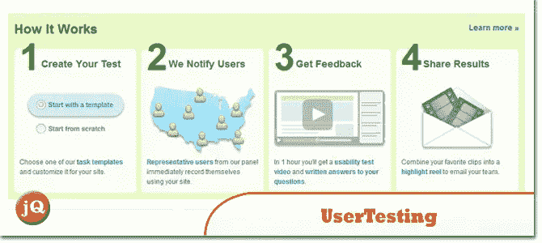
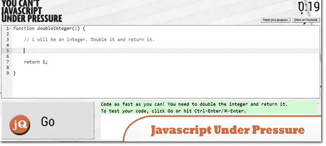

# 10 个有趣的网络开发发现–2013 年 9 月

> 原文：<https://www.sitepoint.com/10-interesting-web-dev-finds-september-2013/>

一些很酷的网络开发工具在九月被发现了！这是发现。尽情享受吧！=)

**相关帖子:**

*   [**2013 年 8 月网络开发发现**](http://www.jquery4u.com/random/interesting-web-dev-finds-august-2013-part-1-of-2/)

## 1.在一起

这是一个由 Mozilla 提供的免费开源 JavaScript 库，它为您的网站添加了协作功能和工具。

 
[源+演示](https://togetherjs.com/)

## 2.负责人

它有助于网站制作者快速了解他们的响应式网站在最流行的设备上的外观。

 
[源+演示](http://responsinator.com/?url=www.jquery4u.com)

## 3.镇定的;冷静的

享受片刻的平静！

 
[来源](http://www.calm.com/)

## 4.平面用户界面

免费用户界面套件。

 
[源+演示](http://designmodo.github.io/Flat-UI/)

## 5.脸书的脸

超过 12 亿张脸书个人资料图片，按时间顺序排列，包括你和你所有的朋友！

 
[来源](http://app.thefacesoffacebook.com/)

## 6.加入我吧

将即时屏幕共享和强大的会议工具结合在一个应用程序中，任何人都可以使用该应用程序进行演示、培训、演示或构思。

 
[来源](https://join.me/)

## 7.幽灵博客平台

这是一个开源的应用程序，允许你写和发布你自己的博客，给你工具，使之变得简单甚至有趣。

 
[来源](http://ghost.org/features/)

## 8.UserTesting.com

当你的目标用户使用你的网站时，让你“回头看”他们。

 
[来源](http://www.usertesting.com/)

## 9.雷尼戴. js

一个模拟雨滴的简单脚本。

 
[来源](http://maroslaw.github.io/rainyday.js/) [演示](http://maroslaw.github.io/rainyday.js/demo.html?imgur=rhnaa4G&youtube=MLBSAVcC1TA&preset=2)

## 10.压力下的 Javascript

你写 javascript 能有多快？你能多快编码？

 
[源+演示](http://toys.usvsth3m.com/javascript-under-pressure/)

## 分享这篇文章