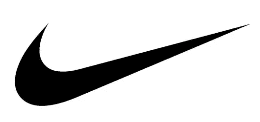
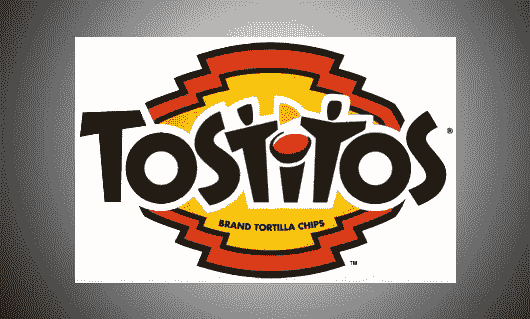
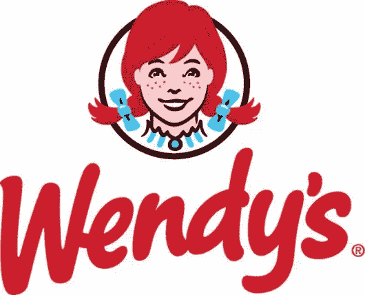
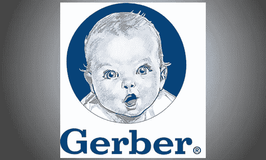
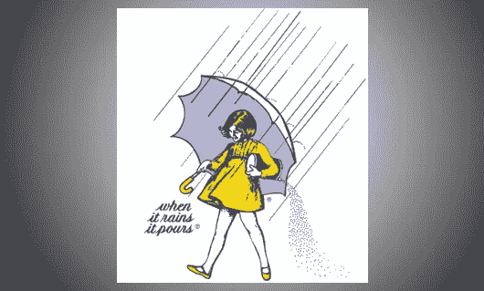
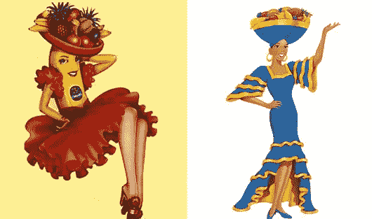
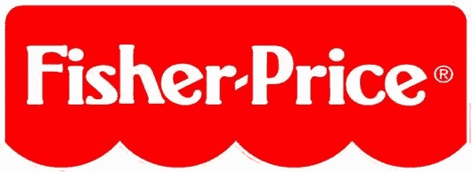

# 在视觉设计中唤起积极情绪的 8 种方法

> 原文：<https://www.sitepoint.com/8-ways-evoke-positive-emotions-visual-design/>

从事品牌工作的设计师有一份非常光荣的工作，那就是努力创造出不仅容易记忆和联系，而且简洁准确地描述品牌的设计。除此之外，还需要唤起正确的情感和品牌简单性的内在需求，有些人可能会说品牌是最棘手的工作领域之一！

然而，如果你能学会在你的设计工作中不断唤起积极的情绪，你会变得很受欢迎，而且很可能会获得高薪。深入了解公司并发现其真正的受众是至关重要的，因为可能对一个群体有利的东西可能会在另一个群体中产生负面情绪。另一个关键是根据个人情况对待每个客户。为一个客户想出正确标志的方法可能不适合下一个客户。

“积极”到底是什么意思？对于保险行业的客户来说，这可能意味着产生安全感。一家面包店可能想从顾客对奶奶自制饼干和馅饼的记忆中创造怀旧氛围。同样，积极对你的每一个客户都有不同的意义，所以有效的品牌推广没有一个通用的公式。

所以，实际上，有效品牌最重要也是最容易被忽视的部分是投入大量的时间和精力去充分了解每一个客户。你的一些客户将会是那些预先给你所有你需要的信息的理想客户，但是其他人将会给你一个他们的远景的模糊的单行描述。这是你需要问很多问题的地方，如果你打算提出品牌创意，不仅让你的客户欣喜若狂，而且让你看起来像你投资组合中的明星。

然而，至少可以说，在研究一家新的客户公司时，确切地知道从哪里开始有点困难。不要绝望！以下是八种深入研究一个组织并创建品牌的绝佳方法，这些方法将在目标市场中培养积极的情绪。

### 1.)专注于单一的情绪

好吧，专注于一种情感是显而易见的，但许多设计师试图在一个设计中完成太多，冲淡了他们的努力，分散了他们的注意力。不是所有的设计师都集中精力问客户这个具体的问题:当客户注意到或认出你的品牌时，你希望他们有什么样的感觉？常见的答案可能包括:快乐、信任、坚强、快乐、性感，以及其他各种积极的情绪。如果你能建立一个单一的主要情感，那就消除了很多不理想的设计工作，而有针对性的情感就成为了你的设计目标。

### 2.)关注品牌属性和产品优势

如果你要为整个品牌设计一个标志，那么一定要了解他们会如何描述他们的品牌属性。基本上，问问这个品牌的核心是什么。例如，雷克萨斯以“不懈追求完美”而闻名同样，耐克的品牌属性是“正宗的运动性能”。

如果你正在为一个特定的产品设计一个视觉效果，然后询问这个特定产品的好处。提醒你的客户，好处不同于功能。特征是尺寸、重量、成分、保质期或任何其他技术规格。好处是产品满足的潜在情感需求。例如，低热量黑巧克力棒的特点是热量少，但口味丰富，可以满足对甜食的渴望。巧克力棒的好处可以说是有助于塑造更苗条的身材，更大的性吸引力，更多的自信，最终成为一个理想的伴侣。(请记住，你不一定要同意甚至喜欢预期的好处才能创造出一个成功的设计。)

### 3.)关注观众

了解你客户的目标市场会帮助你更好地理解如何唤起正确的情感。这就是你的品牌专长需要发挥作用的地方。有些公司可能没有明确的受众。希望问上面的前两个问题能帮助你在一定程度上引导客户。

你需要一些细节:年龄范围、收入水平、性别、地点、职业等等。细节越多，你就越能更好地研究这些消费者或企业的需求。试着像这个品牌的顾客一样思考，而不是像你的客户一样。通常客户会告诉你他们认为他们的客户是怎么想的，或者更糟的是，*应该*怎么想。作为设计师，你的工作是消除任何误解，站在消费者的角度和情感上思考。你的外部视角是无价的。

### 4.)预见顾虑

在你想出一些模型后，考虑你的客户对这个概念的任何担忧。视觉效果描绘了足够的情感还是正确的情感？也要试着预测消费者在观看设计时可能产生的误解，包括无意的视觉模糊，这已经使许多有缺陷的品牌沉没。就像作家、设计师，甚至客户都可能离他们的作品太近，而忽略一个明显的问题。把你的工作放在一边，以后再来做。征求朋友、家人和同事的意见。

接下来的几点是关于在视觉效果中加入情感元素的不同设计理念。如果你不知道从哪里开始，你可以试试下面的方法。

### 5.)创造隐喻性的对比

设计中的隐喻比较是通过将品牌或产品与看似不相关的物品进行比较来完成的。例如，如果公司是一种饮料，它会是哪一种？如果这种洗发水是一辆汽车，它会是什么牌子和型号？这个练习有助于激发创造力，更好地了解你的客户。为了得到最准确的答案，询问你的客户对这种比较的看法是个好主意。

### 6.)使用符号

有时一种情感可以用一个简单的符号来表达。一些公司甚至选择了一种更潜意识的方式来唤起他们标志中的情感，例如联邦快递的标志利用排版中的负空间隐藏一个箭头，暗示向前移动。最近，快餐连锁店 Wendy's 更新了它的标志，甚至在女孩衣服的领子上印上了一个几乎难以辨认的“妈妈”。

符号也可以更明显地唤起情感。例如，亚马逊向上弯曲的箭头从单词中的“a”指向“z ”,看起来也像一个微笑。沃尔玛在 2008 年的品牌重新设计包括一个新的“火花”标志，这给品牌增加了一个更快乐和乐观的外观和感觉。

### 7.)创造一个角色

吉祥物作为一个视觉形象是一个品牌人格化的伟大方式。如果角色是一只可爱的动物，一个婴儿，甚至是一个性感的轮廓，人们可以很容易地将积极的感觉与品牌联系起来。对于一个不太容易与感觉联系在一起的品牌，比如技术，一个吸引人的吉祥物既能让品牌令人难忘，又能给人们带来想要的温暖和模糊的感觉。

世界野生动物基金会的标志一直以一只可爱的熊猫为特色，尽管这个设计是一个简单的负空间渲染，但曲线是柔软的，令人“想抱抱”，脸也很和蔼。MailChimp 用一只可爱的猴子扛着一个邮袋，Twitter 的蓝鸟剪影也相当可爱。嘉宝婴儿是可爱婴儿标志终极的完美例子，但你也可以使用婴儿般的，新颖的角色，如 Pillsbury Doughboy。

一个可爱的孩子般的角色也能唤起积极的情感，比如莫顿·绍特的《拿着雨伞的小女孩》。这些年来，奇基塔香蕉公司总是用性感来更新他们的大部分标志。你也可以用一个代表力量或速度的吉祥物，比如无处不在的美洲狮猫。

请记住，令人讨厌的、制作拙劣的卡通人物有时会引起年长观众的厌烦。然而，卡通人物对孩子甚至年轻人都很有效，尤其是如果他们可爱、惹人喜爱或者“酷”而有趣的话。这是另一个很好的例子，说明为什么记住你的观众是如此重要。

### 8.)选择正确的元素

正确的概念和错误的设计元素最终会产生混乱的信号。确保品牌的颜色、字体，甚至线条的角度都有助于刻意选择积极的情绪。并且一如既往地把组织和受众放在心上。举例来说，一个品牌的刀的锋利的线条是引起对该品牌质量的信任的必要条件。然而，锐角线对于一个品牌的玩具来说太冷了。这就是为什么玩具反斗城和费雪公司在商标中使用如此圆润、修饰的字体。

颜色对于培养正确的情绪尤其重要。这就是为什么大多数清洁剂的商标上都带有蓝色的原因——蓝色与水和清洁联系在一起。不同的颜色也可以象征不同类型的幸福。亮黄色是活泼的，而橙色更是充满活力的温暖。绿色非常适合描绘增长，蓝色可以代表稳定，这对投资公司很有好处。

 **你怎样才能创造出一个积极的、能唤起情感的视觉设计？** 

## **分享这篇文章**