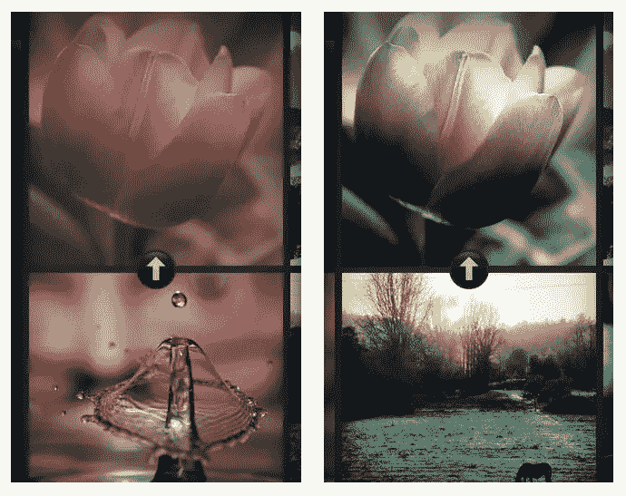
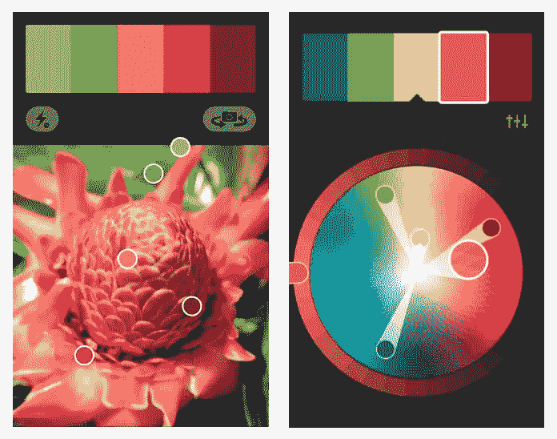
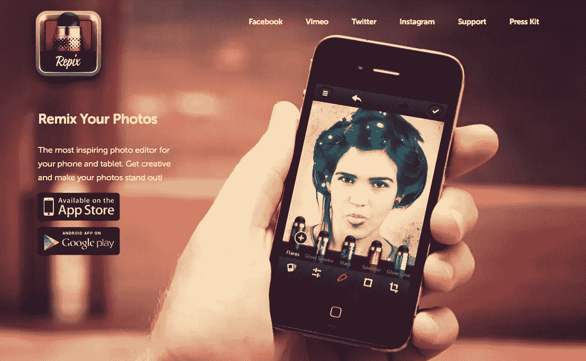
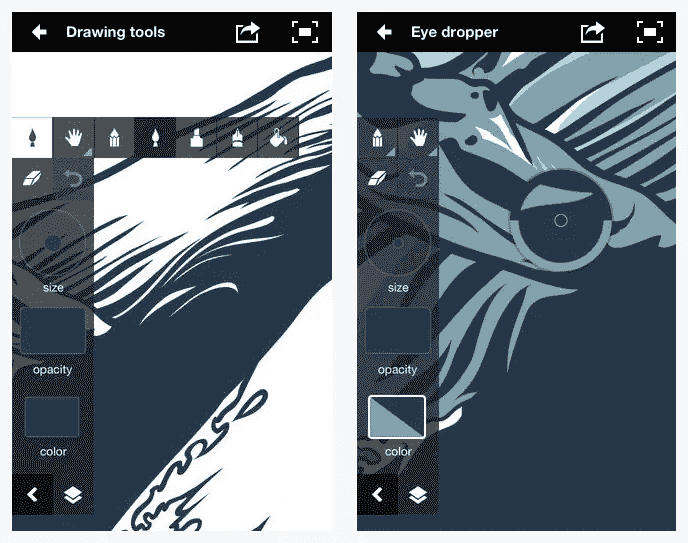
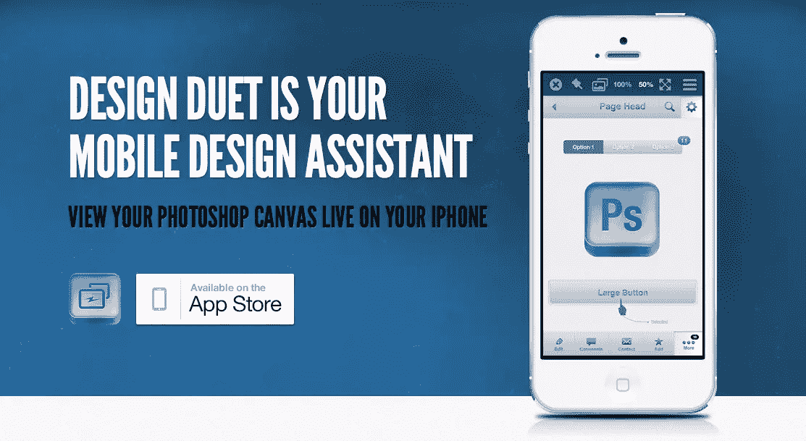
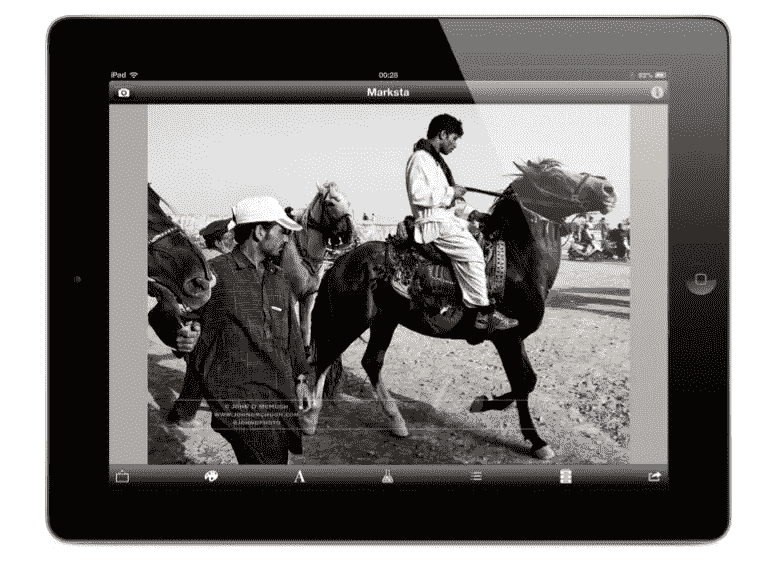
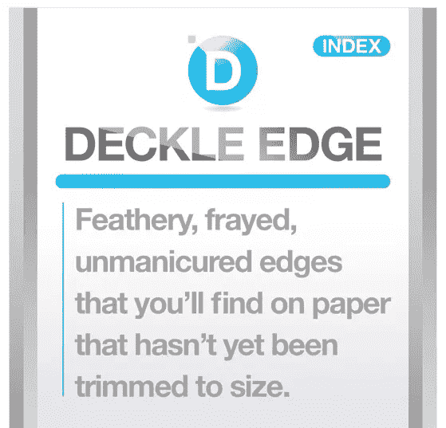
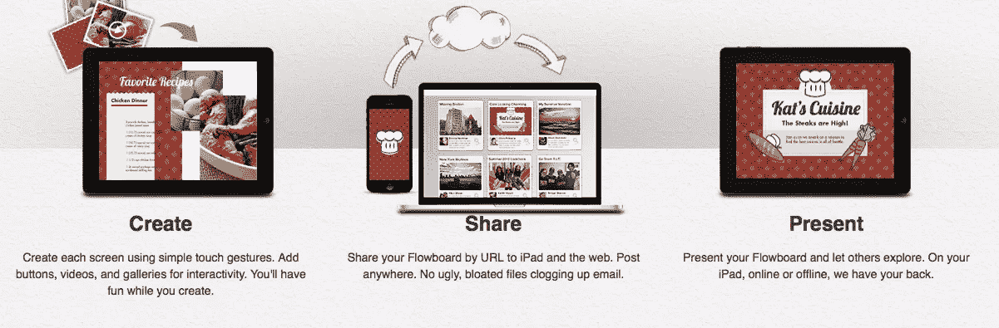

# 面向平面设计师的 10 款励志 iOS 应用

> 原文：<https://www.sitepoint.com/10-apps-graphic-designers/>

创意对于平面设计师来说至关重要，你永远不知道灵感什么时候会降临到你身上。事实上，当你离开办公桌和台式电脑时，你更有可能发现灵感的设计灵感。精明的设计师知道捕捉那些“灵光一现”的时刻有多重要，自满或疏忽的设计师很容易忘记这些想法，就像他们构思出来一样快。

你可以使用正确的移动应用程序，非常清晰地捕捉你的设计想法，而不是回到你的办公桌或你的同事那里，在一张破烂的餐巾上做笔记，或者有一个因分心而减弱的模糊想法。安装了错误应用程序的移动设备最终可能会造成损害或干扰，但通过精心选择的设计工具，你离开办公桌的时间可以真正有助于你的工作。让我们来看看 10 款能够激发灵感、捕捉创意突破的独特应用。

### 设计路径

这个版面创作工具是由印刷界知名公司 Quark 设计的。部分线框设计，部分素描本，部分布局启动，这个应用程序可以让你组装一个快速的文本和图片的页面布局。当你在旅途中，有一个想法需要可视化时，这是很好的选择。一旦你有了基本的想法，你可以用电子邮件发给你自己，在你的桌面上用你的 Quark 专业出版软件完成。

### 偷色贼

一个很大的变化，你的标准照片过滤器应用程序，颜色小偷允许你引用你的设备上的任何图片，并使用颜色方案作为另一个图像的过滤器。颜色有很大的能力来影响图像的情绪，所以如果你试图获得一种特定的感觉，而标准的滤镜无法实现它，这是一个很好的应用程序。理论上，这款应用有无限多的滤镜可供选择，尽管并非每种配色方案都适用于每张照片。如果你在办公室外看到一些鼓舞人心的颜色，你可以很快将它们应用到你自己的设计和图像中。

### Adobe Kuler

如果你喜欢在设计中使用大胆的颜色，那么 Adobe Kuler 将帮助你选择完美的混合。该应用的主要功能是使用移动设备的摄像头生成颜色主题。然后，它在任何设置下捕捉五个颜色点，创建一个样本，您可以处理、存储并发送到其他 Adobe 工具，如 Photoshop、InDesign 或 Illustrator。此外，如果你想在 Flickr 或其他在线网站上对你的图片进行同样的处理，你也可以这样做。

如果你是一个制作自己的定制色轮、尝试当前颜色模式或调整 RGB 滑块的爱好者，那么请查看 Adobe Kuler。毕竟，Adobe 以其最先进的软件和设计应用而闻名。

### Repix

将照片变成杰作不是一件容易的事情，但有了 Repix 这样的应用程序，你可以做很多事情来处理你的照片，并获得你想要的精确结果，只需动动手指。该应用程序具有超过 28 个手工制作的效果笔刷来编辑照片的任何部分，16 个设计滤镜，一个包含六个礼物的超平滑裁剪工具，以及零摩擦设计，允许您在工具之间切换，无需额外的步骤。

### Adobe 创意

如前所述，Adobe 软件和应用程序是设计领域的行业领导者和基准。随着越来越多的软件程序可用于移动设备，以及平板电脑的不断创新，前瞻性的图形设计人员将他们的工作提升到一个新的水平…或者在他们离开办公室时随身携带。

借助 Adobe Ideas，您几乎可以创建或调整任何设计。你可以用你最喜欢的画笔定制你的工具栏，通过 Twitter 或脸书分享你的设计，或者用前面提到的 Adobe Kuler 同步你的颜色主题。这款应用的可能性只受你自身创造力的限制——不再受你在办公桌前工作时间的限制。

### 设计二重奏

如果你一直想在旅途中检查或编辑你的 Photoshop 画布，Design Duet 是适合你的应用程序。此应用程序允许您自动检测网络上运行的 Photoshop 实例，在相机胶卷上存储预览图像，共享展平的图像，甚至包含 Photoshop 文档预设，使您能够创建其他设计。无论是通过您的移动网络还是 Wi-Fi，这款应用程序都将以其简单的概念加快您的工作流程。

### 马克吗

为了建立你作为设计师的声誉，你必须有一个在线的存在。不幸的是，这通常会导致您的作品容易被他人认领、窃取或篡改。这个应用程序允许您轻松地为您的作品添加水印，并直接从您的手机或平板电脑添加您的版权信息。所以，在你上传到脸书或 Instagram 之前，从众多不同的字体中选择，坚持你对你精心制作的作品的权利，而不用担心它会被夺走。

### 吃

vittle 是一个简短的解释性视频剪辑。在这个应用程序中，您可以快速轻松地使用基本的绘图工具在平板电脑上制作动态演示。你可以通过应用程序绘制和记录它们，或者从 Dropbox 等其他应用程序导入照片和 pdf。这些工具相当简单，只有基本的笔刷、颜色和套索工具。但是，由于 Vittle 的动态笔刷引擎，它们永远不会像素化，即使放大也不会。您可以以 720 便士的价格导出并分享您的演示文稿。

### 计算机艺术印刷词汇

与打印机打交道时，你必须精通某些行业术语。在不了解打印机使用的术语的情况下参观打印机是非常令人生畏的。印刷词汇表涵盖了各种令人困惑的术语，如“作弊板”和“毛边”。把它想象成你去外国旅游时要带的一张语言小抄。你可能不会把每件事都做对，但他们会感谢你的努力。下载 Computer Art 的主要应用程序，并在应用程序内购买印刷词汇表。

### 流动板

Flowboard 是一款出色的应用程序，可以让您创建工作演示文稿和作品集，甚至可以离开办公桌。如果你需要即时创建一些东西，它提供了大量的模板。它超级用户友好，你只需点击添加图像或视频，添加文本，然后拖动和调整一切以适应你的需要。经过几个简单的步骤，你就有了一个漂亮的作品幻灯片，准备好了。

## 分享这篇文章