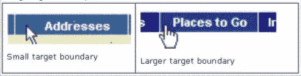

# 移动网页设计的内容策略

> 原文：<https://www.sitepoint.com/content-strategy-mobile-web-design/>

这是无法回避的，移动互联网不会很快消失，对于那些一直回避它的设计师来说，现在是面对它的时候了。的确如此，许多设计师采用“移动优先”的方法来确保一个移动网站，即使它是一个响应式的网站，也能发挥其最大能力。

在[的一篇早期文章](https://www.sitepoint.com/optimizing-responsive-design-websites-for-performance/)中，我谈到了如何最好地优化响应式网站的性能，所以我建议你参考那篇关于减少加载时间等的提示。这一次，我将着眼于规划内容，以解决投资回报(ROI)和可用性问题。

## 响应式还是专用移动网站？

这是一场暂时没有减弱迹象的辩论。一方面，大多数组织会选择“一刀切”的网站。然而，围绕响应式响应的许多争论似乎主要是以成本做[。](http://www.uie.com/articles/roi_mobile/)

创建一个响应迅速、运行良好的网站，同时向手机和桌面提供相同的内容是一件棘手的事情。这往往要花钱。如果一个客户选择继续使用他的桌面网站，并为移动设备制作另一个网站，那么这可能比他选择响应路线花费更少。这是因为一个响应网站将不得不从零开始，因此将是一个更大的项目。

## 面向未来

有必要问问客户，他们认为桌面网站还需要多长时间才能改变。一个移动网站无论如何都要适应不同的屏幕尺寸、分辨率和带宽，所以为什么不彻底改造一下呢？

答案归结为客户对采取简单的方式和妥协来完成一个伟大的设计有多高兴。这意味着客户在投资一个不适应未来的设计时，需要意识到潜在的商业成本。

## 谈论投资回报率

归根结底，大多数企业主理解数字，他们为更昂贵的设计买单的机会将归结为提供投资回报的证据。

当规划一个项目时，这应该是设计师考虑的首要问题。这意味着有必要考虑一个不太昂贵的设计在损失业务方面的成本。

思考一下:

*   在所有平台上呈现统一的品牌体验
*   技术变化有多快
*   可用性和竞争对手网站
*   登录页面和 CTA 的表现
*   内容将如何交付

有必要向客户表明，短期的设计很可能会让他们付出更高的长期成本。如今，消费者对网站有一定的期望，如果一个网站没有达到标准，他们当然不会在意去竞争。

一个在浏览或点击屏幕时反应缓慢的网站会让他们跑向虚拟的山丘。

## 哪个先来？内容还是设计？

所以，问题是，有一个清晰的内容计划更好，还是让内容适合设计更好？答案显然是前者，因为如果没有一个公认的框架来设计，就会出现问题。

考虑内容时，有必要考虑:

*   CTA–文本还是按钮？
*   空间——你有多少空间可以利用，如何有效利用？
*   图像——有多少将被传送到移动设备？
*   如何利用内置功能，如通话、地图、地理位置等？
*   如何减少不同尺寸设备的内容量？
*   用什么布局最好？
*   导航将如何工作？

一旦你开始考虑所有这些，很快就会发现内容在很大程度上决定了设计。从客户端的角度来看，另一个原因是这些内容应该能够适应每个设备。这消除了为每个平台发布不同内容的需要，从 ROI 的角度来看，这将提高工作场所的生产率。

这是一项巨大的长期成本节约。

## 内容和用户界面——菲特定律

作为一名开发人员/设计师，你肯定听说过菲特定律，但以防万一你还没有，简单介绍一下。根据 MDSN 开发者网站上的一篇[文章，菲特定律“可以应用于软件界面以及网站设计，因为它涉及到人们与鼠标或其他指点设备的交互方式”。](http://msdn.microsoft.com/en-us/library/ms993291.aspx)

基本上，根据可点击区域的大小和到达那里所经过的距离，使用鼠标移动光标的人会发现某些可点击区域比其他区域更容易点击。当考虑更个人化的输入设备，即手指时，可以应用相同的原理。

一个人为了到达可点击区域而不得不将输入设备移动得越远，他们就越难找到它。记住这个原则，很容易理解为什么用户会放弃一个不遵守菲特定律的网站。如果用户一直错过一个可点击的目标区域，他们就不太可能留下来。

对于手机来说，更多的转换是通过屏幕上方清晰的 CTA 来完成的，导航也经常出现在那里。这是因为菲特定律告诉我们，这是点击的最短距离，它很好地框定了页面，所以这也是合乎逻辑的。

然而，如果这些可点击的区域很容易到达，但是目标很小，比如按钮中间的文本，那么它们仍然会阻止访问者停留在网站上。

## 拇指测试

对于手指来说，可点击区域的推荐尺寸是 16-22mm，而对于拇指来说是 25mm。这只是一个指导方针，但是很多人觉得这还不够。所以尽量把它们做的大一点；这适用于产品链接和导航，因为如果人们感到沮丧，他们会放弃销售。

试着用各种尺寸画出设计草图，看看你自己的拇指在可点击区域占了多少空间。访问者应该能够舒适地点击，不会与相邻的内容重叠，一次点击就可以把他们带到链接。

*(来源:MDSN 开发商)*

对于移动设备，确保可点击区域是清晰的，这意味着用户必须清楚这是他们点击的地方。

## 三醋酸纤维素

在移动网站上，强烈的行动号召是必不可少的，你没有太多的发挥空间。移动网站最常用的(也是最好的)方法之一是使用“ **call us** ”按钮。除了地图，这对于访问者来说非常有用，因为许多人在搜索时会考虑使用当地的商家。

最简单的 CTA 在移动设备上效果最好，所以考虑按钮、图像等等，把它们放在页面顶部附近。

当基于桌面模式为移动网站规划内容时，交付也很重要。客户端是否使用 CMS 来管理内容，您是否打算使用[重定向](https://developers.google.com/webmasters/smartphone-sites/redirects)或媒体查询？

[手机设计的常见错误](https://developers.google.com/webmasters/smartphone-sites/common-mistakes)包括:错误的重定向、不相关的网址/交叉链接、无法播放的视频等等。这意味着真实世界的测试对于发现任何可能发生在最终用户层面的潜在问题是至关重要的。

在我看来，设计显然将以这样一种方式发展，即针对不同屏幕尺寸和分辨率的设计将成为标准，尽管我肯定有些人会不同意。然而，这仍然是一个相对较新的方法，它往往意味着采取更全面的设计方法，着眼于客户的整体需求，而不是单个网站，移动网站等。

准备投入工作并真正掌握适应性设计的设计师可能很难在短期内说服客户放弃现金，但随着时间的推移，他们会看到自己是赢家。

## 分享这篇文章