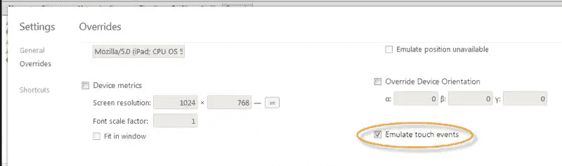

# 开发 Kiosk Web 应用程序的 10 个技巧

> 原文：<https://www.sitepoint.com/tips-developing-kiosk-web-applications/>

我想我应该从我开发 Kiosk Web 应用程序的经验中记下一些技巧。快速浏览一下以确保您的下一个 kiosk web 应用程序没有忽略任何东西可能会很有用。他们来了。

## 1.禁用文本选择

一些信息亭的行为方式是当拖动手指时仍然可以选择文本，这也取决于你使用什么浏览器/软件来显示应用程序。

```
/* disable text selection */
    -webkit-touch-callout: none;
    -webkit-user-select: none;
    -khtml-user-select: none;
    -moz-user-select: moz-none;
    -ms-user-select: none;
    user-select: none;
```

## 2.模拟触摸设备。

开发时使用 chrome dev 工具覆盖来模拟你的点击事件和触摸/滑动。


## 3.强制浏览器缓存刷新

Kiosk web 应用程序可能正在运行缓存的媒体，为了强制它们运行最新的代码，您可能需要向静态媒体附加一个变量，以强制浏览器刷新 JS/CSS。你可以单独在静态媒体前添加动态变量，或者如果你使用 PHP，例如 index.php，你可以这样做:

```
< ?php
    //currently changes daily at middnight
    $forceNum = '5'; //increment this number to force browser to refresh static media cache(js/css).
    $cacheKey = '?'.strtotime(date('Y-m-d')).$forceNum;
?>
<link href="css/styles.css<?php echo $cacheKey; ?/>" rel="stylesheet">
<script src="js/main.js<?php echo $cacheKey; ?>"></script>
```

## 4.在 Kiosk 模式下使用谷歌浏览器

Chrome 可以在开箱后以 Kiosk 模式启动。非常适合测试。按照这些说明找出如何做-> [Chrome Kiosk 模式设置](http://www.jquery4u.com/chrome/google-chrome-kiosk-mode/)。

## 5.支持触摸的自举

如果你从零开始，不要多此一举！查看 [Gumby 2](http://www.jquery4u.com/gumby2/gumby2-backbone-bootstrap/) bootstrap，它具有开箱即用的触摸支持和可定制的 bootstrap UI，可以轻松获得您想要的 web 应用程序外观。Backbone.js 提供了视图之间的即时视图切换以及模板和数据的管理。

## 6.防止重复推送脚本调用

当用户滑动屏幕时，它可能触发多个事件，但应该只触发一次。所以为了让你的应用程序平稳运行，使用一个[去抖脚本](http://www.jquery4u.com/mobile-devices/touch-swipe-function-debounce-script/)。

## 7.预加载您的 web 应用程序图像

这里有一个关于如何[设置 web 应用程序图像](http://www.jquery4u.com/speed/web-app-image-preloading-setup-2mins/)预加载的教程。这可以大大加快应用程序的使用速度，并防止大图片的大规模加载。

一旦我检查了代码/功能，我会更新更多。–一如既往地分享你的建议，我会补充的。

## 分享这篇文章