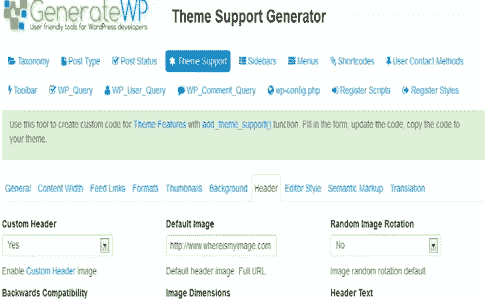
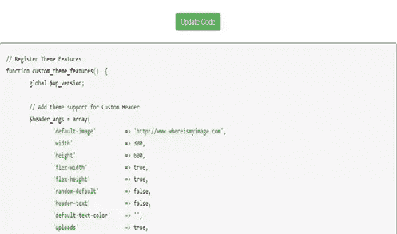
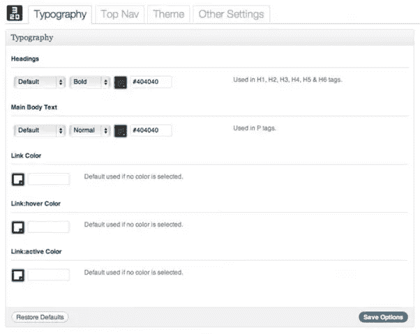
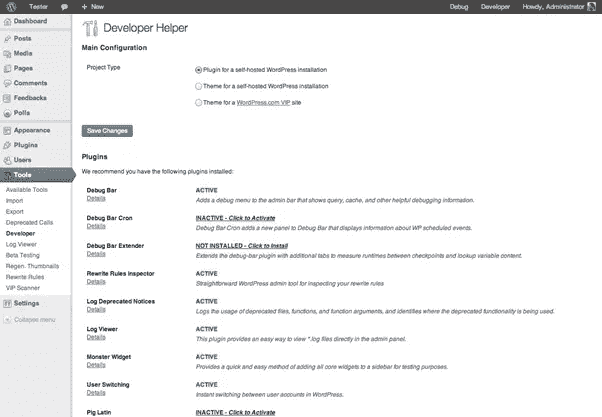

# WordPress 开发者工具

> 原文：<https://www.sitepoint.com/wordpress-developer-tools/>

WordPress 已经成为 2013 年网络开发中使用最广泛的设计资源之一，大约 54%的 CMS 网站使用 WordPress 而不是 Drupal 和 Joomla。全球所有使用 WordPress [的网站的综合数字是 17.4%](http://www.wholegraindigital.com/how-many-people-are-using-wordpress-for-building-their-websites) ，这使得它成为迄今为止世界上最成功的网站建设工具。

这使得大量的工具变得可用，以帮助开发人员轻松完成 WP 设计，以及无需太多编码的功能主题和插件。考虑到这一点，我收集了一些目前可以用来帮助 WP 开发的更有用的工具。

## [GenerateWP](http://generatewp.com/)

这是一个易于使用的工具，允许你通过一系列简单的形式创建基于 WP 的“高级应用程序”。该生成器是由 web 开发人员 Rami Yushuvaev 设计的，他为 WP codex 做出了贡献，并负责希伯来语 WP 版本的发布。生成器前端使用了一个 [Twitter Bootstrap](http://twitter.github.com/bootstrap/) 框架和来自 [Font Awesome](http://fortawesome.github.io/Font-Awesome/) 的图标字体。

目前现场有 15 台发电机，它们是:

*   分类学
*   帖子类型
*   发布状态
*   主题支持
*   补充报道
*   菜单
*   短代码
*   工具栏
*   用户联系方式
*   WP 查询
*   评论查询
*   Wp-config.php
*   注册 WP 脚本
*   注册 WP 样式

所有这些都使用 WP 函数，并允许您添加颜色、图像、填充等元素。

这些只是简单地输入到表格中，根据你想要的，然后你点击“更新代码按钮”,瞧，代码就准备好了，你可以复制并粘贴到 WP 编辑器中。

这对于为 function.php 文件创建代码片段是非常有用的，并且真正免除了开发人员反复参考 WP codex 获取代码样本的需要。

## [WordPress Bootstrap](http://320press.com/wpbs/features/)

这是一个基于 Twitter 的 Bootstrap v2.1.1 的基本主题，构建在 [Bones](http://themble.com/bones/) 主题框架之上。它完全响应，如果你在手机上访问该工具的主页，那么你会对你的项目站点的行为有一个公平的想法。

有四种模板可供选择:

*   主页
*   标准页面
*   带有左侧边栏的页面
*   全幅页面

主题还允许您添加主题选项，这样您就不必一直处理代码:

这个主题当然可以照原样使用，也可以根据特定的项目进行编辑，或者为客户定制一个主题。

## [HTML5 空白](http://html5blank.com/)

另一个有用的基本主题，HTML5 Blank 是一个开源模板，它允许你在 WP 中建立一个 HTML5 站点。它为你提供了一组基本的 CSS 重置和一个典型的 WP 文件结构，非常适合从头开始你的 HTML5 主题项目。

这并不适合立即在网站上运行，它只是一个方便的小框架，而不是一个成熟的主题。它消除了编辑现有主题的麻烦，比如 WP 默认主题。

## [WP 小部件和插件样板文件](https://github.com/tommcfarlin/WordPress-Widget-Boilerplate)

由 Tom McFarlin 创建，这是一个极好的资源，它在 GitHub 上为您提供了大量样板模板供您选择，为您节省了大量时间。这些目标 WordPress 小部件和[插件](http://tommcfarlin.com/wordpress-plugin-boilerplate/)是 PHP 文件，需要一个样式表或管理面板的 JS 脚本。对于那些希望开始开发自己的插件的人来说，这是一个非常节省时间的资源，不应该被忽视。

## 开发者插件

由开发者为开发者设计的插件。这旨在通过确保所有必要的工具都已安装，帮助设计人员优化他们的环境。

首先，插件要求您输入您是哪种类型的开发人员，以确保开发环境适合您的需求。

它检查你是否有项目需要的插件，并且所有的设置都被调整到合适的位置。理想的节省时间，因为它会检查你有你需要的一切，这是一个伟大的小添加到任何 WP 开发人员的工具箱。

其特点包括:

*   支持标准 WordPress.org 站点和 VIP 站点
*   调试 Cron
*   重写规则检查器
*   记录废弃通知
*   VIP 扫描仪
*   Grunion 联系形式
*   怪物部件
*   β系数测定器

## WordPress 课程

如果你是从零开始使用 WP，或者即使你已经习惯了使用 WP，你永远也学不够。想想看，如果 WP 是世界上使用最多的 CMS，比所有其他 CMS 的用户加起来还多，那么作为 WordPress 的专家，开发者有很多机会获得新的客户。

WordPress Lessons codex 有从简单的博客到主题和网站开发的所有开发水平的深入文章。它甚至有一个关于 [SEO 优化](http://codex.wordpress.org/Search_Engine_Optimization_for_WordPress)的部分，这不是所有的设计师都想玩的东西，但为了给客户提供最好的服务，这真的很重要。

更多官方的 WP 资源，请查看制作 WordPress 的工具、插件、主题和文档。

## 世界各地的 WordPress

成为顶级 WP 开发者是值得的；2011 年，一项官方调查发现，可以和 WP 一起工作的设计师的平均时薪是 50 美元。这听起来并不多，但随着 WP 变得越来越受欢迎，这一数字现在肯定会增加。

如果你愿意学习足够多的知识来成为一名顶级开发者，那么这个工资的中位数会更高，但这需要承诺，也需要你这样推销自己。这意味着加入 WP 社区，参与讨论，创建补丁和插件，甚至发布古怪的教程来帮助其他开发者。

如果这些听起来都像你，那么现在就用上面的一些工具和资源在 WordPress 中阅读和编码吧。

## 分享这篇文章