# 15 个有创意的单页网页设计

> 原文：<https://www.sitepoint.com/15-creative-single-page-web-designs/>

正如许多设计师已经知道的，设计界的潮流来来去去，他们享受着不同程度的成功和长寿。一些享受比其他人更好的接收，而一些遭受通过一个令人惊讶的短保质期。单页网页设计当然不是 2013 年的新趋势，但它的延续表明它比大多数网页设计更实用、更有效。像所有的趋势一样，单页网站有其优点和缺点，但在一个每天都有成千上万的新网站创建的世界里，单页网站设计可能是迎合不断缩短的人类注意力跨度的最佳方式。

应该注意的是，单页网页设计并不适合所有的目的；选择这样一种不寻常的格式时，需要考虑很多因素。为你的设计设定一个精炼的目标，对你的内容进行分类以适合一个页面，创建一个有趣的布局，这些都是让你的单页设计充分发挥潜力的最重要的焦点。今天的展示展示了一些伟大的单页网页设计。希望你能找到一点灵感，为你的下一个项目带来动力。

**[大卫·巴拉塔](http://www.davidebaratta.com/)**

[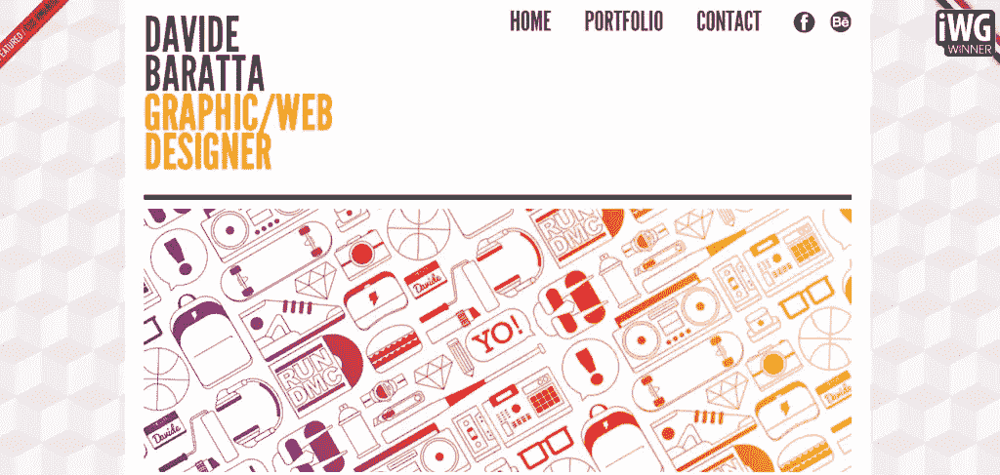](http://www.davidebaratta.com/)

Baratta 的单页网页设计有一个很好的设置，并且在顶部有一个变化的内容框。总体设计肯定会激励那些将投资组合转移到网上的人。

[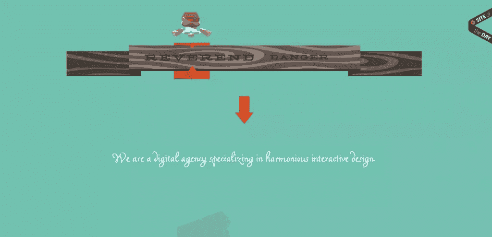](http://www.reverenddanger.com/)

之前在另一个展示中展示过，牧师危险网站是创造性地建立的，更不用说互动元素和动画为已经独特的角色设计和单页格式提供了一个很好的接触。

**Pusulaweb**

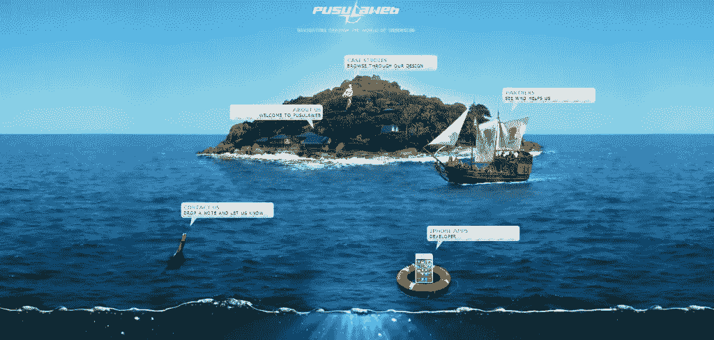

Pusulaweb 不仅有一个美丽的背景，而且他们设计的这种向下滚动的单页网页设计让人联想到你正在更深的水下。

**[永远有创意的](http://alwayscreative.net/)**

[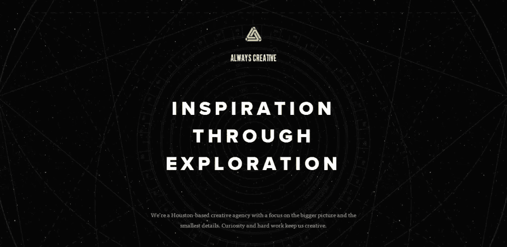](http://alwayscreative.net/)

总是有创意，不出所料，有一个创造性的单页网页设计。从顶部的动画银河元素到夹在“灵感”和“联系”页面之间的静态页面，这是一个深思熟虑和独特的单页面布局。

**[Badr](http://badrfood.com/)**

[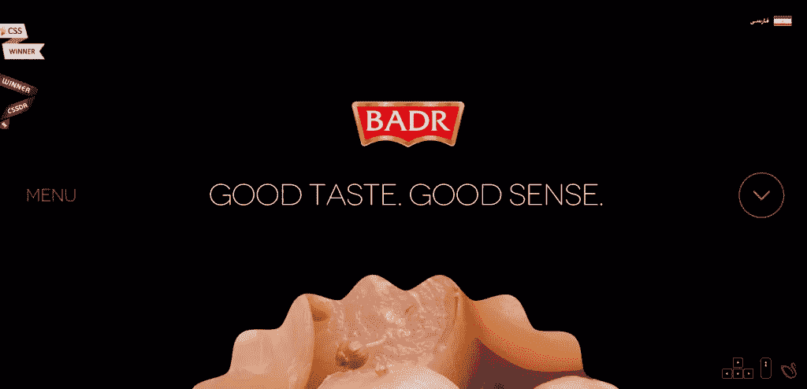](http://badrfood.com/)

Badr Food Industries 有一个有趣的页面设置，但这是一个很好的有趣类型。单页网页设计可以很容易地通过点击按钮来导航，为每个选定的页面带来丰富多彩的内容。

**盖丘亚语**

[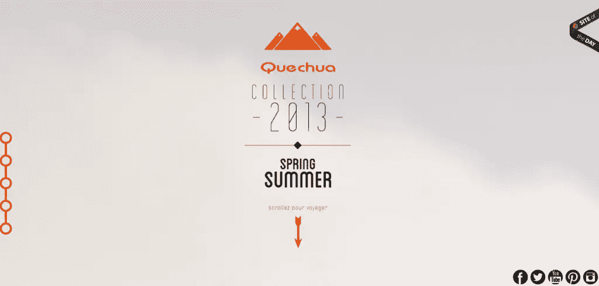](http://www.quechua.com/campaigns/lookbook-spring-summer/#/home)

盖丘亚语不仅有一个简单、有品位的 flash 介绍，而且他们的网站也是一个令人惊叹的东西。乍一看，设计和元素相当简单，但仔细一看，你会发现旅行图像是如何简单地工作的。

**[最后一滴](http://everylastdrop.co.uk/)**

[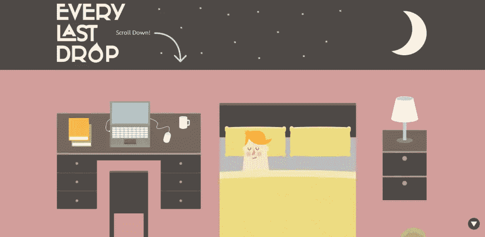](http://everylastdrop.co.uk/)

添加动画，或者至少创造一种事物被动画化的感觉，是一个吸引人的概念，已经在单页网站上流传开来。当你浏览《最后一滴》的网站时，你会看到他们的代表人物度过了他们的一天。

**[我的普罗旺斯](http://www.myprovence.fr/en)**

[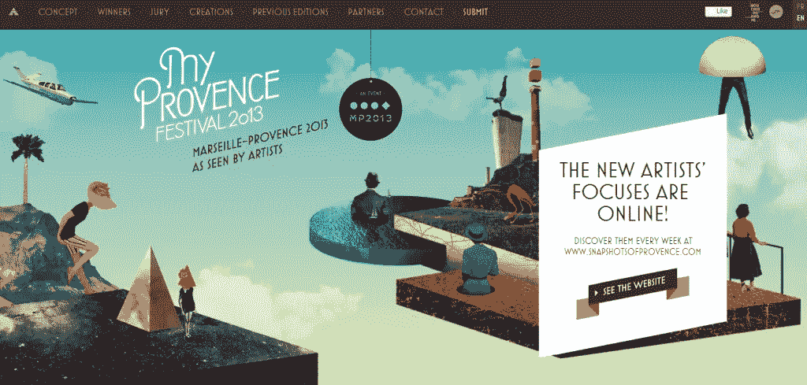](http://www.myprovence.fr/en)

保持创新是必须的，尤其是当你使用的趋势并不新鲜的时候。伴随着网站页面逻辑顺序的插图对我的普罗旺斯很有利。

[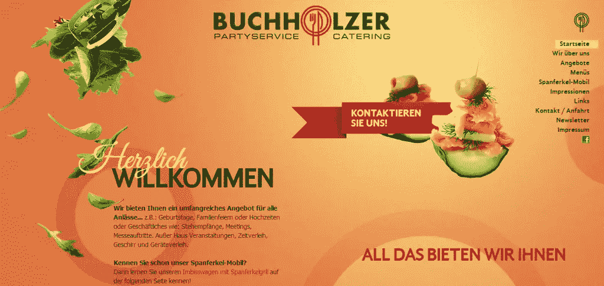](http://www.buchholzer-catering.de/)

食品网站最近开始转向单页设计，对于像 Buchholzer 这样的网站来说，这被证明是非常有效的。当你向下滚动时，不同颜色的页面很吸引人，美丽的食物图片让你感到饥饿。

**[茶壶创作](http://www.teapot-creation.com)**

[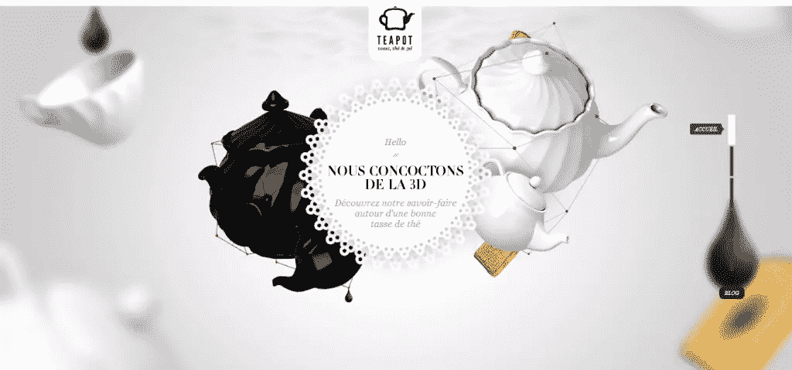](http://www.teapot-creation.com)

茶壶创作的网站是完全美丽和鼓舞人心的。从图形到背景，你可以看出这个网站投入了大量的精力。单页网页设计将所有这些元素统一在一起，使其成为一个集体整体。

**陆丹蓝**

[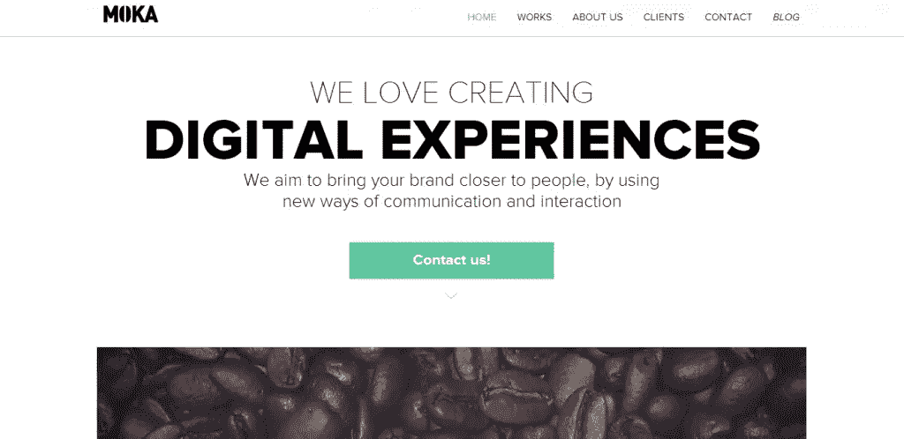](http://moka.tv/?lang=en#/home)

企业，尤其是设计机构，可以通过走一条不那么传统的网站设计路线来发表声明和吸引客户。陆丹蓝的单页设计更倾向于极简设计，但看起来仍然非常专业。

**[【ouback】](http://www.iamousback.com/)**

[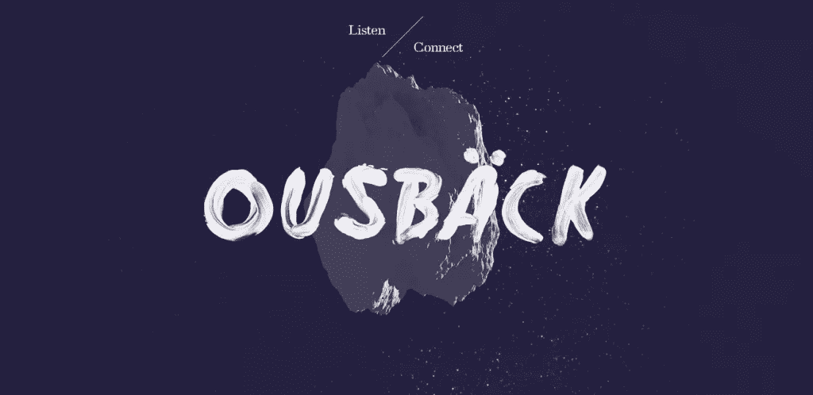](http://www.iamousback.com/)

奥斯巴克的网站很吸引人。背景设计周期性地向上滚动，给你两种不同的视图。但是，一旦向下滚动足够远，就会得到一个干净简单的单页面设置。

**耶节**

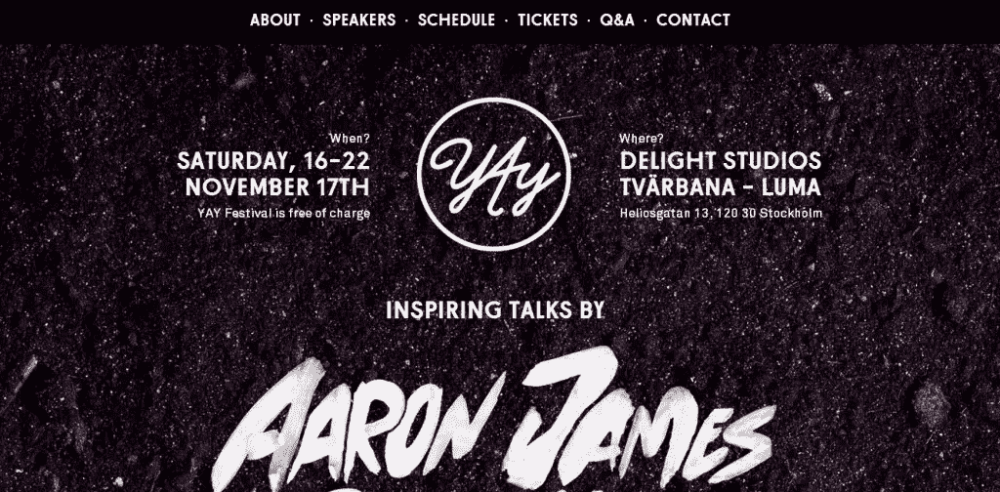

你的单页网站不一定要有连续无缝的背景。Yay Festival 的网站证明了这一点，他们的主页不仅有照片背景，而且使用了强烈的全彩。

**[亚特兰蒂斯](https://www.atlassian.com/time-wasting-at-work-infographic)**

[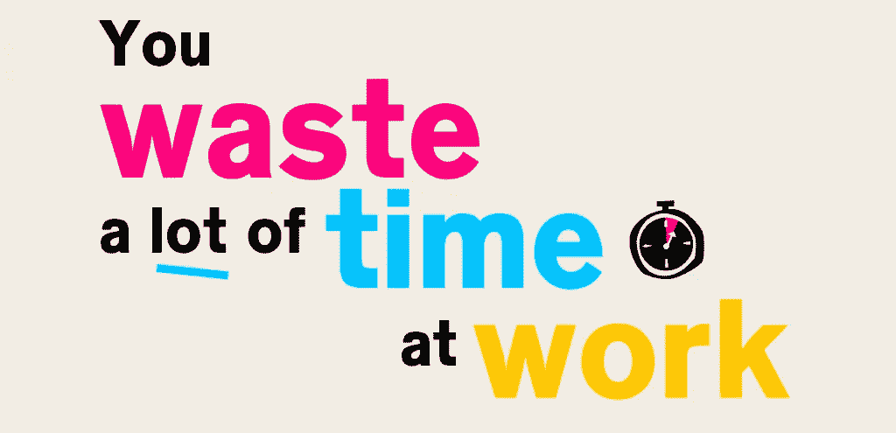](https://www.atlassian.com/time-wasting-at-work-infographic)

给你的网站添加颜色——尤其是当你的背景是浅色的时候——总是一个好主意，Atlassian 将它与一个执行良好的单页网页设计结合起来。

**[伊恩·詹姆斯·考克斯](http://www.ianjamescox.com/)**

[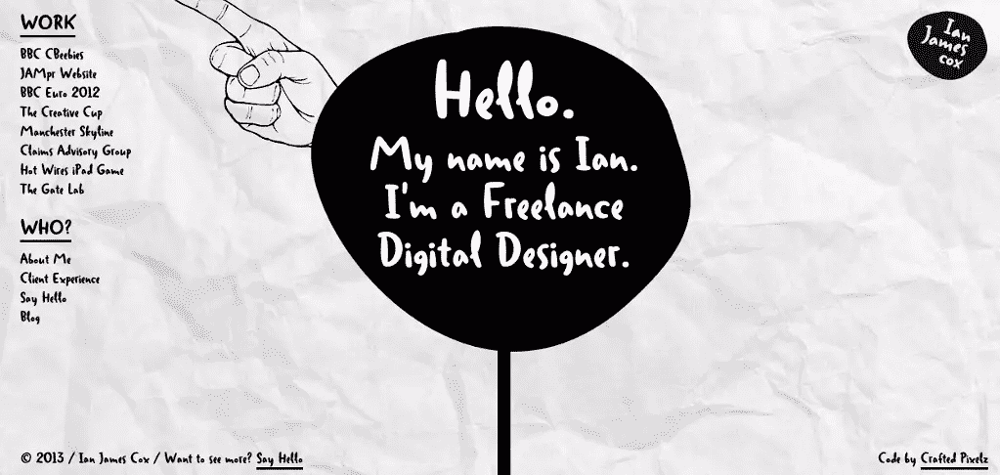](http://www.ianjamescox.com/)

一个单页文件夹可以通过使用设计来赋予深度，以通过类似地图的体验。它可能看起来是一个复杂的网站，但它是一个上下流动的单一页面。

*你如何看待网页设计中的单页？你在列表中有喜欢的或者应该被包括的吗？*

如果你喜欢读这篇文章，你会爱上[可学的](https://learnable.com?utm_source=sitepoint&utm_medium=link&utm_campaign=learnablelink)；向大师们学习新技能和技术的地方。会员可以即时访问 SitePoint 的所有电子书和交互式在线课程，如[美丽网页设计的原则，第二版](https://learnable.com/books/the-principles-of-beautiful-web-design-2nd-edition?utm_source=sitepoint&utm_medium=link&utm_campaign=learnablelink)。

对本文的评论已经关闭。有关于网页设计的问题吗？为什么不在我们的[论坛](https://www.sitepoint.com/forums/forumdisplay.php?1-Website-Design?utm_source=sitepoint&utm_medium=link&utm_campaign=forumlink)上问呢？

## 分享这篇文章