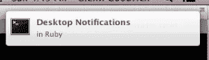

# wine watcher——Ruby 桌面通知

> 原文：<https://www.sitepoint.com/winewatcher-desktop-notifications-ruby/>

[](https://www.sitepoint.com/wp-content/uploads/2013/08/dn.png)

对于外行来说， [Wine](http://winehq.org/about) (Wine 不是一个模拟器)是“一个兼容层，能够在几个 POSIX 兼容的操作系统上运行 Windows 应用程序，比如 Linux、Mac OSX 和 BSD。”它被称为“不是仿真器”是有原因的——它不是在虚拟机中模拟整个操作系统，而是实时翻译 API 调用，使支持 3D 游戏和高清视频等要求苛刻的过程成为可能。

不幸的是，不在虚拟机中运行 Windows 有一个缺点:兼容性。为了构建匹配的 POSIX API 函数，必须对闭源 Windows 库进行逆向工程。因此，在 Wine 的库实现中仍然有相当多的缺口。许多程序表现出不寻常的行为或似乎不可预测地崩溃。

但是新的应用程序一直都在得到支持。WineHQ 维护着一个名为 AppDB 的葡萄酒兼容性数据库。这里是 Adobe Photoshop CS6 的 AppDB 页面如果你看底部，你可以看到一个标有“测试结果”的表格每个结果都有一个等级:金、白金、银、铜或垃圾。

如果每当你最喜欢的应用程序提交新的葡萄酒测试结果时，你都能收到桌面通知，这不是很好吗？

事实证明，使用 Ruby，您可以很容易地。

要做到这一点，需要做五件事:

1.  通知服务器在屏幕上绘制通知
2.  与服务器兼容的通知客户端
3.  Ruby 的客户端绑定
4.  用于 HTTP 通信和 HTML 解析的库
5.  一种从 Ruby 脚本中创建守护进程的方法

现在桌面通知似乎有两个大玩家:freedesktop 和 Growl。说到你想用哪一个，简而言之就是:

*   免费桌面–Linux/BSD
*   咆哮——Mac OS X/Windows

### 免费桌面

Freedesktop (GNOME)通知在[桌面通知规范](https://developer.gnome.org/notification-spec/)中有描述。这些通知通过 [D-Bus](http://www.freedesktop.org/wiki/Software/dbus/) 进行通信，这是 POSIX 世界中一种流行的进程间通信协议。

GNOME 桌面环境不需要使用 freedesktop 通知。您所需要的只是 D-Bus 和桌面通知规范的实现。有许多服务器可供选择。

archlinux wiki 有一个关于 Libnotify 和一些兼容通知服务器的优秀页面。

根据您的环境，您可能已经安装了 freedesktop 通知服务器。一种简单的方法是使用 notify-send 命令。根据您的发行版，您可能需要用您的软件包管理器来安装它。

```
$ notify-send "Hello" "World" -t 2000
```

对于本教程，我使用了 [dunst](http://www.knopwob.org/dunst/) 通知服务器。它是轻量级和极简主义的，与像 [dwm](http://dwm.suckless.org/) 这样的窗口管理器配合得很好。我非常喜欢 dunst 的一点是，通知被绘制在其他所有东西之上。例如，你可以玩游戏或看电影，通知会弹出
而不会最小化窗口。

Dunst 相当受欢迎，所以它应该可以通过您的软件包管理器获得。除了可执行二进制文件，您还需要一个 D-Bus 服务文件来按需启动它。您的软件包管理器应该会为您创建这个，但是如果没有，您需要将`org.knopwob.dunst.service`添加到*/usr/share/dbus-1/services*中，内容如下:

```
[D-BUS Service]
Name=org.freedesktop.Notifications
Exec=/usr/bin/dunst
```

可以使用一个 **dunstrc** 文件来配置 dunst 通知的外观。这里是我的 *~/。config/dunst/dunstrc* :

```
[global]
    font = "Monospace 8"
    allow_markup = yes
    format = "<b>%s %p</b>\n%b"
    sort = yes
    indicate_hidden = true
    # geometry = "x5"
    idle_threshold = 0
    geometry = "300x5-20+20"
    alignment = left
    show_age_threshold = 10
    sticky_history = yes
    follow = mouse
    word_wrap = yes
    separator_height = 2
    padding = 20
    horizontal_padding = 10
    separator_color = frame
    startup_notification = true
    dmenu = "/usr/bin/dmenu -p dunst: -nb #FFFFFF -nf #000000 -sb #94DBFF -sf #000000"
    browser = firefox

[frame]
    width = 3
    color = "#000000"

[shortcuts]
    close = ctrl+space
    close_all = ctrl+shift+space
    history = ctrl+grave
    context = ctrl+shift+period

[urgency_low]
    background = "#ffffff"
    foreground = "#000000"
    timeout = 30

[urgency_normal]
    background = "107FC9"
    foreground = "#000000"
    timeout = 45

[urgency_critical]
    background = "#ff9999"
    foreground = "#000000"
    timeout = 0
```

邓斯特似乎在开始时读过这个文件一次。如果您想进行更改，然后在通知中看到它们，您需要杀死 dunst。如果 dunst 作为 D-Bus 服务安装在您的系统上，您就不需要在 shell 中重新启动它。

```
$ killall dunst
```

安装了 Dunst 之后，您有了一种在屏幕上绘制通知的方法，但是您仍然需要一种方法来告诉它应该说什么。

[Libnotify](https://developer-next.gnome.org/libnotify/) 实现 Freedesktop 通知的客户端。为了使用它，你需要操作系统的二进制文件和 Ruby 绑定。有不止一种宝石可用于 Ruby 绑定，但对我有用的是 [libnotify](https://github.com/splattael/libnotify) :

```
$ gem install libnotify --version 0.8.1
```

一旦所有东西都安装好了，您就可以用规范的 hello world:

```
require 'libnotify'
Libnotify.show(:summary => "Hello", :body => "World", :timeout => 2.5)
```

注意:当我开始本教程时，notify-send 似乎创建了无样式的通知，而 libnotify 工作正常(两者现在都工作)。如果对 dunstrc 进行修改似乎没有任何作用，请确保在放弃之前尝试 libnotify。

## 吠声

与 GNOME 通知不同，Growl 不使用像 D-BUS 这样的进程间通信协议。相反，它使用 GNTP(grow 网络传输协议)，运行在 TCP 之上。这有两大优势:

1.  独立于平台
2.  Growl 可以接收来自远程客户端的通知

咆哮通知服务器可用于每一个主要平台。当 Linux 节点完成处理时，想在您的 Windows 机器上得到一个弹出窗口吗？那就咆哮吧。

*   [咆哮](http://growl.info/)——麦克·OS X 的原创
*   Windows 版的咆哮似乎是免费的，不像 OS X 版
*   [growl-for-Linux](https://github.com/mattn/growl-for-linux)-也是免费的

在客户端，我发现了一些宝贵的东西。

*   [groem](https://github.com/ericgj/groem)
*   [ruby_gntp](https://github.com/snaka/ruby_gntp)
*   [红宝石咆哮](https://github.com/drbrain/ruby-growl)

ruby-growl 附带了一个“growl”可执行文件，您可以使用它来测试您的 growl 服务器。它在我的系统上成功地与 growl-for-linux (gol)一起工作。

```
$ gem install ruby-growl --version 4.0
$ gol &
$ growl -H localhost -m "hello world"
```

```
#!/usr/bin/env ruby
require 'ruby-growl'
notif = Growl.new "localhost", "ruby-growl", "GNTP"
notif.notify("ruby-growl notification", "Hello World", "Greetings!")
```

## 麦克·OS X

除了 Growl，如果您有 Mac OS X 10.8 (Mountain Lion)或更高版本，Mac OS X 用户通知也可供您使用。[终端通知器](https://github.com/alloy/terminal-notifier)是本地通知服务器的客户端。

```
$ gem install terminal-notifier --version 1.4.2
$ terminal-notifier -title "Hello" -message "World"
```

```
require 'terminal-notifier'
TerminalNotifier.notify('Hello World', :title => 'Ruby', 
                                       :subtitle => 'Programming Language')
```

## 分叉遮罩守护程序

一旦通知在您的系统上运行，就应该创建一个守护进程来定期显示它们。多亏了方便的[守护进程](http://daemons.rubyforge.org/) gem，用 Ruby 构建守护进程变得很容易。

```
$ gem install daemons --version 1.1.9
```

守护程序 gem 使得编写可以发出启动和停止命令的脚本成为可能。为此，首先你需要写一个真正的守护进程——在后台运行无限循环的程序。它可能看起来像这样:

```
# matte_daemon.rb
# Do nothing, sleep every 10 seconds
loop do
  sleep(10)
end
```

接下来，您将编写包装器脚本来控制守护进程。

```
#!/usr/bin/env ruby
# matte_controller
require 'daemons'

Daemons.run('matte_daemon.rb')
```

现在它可以发出启动和停止命令。

```
$ ruby matte_controller start
$ ruby matte_controller restart
$ ruby matte_controller stop
```

当然，有了执行权限，您可以将控制器放在您的路径中，并从任何地方执行它——更像一个真正的守护进程。这就是为什么我没有？本教程中控制器的 rb 扩展。

```
$ matte_controller start
```

## 一个更有趣的守护进程

到目前为止，使用 libnotify 很容易创建一个有趣的弹出窗口守护程序。

```
# annoying_daemon.rb
require 'libnotify'

adv = ["basically", "just", "entirely", "practically"]
nouns = ["Doctors", "Lawyers", "Dermatologists", "Ruby Consultants"]
adj = ["angry", "mad", "furious", "outraged", "livid"] 
poss = ["her", "his", "area man's", "this mom's"]

# Show a 3-second notification every 10 seconds
loop do
  annoy_str = "They're #{adv.sample} #{adj.sample} about #{poss.sample} secret"
  Libnotify.show(:summary => nouns.sample, 
                  :body => annoy_str, 
                  :timeout => 3)
  sleep(10)
end
```

## 刮酒测试结果

### 日期

如果您查看 AppDB 条目，您会看到葡萄酒测试日期的格式是“MMM DD YYY”由于目标是在提交新的测试结果时看到通知，Ruby 需要在内部理解这样的日期，以便对它们进行比较。幸运的是，Ruby 提供了 Date#parse，这使得将日期字符串转换成日期对象变得很容易。

```
require 'date'
test_date = Date.parse('Aug 22 2013')
# => #<Date: 2013-08-22 ((2456527j,0s,0n),+0s,2299161j)>
```

一旦日期从文本处理成日期对象，就可以对它们进行适当的比较。将之前的日期与另一个日期(2012 年 8 月 22 日)进行比较是多么容易:

```
first_date = Date.parse('Aug 22 2013')
second_date = Date.parse('Aug 22 2012')
first_date > second_date
# => true
```

### 从 HTML 中抓取日期

网络抓取总是涉及到至少两件事:

*   发送 HTTP 请求并从 HTTP 响应中提取 HTML
*   解析 HTML 以导航 DOM

Ruby 附带了 HTTP 的 open-uri。对于严重的刮擦，您可能希望找到一个更好的替代方案，但它适用于本教程。对于解析 html 来说， [Nokogiri](http://nokogiri.org/) 是一个流行的工具。

```
$ gem install nokogiri --version 1.6.0
```

一旦安装了 Nokogiri，就可以开始解析 AppDB 测试结果页面。

```
require 'open-uri'
require 'nokogiri'
require 'date'

url = "http://appdb.winehq.org/objectManager.php?&amp;sClass=version&amp;iId=25607"
doc = Nokogiri::HTML(open(url))
```

Nokogiri 可以使用 CSS 选择器来导航 DOM。在撰写本文时，AppDB 测试结果被列在一个带有“historyTable”类的表中。这个函数调用将返回所有的行元素(

) in the table:

```
result_rows = doc.css(".historyTable tr")
```

因为只需要最新的测试结果，所以只需要数组中的第二行(第一行是标题行)。

```
latest_result_row = result_rows[1]
```

既然选择了第一个测试结果行，您就可以获得列元素的数组(

).

```
latest_result_columns = latest_result_row.css("td")
```

如果您查看 AppDB 结果表，您可以看到`test_date`是第 3 列，因此可以像这样访问它:

```
test_date_text = latest_result_columns[2].text
test_date = Date.parse(test_date_text)
```

给你。以下是获取任何有效葡萄酒应用程序 id 的最新测试数据的完整脚本:

```
#!/usr/bin/env ruby
require 'open-uri'
require 'nokogiri'
require 'date'

app_id = ARGV[0]
app_url = "http://appdb.winehq.org/objectManager.php?sClass=version&amp;iId=#{app_id}"

doc = Nokogiri::HTML(open(app_url))

# Get app name
name = doc.css("[text()*='Name']")[0].parent.next_element.text

# Get latest test data
result_rows = doc.css(".historyTable tr")
latest_result = result_rows[1]
latest_columns = latest_result.css("td")
distro = latest_columns[1].text
test_date = Date.parse(latest_columns[2].text)
wine_version = latest_columns[3].text
rating = latest_columns[6].text

puts "name:   #{name}"
puts "distro: #{distro}"
puts "date:   #{test_date}"
puts "wine:   #{wine_version}"
puts "rating: #{rating}"
```

```
$ ruby latest_test_data.rb 25823
name:   EVE Online
distro: Ubuntu 13.04 "Raring" x86_64 (+ variants like Kubuntu)
date:   2013-06-30
wine:   1.6-rc4 
rating: Silver 
```

## 存储日期

通知系统将需要在某个地方存储测试结果日期，以便知道给定的测试结果是否比它看到的最后一个结果新。一个简单的键值存储可以很好地完成这项工作。

Moneta 是键值存储的通用接口。它支持几乎所有可用的后端，而且使用起来再简单不过了。

```
$ gem install moneta --version 0.7.19
$ gem install daybreak --version 0.3.0
```

后端对于这个项目来说并不重要，但是在这个例子中，我使用了 Daybreak。出于几个原因，Daybreak 是 Moneta 的优秀后端。首先，它非常快，但更重要的是，它不涉及管理另一个类似 Redis 或 MongoDB 的进程。这将使事情简单得多。以下是你如何在 Moneta 上使用 Daybreak:

```
require 'moneta'
store = Moneta.new(:Daybreak, :file => 'database.db')
store[123456] = 'Item No. 123456'
store[123456]
# => "Item No. 123456" 
store.close
```

我应该指出一个怪癖。虽然 Moneta 可以序列化对象，但它似乎不知道对它们所做的更改。

```
store = Moneta.new(:Daybreak, :file => "test.db")
store[0] = { status: "unchanged" } 
# => {:status=>"unchanged"} 
store[0][:status]
# => "unchanged" 
store[0][:status] = "changed"
# => "changed" 
store[0][:status]
# => "unchanged"
```

解决这个问题的方法是在每次发生更改时存储整个对象。如果你想序列化一些大的东西，这可能是一个问题。

## 抓取守护程序

是时候把所有东西放在一起了。目标是构建一个守护进程，当 WineHQ 的 AppDB 上的特定应用程序提交新的测试结果时，它会通知用户。这是我想到的:

### winewatcher.rb

```
#!/usr/bin/env ruby
require 'open-uri'
require 'nokogiri'
require 'libnotify'
require 'moneta'
require 'date'

module WineWatcher

  class TestResult
    attr_accessor :app_name, :distribution, :test_date, :wine_version, :rating

    def to_h
      {
        app_name: @app_name,
        test_date: @test_date
      }
    end

    def to_s
      "App: #{@app_name}\nDistribution: #{@distribution}\nDate: #{@test_date}\n" + 
      "Wine Version: #{@wine_version}\nRating: #{@rating}\n"
    end
  end

  class Watcher

    BASE_URL = "http://appdb.winehq.org/objectManager.php?sClass=version&amp;iId="
    NOTIFY_RESULT_EXPIRATION = 0
    NOTIFY_WATCH_EXPIRATION = 2
    MIN_ACCESS_INTERVAL = 2

    def initialize
      @dates = {}
      @apps = []
      @app_index = 1
      @results = Moneta.new(:Daybreak, :file => "winewatcher.db")
    end

    # To use a different notification system, just change the call here
    def notify(summary, body, timeout)
      Libnotify.show(:summary => summary, 
                    :body => body,
                    :timeout => timeout)
    end

    # Only add apps not already being watched
    # Notify user the name of the app
    def add_app(app_id)
      if !@apps.include?(app_id)
        @apps << app_id
        if (!@results.key?(app_id))
          latest_result = get_latest_result(app_id)
          @results[app_id] = latest_result.to_h
          sleep MIN_ACCESS_INTERVAL
        end
        notify("WineWatcher", 
              "Watching #{@results[app_id][:app_name]}",
              NOTIFY_WATCH_EXPIRATION)
      end
    end

    # If the most recent date is newer than the one in the database,
    # Notify the user and update the date
    def check_next_app
      app_id  = @apps[@app_index % @apps.size]
      latest_result = get_latest_result(app_id)
      if (latest_result.test_date > @results[app_id][:test_date])
        notify("WineWatcher: New Test Result", 
              latest_result.to_s,
              NOTIFY_RESULT_EXPIRATION)
        # wasteful to assign whole hash but assigning keys doesn't seem to work
        @results[app_id] = latest_result.to_h
      end
      @app_index += 1
    end

    # Pull all of the information needed from AppDB for a test result
    def get_latest_result(app_id)
      url = BASE_URL + app_id.to_s
      doc = Nokogiri::HTML(open(url))
      row = doc.css(".historyTable tr")[1]
      columns = row.css("td")
      app_name = doc.search("[text()*='Name']")[0].parent.next_element.text.strip
      result = TestResult.new
      result.app_name = app_name
      result.distribution = columns[1].text.strip
      result.test_date = Date.parse(columns[2].text.strip)
      result.wine_version = columns[3].text.strip
      result.rating = columns[6].text.strip
      return result
    end 

  end
end
```

### winewatcher_daemon.rb

```
#!/usr/bin/env ruby

# The number of seconds between checking each app.
# In actual use, this number should be much higher. There's no reason to hit
# WineHQ more often than once every 10-60 minutes, as Test Results aren't
# submitted that often.
APP_CHECK_INTERVAL = 7

# move to a folder where the database can be written
Dir.chdir Dir.home

watcher = WineWatcher::Watcher.new
watcher.add_app(14322)
watcher.add_app(1424)
watcher.add_app(24498)
watcher.add_app(25823)

loop do
  watcher.check_next_app
  sleep(APP_CHECK_INTERVAL)
end
```

### 葡萄酒观察者 _ 控制器

```
#!/usr/bin/env ruby
require 'daemons'
require './winewatcher'

Daemons.run('winewatcher_daemon.rb')
```

## 守护程序 Gem 问题

原来守护进程 gem [做了一些奇怪的事情](http://daemons.rubyforge.org/classes/Daemons.html)。对于每个守护进程，它将工作目录更改为“/”——远离您可能需要的文件，除非它们在您的 Ruby 加载路径中，以及它没有权限写入的位置。我提到这一点是因为这对我来说是意想不到的，也很难确定。我通过在包装器脚本中要求 winewatcher 类文件并在守护进程中将当前目录改为 home 来解决这些问题。

## 结论

这个项目的源代码可以在 [github](http://github.com/rlqualls/winewatcher_tutorial) 获得。

一旦安装了 libnotify 和通知服务器，您就可以试用它了。确定您对个人目录有写权限。

```
$ git clone http://github.com/rlqualls/winewatcher_tutorial
$ cd winewatcher_tutorial
$ bundle
$ ruby resetdb.rb
$ ruby winewatcher_controller start
$ ruby winewatcher_controller stop
```

## 资源

*   [私生子的书:网络抓取简介](http://ruby.bastardsbook.com/chapters/web-scraping/)
*   [Nokogiri 解析教程](http://nokogiri.org/tutorials/parsing_an_html_xml_document.html)
*   【Ruby 的 Libnotify】
*   [硬币](https://github.com/minad/moneta)
*   [黎明](http://propublica.github.io/daybreak/)

## 分享这篇文章