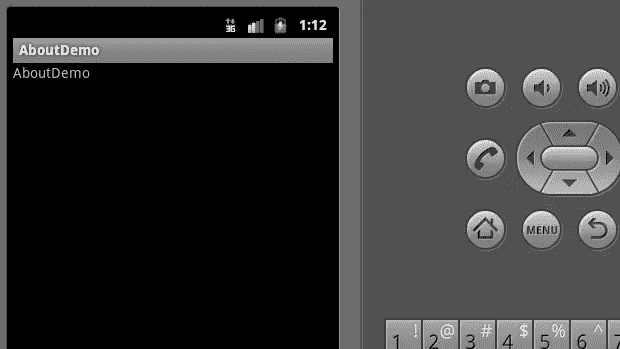
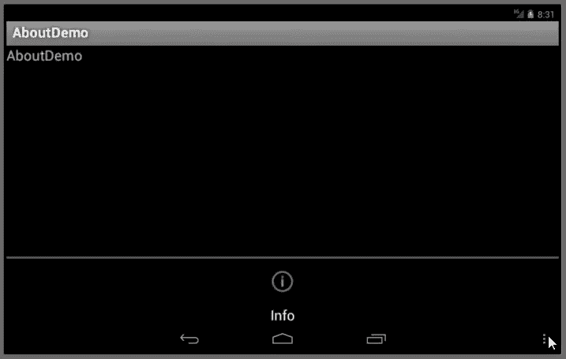
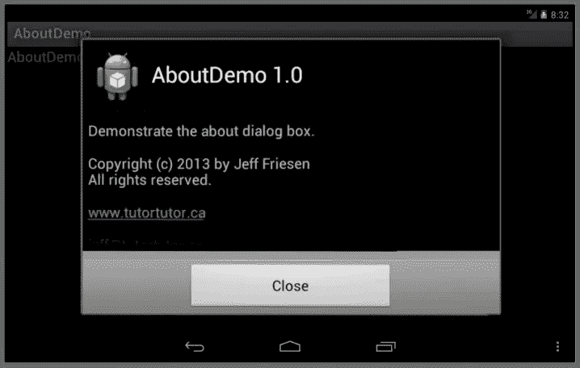

# Android 库项目入门，第 3 部分

> 原文：<https://www.sitepoint.com/getting-started-android-library-projects-part-3/>

可重用的 about 对话框是存储在 Android 库项目中的一个很好的选择。在这个关于 Android 库项目的三部分系列的第二部分中，我向您介绍了一个简单的 about 对话框示例。在本文中，我将向您展示如何从应用程序项目中访问“关于”对话框项目。

我使用 Android SDK Release 20 以及 Android 2.3.3 (API 级别 10)和 Android 4.1 (API 级别 16)平台来开发和测试本文的[代码](http://tutortutor.ca/articles/gswalp/code3.zip)。

## 关于对话框 Android 库项目演示

我已经创建了一个简单的应用程序，演示了关于对话框 Android 库项目。它是在*选项菜单*的上下文中完成的，选项菜单是活动的菜单项的主要集合。在 Android 2.3.3 上，你通过按菜单键激活这个菜单。在 Android 4.1 上，按下操作栏的垂直省略号图标。

### 探索源代码和资源

关于对话框演示 app 项目由一个单独的源文件(`AboutDemo.java`)和三个资源文件:`main.xml`、`options.xml`和`strings.xml`。清单 1 展示了`AboutDemo.java`。

```
package ca.tutortutor.aboutdemo;

import android.app.Activity;

import android.os.Bundle;

import android.view.Menu;
import android.view.MenuInflater;
import android.view.MenuItem;

import ca.tutortutor.about.About;

public class AboutDemo extends Activity
{
   @Override
   public void onCreate(Bundle savedInstanceState)
   {
      super.onCreate(savedInstanceState);
      setContentView(R.layout.main);
   }

   @Override
   public boolean onCreateOptionsMenu(Menu menu)
   {
      MenuInflater inflater = getMenuInflater();
      inflater.inflate(R.menu.options, menu);
      return true;
   }

   @Override
   public boolean onOptionsItemSelected(MenuItem item)
   {
      switch (item.getItemId())
      {
         case R.id.menu_info:
              About.show(AboutDemo.this, getString(R.string.about), 
                         getString(R.string.close));
              return true;

         default:
              return super.onOptionsItemSelected(item);
      }
   }
}
```

**清单 1:** `AboutDemo.java`

清单 1 覆盖了三个`Activity`方法。当创建活动时，调用`onCreate()`方法，并从`main.xml`展开活动的视图层次结构(稍后讨论)。`onCreateOptionsMenu()`和`onOptionsItemSelected()`方法支持选项菜单。

当用户打开选项菜单(通过按菜单或操作栏的垂直省略号图标)时，调用`onCreateOptionsMenu()`。它被一个附加了菜单项的`Menu`对象调用，获得一个菜单充气器(通过调用`getMenuInflater()`，并使用充气器将`options.xml`充气成一个`menu`引用的菜单。返回的`true`值显示菜单。

从选项菜单中选择一个菜单项时，调用`onOptionsItemSelected()`。它调用`MenuItem`参数的`getItemId()`方法来获取所选菜单项的资源 ID。如果这个 ID 对应于`menu_info` ID，`About`的`show()`方法被调用来显示 about 文本(对应于`about`字符串 ID)和 close 按钮文本(对应于`close`字符串 ID)。

因为这个应用程序很简单，所以我不需要 switch 语句。此外，因为这个菜单上只有一个菜单项，所以不会执行默认情况。我选择这种架构是因为我可能会决定向选项菜单添加更多的菜单项，并且我可能不想立即处理这些菜单项。当完成应用程序时，我可能会删除默认情况。

清单 2 展示了`main.xml`。

```
<?xml version="1.0" encoding="utf-8"?>
<LinearLayout xmlns:android="http://schemas.android.com/apk/res/android"
              android:orientation="vertical"
              android:layout_width="fill_parent"
              android:layout_height="fill_parent">
  <TextView android:layout_width="fill_parent" 
            android:layout_height="wrap_content" 
            android:text="@string/app_name"/>
</LinearLayout>
```

**清单 2:** `main.xml`

清单 2 的布局资源将 textview 小部件包装在一个占据整个屏幕的线性布局中。这个小部件也占据了屏幕的整个宽度，但是它的高度被限制为不大于它的内容(加上填充)，所以当显示`AboutDemo`活动时，它出现在屏幕的顶部。

清单 3 展示了`options.xml`。

```
<?xml version="1.0" encoding="utf-8"?>
<menu xmlns:android="http://schemas.android.com/apk/res/android">
  <item android:id="@+id/menu_info"
        android:icon="@android:drawable/ic_menu_info_details"
        android:title="@string/menu_info"/>
</menu>
```

**清单 3:** `options.xml`

清单 3 描述了一个名为`options`的选项菜单——它显示了一个 info (about)菜单项。分配给`icon`属性的`@android:drawable/ic_menu_info_details`值标识信息菜单项的标准图标。标题是从字符串资源中获得的，这样我就可以在必要时对其进行本地化。

清单 4 展示了`strings.xml`。

```
<?xml version="1.0" encoding="utf-8"?>
<resources>
  <string name="about"><![CDATA[Demonstrate the about dialog box.<p>
                                Copyright (c) 2013 by Jeff Friesen<br>
                                All rights reserved.<p>
                                <a href="http://tutortutor.ca/">www.tutortutor.ca</a><p>
                                <a href="mailto:jeff@tutortutor.ca">jeff@tutortutor.ca</a><p>
                                1-800-555-1234<p>
                                <i>This app is distributed on an "as is" basis, without warranty. 
                                Although every precaution has been taken in the app\'s creation, Jeff 
                                Friesen shall not have any liability to any person or entity with 
                                respect to any loss or damage caused or alleged to be caused directly 
                                or indirectly by the app.</i>]]></string>
  <string name="app_name">AboutDemo</string>
  <string name="close">Close</string>
  <string name="menu_info">Info</string>
</resources>
```

**清单 4:** `strings.xml`

清单 4 描述了应用程序的字符串资源。其中一个资源(`about`)需要包含 HTML 标签，比如`<br>`和`<p>`。为了防止解析器在解析 XML 时出错(通过 Android 资产打包工具`aapt`，资源文本被夹在前缀`![CDATA[`和相应的后缀`]]>`之间。

**提示:**为了支持另一个地区(例如`fr` —法语)，创建一个`res\values-*suffix*`目录，其中 *`suffix`* 标识一个地区(例如`res\values-fr`，并将一个`strings.xml`文件复制到这个目录，除了在`<string>`和`</string>`标记之间的本地化内容之外，这个目录与清单 4 相同。

### 创建、初始化、安装和运行 AboutDemo

让我们创建并初始化这个应用程序项目。第一步是创建项目。我使用以下命令行在我的 Windows 平台上完成了这项任务:

```
android create project -t 1 -p C:\prj\ap\AboutDemo -a AboutDemo -k ca.tutortutor.aboutdemo
```

目标 1 确定我的平台上的 Android 2.3.3。(执行`android list targets`以获得您平台上的等效目标数。)我将这个项目存储在我的`C:\prj\ap\AboutDemo`目录中。最后，该项目的包名是`ca.tutortutor.aboutdemo`。

接下来，将包含清单 1 内容的`AboutDemo.java`文件复制到`AboutDemo\src\ca\tutortutor\aboutdemo`目录中。另外，将以下资源文件复制到适当的目录中:

*   `main.xml`包含清单 2 的内容到`AboutDemo\res\layout`

*   `options.xml`包含清单 3 的内容到`AboutDemo\res\menu`——您必须首先创建`menu`目录

*   `strings.xml`包含清单 4 的内容到`AboutDemo\res\values`

在生成此项目之前，需要更新它以引用“关于”对话框库项目。我使用以下命令来完成这项任务:

```
android update project -t 1 -p C:\prj\ap\AboutDemo -l ..\About
```

执行`ant debug`来构建这个项目。假设有一条*构建成功*的消息，执行以下命令在当前 Android 虚拟设备(AVD)上安装生成的`AboutDemo-debug.apk`文件:

```
adb install AboutDemo-debug.apk
```

如果第一次尝试失败，您可能必须重复此命令。

该应用程序以默认图标安装在 AVD 上。按此图标运行应用程序。假设是 Android 2.3.3 设备，按菜单键显示选项菜单。图 1 显示了结果。



**图 1:** 查看 Android 2.3.3 下的选项菜单。

按 Info 菜单项，您应该看到图 2 的 about 对话框。


**图 2:** 滚动对话框以观察更多关于文本。按下电子邮件链接会出现“不支持的操作”对话框。

让我们在 Android 4.1 下运行这个应用程序。启动配置为 API 级的 AVD。启动后，安装`AboutDemo-debug.apk`并按下它的图标，然后按下操作栏上的垂直省略号。您应该观察图 3。



**图 3:** 查看 Android 4.1 下的选项菜单。

按 Info 菜单项，您应该看到图 4 的 about 对话框。



**图 4:** 滚动对话框以观察更多关于文本。按下电子邮件链接会出现“不支持的操作”对话框。

## 结论

Android 库项目易于创建和使用。现在您对它们有了基本的了解，您可能想用更多的例子来练习。开发一个可重用的帮助对话框，使用`WebView`来呈现基于 HTML 的帮助，怎么样？此外，考虑开发一个图像处理库。

## 分享这篇文章