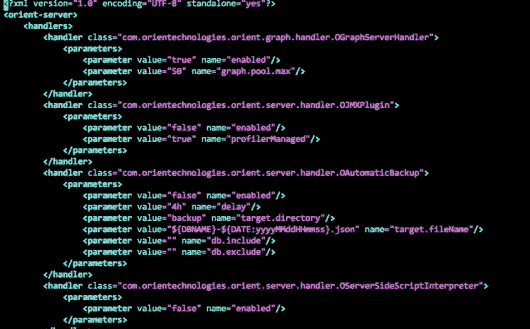
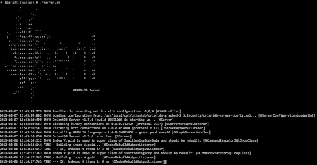
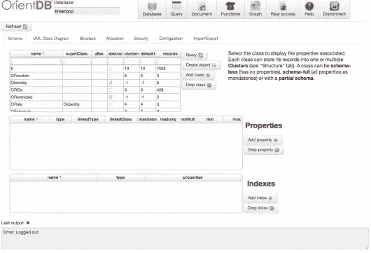
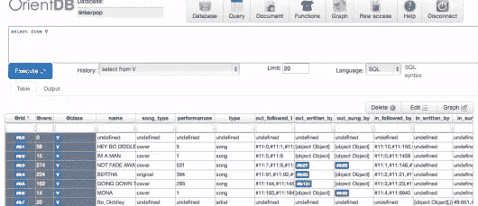
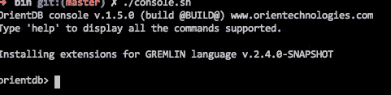
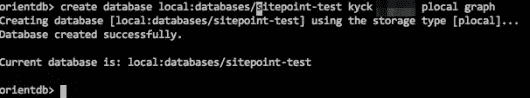

# 看东方数据库:图形文件 NoSQL

> 原文：<https://www.sitepoint.com/a-look-at-orientdb-the-graph-document-nosql/>

在这篇文章中，我将向你简要介绍一个 [OrientDB](http://www.orientdb.org) 。在本系列的后续文章中，我将带您通过 Ruby 使用 OrientDB。

你可能听说过文档数据库，比如 [MongoDB](http://www.mongodb.org) ，你可能听说过图形数据库，比如 [Neo4j](http://www.neo4j.org) 。我敢打赌，你没有听说过很多图形文档数据库，如果有的话。

没错。OrientDB 自诩为“图形文档 NoSQL”从网站:

> OrientDB 是一个开源的 GraphDB，混合了文档数据库和面向对象的特性。

听起来有趣吗？还是疯了？还是两者都有？

我们在 Neo4j[ [1](#1) ]的道路上走了很远之后发现了 OrientDB，却发现 Neo4j 对其“企业”功能(即 HA)的定价超出了我们的创业能力。OrientDB 有一个 [Apache2 许可证](http://www.apache.org/licenses/LICENSE-2.0.html)，比 Neo4j 的更宽松。[ [2](#2)

我喜欢 GraphDB 的概念，比如有向属性关系以及图形方法带来的灵活性。如果你不熟悉图形数据库的概念，看看 Thiago Jackiw 的这两篇文章([一篇](https://www.sitepoint.com/using-a-graph-database-with-ruby-part-i-introduction/)和[两篇](https://www.sitepoint.com/using-a-graph-database-with-ruby-part-ii-integration/))。

如果你需要一个文档数据库的初级读本，看看来自 10gen 的这篇文章。

本质上，OrientDB 从它的文档 DB 根中获得了灵活模式的承诺，以及作为一等公民的关系，就像图形数据库一样。两个世界的一个很好的例子是 OrientDB 如何支持嵌入和引用关系。前者包含在记录中，只能通过该容器访问。被引用的关系就像图形数据库世界中的边，可以作为具有起始顶点、结束顶点和属性的一级对象来访问。

Orient 有一些令人印象深刻的声明，例如每秒超过 150，000 次插入，并且已经在 Nuvolabase 中有了云服务。事实上，Nuvolabase 提供了 OrientDB 附带的“studio”应用程序的演示，你可以在这里看到。

### 不是美国制造的

如果你看了 Nuvolabase 的定价，你可能会注意到它不是很好的美国美元。目前，OrientDB 的大多数客户似乎都在欧洲。另外，OrientDB 背后的公司，[东方科技](http://orientechnologies.com/)，在伦敦。我提到它只是因为 1)我在美国，2)在我偶然发现 OrientDB 之前，我对它知之甚少。除此之外，我真的不认为这是一个问题。

### 装置

背景够了，我们安装 OrientDB 玩玩吧。OrientDB 是用 Java 编写的，所以您应该可以在任何地方运行它。它配有服务器、控制台和 [Gremlin](http://gremlin.tinkerpop.com/) 控制台。现在先不要管 Gremlin，我以后再说。

可供下载的版本有[这里](https://github.com/orientechnologies/orientdb/wiki/Download)。目前，我会推荐 [1.5.0 稳定版](https://github.com/orientechnologies/orientdb/releases/tag/1.5)。只需点击该页面上的绿色大按钮，即可获得发布的 zip 文件。


将文件解压到一个目录中，我假设这个目录名为`orientdb`。OrientDB 的目录结构相当典型:


我今天只讲一下**配置**、 **bin** 和**数据库**目录。

#### 配置

在 **config** 目录下有几个文件。我们只想运行“标准”服务器，所以打开**orientdb-server-config . XML**文件。



还记得 XML 吗？它仍然是 XML，仍然主导着 Java 配置。不管怎样，这里有很多设置你可以自己研究(或者我稍后会发布)。现在，向下滚动直到看到`<users>`部分。

这个部分定义了(你猜对了)可以访问服务器的用户。默认情况下，OrientDB 提供一个“root”和“guest”用户。我喜欢用更合理的密码来添加我自己的用户，所以可以随意添加:

```
<user resources="*" password="password" name="user"/>
```

`resources`属性控制用户可以做什么。值`*`使用户变得无所不能，因此相应地管理自己。OrientDB wiki 上有[一些](https://github.com/orientechnologies/orientdb/wiki/DB-Server#resources)文档，但感觉不完整。

保存配置文件并关闭它。

#### 数据库

**databases** 目录保存(您又猜对了)该服务器服务的数据库。该目录中的任何数据库对服务器都是可见的，无需配置。创建新数据库时，将在此目录中创建一个与数据库同名的新文件夹。我们一会儿会做的。

然而，这个目录只是数据库的默认目录。您可以通过配置添加其他`storage`站点。

OrientDB 支持三种存储“引擎”:内存、本地和 plocal。记忆是不言自明的。

本地和本地存储类型使用文件系统。本地似乎是“老方法”，也是目前最丰富的功能。Plocal 是“新方式”，但是缺少一些一流的特性，比如事务。这里可以阅读更多[。](https://github.com/orientechnologies/orientdb/wiki/Concepts#database-url)

OrientDB 附带了一个名为 **tinkerpop** 的演示数据库，当我们启动服务器时，您可以使用它。

#### 点燃它

通常情况下，bin 目录中有有趣的内容。也就是说，它包含启动各种类型的服务器和控制台的脚本。今天，我们将使用 **server.sh** (或者 **server.bat** ，如果你使用的是 Windows 系统)来发布普通的独立服务器。

**注意:**我不得不`chmod +x *.sh`进入那个目录，因为我所有的 shell 脚本都是不可执行的。

一旦启动了服务器，您将看到如下内容:



啊…你不喜欢 ASCII 艺术吗？我知道。只要你没有看到任何错误，一切都准备好了。OrientDB 附带了一个[便捷的 web 应用程序](https://github.com/orientechnologies/orientdb/wiki/OrientDB-Studio)，在这里你可以浏览数据库、创建类、记录、索引等。默认情况下，它位于 [http://localhost:2480](http://localhost:2480) 。当您访问该页面时，它会要求您登录。确保使用我们在上面的配置中定义的用户名和密码。现在，在数据库下拉列表中应该只有 **tinkerpop** 数据库。

登录后，您应该会看到:



Studio 应用程序从“数据库”部分的“模式”选项卡开始。这显示了可用的类以及一些其他元数据。值得注意的是 **V** 和 **E** ，它们分别代表顶点和边。这些是你的图形数据库的基类，当你创建一个新类(也称为“顶点类型”或“边类型”)时，它将从这些类中的一个继承。

tinkerpop 数据库没有任何顶点子类，但是它有三个边子类:**后跟 _by、**、**由**唱，以及**由**写。它们是边子类的指示是**超类**列中的‘E’值。正如你可能猜到的，Vertex 子类在那一列中有一个“V”。哦，你可以创建子类的子类。

您可以把类想象成非常像面向对象世界中的类。他们定义了一种“记录类型”作为一个简短的演示，选择表中的“V”类，然后单击“查询”按钮。您将被带到查询页面，该页面如下所示:



在这里您可以看到 V 类的记录和属性。任何以“@”开头的属性(so、`@rid`、`@version`和`@class`)都是 OrientDB 系统属性，这意味着所有的类都有它们。其余的或者是用户定义的，或者被定义为关系的一部分。关系属性以`in_`或`out_`开始，每个属性保存进入或离开每个关系类型的每个顶点的边记录的 id。

你第一眼看到 OrientDB 可能会迷失方向。关系属性和奇数 id(比如，“#11:0”)可以将您带出舒适区。快速讨论一下 OrientDB 中的数据结构可能会有所帮助。

### 结构

如前所述，OrientDB 将数据分成类似 OO 的类。这些类具有继承性，在图形世界中，可以是(V)ertex 或(E)dge 子类。每个类都有一个或多个*集群*，它们是“对记录进行分组的通用方式”。您可以根据属性将一个类分组。

例如，如果您有一个**发票**类，您可以将 2012 年的发票分组到一个**发票 2012** 簇中，将 2013 年的发票分组到一个**发票 2013** 簇中。创建给定记录时，可以指定该记录使用哪个分类。每个类至少有一个默认物理簇，如果在创建记录时没有指定，则使用该默认物理簇。

聚类的目的是将您想要一起查询的数据分组。我们还没有用它们做太多，但是计划随着 OrientDB 的发展，广泛使用它们。

记录就是你所期望的:一个类的实例。它们是文档数据库意义上的文档，也是图形数据库意义上的节点。记录存在于簇中，并且具有由类定义的模式。类、集群和记录是 OrientDB 数据结构的最大部分。

正如我提到的，关系是财产图的“边”,是一等公民。它们有方向(即一个“入”顶点和一个“出”顶点)，并且可以有属性。图形数据库的速度很大程度上来自于从顶点到边到顶点遍历图形的容易程度，等等。这就是为什么图表是大多数社交网站的选择。这种关系旨在避免传统 RDBMS 的“连接之痛”,在传统 RDBMS 中，数百万个连接的重量会导致巨大的性能问题。

### 玩弄数据

**bin** 目录也有一个**控制台**脚本(要么。嘘还是。bat，看你的 OS)。打开一个新的终端并启动控制台。



OrientDB 有[一个扩展的控制台命令列表](https://github.com/orientechnologies/orientdb/wiki/Console-Commands#console-commands)。今天，我们将创建一个数据库，添加一个顶点类型，创建一些数据，然后查询这些数据。

#### 创建数据库

```
create database plocal:databases/sitepoint-test user pass plocal graph
```

(**注意:**我从 OrientDB 安装的根目录开始我的`console.sh`，所以我的**数据库**文件夹的相对路径如上图所示。如果您从 **bin** dir 启动控制台，您需要输入一个相对或绝对路径，以便在正确的位置创建数据库。)



请注意，控制台已经使这个新数据库成为“最新的”这意味着命令和查询将针对该数据库运行。

#### [创建顶点类型和顶点](https://github.com/orientechnologies/orientdb/wiki/SQL-Create-Vertex)

让我们创建一个“人”的顶点类型，并使两个人。

```
create class Person extends V
=> Class created successfully. Total classes in database now: 11
```

记住，顶点类型只是顶点的子类。

现在，我们可以[添加一个属性](https://github.com/orientechnologies/orientdb/wiki/SQL-Create-Property)。

```
create property Person.name string
=> Property created successfully with id=1
```

现在，创造我们的爱人。

```
create vertex Person set name='Joanie'
=> Created vertex 'Person#11:0{name:Joanie} v0' in 0.076000 sec(s).

create vertex Person set name='Joanie'
=> Created vertex 'Person#11:1{name:Chachie} v0' in 0.001000 sec(s).
```

#### [创建边缘类型和边缘](https://github.com/orientechnologies/orientdb/wiki/SQL-Create-Edge)

创建我们的边/关系非常类似于创建我们的顶点类型和顶点。然而，如果你的关系没有任何属性，你不需要用 T1 来创建一个边类型。今天我们将保持简单，只是模仿我们对顶点所做的。

```
create class loves extends E
=> Class created successfully. Total classes in database now: 12

create edge loves from #11:1 to #11:0
=> Created edge '[loves{in:#11:0,out:#11:1}]' in 0.003000 sec(s).
```

#### 询问

```
select from Person

----+-----+-------
#   |@RID |name
----+-----+-------
0   |#11:0|Joanie
1   |#11:1|Chachie
----+-----+-------

select name as subject, out_loves.name as loves from person

----+-----+-------+------
#   |@RID |subject|loves
----+-----+-------+------
0   |#-2:1|Joanie |null
1   |#-2:2|Chachie|Joanie
----+-----+-------+------
```

您会注意到 OrientDB 有一个非常类似 SQL 的语法，这在您试图理解所有新概念时非常有用

显然，你还可以做更多的事情。这个例子有助于提高你的警觉。

## 结论

这就是我今天想和 OrientDB 走的路。在下一篇文章中，我将讨论作为我们工作的一部分的 oriented b-JRuby gem 以及一个新的 gem(代号:“oriented”)。在此之前，探索 OrientDB 控制台和 studio 应用程序，并查看 Google Group(链接如下)。

## 资源

*   [OrientDB 谷歌集团](https://groups.google.com/forum/#!forum/orient-database)
*   [OrientDB Github 知识库](https://github.com/orientechnologies/orientdb/)

* * *

这真的非常非常棒。真的，如果不是预算问题，我大概不会把眼光放在 Neo4j 之外。

公平地说，Neo4j 许可他们的商业和企业产品。在我看来，没有他们的企业功能，你不可能真正部署一个生产应用。OrientDB 也对他们的“企业”服务收费，如这里的所示，但是它没有删除任何允许伸缩的特性。这不是一个关于 Neo4j vs OrientDB 的帖子，所以这就是我要说的。

## 分享这篇文章