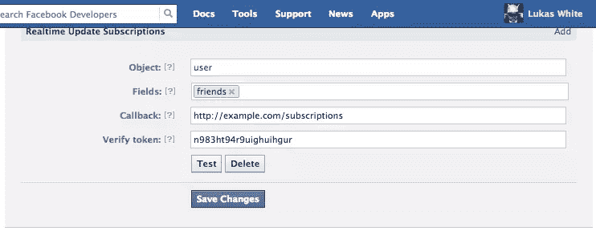

# 使用脸书的实时更新和订阅 API

> 原文：<https://www.sitepoint.com/using-facebooks-realtime-updates-and-subscription-api/>

脸书的实时更新允许我们声明我们对用户的某些信息感兴趣，并让脸书在信息发生变化时通知我们，而不是我们不断地查询 API。虽然脸书建议我们保留最少量的用户数据，但保持平衡是谨慎的。事实上，存储某些信息，比如用户的姓名和朋友列表，比不断地查询这些信息更有意义。订阅信息更新有助于确保我们的数据始终保持最新。

当然，实时更新还有其他用途——事实上，我们将在本文中看到一个:一个示例应用程序，当其他人“取消”他们的好友时，它会向他们发送电子邮件。(实际上，这并不完全正确——它告诉你某人不再是你的“朋友”,不管是谁解除了好友关系。)

## 入门指南

如果你曾经开发过脸书应用程序，注册应用程序将会成为你的第二天性。前往[https://developers.facebook.com](https://developers.facebook.com "Home - Facebook Developers")，点击应用程序，然后点击创建新应用程序，并按照说明进行操作。保存应用程序 ID 和密码，因为您稍后将需要它们来建立到脸书的连接。

此外，该应用程序需要公开，以便脸书对其进行“ping”操作。您可能会考虑使用 AppFog、Heroku 或 PagodaBox 之类的服务，或者干脆将它托管在一个可访问的服务器上。

一旦你在脸书注册了，并且知道你将在哪里托管这个应用程序，一个很好的起点就是下载你最喜欢的框架的框架项目(本文使用 Timothy Boronczyk 的这个基于 Slim 的框架)或者你可以从 GitHub 下载文章的[示例代码](https://github.com/phpmasterdotcom/FacebookRealTimeUpdatesAndSubscription "FacebookRealTimeUpdatesAndSubscription - GitHub")。

首先，我们需要对 skeleton 的`composer.json file`做一些补充。我们将安装三个额外的库:脸书 SDK 来访问他们的 API，PHPMailer 来轻松发送电子邮件，以及流行的 JavaScript 库下划线的一个端口。

```
{
    "require": {
        ...
        "facebook/php-sdk": "dev-master",
        "phpmailer/phpmailer": "dev-master",
        "underscore/underscore.php": "dev-master"
    }
}
```

接下来，通过将`config/config.php.example`复制到`config/config.php`来创建一个配置文件，设置您的特定数据库凭证，并添加以下内容:

```
'facebook.app_id'       => 'FACEBOOK-APP-ID',
'facebook.app_secret'   => 'FACEBOOK-APP-SECRET',
'facebook.verify_token' => 'FACEBOOK-VERIFY-TOKEN',

'smtp.host'             => 'SMTP-HOST',
'smtp.port'             => SMTP-PORT,
'smtp.encryption'       => 'tls', // or 'ssl'
'smtp.username'         => 'SMTP-USERNAME',
'smtp.password'         => 'SMTP-PASSWORD',
'smtp.from_address'     => 'no-reply@example.com',
'smtp.from_name'        => 'SitePoint Facebook Real-Time Tutorial',
```

显然，你需要提供你自己的价值观。

现在将以下内容添加到`include/services.php`中，它处理依赖注入，这样我们的应用程序就可以轻松访问脸书 SDK 和 PHPMailer 库:

```
$c['facebook'] = function($c) {
    $config = $c['config'];
    return new Facebook(array(
        'appId' =>  $config['facebook.app_id'], 
        'secret' => $config['facebook.app_secret'],
        'cookie' => true,
    ));
};

$c['phpmailer'] = function($c) {
    $config = $c['config'];

    $mail = new PHPMailer();

    $mail->IsSMTP();
    $mail->Host = $config['smtp.host'];
    $mail->Port = $config['smtp.port'];
    $mail->SMTPAuth = true;
    $mail->Username = $config['smtp.username'];
    $mail->Password = $config['smtp.password'];              
    $mail->SMTPSecure = $config['smtp.encryption'];

    $mail->From = $config['smtp.from_address'];
    $mail->FromName = $config['smtp.from_name'];

    $mail->WordWrap = 100;
    $mail->IsHTML(true);

    return $mail;
};
```

最后，我们需要建立我们的数据库模式。(我将使用 MySQL，尽管 NotORM 与框架应用程序捆绑在一起的 ORM——可以与任何支持 PDO 的数据库一起工作。)只有一张桌子:

```
CREATE  TABLE users (
    id INTEGER NOT NULL AUTO_INCREMENT,
    fb_id VARCHAR(64),
    name VARCHAR(255) NOT NULL,
    email VARCHAR(255) NOT NULL,
    friends TEXT,
    fb_access_token VARCHAR(255),
    fb_access_token_expires INTEGER,

    PRIMARY KEY (id) ,
    UNIQUE INDEX fb_id_UNIQUE (fb_id ASC)
);
```

## 授权应用程序

为了代表我们的用户，我们需要允许他们授权我们的应用程序。我们将保持简单，只创建一个脸书登录按钮的页面。单击该按钮会将用户重定向到脸书，在重定向到确认回调之前，会要求她授权应用程序。

在回调中，我们需要做几件事:

*   用密码换接入令牌。
*   将访问令牌交换为长期访问令牌。
*   获取用户的信息。
*   检索用户的朋友列表。
*   为用户创建一个数据库记录，存储长期访问令牌和她的朋友列表。

脸书已经废除了离线访问，我们过去可以获得一个永久有效的用户访问令牌。相反，我们现在请求一个长期令牌。当我尝试这样做时，令牌显示其有效期不到两个月，用户需要在到期时(或之前)重新进行身份验证。重新授权超出了本文的范围，但是请注意，如果没有用户的重新授权，我们的应用程序不可能永远运行。

首先，为首页添加路线:

```
$app->get('/', function () use ($app, $c) {
    $url = $c['facebook']->getLoginUrl(array(
        'scope' => 'email',
        'redirect_uri' => $app->request()->getUrl() . '/confirm',
    ));

    $app->view()->setData(array(
        'login_url' => $url,
    ));

    $app->render('index.html');
});
```

这个路由所做的只是获取登录 URL——指定我们需要用户的电子邮件地址作为附加权限——并设置确认回调。重要的事情发生在回调中。

接下来，添加确认回拨的路由:

```
$app->get('/confirm', function () use ($app, $c) {
    $config = $c['config'];
    $facebook = $c['facebook'];

    // exchange the code for an access token
    $url = sprintf(
        'https://graph.facebook.com/oauth/access_token?client_id=%s&redirect_uri=%s&client_secret=%s&code=%s',
        $config['facebook.app_id'],
        urlencode($app->request()->getUrl() . '/confirm'),
        $config['facebook.app_secret'],
        $app->request()->get('code')
    );
    $response = file_get_contents($url);

    $params = null;
    parse_str($response, $params);
    $token = $params['access_token'];

    // exchange the access token for a long-term token
    $url = sprintf(
        'https://graph.facebook.com/oauth/access_token?grant_type=fb_exchange_token&client_id=%s&client_secret=%s&fb_exchange_token=%s',
        $config['facebook.app_id'],
        $config['facebook.app_secret'],
        $token
    );
    $response = file_get_contents($url);

    $params = null;
    parse_str($response, $params);
    $token = $params['access_token'];
    $tokenExpires = $params['expires'];

    // get the user's information
    $facebook->setAccessToken($token);
    $fb_user = $facebook->api('/me');
    $friends = $facebook->api('/me/friends');

    // create the database entry
    $c['db']->users->insert(array(
        'fb_id'   => $fb_user['id'],
        'name'    => $fb_user['name'],
        'email'   => $fb_user['email'],
        'friends' => serialize($friends['data']),
        'fb_access_token' => $token,
        'fb_access_token_expires' => $tokenExpires
    ));
});
```

这个简单的例子有一些限制:

1.  它假设用户同意授权我们的应用程序访问她的电子邮件地址。
2.  它假设用户以前没有授权该应用程序。

您可以通过处理拒绝来扩展这个示例，并构建某种机制来要求用户在令牌过期时重新授权。

## 设置订阅

脸书的订阅 API 提供了一个应用程序订阅的 REST 接口。订阅只是告诉脸书我们想要接收什么样的实时更新。我们指定我们感兴趣的对象——在我们的例子中是用户——和字段——朋友。

注意，我们订阅对象的类型，而不是特定的对象本身；用户订阅意味着我们将获得授权应用程序的任何人的更新，而不仅仅是特定的用户。此外，实时更新仅限于某些类型的对象及其字段的子集。更多信息请参考[实时更新文档](https://developers.facebook.com/docs/reference/api/realtime/ "Realtime Updates - Facebook Developers")。

有两种方式来设置订阅:通过脸书上的开发者门户，以及使用 API。无论是哪种情况，我们都需要先设置一个集线器质询回调，因为脸书会在验证过程中对此进行 pings 操作。

每当我们添加或修改订阅时，脸书通过使用以下参数向回调发出 GET 请求来验证订阅:

*   `hub.mode`–字符串“订阅”
*   `hub.challenge`–随机字符串
*   `hub.verify_token`–我们在创建订阅时给出的 verify_token 值

我们的回调只是检查`hub.mode`是否包含字符串“subscribe”,`hub.verify_token`是否匹配我们指定的字符串，一切正常只是输出`hub.challenge`的值。

```
$app->get('/subscriptions', function () use ($app, $c) {
    $req = $app->request();
    $verify = $c['config']['facebook.verify_token'];
    if ($req->get('hub_mode') == 'subscribe' && $req->get('hub_verify_token') == $verify) {
        echo $req->get('hub_challenge');
    }
});
```

要通过开发人员门户网站设置订阅，请转到您的应用程序，然后单击左侧“设置”下的“实时更新”。在显示“请选择您想要订阅的对象”的地方，选择“用户”并单击“确认”。您现在将看到以下表单:



输入“friends”作为对象字段，输入“ <your-url>/subscriptions”作为回调端点，并输入一个随机字符串作为验证令牌(也将这个随机字符串记录在您的配置文件中)。</your-url>

或者，要使用订阅 API 设置订阅，可以向*https://graph.facebook.com/<APP _ ID>/Subscriptions*发出 POST 请求。例如:

```
$facebook->api(
    $config['facebook']['app_id'] . '/subscriptions',
    'POST',
    array(
        'object'       => 'user',
        'fields'       => 'friends',
        'callback_url' => 'http://www.example.com/subscriptions',
        'verify_token' => $config['facebook']['verify_token']
    )
);
```

## 处理实时更新

订阅更新本身以 JSON 格式发布到我们的应用程序中。为了处理它们，我们需要设置一个回调来验证请求的真实性，然后更新我们的本地数据。

接下来几节中出现的代码都驻留在 POST 回调中:

```
$app->post('/subscriptions', function () use ($app, $c) {
```

### 验证 POST 请求

强烈建议验证 POST 请求确实来自脸书。幸运的是，这相对简单。当发出请求时，脸书将根据请求体和我们的应用程序秘密生成一个签名，并将其包含在 X-HUB-SIGNATURE 报头中。我们只需检查头部是否已设置，自己生成签名，并比较两者。

```
$req = $app->request();
$headers = $req->headers();

$signature = $headers['X_HUB_SIGNATURE'];
$body = $req->getBody();

$expected = 'sha1=' . hash_hmac('sha1', $body, $facebook->getApiSecret());

if ($signature != $signature) {
	exit();
}
```

签名是这样生成的:获取请求体，在请求体的开头添加“sha1 ”,然后使用应用程序机密与 SHA1 一起对其进行哈希处理。到此为止，我们知道请求来自脸书，所以我们可以继续处理它。

### 处理更新

更新告诉我们发生了什么变化，但不告诉我们发生了什么变化。查询 API 以找出新值是开发人员的责任。下面是一个通知示例，它告诉我们由 123456789 标识的用户有朋友变更:

```
{
  "object": "user",
  "entry": [
    {
      "uid": "123456789",
      "id": "123456789",
      "time": 1374846331,
      "changed_fields": [
        "friends"
      ]
    }
  ]
}
```

我们可能会一次收到一个更新，或者一起收到一堆更新，但总是针对同一对象类型。也就是说，我们不会在同一个请求中获得用户更新和页面更新。因此，我们需要首先检查对象类型，然后遍历实际的对象，看看哪些字段发生了变化。

```
$updates = json_decode($body, true);
if ($updates['object'] == 'user') { 
    foreach ($updates['entry'] as $entry) {
        $uid = $entry['uid'];
        foreach ($entry['changed_fields'] as $field) {
            if ($field == 'friends') {
                ...
```

我们只对 friends 字段感兴趣，但是当然您可以订阅其他字段(在这种情况下，switch 语句可能更好)。

对于每个用户对象，我们可以使用刚刚从请求中获取的脸书 UID 从数据库中检索保存的信息。

```
$user = $db->users('fb_id = ?', $uid)->fetch();
if ($user) {
    $data = unserialize($user['friends']);
```

未序列化的朋友数据如下所示:

```
array(123) {
  [0]=>
  array(2) {
    ["name"]=>
    string(11) "Mick Jagger"
    ["id"]=>
    string(7) "123456789"
  }
  [1]=>
  array(2) {
    ["name"]=>
    string(10) "Keith Richards"
    ["id"]=>
    string(8) "987654321"
  }
...
```

我们想要的是 ID 的数组，所以这里是下划线出现的地方，特别是`pluck()`函数:

```
$friendIDs = __::pluck($data, 'id');
```

我们代表用户使用脸书 API，因此我们需要将访问令牌设置为我们之前保存在数据库中的内容。然后我们可以获取一个最新的朋友列表，并再次运行`pluck()`，这样我们就有一个数组可以比较。我们只需确定最新列表中缺少的 id，然后使用 API 获取相应的名称。

```
$facebook->setAccessToken($user['fb_access_token']);
$response = $facebook->api('/me/friends');
$friendsData = $response['data'];

$newFriendIDs = __::pluck($friendsData, 'id');
$removedIDs = array_diff($friendIDs, $newFriendIDs);

if (count($removedIDs)) {
    $html = '<p>The following people have un-friended you:</p>';
    $html .= '<ul>';
    foreach ($removedIDs as $id) {
        $friend = $facebook->api($id);
        $html .= '<ul>' . $friend['name'] . '</li>';
    }
    $html .= '</ul>';

    $mail = $c['phpmailer'];
    $mail->AddAddress($user['email'], $user['name']);
    $mail->Subject = 'Someone has un-friended you on Facebook!';
    $mail->Body = $html;
    $mail->Send();
}
```

还有最后一件事，我们完成了；我们需要将最新的朋友列表保存到数据库中，以便在将来的比较中使用。

```
$user->update(array(
    'friends' => serialize($friendsData),
));
```

## 摘要

在本文中，我们查看了脸书的实时更新和订阅 API，看到它们对于保持本地存储的数据最新是多么的有用，因为它们允许我们在发生变化时获取更新的数据。我们通过构建一个示例应用程序来演示如何使用它们，该应用程序监视用户的好友列表，并让她知道何时发生了变化。如果你有其他有用的想法，请务必在评论中告诉我！

<small>图片 via[Fotolia](http://us.fotolia.com/?utm_source=sitepoint&utm_medium=website_link&utm=campaign=sitepoint "Royalty Free Stock Photos at Fotolia.com")</small>

## 分享这篇文章