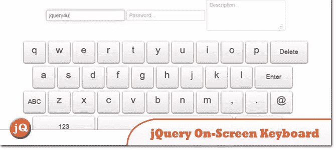
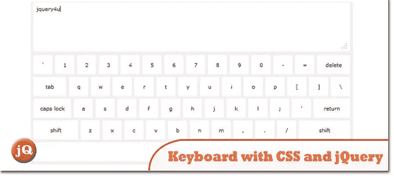
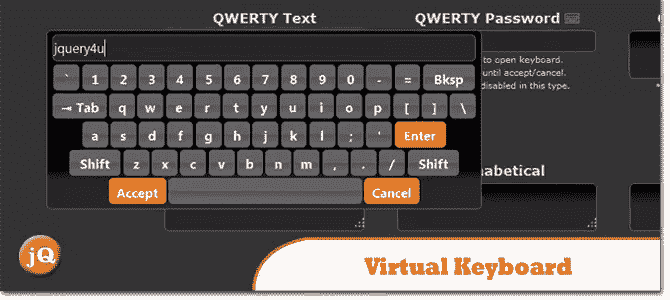
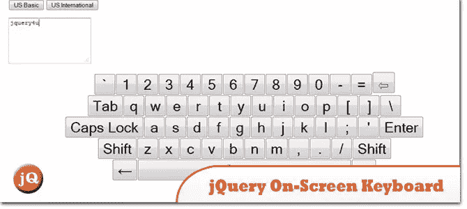

# 4 屏幕键盘上的 jQuery

> 原文：<https://www.sitepoint.com/4-jquery-screen-keyboards/>

所有这些例子都使用 jQuery 来产生一个屏幕上的[键盘](https://www.sitepoint.com/best-mechanical-keyboards/)。

**相关帖子:**

*   [HTML5 画布屏幕键盘](http://www.jquery4u.com/?p=17374)

## 1.jQuery 屏幕键盘

由 jQuery 支持的屏幕键盘。

 
[来源](https://www.sitepoint.com/jquery-on-screen-keyboard/)

## 2.用 CSS 和 jQuery 创建键盘

键盘包括“动作”键(caps lock、shift 和 delete ),单击时会动态改变键盘。今天我将向您展示如何构建它。

 
[来源](http://net.tutsplus.com/tutorials/javascript-ajax/creating-a-keyboard-with-css-and-jquery/) [演示](http://d2o0t5hpnwv4c1.cloudfront.net/378_jqueryKeyboard/demo/index.html)

## 3.虚拟键盘

嵌入在浏览器窗口中的屏幕虚拟键盘，当指定的输入字段被聚焦时会弹出。

 
[源+演示](http://mottie.github.io/Keyboard/)

## 4.jQuery 屏幕键盘

为触摸屏终端等可能没有硬件键盘的环境提供多语言屏幕键盘。

 
[来源](http://code.accursoft.com/osk/wiki/Home) [演示](https://bytebucket.org/accursoft/osk/wiki/demo.html)

## 分享这篇文章