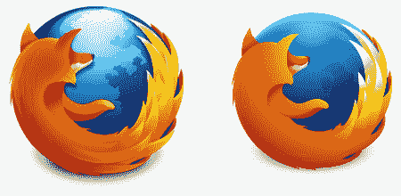

# 火狐 23 的新功能

> 原文：<https://www.sitepoint.com/firefox-23-whats-new/>

又到那个时候了。火狐 23 版本已经在 Windows、Mac、Linux 和 Android 上发布。你可能已经有了，但是如果没有，选择**帮助** > **关于火狐**或者从[getfirefox.com](http://getfirefox.com/)下载。让我们浏览一下新功能列表…

## 新标志

火狐的 logo 已经变得越来越平，越来越没有光泽了:



是一种进步吗？你在乎吗？它在 Windows 8 任务栏上看起来不太清晰，但我不会因此失眠。

## 没有 JavaScript 或图像禁用

正如我上个月报道的，火狐 23 不再允许你从选项菜单中禁用 JavaScript。此外，您不能禁用图像。

虽然这引起了一些争议，但我认为这是一个好的举措。开发人员和高级用户仍然可以改变浏览器的行为，但新手用户不会偶然发现潜在的危险选项。

## 混合内容拦截器

当访问同时包含 HTTPS 和 HTTP 内容的页面时，地址栏中会出现一个新的盾形图标，并自动阻止某些内容，如不安全的脚本。用户可以通过单击图标来覆盖此行为:


## HTML5 输入范围类型

Firefox 是最后一个支持范围输入类型的主流浏览器:

```
<input type="range" value="50" min="0" max="100" step="1" />
```

它产生一个滑块控件；没有脚本或 CSS 是必要的！

## 开发者工具选项

一个新的选项面板已经实现，允许您启用或禁用工具，主题，chrome 调试和远程调试。点按“开发者工具”窗口/面板左上角的齿轮图标。

## 新网络监视器

网络监视器(菜单> Web Developer >网络)提供了所有网络活动的视图。虽然控制台上已经提供了这些信息，但新工具提供了一个更简单的界面，类似于 Firebug 和 Webkit/Blink Inspector 中的界面:


在工具的右边有一个小的扩展图标，允许您更详细地分析每个请求的头、cookies、参数、响应和时间。

## 无前缀 requestAnimationFrame

`requestAnimationFrame`是`setTimeout`或`setInterval`的现代替代物。它允许浏览器执行其他任务，但下次空闲时会运行一个回调函数。虽然可以为任何长期运行的流程调用它，但动画是最有可能的用途。

更多信息，请参考使用 requestAnimationFrame 的[简单动画。](/simple-animations-using-requestanimationframe/)

## RIP 闪烁

眨眼就过去了。那是标签和`text-decoration`风格——不是 Chrome 的新渲染引擎！

标签是邪恶的。它交替使用文本的前景色和背景色来制造一种诱发偏头痛的效果。只有 15 年前创建的 GeoCities 网站会受到影响。

## 杂项更新

除了各种[安全补丁](https://www.mozilla.org/security/known-vulnerabilities/firefox.html)，桌面版还包括…

*   简化的插件安装界面
*   社交 API 的新分享按钮
*   搜索提供商可以在整个浏览器中切换
*   一个改进的关于:内存分析器
*   Windows Vista、7 和 8 上的 H.264 视频解码加速
*   Mac OS X 10.7+中新的滚动条样式

移动版本提供…

*   一个在地址栏显示网址而不是页面标题的新设置(这是我个人的不满)
*   向下滚动时工具栏是隐藏的
*   基本 RSS 支持(长按地址栏)
*   [健康报告](https://blog.mozilla.org/metrics/fhr-faq/)的初步实施
*   对阅读器模式的各种更新

Firefox 仍然是许多高级用户和网络开发者的首选浏览器。它可能已经输给了 Chrome，但 Mozilla 最近的创新更新让谷歌看起来有点昏昏欲睡。狐狸正在反咬一口。

## 分享这篇文章