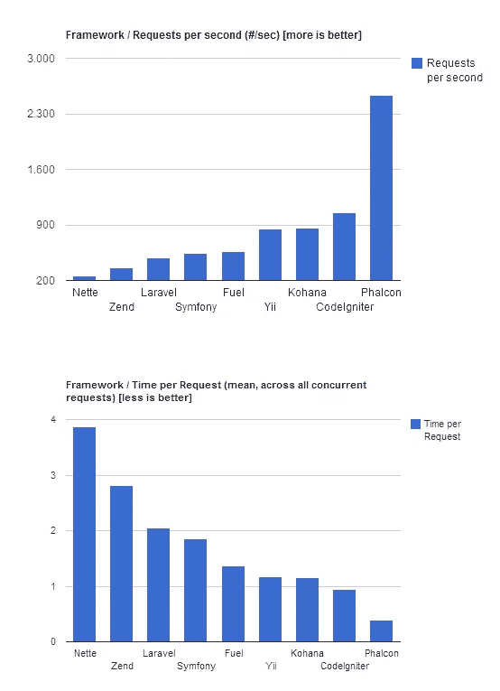

# PhalconPHP:又一个 PHP 框架？

> 原文：<https://www.sitepoint.com/phalconphp-yet-another-php-framework/>

PHP 框架种类繁多，从包含 ORM、验证组件和大量 HTML 助手的全栈框架，到除了提供路由功能之外几乎没有其他功能的微框架。它们都声称自己很特别，要么语法漂亮，速度快，要么文档很好。其中一个框架是 Phalcon。但是与其他框架相比，Phalcon 确实非常不同；它不仅仅是你下载的另一个包，而是一个用 c 编写的 PHP 模块。

在本文中，我们将简要了解一下 Phalcon 是什么样子，以及它的特别之处。

## 什么是 Phalcon？

Phalcon 是一个全栈框架。它促进了 MVC 架构，提供了 ORM、请求对象库、模板引擎、缓存、分页等特性……在它的网站上可以找到完整的特性列表。

但是 Phalcon 有些独特，因为您不像使用大多数其他框架那样，只是下载一个归档文件并将其解压缩到一个目录中。相反，您下载并安装 Phalcon 作为一个 PHP 模块。安装过程只需要几分钟，并且可以在文档中找到[安装说明](http://docs.phalconphp.com/en/latest/reference/install.html)。此外，Phalcon 是开源的。如果需要，您可以随时修改代码并重新编译它。

## 为获得更好的性能而编译

PHP 的一个主要缺点是，在每次请求时，所有文件都从硬盘中读取，转换成字节码，然后执行。与 Ruby (Rails)或 Python (Django，Flask)等其他语言相比，这导致了一些重大的性能损失。使用 Phalcon，整个框架已经在 RAM 中，所以整套框架文件不需要处理。网站上的基准测试显示，这确实具有一些显著的性能优势。



Phalcon 每秒处理的请求是 CodeIgniter 的两倍多。当您查看每个请求的时间时，Phalcon 处理请求的时间最少。所以每当一个框架说它很快，就认为 Phalcon 更快。

## 使用 Phalcon

Phalcon 提供了现代 PHP MVC 框架的经典特性(路由、控制器、视图模板、ORM、缓存等。)，所以和其他框架比起来除了速度没什么特别的。尽管如此，我们还是来看看使用 Phalcon 的典型项目是什么样子的。
首先，通常有一个引导文件，每个请求都会调用它。请求通过存储在`.htaccess`文件中的指令发送到引导程序。

```
<IfModule mod_rewrite.c>
    RewriteEngine On
    RewriteCond %{REQUEST_FILENAME} !-d
    RewriteCond %{REQUEST_FILENAME} !-f
    RewriteRule ^(.*)$ index.php?_url=/$1 [QSA,L]
</IfModule>
```

Phlacon 文档建议使用以下目录结构:

```
  app/
    controllers/
    models/
    views/
  public/
    css/
    img/
    js/
```

但是如果你真的想的话，可以修改目录布局，因为所有的东西都将通过引导文件来访问，引导文件以`public/index.php`的形式存在。

```
<?php
try {
// register an autoloader
$loader = new PhalconLoader();
$loader->registerDirs(array(
'../app/controllers/',
'../app/models/'
))->register();

// create a dependency injection container
$di = new PhalconDIFactoryDefault();

//set up the view component
$di->set('view', function(){
$view = new PhalconMvcView();
$view->setViewsDir('../app/views/');
return $view;
});

// handle the request
$application = new PhalconMvcApplication();
$application->setDI($di);
echo $application->handle()->getContent();
}
catch (PhalconException $e) {
echo "PhalconException: ", $e->getMessage();
}
```

### 模型控制器

控制器和模型是自动加载的，因此您可以创建文件并在项目中的任何位置使用它们。控制器应该扩展`PhalconMvcController`，模型应该扩展`PhalconMvcModel`。

控制器动作定义如下:

```
public function indexAction() {
echo 'welcome to index';
}
```

模型也很简单:

```
class Users extends PhalconMvcModel
{
}
```

通过扩展`PhalconMvcModel`类，你可以立即使用一些方便的方法，比如`find()`、`save()`和`validate()`。你可以使用这样的关系:

```
class Users extends PhalconMvcModel
{
public function initialize() {
$this->hasMany('id', 'comments', 'comments_id');
}
}
```

### 视图

视图提供了基本的功能，比如能够向视图传递数据和使用布局。尽管像 Twig 或 Blade 一样，但 Phalcon views 并不使用特殊的语法。他们用的是纯 PHP。

```
<html>
<head>
<title>Blog's title</title>
</head>
<body>
<?php echo $this->getContent(); ?>
</body>
</html>
```

然而，Phalcon 有一个内置的即时消息系统:

```
$this->flashSession->success('Succesfully logged in!');
```

### 费尔康查询语言

Phalcon 有自己的 ORM，Phalcon 查询语言(PHQL)，可以用来让数据库交互更有表现力，更干净。PHQL 可以与模型集成，从而轻松定义和使用表之间的关系。

您可以通过扩展`PhalconMvcModelQuery`类来使用 PHQL，然后创建一个新的查询，如下所示:

```
$query = new PhalconMvcModelQuery("SELECT * FROM Users", $di);
$users = $query->execute();
```

除了这样的原始 SQL，您还可以像这样使用查询构建器:

```
$users = $this->modelsManager->createBuilder()->from('Users')->orderBy('username')->getQuery()->execute();
```

当您的查询变得更加复杂时，这非常方便。

## 结论

Phalcon 提供了现代 PHP MVC 框架的经典特性，因此使用起来应该很舒服，从这个意义上说，它只是另一个 PHP 框架。但是它真正与众不同的地方是它的速度。如果你有兴趣了解更多关于 Phalcon 的知识，请查看[框架的文档](http://docs.phalconphp.com/en/latest/index.html)。一定要试出来！

<small>图片 via[Fotolia](http://us.fotolia.com/?utm_source=sitepoint&utm_medium=website_link&utm=campaign=sitepoint "Royalty Free Stock Photos at Fotolia.com")</small>

## 分享这篇文章