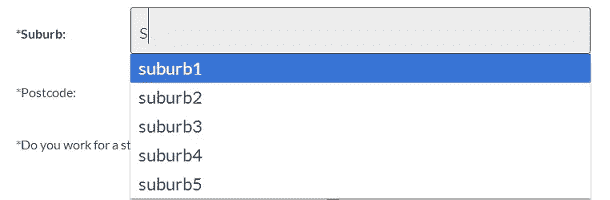

# jQuery AJAX HTML5 数据列表自动完成示例

> 原文：<https://www.sitepoint.com/jquery-ajax-html5-datalist-autocomplete/>

这段代码使用 H **TML5 Datalist 标记为文本字段**设置自动完成选项。它通过 AJAC 请求从 JSON 文件中获取数据(如果需要，数据可以持久地存储在浏览器中，或者本地存储在 js 对象上)。然后，当郊区发生变化时，它使用郊区的选择来自动填充其他字段邮政编码和州。在除了 Safari 之外的几乎所有浏览器中都很好用。

**注意:** HTML 数据列表仍然无法与所有浏览器兼容。[参见兼容性](http://caniuse.com/datalist)。对于回填插件，使用这个:[jquery . releventdropdowns . js](https://github.com/CSS-Tricks/Relevant-Dropdowns/blob/master/js/jquery.relevant-dropdown.js)–它插入一个带有 LI 的标签来代替 datalist 选项。



## HTML5 数据列表标记

```
<input list="suburbs" name="suburb" type="text" autocomplete="on">
<datalist id="suburbs"></datalist>
```

## 完整 jQuery

这段代码通过 JSON 填充 datalist，并根据用户对字段的自动完成选择自动填充其他字段。

```
window.DATALIST = {

    cache: {},

    init: function()
    {
        var _this = this,
            this.cache.$form = $('formid');
            this.cache.$suburbs = this.cache.$form.find('datalist#suburbs');
            this.cache.$suburbInput = this.cache.$form.find('input[name="suburb"]');
            this.cache.$postcodeInput = this.cache.$form.find('input[name="postcode"]');
            this.cache.$stateInput = this.cache.$form.find('input[name="state"]');

        //grab the datalist options from JSON data
        var checkMembershipRequest = $.ajax({
            type: "GET",
            dataType: "JSON",
            url: "/php/suburbs.php"
        });

        checkMembershipRequest.done(function(data)
        {
            console.log(data);

            //data could be cached in the browser if required for speed.
            // localStorage.postcodeData = JSON.stringify(data);

            //add options to datalist
            $.each(data.suburbs, function(i,v)
            {
                _this.cache.$suburbs.append('<option data-value="+i+" data-postcode="+v.postcode+" data-state="+v.state+">'+i+'</option>');
            });

            //hook up data handler when suburb is changed to autocomplete postcode and state
            _this.cache.$suburbInput.on('change', function()
            {
                // console.log('suburb changed');
                var val = $(this).val(),
                    selected = _this.cache.$suburbs.find('option[data-value="'+val+'"]'),
                    postcode = selected.data('postcode'),
                    state = selected.data('state');
                _this.cache.$postcodeInput.val(postcode);
                _this.cache.$stateInput.val(state);
            });

        });

        checkMembershipRequest.fail(function(jqXHR, textStatus)
        {
            console.log( "postcode request fail - an error occurred: (" + textStatus + ")." );
            //try again...
        });

    }

}
```

## 完整的 HTML

您的 HTML 可能是这样的:

```
 *   <label class="inline" for="suburb">*郊区:</label> <input class="text input xwide" list="suburbs" name="suburb" type="text" placeholder="" autocomplete="on" required="">  <datalist id="suburbs"></datalist>

*   <label class="inline" for="postcode">*邮政编码:</label> <input class="text input narrow narrow-margin" name="postcode" type="text" placeholder="" required=""> <label class="inline" for="state">州名:</label> <input class="text input narrow" name="state" type="text" placeholder="" required=""> 
```

## 完整 JSON

PHP 文件返回 JSON 可能是。json 或者。php 和抓取数据库中的数据，如果需要。

```
{
    "suburbs": {
        "suburb1": {
            "postcode": "2016",
            "state": "NSW"
        },
        "suburb2": {
            "postcode": "4016",
            "state": "QLD"
        },
        "suburb3": {
            "postcode": "3016",
            "state": "CA"
        },
        "suburb4": {
            "postcode": "8016",
            "state": "WA"
        },
        "suburb5": {
            "postcode": "6016",
            "state": "SA"
        }
    }
}
```

## html5 触发器数据列表

使用 ALT+向下箭头模拟用户操作。您需要使用 jQuery 来模拟多次触发按键。

键码 ALT = 18(也称为 altKey 的修饰键)
键码向下箭头= 40

```
var e = jQuery.Event("keydown");
e.which = 40;
e.altKey = true;
$("input").trigger(e);
```

## 分享这篇文章