# 在 Photoshop 中创建一个未来的 404 页面

> 原文：<https://www.sitepoint.com/create-a-techno-style-404-page-design-in-photoshop/>

我们花了很多时间设计主页，规划一个简单的导航，浏览所有我们认为重要的细节。但是，在设计过程中经常被忽略(或完全忘记)的一个页面是 404 页面，有时被称为“找不到页面”错误页面。

根据最近的设计调查，人们被 404 页面绊倒的比率比设计师想象的要高得多。当访问者点击 404 页面时，他们通常会立即离开网站，这增加了网站的跳出率，并导致网站背后的组织失去机会。话虽如此，几乎不可能防止每一个 404 错误，当它们不可避免地发生时，一点点的风格和幽默可以在很大程度上挽回访问者并赢回他们的青睐。在本教程中，我们将使用各种有趣的模式和混合选项来设计一个时尚的 404 页面。

**资源:**

[异国情调的圆点图案](http://webtreatsetc.deviantart.com/art/Colorful-Exotic-Polkadots-131357288)

[数字显示字体](http://www.dafont.com/digital-display-tfb.font)

在我们开始之前，让我们看看我们的最终设计。([下载完成的，分层的 PSD 文件](https://www.dropbox.com/s/yp9bt21ix5fnzox/404%20page.zip)。)

[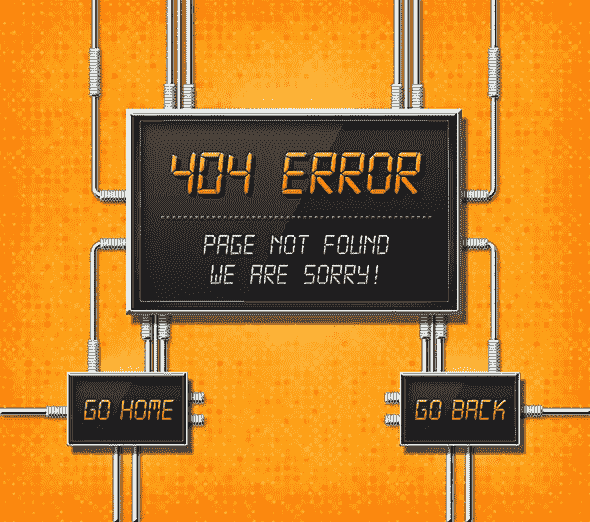](https://www.sitepoint.com/wp-content/uploads/2013/07/Final.jpg)

### 第一步

打开你的 Photoshop，创建一个新文件，我将保持小尺寸，宽度为 960 像素，高度为 850 像素。

[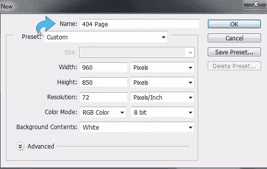](https://www.sitepoint.com/wp-content/uploads/2013/07/Step-1.jpg)

### 第二步

现在我们从背景开始，创建一个新层，点击“层”>“新建”>“层”然后，选择油漆桶工具，用颜色#ffab19 填充背景。

[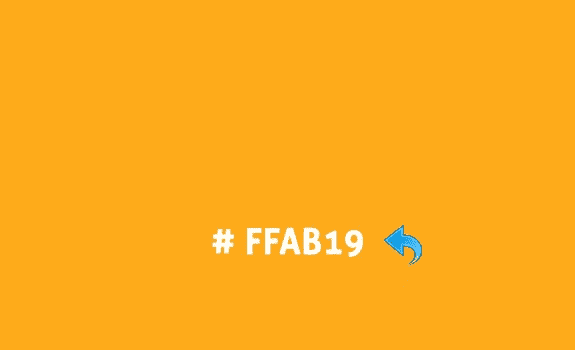](https://www.sitepoint.com/wp-content/uploads/2013/07/Step-2.jpg)

### 第三步

选择背景层，点击“图层”>“图层样式”>“图案叠加”(或者双击选中的图层)，从上面提到的图案中添加一个圆点图案。改变混合模式为“叠加”，设置图案不透明度为 70%。

[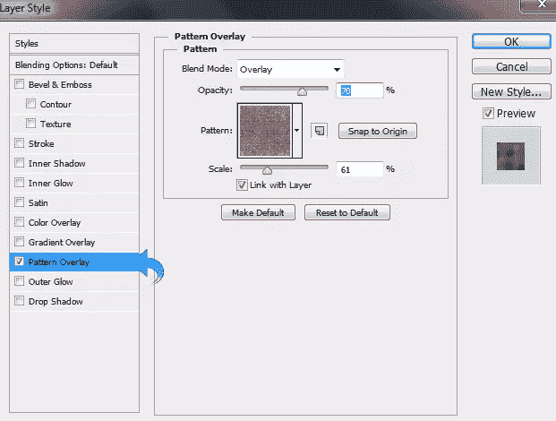](https://www.sitepoint.com/wp-content/uploads/2013/07/Step-3.jpg)

### 第四步

再次点击“图层”>“图层样式”>“内阴影”(或者双击选中的图层)，使用“柔光”混合模式添加一些内阴影。现在，设置大小为 125 像素。

[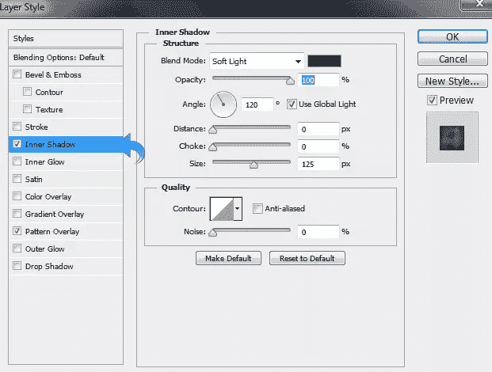](https://www.sitepoint.com/wp-content/uploads/2013/07/Step-4.jpg)

### 第五步

现在我们将从我们的主要柜台开始。首先，创建一个新层(“层”>“新建”>“层”)。要为计数器创建一个发光的背景，选择“软圆刷”并在中间使用前景色#ffffff。

### 第六步

选择矩形工具创建一个矩形，并用颜色#ebebeb 填充。

[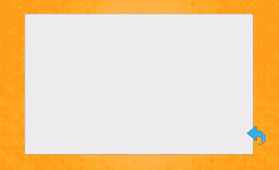](https://www.sitepoint.com/wp-content/uploads/2013/07/Step-6.jpg)

### 第七步

选择上面的矩形图层，点击“图层”>“图层样式”(或者双击选中的图层)，添加“斜面和浮雕”保持如下图所示的设置。

[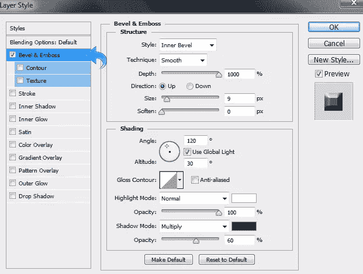](https://www.sitepoint.com/wp-content/uploads/2013/07/Step-7a.jpg)

再次点击“图层”>“图层样式”(或者双击选中的图层)，添加一些阴影。保持设置不变，如下图所示。

[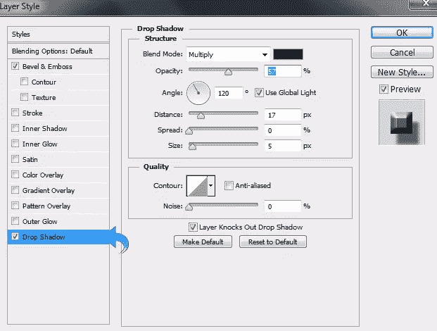](https://www.sitepoint.com/wp-content/uploads/2013/07/Step-7b.jpg)

### 第八步

再次选择矩形工具创建另一个矩形，填充颜色#252525。

[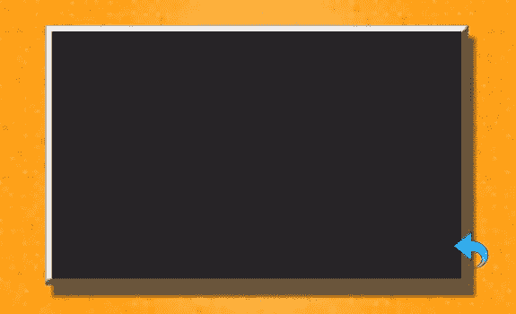](https://www.sitepoint.com/wp-content/uploads/2013/07/Step-8.jpg)

### 第九步

现在，选择上面的矩形图层，点击“图层”>“图层样式”，添加“斜面和浮雕”保持如下图所示的设置。

[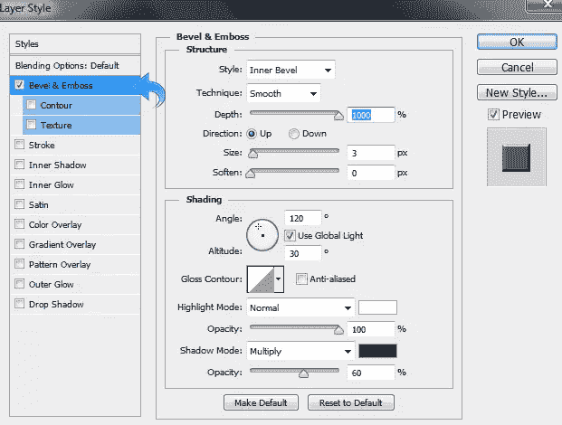](https://www.sitepoint.com/wp-content/uploads/2013/07/Step-9a.jpg)

再次点击“图层”>“图层样式”，添加描边。保持设置不变，如下图所示。

[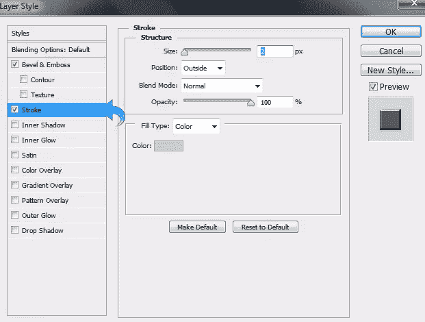](https://www.sitepoint.com/wp-content/uploads/2013/07/Step-9b.jpg)

再次点击“图层”>“图层样式”，添加“内部发光”保持设置不变，如下图所示。

[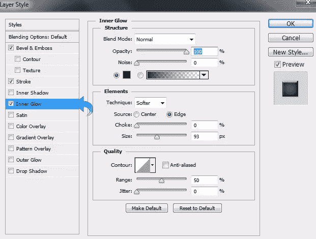](https://www.sitepoint.com/wp-content/uploads/2013/07/Step-9c.jpg)

再次点击“图层”>“图层样式”，添加“渐变叠加”保持如下图所示的设置。

[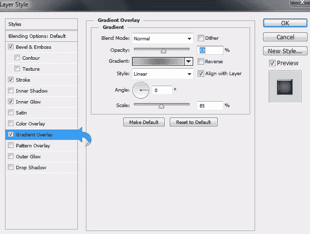](https://www.sitepoint.com/wp-content/uploads/2013/07/Step-9d.jpg)

### 第十步

使用矩形工具创建另一个矩形，填充颜色#111111。

[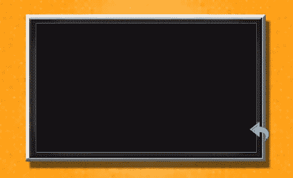](https://www.sitepoint.com/wp-content/uploads/2013/07/Step-10.jpg)

### 步骤 11

选择上面的图层，点击“图层”>“图层样式”添加“描边”，保持设置不变，如下图所示。

[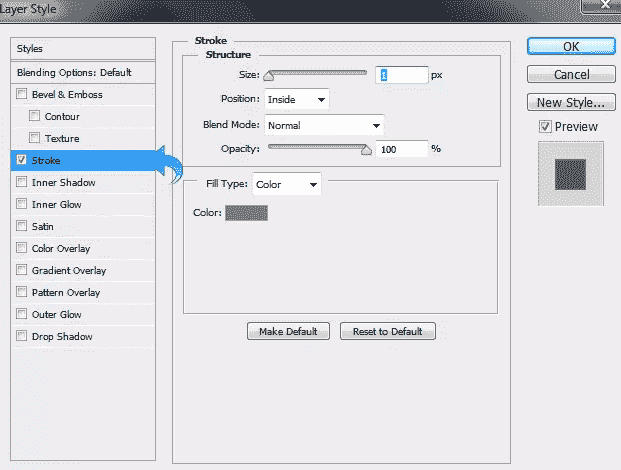](https://www.sitepoint.com/wp-content/uploads/2013/07/Step-11a.jpg)

再次点击“图层”>“图层样式”，添加一些“内部阴影”保持设置不变，如下图所示。

[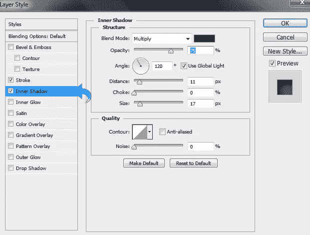](https://www.sitepoint.com/wp-content/uploads/2013/07/Step-11b.jpg)

最后，点击“图层”>“图层样式”，添加“渐变叠加”保持如下所示的设置。

[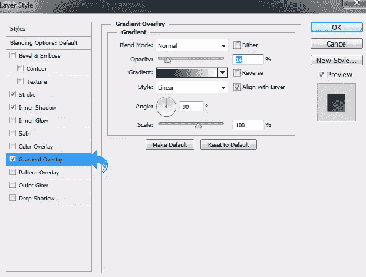](https://www.sitepoint.com/wp-content/uploads/2013/07/Step-11c.jpg)

### 步骤 12

现在，让我们添加正文。首先，我们将创建阴影文本，因此选择文字工具并添加文本。然后，点击“图层”>“图层样式”(或双击选中的图层)，添加斜面和浮雕，并保持设置如下图所示。

[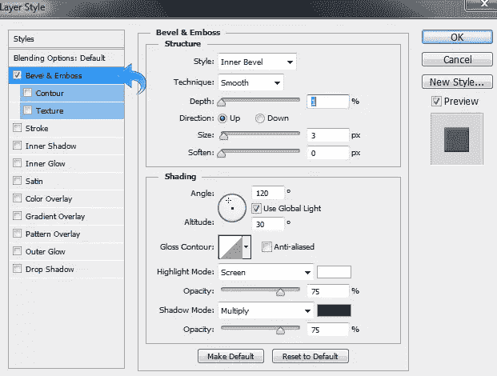](https://www.sitepoint.com/wp-content/uploads/2013/07/Step-12a.jpg)

再次点击“图层”>“图层样式”(或者双击选中的图层)进行渐变叠加。

[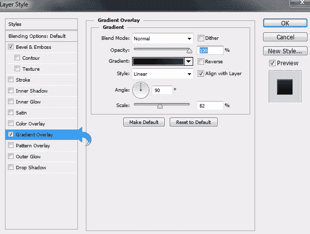](https://www.sitepoint.com/wp-content/uploads/2013/07/Step-12b.jpg)

再次点击“图层”>“图层样式”(或者双击选中的图层)，添加一些阴影。

[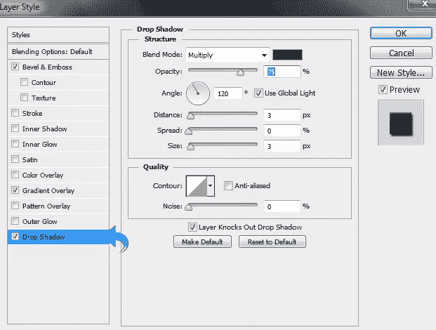](https://www.sitepoint.com/wp-content/uploads/2013/07/Step-12c.jpg)

### 第十三步

再次，选择文字工具，添加与上面使用的相同样式的主要文本，然后调整“渐变叠加”设置，以获得所需的颜色。

[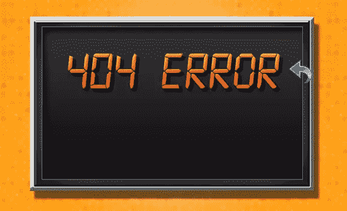](https://www.sitepoint.com/wp-content/uploads/2013/07/Step-13.jpg)

### 步骤 14

重复同样的过程，添加更多的文字，同时调整渐变叠加面板中的颜色。

[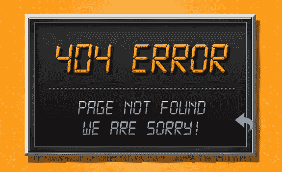](https://www.sitepoint.com/wp-content/uploads/2013/07/Step-14.jpg)

### 第十五步

现在，我们将在我们的计数器屏幕上创建闪耀。选择钢笔工具或者你可以使用多边形套索工具创建一个简单的形状，并用#ffffff 填充它。然后，减少层不透明度为 7%。

[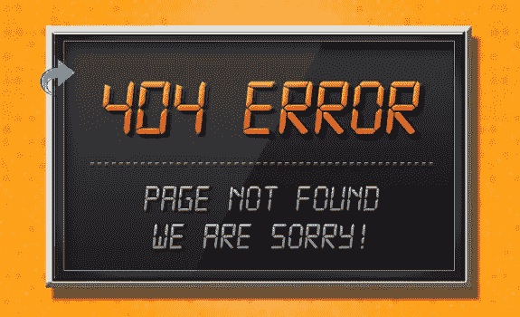](https://www.sitepoint.com/wp-content/uploads/2013/07/Step-15.jpg)

### 第十六步

我们的主要柜台完成了；现在，重复相同的过程来创建两个小计数器，以帮助我们的用户重定向到主站点。

[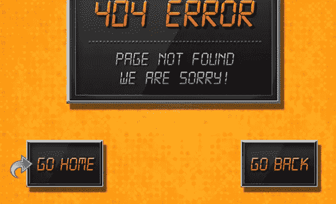](https://www.sitepoint.com/wp-content/uploads/2013/07/Step-16.jpg)

### 步骤 17

现在我们将从电线开始。首先，创建一个新层。然后，选择钢笔工具创建一个路径。右键单击路径，选择用画笔描边路径的选项。确保你的前景色是#ffffff。

[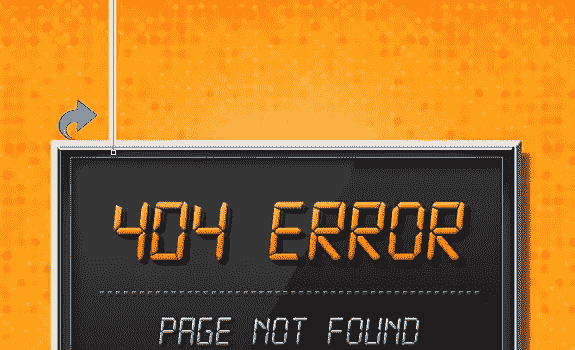](https://www.sitepoint.com/wp-content/uploads/2013/07/Step-17.jpg)

### 步骤 18

选择上面的线层，点击“图层”>“图层样式”(或者双击选中的图层)，添加斜面和浮雕。

[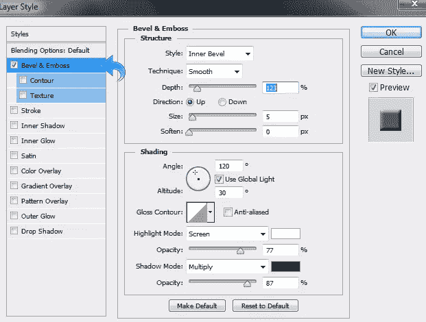](https://www.sitepoint.com/wp-content/uploads/2013/07/Step-18a.jpg)

再次点击“图层”>“图层样式”(或者双击选中的图层)添加描边。

[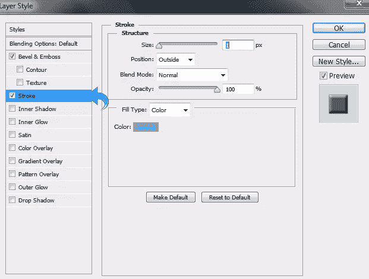](https://www.sitepoint.com/wp-content/uploads/2013/07/Step-18b.jpg)

再次点击“图层”>“图层样式”(或者双击选中的图层)，添加一些阴影。

[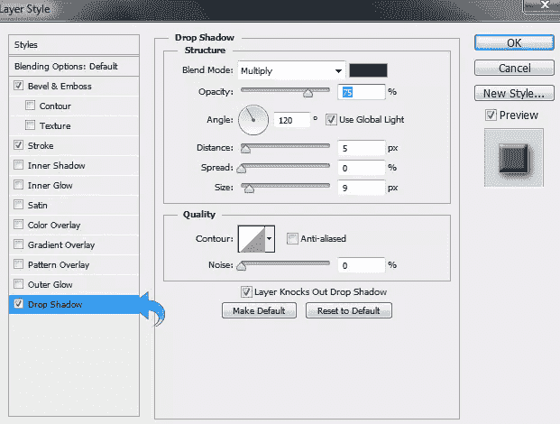](https://www.sitepoint.com/wp-content/uploads/2013/07/Step-18c.jpg)

### 步骤 19

重复同样的过程，创建更多的线，调整笔刷大小来调整线的粗细。

[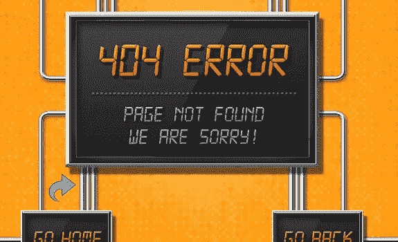](https://www.sitepoint.com/wp-content/uploads/2013/07/Step-19.jpg)

### 步骤 20

现在，我们将创建导线接头。创建一个新层，粘贴电线样式到这个层(右键点击层，选择“复制层样式。”然后，打开画笔面板来调整设置。

[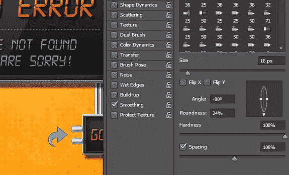](https://www.sitepoint.com/wp-content/uploads/2013/07/Step-20.jpg)

我们完成了我们的 404 页面设计！我希望你们喜欢这个教程。我会带着更多有趣的教程回来，在那之前玩得开心，继续设计！

## 分享这篇文章