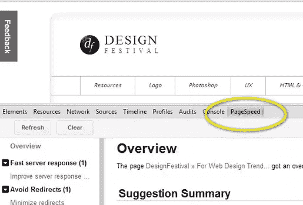

# 提高网站速度的 10 种方法

> 原文：<https://www.sitepoint.com/10-ways-to-speed-up-your-site/>

你设计了一个漂亮的网站。它看起来很棒，它卖小部件，它完成工作！但是，总有改进的空间，尤其是在技术方面。提高网站整体体验的最好方法之一就是提高网站速度。

除了让你的用户体验更好，页面速度也成为搜索引擎优化的主要影响因素。所以，不要低估页面速度的价值，即使你的网站已经很快了。看看你的竞争对手加载速度有多快，你可能会找到在搜索引擎曲线上领先的最快方法——更快的网站会得到优惠待遇。

### 1.更快的服务器意味着更快的结果

这是确保您的网站始终快速运行的最简单的方法，但也可能是最昂贵的选择。我 99%的客户通过 GoDaddy 或 BlueHost 等公司共享主机。

如果您正在交付大量的媒体内容，可能是时候升级到专用服务器或登录专门托管较大媒体文件的内容交付网络(CDN)了。这可以大大减少页面的加载时间，因为 HTML、CSS 和页面的其他基本内容是从服务器加载的，而大文件则由 CDN 处理。

### 2.打开文件压缩

大多数服务器可以处理文件压缩，这意味着文件由服务器压缩，以压缩格式发送给用户，然后解压缩。虽然这给用户的计算机增加了一点压力，但它会对下载速度产生重大影响。

虽然这听起来很复杂，但并不太难。如果你有任何使用 web 服务器的经验，你应该能够进去做这些改变。

对于基于 Windows 的服务器，你必须配置 IIS 来压缩文件:[在 IIS 7 中配置 HTTP 压缩](http://technet.microsoft.com/en-us/library/cc771003(WS.10).aspx)

对于基于 Apache 的服务器，您正在寻找 mod_deflate 功能，它可以在。htacess 文件: [Mod Deflate](http://httpd.apache.org/docs/2.0/mod/mod_deflate.html) 。

这可能会产生巨大的影响，所以请花些时间来探索这个选项。它可能会对没有内置解压缩功能的旧浏览器产生负面影响，但现代浏览器不会有问题。

### 3.将图像放入 CSS

我们每个页面上都有被访问的文件。标题图形、菜单图形和许多图标都是标准配置。那么，为什么不把它们放入一个 CSS 文件中，不再要求浏览器为每个页面检索每个文件呢？

当一个图像在你的 CSS 文件中时，一个单独的 CSS 解析器处理寻找这些文件的过程。这被称为异步过程。简而言之，这允许你的浏览器一次做更多的事情。

例如，假设您的站点标题和菜单有以下图像:

*   header.jpg
*   facebook.png
*   twitter.png
*   myspace.png(
*   instagram.png
*   favicon.ico
*   …等等。

如果在 HTML 中直接引用这些文件，浏览器必须下载 HTML，呈现它，然后单独获取每个文件。

*或*，您可以让浏览器内置的 CSS 解析器在您的浏览器呈现 HTML 时处理这些请求。这是完成工作更有效的方法。

### 缩小

缩小是简单地删除网站文件中的空白。在许多情况下，缩小可以减少 20-50%的文件大小。但是，你不想经历缩小文件的过程，直到你完成；缩小的文件更难编辑，因为你所有漂亮的换行符和缩进都不见了。所以，等到你的网站完成后再缩小。

在你缩小任何内容后，去 W3.org 验证你的内容。这将确保您没有破坏任何有效标记。然后，把内容放到你的网站上，确保你没有破坏网站的功能和内容。

### 4.缩小 CSS

在我过去几年工作过的大多数网站中，CSS 可能非常大，并且经常被分成多个 CSS 文件。WordPress 只是一个例子。为了使这些 CSS 文件加载更快，缩小是答案。

有很多强大的工具，从简单的到超级复杂的都有。根据我的经验，简单的工具对文件大小有很大的影响，而高级的工具可能只会有一点点好的结果。

我最喜欢的是在 MinifyCSS.com 结束

只需将 CSS 内容粘贴到 CSS 输入区域，调整压缩设置和选项，并处理它。然后，替换处理过的内容。如果你只得到 5-10%的改善，你可能需要更积极的压缩设置。

你可以通过[http://jigsaw.w3.org/css-validator/](http://jigsaw.w3.org/css-validator/)来验证 CSS

### 5.缩小 JS

Javascript 缩小比 CSS 更敏感。你很容易破坏你的代码，所以要小心。话虽如此，越来越多的网站依赖 JS 来实现基本功能，所以探索 JS 文件的小型化可以有很大的改进。

99%的时候，JavaScript 文件中唯一被缩小的是注释和空白。因此，一切都应该进展顺利，但是如果您发现您的功能在 JS 文档中的特定位置/功能上出现问题，您总是可以分几个步骤压缩该功能的上下部分，以获得几乎相同的缩小结果。

我使用[http://jscompress.com/](http://jscompress.com/)来快速清理我的 JS 文件。

### 6.缩小 HTML

HTML 是缩小化的另一个很好的候选，但它很少被使用，因为现在很多 HTML 是通过 PHP 或其他服务器端技术动态生成的。但是，有一些例子，你在文件中包含了大块的 HTML，没有必要跳过缩小这些代码块。

一个伟大的，简单的 HTML 压缩工具可以在[http://www.willpeavy.com/minifier/](http://www.willpeavy.com/minifier/)找到。然后，再次前往 http://validator.w3.org/的[来确保代码仍然是有效的 HTML 标记。](http://validator.w3.org/)

### 7.合适的图像尺寸

图像占用大量带宽！在页面上找到 200k+但只有 150x150px 的零散图形并不罕见，在轻度 JPG 压缩下应该只有 10k。我经常看到这种情况。我花时间浏览顶层页面，查看每张图片，确保提供的图片与显示的图片大小相同。

这通常发生在使用 WordPress 或其他 CMS 的时候。用户可能拖放了一个*巨大的*图像，但没有选择正确的尺寸，而是使用百分比来缩小页面的尺寸。

我最近发现了一个小宝石，它对于页面上的一个小图像来说超过 2MB。页面速度从 20 多秒下降到 2 秒以下。确保一个小的，不正当的形象不会让你慢下来！

### 8.没有 CSS @import

开发中的一个常见做法是使用 CSS 导入来获取字体等样式。我一直在用这些东西，比如谷歌网页字体或我开发的其他一些库或资源。

这在开发过程中是没问题的。但是到了生产的时候，花点时间把你的 CSS 合并成一个或者几个文件。这对于较大的文件或字体尤其重要。浏览器必须等待内容加载，你不想依赖第三方。

### 9.浏览器缓存

这可能是设计师面临的最复杂、最耗时的任务之一。利用浏览器缓存最简单的方法是使用 WordPress 或其他 CMS 插件。这些将处理您想要处理的大部分缓存任务，并节省您梳理可以从缓存中受益的文件的时间。

简而言之，如果内容不经常改变，文件是缓存的好选择。页面上的页眉、页脚和基本内容只是几个很好的例子。但是，如果其中大部分是动态的，更新非常频繁(每小时或每天)，那么缓存可能是一个坏主意，因为浏览器不会获得最新版本。

对于基于 Windows 的服务器:[配置 IIS 7 输出缓存](http://www.iis.net/learn/manage/managing-performance-settings/configure-iis-7-output-caching)

对于基于 Apache 的服务器，查看他们的缓存指南(版本 2.4):[http://httpd.apache.org/docs/2.4/caching.html](http://httpd.apache.org/docs/2.4/caching.html)

### 10.清除错误的请求

我只提出检查不好的请求，因为它们发生在每个人身上，应该是你网站维护周期的一部分。糟糕的请求可能在任何时候开始出现，而且它们并不那么明显。

一个常见的例子是当 Twitter 改变了他们的 API，而你的网站中查询他们的 API 的部分不再工作。现在你在发送和接收不好的请求。足够的这些，你会开始看到你的网站的主要速度问题。

定期检查错误的请求。图像会移动。CSS 得到更新。客户乱搞东西。不要低估坏请求对网站速度的影响，即使这种情况很少发生。

### 检查速度机会

一个很好的方法是使用 Chrome 浏览器的内置页面速度工具来检查你的网站可以改进的地方。只需点击 F12 或右键单击并选择检查元素。在“开发人员”面板中，您会看到页面速度工具:

使用这个简单的工具，您可以获得许多关于重点关注的问题和领域的线索。

你是如何优化你的网站的？你有什么提高速度的灵丹妙药？

## 分享这篇文章