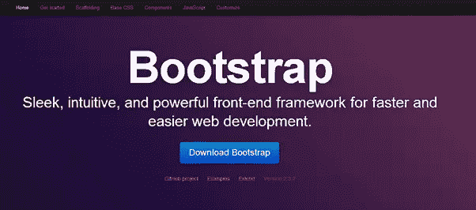
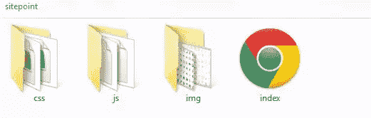
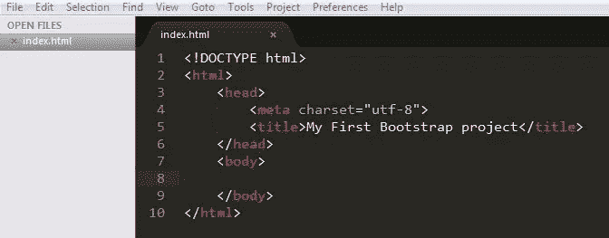
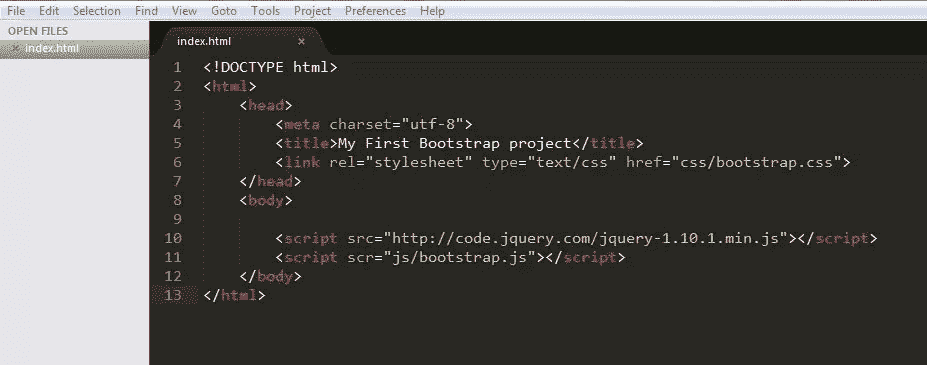
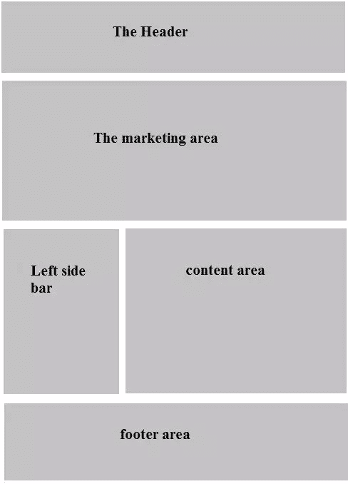
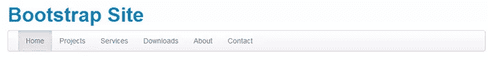
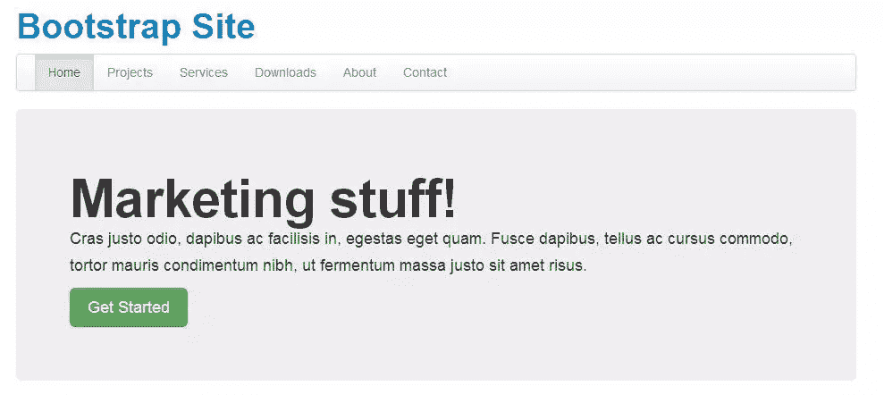
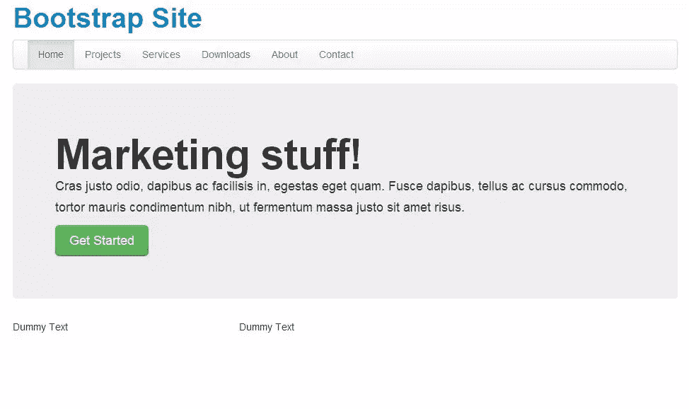
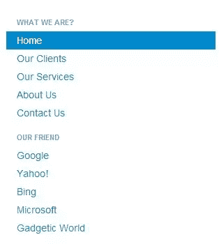
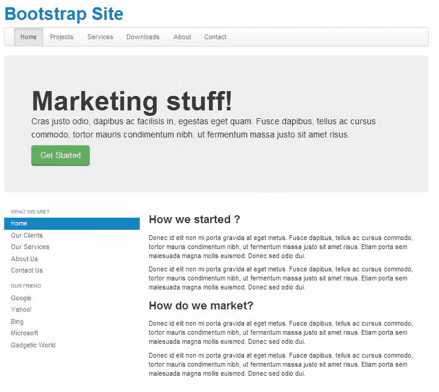

# Twitter 引导教程——处理复杂设计

> 原文：<https://www.sitepoint.com/twitter-bootstrap-tutorial-handling-complex-designs/>

在网页设计和开发领域，关于 Twitter Bootstrap 已经说了很多，也写了很多。有人称之为零设计知识的 web 开发者的福音，也有人称之为设计师的福音。不管它是什么，它做事情更容易和更快。



在许多情况下，web 开发人员已经准备好了整个设置，但是由于缺少他们将要工作的项目的设计，他们无法继续工作。他们必须依靠设计师来完成他们项目的客户端。这个过程耗费了大量的时间，对于需要尽快实现自己想法的开发人员来说，这是一种严重的时间浪费。在这种情况下，Twitter Bootstrap 以超级英雄的方式来拯救我们！

Twitter Bootstrap 是一个帮助设计 web 应用程序的 CSS 框架。它是当今业界最容易使用的 CSS 框架之一。它假设你没有设计知识，你想做的只是按照 Bootstrap 规范编写一些 HTML。简而言之，Twitter Bootstrap 已经为您编写了 CSS 样式表，内置了 jQuery 支持，还提供了一些流行的 JavaScript 工具。哇哦。这不是很好吗？你得到了一堆现成的流行工具。你所要做的就是把正确的 HTML 标记放在正确的地方。

在本教程中，我将解释如何通过展示演示布局页面来开始使用推特自举，以及如何探索该框架并根据自己的需求进行定制。

## 入门指南

要开始使用 Twitter Bootstrap，你必须从他们的官方 [github 页面](http://twitter.github.io/bootstrap/index.html)下载 bootstrap.zip。它包含了一组文件，分别是 **css** 、 **js** 和 **img** 我们需要用 Twitter Bootstrap 开始建立网站。**“CSS”**文件夹中有非响应性设计和响应性设计的样式表以及它们的最小化版本。当设计已经完成并且项目已经准备好启动时，您将使用最小化的版本来使网站运行得更快。**“js”**文件夹中有 bootstrap.js 及其最小化版本。这些 JavaScript 文件包含我们将在网站设计中使用的各种 JavaScript 组件。最后一个文件夹，**“img”**包含了两组半身人的图像，除了它们的前景色之外，两者完全相同。半身人图片由**glyphicon**提供，他们非常慷慨地在 Twitter Bootstrap 项目中免费提供这些图片。

所以让我们把手弄脏吧。在我们开始之前，打开您的文本编辑器，创建第一个名为“index.html”的文件，并将其保存在项目的 home 文件夹中。



**引导程序工作的基本 HTML 模板**

为了激活引导框架，您需要包含所有适当的文件，并遵循适当的 HTML 结构。这里，我们将首先构建结构，然后查看需要哪些文件。您应该注意的第一件事是，它需要在顶部声明一个 HTML5 doctype:

```
<!DOCTYPE html>
```

我们将把 **meta** 字符设置为 utf-8，因为我们将在项目中使用特殊字符，并且我们希望浏览器能够正确解析它们。Twitter Bootstrap 也在他们的文档中指定使用 utf-8 以获得更好的兼容性。

```
<meta charset=”utf-8”> 
```

然后我们会设置普通的 html 标签像、、这些都是 html 的基本标签。你的 index.html 页面应该如下所示。



我们现在将继续添加必要的样式表，即 **bootstrap.css** 。

```
<link rel=”stylesheet” href=”css/bootstrap.css”  type=”text/css”/>
```

现在我们已经准备好了 CSS，我们将包含所有需要的 JavaScript 文件。首先，您需要包含一个 jQuery 文件，为此我建议包含来自 jQuery CDN 的文件，如下所示。

```
<script src="https://code.jquery.com/jquery-1.10.1.min.js"></script>
```

然后，我们将包括引导文件。

```
            <script src=”js/bootstrap.js”></script>
```

考虑到网页的性能，所有这些脚本都应该位于 end body 标签`</body>,`之上。

最后，我们完成了包含所有必要文件的过程。现在，您可以开始构建网站的各个组件了。你的 index.html 应该是这样的。



## 了解它是如何工作的

首先，我们需要理解 Twitter Bootstrap 很大程度上依赖于 12 个网格。那么，什么是网格呢？

假设你想要在你的 index.html 体内有两个大的相等的部分。您必须给每个 div 元素一个“span6”类。这告诉 Bootstrap 进行两次相等的分割，每边应跨越六个网格。希望这能让你了解 Bootstrap 是如何工作的。对于每个元素，它都有一组预定义的类。需要时，你必须给每个人适当的课程。

为了更好地理解我们今天要构建什么，这里是第一个[演示页面](http://www.zetiz.com/sitepoint/)。看一看再回来。我们将开始建造它。

## 用自举编码

让我们将演示页面分成五个主要部分:

1.  朗读者
2.  营销领域
3.  左侧栏
4.  内容区域
5.  页脚



为了包装我们网站中包含的所有内容，我们将创建一个容器类，它应该位于屏幕的中间，并且在四周都有足够的填充。为此，Bootstrap 有一个名为“container”的类，我们将使用它作为父包装器。因此，继续编写下面这段代码:

```
<div class="”container”">
```

现在在容器 div 中，首先我们将记下网站的标题。为此，我们将使用 h1 标题标签。

```
<h1><a href="”#”">Bootstrap Site</a></h1>
```

在浏览器中检查你的 index.html，它会很漂亮地居中。导航栏的时间到了。Twitter Bootstrap 为导航栏指定了以下标记:

```
<div class="navbar">
	          <div class="navbar-inner">
	            <div class="container">
	              <ul class="nav">
	                <li class="active"><a href="#">Home</a></li>
	                <li><a href="#">Projects</a></li>
	                <li><a href="#">Services</a></li>
	                <li><a href="#">Downloads</a></li>
	                <li><a href="#">About</a></li>
	                <li><a href="#">Contact</a></li>
	              </ul>
	            </div>
	          </div>
	        </div>
```

“navbar”应该是给导航的主 div 的类。你必须按照上面的标记导航出现按照 Twitter 引导风格。将上述代码放在 h1 标记的正下方。请确保您将所有内容都放在我们的父包装类中，即“容器”。进入浏览器，检查你的页面，你会看到一个漂亮的导航栏就在网站标题的下面。



显然，您希望您的标题看起来与此有所不同。在本教程的最后，我们将看看如何将我们自己的样式添加到现有的引导样式中，并添加更多的 CSS 来设计标题区域。让我们继续进行第二部分，我们称之为“营销领域”。

Twitter Bootstrap 为营销领域提供了一个漂亮的预定义类。他们给了它一个“英雄单位”的等级。继续复制下面给出的代码，并将其粘贴到导航 div 下面。

```
<div class="hero-unit">
        <h1>Marketing stuff!</h1>

        <p>Cras justo odio, dapibus ac facilisis in, egestas eget quam. Fusce dapibus, tellus ac cursus commodo, tortor mauris condimentum nibh, ut fermentum massa justo sit amet risus.</p>

        <a href="#" class="btn btn-large btn-success">Get Started</a>
     </div>
```

在浏览器中检查您的页面；它现在应该看起来像下面这样:



是不是很神奇？不用写一个 CSS，你就有了这么漂亮的营销区域。好了，我们来探究一下上面的代码。“英雄单位”有一个为 h1 标签设计的 CSS。所以你在 h1 标题中写的任何东西看起来都是加粗的，从主体元素中脱颖而出。接下来，我们有一般的段落标签来描述我们的营销或我们的产品。

有趣的部分来了，**链接和按钮**。你可以通过添加一个“ **btn** ”类来使任何链接看起来像一个按钮，然后通过添加更多的类似 **`btn-large/btn-small/btn-mini`** 的类来改变它的大小。要改变按钮的颜色，添加类似于 **btn-success** (绿色)、 **btn-info** (浅蓝色)、 **btn-warning** (黄色)和 **btn-danger** (红色)的类。关于按钮和装饰链接的更多信息可以在 Twitter Bootstrap 的[基础 CSS 部分](http://twitter.github.io/bootstrap/base-css.html#buttons)中找到。这些类适用于 HTML 按钮元素。

我希望到目前为止你的旅程是有趣的。Twitter Bootstrap 非常简单，它不允许你在 CSS 样式表中做任何事情。你必须利用它提供的资源。这是它成为业界最强大的 CSS 框架之一的原因。

我们现在将进入下一部分，左侧栏和内容部分。你会明白我是如何将这个区域分成两个不相等的垂直区域，以及我们如何能做更多这样的划分。如前所述，Twitter Bootstrap 是一个 12 网格系统。你必须永远记住这一点。这意味着您可以在任何父网格中创建最多 12 个垂直网格。

目前我们正在我们的父包装类“容器”中工作。因此，我们将使用 12 个网格将截面分成两个不相等的部分。对于左侧栏，我们将使用类“span4 ”,对于右侧内容部分，我们将使用“span8”。类名反映了我的意图，左边应该跨越四个网格，右边应该跨越剩下的八个网格。

```
<div class="row">
	        	<div class="span4">
	        		<p>Dummy Text</p>
	        	</div>
	        	<div class="span8">
	        		<p>Dummy Text</p>
	        	</div>
	        </div>
```

您的网页现在应该如下所示。



应该有两个独立的柱子并排立着。您现在一定在考虑我在上面用类“row”添加的额外包装器 div。原因是 span*类默认情况下是向左浮动的。为了强制两列都出现在上面所有内容的下面，我们添加了“row”div。它的作用类似于传统的“”行表格。现在，您应该从代码中删除伪段落元素。我们现在将用导航列表填充左栏。

对于导航列表，您必须遵循以下标记。

```
<ul class="nav nav-list">
    <li class="nav-header">What we are?</li>
    <li class="active"><a href="#">Home</a></li>
    <li><a href="#">Our Clients</a></li>
    <li><a href="#">Our Services</a></li>
    <li><a href="#">About Us</a></li>
    <li><a href="#">Contact Us</a></li>
    <li class="nav-header">Our Friend</li>
    <li><a href="#">Google</a></li>
    <li><a href="#">Yahoo!</a></li>
    <li><a href="#">Bing</a></li>
    <li><a href="#">Microsoft</a></li>
    <li><a href="#">Gadgetic World</a></li>
</ul>
```

你必须添加“导航列表”类除了“导航”类，这将使它看起来像一个列表。将类“nav-header”添加到“nav”类的任何“li”元素中，将使它看起来像链接部分的标题。继续，看看它在浏览器中的样子。



转到内容区域，我们将用一般的 h3 标签和段落标签填充它。不需要额外的类，因为我们希望它们一个接一个地出现。下面是我将放入“span8”的代码。

```
<h3>How we started ?</h3>

<p>Donec id elit non mi porta gravida at eget metus. Fusce dapibus, tellus ac cursus commodo, tortor mauris condimentum nibh, ut fermentum massa justo sit amet risus. Etiam porta sem malesuada magna mollis euismod. Donec sed odio dui.</p>

<p>Donec id elit non mi porta gravida at eget metus. Fusce dapibus, tellus ac cursus commodo, tortor mauris condimentum nibh, ut fermentum massa justo sit amet risus. Etiam porta sem malesuada magna mollis euismod. Donec sed odio dui.</p>

<h3>How do we market?</h3>

<p>Donec id elit non mi porta gravida at eget metus. Fusce dapibus, tellus ac cursus commodo, tortor mauris condimentum nibh, ut fermentum massa justo sit amet risus. Etiam porta sem malesuada magna mollis euismod. Donec sed odio dui.</p>

<p>Donec id elit non mi porta gravida at eget metus. Fusce dapibus, tellus ac cursus commodo, tortor mauris condimentum nibh, ut fermentum massa justo sit amet risus. Etiam porta sem malesuada magna mollis euismod. Donec sed odio dui.</p>
```

刷新您的浏览器，它现在应该看起来如下:



如你所见，我们已经非常接近最终设计了。我们只剩下页脚部分。

对于页脚，我们将再次将“行”分成三个部分，正如您在演示页面中看到的那样。这一次，除法将是相等的部分，即“span4”。因此，我们将在上面左侧边栏和内容区域的“行”div 下面创建另一个“行”div。遵循以下代码:

```
<div class="row">
<div class="span4">
		<h4 class="muted text-center">Meet Our Clients</h4>
		<p>Donec id elit non mi porta gravida at eget metus. Fusce dapibus, tellus ac cursus commodo, tortor mauris condimentum nibh, ut fermentum massa justo sit amet risus. Etiam porta sem malesuada magna mollis euismod. Donec sed odio dui.</p>
		<a href="#" class="btn"><i class="icon-user"></i> Our Clients</a>
	</div>
	<div class="span4">
		<h4 class="muted text-center">Know Our Employees</h4>
		<p>Donec id elit non mi porta gravida at eget metus. Fusce dapibus, tellus ac cursus commodo, tortor mauris condimentum nibh, ut fermentum massa justo sit amet risus. Etiam porta sem malesuada magna mollis euismod. Donec sed odio dui.</p>
		<a href="#" class="btn btn-success"><i class="icon-star icon-white"></i> Our Employees</a>
	</div>
	<div class="span4">
		<h4 class="muted text-center">Reach Us</h4>
		<p>Donec id elit non mi porta gravida at eget metus. Fusce dapibus, tellus ac cursus commodo, tortor mauris condimentum nibh, ut fermentum massa justo sit amet risus. Etiam porta sem malesuada magna mollis euismod. Donec sed odio dui.</p>
		<a href="#" class="btn btn-info">Contact Us</a>
	</div>
</div>
```

够简单！我们使用“span4”类将行分成三个相等的部分，然后使用 h4 标签、段落标签和看起来像按钮的链接填充每个部分。在浏览器中检查输出。你应该看到链接按钮里面的小图片，我们的客户和我们的员工。你必须借助*标签，并添加适当的图像类别，如图标用户，图标明星，图标玻璃等。要将图标更改为白色，请使用 icon-white 类以及 icon-user 和 icon-star 类。图标类的完整列表可以在引导程序的文档中找到[这里](http://twitter.github.io/bootstrap/base-css.html#icons)。*

为了在页脚区域和上面的内容之间留出一点空间，我们将在每个“行”div 之间添加一个

* * *

标签。继续插入

* * *

标签，并将其与演示页面进行比较。

现在对于版权区域，我们将添加以下代码:

```
<hr>
<div class="footer">
<p>&copy; 2013</p>
</div>
```

所以最后，我们完全使用 Twitter Bootstrap 框架构建了一个简单而体面的登录页面。

## 向 Twitter Bootstrap 添加自定义样式

如果您对 CSS 有一点了解，并且想要调整 Bootstrap 的默认样式，那么最好的方法是构建您自己的自定义样式表，在顶部导入 Bootstrap 的样式表，然后覆盖您自己的 CSS 文件中的样式。确保链接到您的自定义样式表，而不是引导的 CSS 文件。如果你对 Twitter Bootstrap 的默认风格满意，那么显然你不需要创建一个定制的样式表。但是随着许多网站将使用这个框架，它将成为一种常见的风格，可以在其他所有用 Bootstrap 构建的网站中看到。所以如果你在 Bootstrap 的 CSS 之上添加你自己风格的 CSS 会更好。

```
@import url("bootstrap.min.css");
```

## Twitter Bootstrap 的一些更重要的组件

### 前导段落

要使一个段落在长文档中间突出，可以给它添加类“lead”。这将使特定段落的字体比文档的其余部分大一点。

### 强调标签

你也可以在你的 html 页面中使用默认的强调标签，比如<small>、**和*。像**和*这样的标签仍然有效。******</small>

### 文本对齐

任何段落或 div 标签内的文本对齐都可以使用类来完成:“text-left”、“text-center”和“text-right”。

### 文本颜色

您可以使用各种文本颜色强调类来设置段落文本的默认颜色，如灰色的“静音”，红色的“文本警告”，深栗色的“文本错误”，浅蓝色的“文本信息”，绿色的“文本成功”。

### 表格样式

Twitter Bootstrap 还设计了默认表。遵循以下标记:

```
<table class="table">
 	<tr>
		<td></td>
		<td></td>
</tr>
…..
</table>
```

### 玩图像

您可以使用普通的标签添加图像。为了让你的设计更有趣，可以添加一些类，比如“img-rounded”用于圆角，“img-circle”用于环绕图像，“img-polaroid”用于给图像添加框阴影和边框半径。

### 下拉菜单

要在现有的导航栏中添加一个下拉菜单，如演示页面所示，您必须在“li”元素中添加以下标记。

```
<li class="dropdown">
    <a href="#" class="dropdown-toggle" data-toggle="dropdown">
        <i class="icon-th-large"></i> Drop Down
        <b class="caret"></b>
    </a>
    <ul class="dropdown-menu">
        <li><a href="#">Item1</a></li>
        <li><a href="#">Item2</a></li>
        <li><a href="#">Item3</a></li>
    </ul>
</li>
```

对于 dropdown，您必须使用“dropdown”类包装父元素，然后对插入符号使用默认的“a”标记，然后用项目嵌套另一个 ul 元素。

我已经向您展示了使用 Twitter Bootstrap 的基础知识，以及如何开始使用它。既然你已经理解了它是如何工作的，我希望你能更容易理解它们的原始文档。仔细阅读它，你一定会在探索中发现许多新的特性。

在我的下一篇教程中，我将致力于使用 Twitter Bootstrap 构建响应性网站。所以，如果你不想错过我的下一个教程，请与我们保持联系并订阅我们的时事通讯。

对这篇文章的评论已经关闭。有关于 Twitter Bootstrap 的问题吗？为什么不在我们的[论坛](https://www.sitepoint.com/forums/forumdisplay.php?53-CSS-amp-Page-Layout?utm_source=sitepoint&utm_medium=link&utm_campaign=forumlink)上问呢？

今天就开始用 Bootstrap 构建网站吧！[可学会员制](https://learnable.com?utm_source=sitepoint&utm_medium=referral&utm_content=twitter-bootstrap-tutorial-handling-complex-designs&utm_campaign=top20articles)提供数十本 SitePoint 书籍，包括 [Jump Start Bootstrap](https://learnable.com/books/jsbootstrap1?utm_source=sitepoint&utm_medium=referral&utm_content=twitter-bootstrap-tutorial-handling-complex-designs&utm_campaign=top20articles) 。

## 分享这篇文章