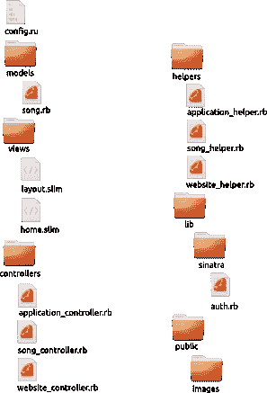

# 构建一个 Sinatra MVC 框架

> 原文：<https://www.sitepoint.com/build-a-sinatra-mvc-framework/>

在我的书的最后一章 [Jump Start Sinatra](https://www.sitepoint.com/books/sinatra1) 中，我建议从书中产生的代码可以重构为类似于 Rails 的 MVC 结构。我把这作为一个练习留给读者去完成，但是我决定在这里写下我的尝试。如果你没有这本书，那你真可耻！)，但是你应该能够从一般意义上理解这里写的大部分内容。优秀的 [Padrino](http://www.padrinorb.com/) 展示了在 Sinatra 基础上构建可以实现什么，因此从头构建一个微框架，可以用来使组织代码更容易，同时保持 Sinatra 的简单性，这应该是一个有趣的项目。

## 辛纳特拉的歌曲

在书中，我们构建了一个名为 Songs by Sinatra 的示例应用程序。这是一个致力于伟大的弗兰克·辛纳屈的歌曲的网站。它允许登录的用户通过 Ol' Blue Eyes 添加歌曲，包括标题、日期、长度和歌词。它还允许网站访问者“喜欢”这些歌曲。现场直播可以[看这里](http://songsbysinatra.herokuapp.com/)。


## 创建文件结构

第一项工作是创建文件结构。因为我们使用的是 MVC 结构，所以拥有“模型”、“视图”和“控制器”文件夹是有意义的。我还决定为任何扩展和中间件创建一个“helpers”文件夹和“lib”文件夹。

在书中，我们创建了一个小的中间件来处理资产(如 CoffeeScript 和 Sass 文件)，因此我们有一个“assets”文件夹，以及所有公共可用资源(如图像)的标准公共文件夹。

这是我的文件夹结构图:



## 一个控制器来管理它们

我还在书中建议写一个名为 ApplicationController 的全局控制器。这应该使用所有的视图，布局和注册整个应用程序使用的任何扩展。

```
$:.unshift(File.expand_path('../../lib', __FILE__))

require 'sinatra/base'
require 'slim'
require 'sass'
require 'coffee-script'
require 'v8'
require 'sinatra/auth'
require 'sinatra/contact'
require 'sinatra/flash'
require 'asset-handler'

class ApplicationController < Sinatra::Base

  helpers ApplicationHelpers

  set :views, File.expand_path('../../views', __FILE__)
  enable :sessions, :method_override

  register Sinatra::Auth
  register Sinatra::Contact
  register Sinatra::Flash

  use AssetHandler

  not_found{ slim :not_found }
end
```

这需要使用所有必要的宝石，然后创建一个`ApplcationController`类。这将是所有控制器的基类。它注册了`ApplicationHelpers`，这将是所有应用程序范围内的助手的去处。

需要在这里设置*视图*文件夹，因为它与我们的*application _ controller . Rb*文件不在同一个目录中，而这正是 Sinatra 所期望的。不过，这很容易改变，使用`set`命令。

我们还在这里启用了`sessions`和`method_override`。使用 sinatra-flash 需要会话，大多数应用程序也需要会话。`method_override`设置用于允许浏览器使用 POST 方法和表单中的隐藏输入字段来支持 HTTP 方法，如 PUT、PATCH 和 DELETE。

## 扩展ˌ扩张

在书中，我经历了构建一个`Auth`扩展模块。我还解释了如何编写一些帮助方法来发送联系邮件。我将这些和联系路线提取到它们自己的扩展中，以便可以单独设置

这些设置可以在`ApplicationController`中设置，所以扩展中的代码根本不需要编辑。

## 其他控制器

其他控制器现在继承自`ApplicationController`类。该应用程序中有两个控制器——负责站点主要部分的`WebsiteController`和负责在`Song`模型上执行的所有 CRUD 操作的`SongController`。

```
class WebsiteController < ApplicationController
  helpers WebsiteHelpers

  get '/' do
    slim :home
  end

  get '/about' do
    @title = "All About This Website"
    slim :about
  end
end

class SongController < ApplicationController
  helpers SongHelpers

  get '/' do
    find_songs
    slim :songs
  end

  get '/new' do
    protected!
    find_song
    slim :new_song
  end

  get '/:id' do
    find_song
    slim :show_song
  end

  post '/songs' do
    protected!
    create_song
    flash[:notice] = "Song successfully added"
    redirect to("/#{@song.id}")
  end

  get '/:id/edit' do
    protected!
    find_song
    slim :edit_song
  end

  put '/:id' do
    protected!
    update_song
    flash[:notice] = "Song successfully updated"
    redirect to("/#{@song.id}")
  end

  delete '/:id' do
    protected!
    find_song.destroy
    flash[:notice] = "Song deleted"
    redirect to('/')
  end

  post '/:id/like' do
    find_song
    @song.likes = @song.likes.next
    @song.save
    redirect to("/#{@song.id}") unless request.xhr?
    slim :like, :layout => false
  end
end
```

## 模型

这种情况下只有一种模式——`Song`模式。在模型目录中，只有一个文件 *song.rb* 创建了`Song`类并设置了所有的数据映射器属性:

```
require 'dm-core'
require 'dm-migrations'

class Song
  include DataMapper::Resource
  property :id, Serial
  property :title, String
  property :lyrics, Text
  property :length, Integer
  property :released_on, Date
  property :likes, Integer, :default => 0

  def released_on=date
    super Date.strptime(date, '%m/%d/%Y')
  end

  DataMapper.finalize
end
```

注意，我在这个模型中使用了 DataMapper，但是也可以很容易地使用另一个 ORM。事实上，我甚至可以在另一个模型中使用不同的 ORM。

## 助手

每个控制器都有自己的 helper 文件，所以有 *application-helpers.rb* 、 *website-helpers.rb* 和 *song-helpers.rb* 。这些被创建为一个模块，然后每个控制器必须显式注册相关的助手模块。以下是应用程序助手文件:

```
module ApplicationHelpers
  def css(*stylesheets)
      stylesheets.map do |stylesheet|
        "<link href="/#{stylesheet}.css" media="screen, projection" rel="stylesheet" />"
    end.join
  end

 def current?(path='/')
   request.path_info==path ? "current": nil
 end
end
```

它注册在*application _ controller . Rb*中，代码如下:

```
helpers ApplicationHelpers
```

应用程序助手是所有全局助手方法的去处。上面的两个在布局中使用，以便更容易包含到 CSS 文件的链接，另一个帮助器在链接到当前页面时向链接添加一个“当前”类。

## 支持

*config.ru* 是完成所有配置的地方:

```
require 'sinatra/base'

Dir.glob('./{models,helpers,controllers}/*.rb').each { |file| require file }

SongController.configure :development do
  DataMapper.setup(:default, "sqlite3://#{Dir.pwd}/development.db")
end

SongController.configure :production do
  DataMapper.setup(:default, ENV['DATABASE_URL'])
end

map('/songs') { run SongController }
map('/') { run WebsiteController }
```

首先，我们需要`Sinatra::Base`(与`Sinatra`相反，因为我们使用的是模块化结构)。然后，我们需要保存在模型、助手和控制器文件夹中的所有文件。

之后，我们为`SongController`类做一些配置，为生产和开发环境建立数据库。这可以放在 *song_controller.rb* 文件中，但是 *config.ru* 似乎是放置配置的最佳位置。

最后，我们使用 Rack 提供的便利的`map`方法为每个控制器创建一个名称空间。

## 这是所有的乡亲

Sinatra 的灵活性和模块化风格使得将应用程序重构为框架风格的结构变得非常容易。我认为它在代码组织和保持相对简单之间找到了一个很好的平衡。您仍然需要手工做一些事情，比如手工设置视图和数据库连接。

展望未来，我想我会考虑添加更多的扩展，使用更好的资产处理器，更好地组织数据库和 ORM。我已经把所有的[代码放在 GitHub](https://github.com/daz4126/jumpstart) 上了，并称之为‘Jump Start’。鉴于这个名字的由来，这个名字似乎更合适，因为它帮助你“启动”你的 Sinatra 项目。你会使用跳跃启动吗？你能想出改进的方法吗？你使用 Sinatra 创建了自己的定制框架吗？像往常一样，请在下面的评论中告诉我们。

## 分享这篇文章