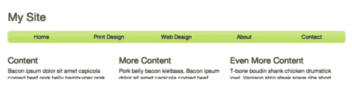
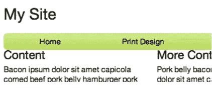
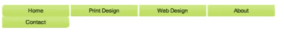

# 构建交互式导航栏

> 原文：<https://www.sitepoint.com/building-an-interactive-navigation-bar/>

一个简单的导航结构可以增加网站的可用性，并使信息容易找到。通过使用基本的 HTML 和 CSS，您可以构建一个水平导航条，当用户悬停在导航链接上时，它可以提供交互。

## 首先从标记开始

虽然你可能已经有了一个适合网站其他部分的设计，但在担心表示和 CSS 之前，先专注于 HTML，会帮助你保持标记的整洁和紧凑。这将带来更好的前端性能，并在您继续发展时有助于组织。图 1 展示了最终结果。



**图一。已完成的导航栏**

## 将它分解

您将了解构建过程中每个步骤的基本原理和代码:

*   HTML 结构
*   结构样式:对齐项目、填充和边距
*   装饰样式:渐变、文本颜色、边框半径
*   使用伪类选择器的特殊交互风格

## HTML 结构

稳固的 HTML 结构是任何网页的基础。有许多不同的方法可以达到相同的视觉效果，但是有些结构提供了语义等优势，可以帮助您保持相应的 CSS 样式表有序。

### 使用 HTML5 语义标签

在 HTML5 之前，标签

是一个适用于从主文本部分到页脚的所有内容的通用元素。然而，像、、和这样的新语义标签可以更好地将标记组织成有意义的部分，并减少样式表中重复的类名。由于大多数现代浏览器都支持 HTML5，所以最好利用这些新的描述性标签来赋予您的标记上下文含义。

语义标记不仅保持了文档树的整洁，还帮助用户通过浏览器窗口中的像素以外的方式体验 Web 站点，如屏幕阅读器或其他辅助设备。此外，拥有良好的标记结构是有效的，可以消除对类名的需要(例如，使用

)，从而使您的 CSS 文件更小，性能更好。

### 兼容性呢？

如果你正在做一个需要支持 IE7 和 IE8 等旧浏览器的项目，你需要在你的<头>的条件注释中包含一个名为 [html5shiv](https://code.google.com/p/html5shiv/) (或 html5shim)的小脚本。这个脚本允许 IE 的遗留版本使用 html5，并提供一些基本的样式。它开箱即用，因此几乎不需要配置。

在针对 IE9 和更低版本的条件注释中包含您的文件中的脚本。

```
<!--[if lt IE 9]>
  <script src="dist/html5shiv.js"></script>
<![endif]-->
```

请确保在链接到样式表后包含此文件。否则，在脚本加载时，屏幕上可能会闪现未设置样式的内容。为了避免高加载时间，最好使用 JSCompress 之类的工具来缩减 shiv 脚本。

### 标记导航栏

本质上，导航栏是一个简单的链接列表。HTML 有几种列表类型:有序列表

。在每个列表中，项目被包装在列表项目标签中，
*   , in which case it will contain anchor points that link to other pages.

因为这个列表的目的是导航，所以一个

标签适合作为包含的父元素。然后，因为链接不一定属于任何编号顺序，

*   In. Each link or 

```
<a href="/contact">Contact</a>
```

你也可以使用../移回一个文件夹。

此外，您可以指定链接的目标，或链接应该打开的位置:在新标签、新窗口或当前窗口中。因为导航栏通常只包含同一网站内的链接，所以除非特殊情况，否则没有必要指定目标。

您的标记将如下所示:

```
<nav>
  <ul>
    <li>
        <a href="/">Home</a>
    </li>
    <li>
        <a href="/print">Print Design</a>
    </li>
    <li>
        <a href="/web">Web Design</a>
    </li>
    <li>
        <a href="/bio">Bio</a>
    </li>
    <li>
        <a href="/contact">Contact</a>
    </li>
  </ul>
</nav>
```

### 为什么不只是主播？

这是真的:您可以使用以下标记轻松复制相同的视觉样式和行为:

```
<div class="”nav”">
  <a href="#">Home</a>

  <a href="#">Print Design</a>

  <a href="#">Web Design</a>

  <a href="#">Bio</a>

  <a href="#">Contact</a>
</div>
```

这甚至比上面提供的例子还要少。但是想象一下这段代码被断章取义了。当然，它仍然是链接的集合。然而，这些特定的链接是否是页面的主要导航，或者它们是否应该出现在列表的上下文中，这一点并不明显。现在，假设您正在使用屏幕阅读器，但看不到页面的其余部分。使用语义标签，虽然可能会在标记中造成另一层嵌套，但实际上会创建一个组织得更好、更容易访问的页面。此外，使用像

这样的语义标签实际上消除了对“nav”这样的类名的需求，因此降低了站点标记的复杂性。

## 使用 CSS 设置样式

既然 HTML 已经就绪，就可以使用 CSS 来排列和修饰每个元素了。

许多 CSS 框架提倡将结构化的 CSS(如对齐、边距和填充)与装饰性的 CSS(如渐变、文本颜色和圆角)分开。虽然这种方法可能适合也可能不适合您的项目，但我们会将这两种类型的 CSS 分开，以便更好地理解应用于导航栏的样式。

### 重置样式表

在任何项目中，使用好的重置样式表都可以避免在多个地方覆盖特定于浏览器的默认样式行为。一个非常基本的重置样式表可能如下所示:

```
h1, h2, h3, h4, h5, h6, p, a, ul, ol, li, small {

  margin: 0;

  padding: 0;

  border: 0;

  outline: 0;

  font-size: 100%;

  background: transparent; }
```

从本质上讲，重置样式表只是将每个元素重新设置为公共默认值。这使您不必在自己的样式声明中手动覆盖默认的结构或装饰规则，因为浏览器经常将自己的样式和格式应用于上述元素，导致它们在不同的浏览器中看起来不一致。

埃里克·迈耶的重置样式表是许多项目的热门选择，理查德·克拉克[更新了它](http://html5doctor.com/html-5-reset-stylesheet/)以添加 HTML5 元素。

无论您使用哪种类型的重置样式表，请确保它是添加到您头脑中的第一个样式表。这样，您的站点将利用 CSS 的级联行为，并且您随后的样式表将简单地修改已经一致的通用样式。

### 结构 CSS:宽度、浮动和间距

首先，声明导航栏的宽度和一些边距。

```
/* Give the body a width */

body {

  width: 100%;

  max-width: 960px;

  margin: 0 auto; }

/* Make the nav take up the whole body width, and give it some top and bottom margin space */

nav {

  width: 100%;

  margin: 20px 0; }

/* Make the list of links take up the whole width of the nav */

nav ul {

  width: 100%; }
```

有五个导航链接，所以它们每个都需要占据导航条总宽度的 1/5。这意味着每个

*   Should be 20% wide, and the anchors in it should occupy*   100% of. We also want to set the anchor display to block because we haven't declared it yet. Making the anchor point a block will make it fill its parent.*   Height and width of. Depending on the style sheet you reset, you may not need to declare this rule again.

```
nav ul li {

  width: 20%; }

nav ul li a {

  display: block;

  width: 100%; }
```

虽然您可能更喜欢站点其他部分的列表在视觉上用项目符号、破折号或圆盘来区分，但您肯定不希望它们出现在导航栏中。添加以下样式规则将覆盖任何已应用的现有列表项或间距样式。注意:如果使用重置样式表，这些规则可能不是必需的。

```
nav ul {

  width: 100%; /* from above */

  list-style: none;

  margin: 0;

  padding: 0; }
```

结构化 CSS 的最后一部分是让每个链接并排排列，创建水平栏。默认情况下，每个

*   Elements will be stacked vertically, as shown in Figure 2.


**图二。默认情况下，导航链接将垂直堆叠。**

要使它们出现在水平行中，请使用 float。

```
nav ul li {

  width: 20%; /* from above */

  float: left; }
```

向左浮动将从列表中的第一个项目开始，从左到右堆叠项目。因为有五个项目占据了导航条宽度的 20%,所以最终的结果，如图 3 所示，是一个包含五个等距项目的水平条。


**图 3。单杠随着李的每一辆<和>漂走。**

float 的一个独特的特性是，它从页面流中取出元素，并将其向左或向右拉。因此，

高度可能会导致其他布局问题。例如，如果您将



**图 4。未声明溢出:隐藏在浮动子元素的父元素上会导致布局问题。**

### 如果浮动很麻烦，为什么不使用内联块呢？

的确，display: inline-block 也将使每个

*   Elements are stacked on top of each other in a horizontal row. However, inline-block also adds some default spaces between elements (see Figure 5), which is difficult to cover consistently in browsers.



**图 5。与内联块而不是浮动对齐的项。**

由于这种特殊的导航条的设计在项目之间没有任何空间，所以最好使用浮动，因为它保证将

*   Stacked together, without any unexpected gaps.

## 装饰性 CSS

现在每个 HTML 块都有了适当的间距和位置，是时候装饰了。

每个导航项目都有一个轻微的渐变背景，当用户悬停在链接上时，渐变会变暗。第一个和最后一个项目也有圆角。CSS3 使得这两个以前令人痛苦的设计变得容易实现。

### 梯度

大多数现代浏览器现在都支持 CSS3 渐变，而不是使用重复的背景图像，CSS3 渐变可以从您的输入中创建渐变，并将其用作背景图像。为线性或径向渐变编写自己的 CSS 有点麻烦，但并不总是必要的。网上有很多渐变生成器，ColorZilla(一个允许你从网站上复制颜色代码的浏览器插件)有自己的[一个很棒的](http://www.colorzilla.com/gradient-editor/)。如果你喜欢使用 [Sass](http://sass-lang.com/) ，你可以切换代码输出。

由于用户与之交互的元素是锚，而不是李，所以最好为锚本身制定样式规则。也有可能给

本身添加样式规则，但是根据您的样式选择，您可能会为将来的冲突做好准备。

首先给链接添加默认的渐变背景。

```
nav ul li a {

  text-align: center;

  padding: 8px 0;

  display: block;

  width: 100%;

  background: #cdeb8e; /* Old browsers */

  background: -moz-linear-gradient(top, #cdeb8e 0%, #b0ca34 100%); /* FF3.6+ */

  background: -webkit-gradient(linear, left top, left bottom, color-stop(0%,#cdeb8e), color-stop(100%,#b0ca34)); /* Chrome,Safari4+ */

  background: -webkit-linear-gradient(top, #cdeb8e 0%,#b0ca34 100%); /* Chrome10+,Safari5.1+ */

  background: -o-linear-gradient(top, #cdeb8e 0%,#b0ca34 100%); /* Opera 11.10+ */

  background: linear-gradient(to bottom, #cdeb8e 0%,#b0ca34 100%); /* W3C standard, IE10+ */

  filter: progid:DXImageTransform.Microsoft.gradient( startColorstr='#cdeb8e', endColorstr='#b0ca34',GradientType=0 ); /* IE6-9 */

  }
```

这个渐变输出直接来自 ColorZilla，并且已经包含了 IE 旧版本的前缀和变通方法。请注意，对于无前缀的线性渐变，建议在方向声明前使用单词“to”，例如“to bottom”或“to top”，这是对“top”或“bottom”的更改。

### 悬停样式

伪类选择器允许您根据位置或状态定位特定的元素。对于交互式导航栏，使用伪类选择器(有时也称为伪类或伪选择器)可以更精确地控制导航项目列表的外观。伪类通过它们前面的冒号来识别；例如:悬停或:活动。

您可能熟悉基于状态定位<anchor>元素的伪类的类型。</anchor>

```
:visited

:hover

:active
```

为了使导航链接在用户悬停时看起来有所不同，将:hover 伪类附加到 a 选择器，并定义不同的背景样式。

```
nav ul li a:hover {

  background: #b0ca34; /* Old browsers */

  background: -moz-linear-gradient(top, #b0ca34 0%, #96c40d 100%); /* FF3.6+ */

  background: -webkit-gradient(linear, left top, left bottom, color-stop(0%,#b0ca34), color-stop(100%,#96c40d)); /* Chrome,Safari4+ */

  background: -webkit-linear-gradient(top, #b0ca34 0%,#96c40d 100%); /* Chrome10+,Safari5.1+ */

  background: -o-linear-gradient(top, #b0ca34 0%,#96c40d 100%); /* Opera 11.10+ */

  background: linear-gradient(to bottom, #b0ca34 0%,#96c40d 100%); /* W3C standard, IE10+ */

  filter: progid:DXImageTransform.Microsoft.gradient( startColorstr='#b0ca34', endColorstr='#96c40d',GradientType=0 ); /* IE6-9 */

  }
```

这取决于您正在使用的重置样式表(或者没有使用！)您可能需要覆盖链接在其每个动态伪类状态中的默认行为。通常，链接在被访问时会改变颜色，并在悬停时加下划线。

```
nav ul li a,

nav ul li a:focus,

nav ul li a:visited,

nav ul li a:hover,

nav ul li a:active {

  color: #000;

  text-decoration: none; }
```

### 使拐角变圆

要对导航列表中的第一个和最后一个项目进行圆角处理，您需要使用另一种类型的伪类选择器来记录元素在文档树中的位置。这些结构伪类显示了元素与其父元素或兄弟元素之间的关系。虽然不是一个详尽的列表，但最常见的结构伪类有:

```
:first-child

:last-child

:nth-of-type(n) /* Where n is a number, targets the nth child. You can also use “even” or “odd” instead of a number. */
```

为了圆角，将第一个子节点中的

```
nav ul li:first-child a {

  border-top-left-radius: 8px;

  border-bottom-left-radius: 8px;

}

nav ul li:last-child a {

  border-top-right-radius: 8px;

  border-bottom-right-radius: 8px;

}
```

记住，每个

*   There is only one anchor, but

    *   . So, aim for what you want first.
    *   , and then aim at the anchor in that element. A common mistake is to add pseudo-classes to anchors instead of
    *   . But because there is only one anchor point, it is both the last child and the first child.

您的样式将不会按计划工作。此外，圆角将应用于每一个

### 浏览器兼容性

根据圆角对你的重要性，前缀可能是必要的。检查 CSS 浏览器支持的一个很好的资源是[http://www.caniuse.com](http://caniuse.com/)，它将解释每种浏览器类型和版本为 CSS 属性提供的支持级别。

过滤器(传统 IE 浏览器用于渐变)和边框半径之间存在已知的冲突。过滤器不听边界半径，所以不管边界半径规则如何，您最终都会得到方形拐角。由于 IE10 支持背景渐变(而不是滤镜)，我通常从所有渐变样式中省略滤镜规则，并允许 IE9 和更低版本退回到简单的背景色。

### 个性化您的设计

既然你已经有了导航栏的结构和样式，那就花些时间来个性化你的配色方案、字体和布局。还有其他一些相当简单的 CSS 属性具有很大的视觉冲击力。文本阴影和边框阴影为您的文本和包含的元素增加了维度，而 transition 可以在不使用任何 jQuery 的情况下将渐变动画应用到背景图像。

```
box-shadow: 0 0 1px #000; /* x offset, y offset, size, color */

text-shadow: 2px 2px 2px #000;

transition: background 2s;
```

与 border-radius 类似，并不是所有的浏览器都支持这些属性，所以要确保添加适当的前缀。

## 回顾

通过一些基本的 HTML 和 CSS，你可以创建一个简单的具有视觉冲击力的导航条。

*   从 HTML 开始，确定一个简单的语义文档结构
*   接下来关注结构风格。调整边距、填充，并将 blokc 元素移动到您想要的位置。
*   接下来，该装修了。利用 CSS3 渐变和边框半径。请参考 www.caniuse.com，了解何时添加前缀，并在交互式样式中使用伪类选择器的帮助，或者在不需要额外类名的情况下针对特定元素。

## 完整代码示例

```
<nav>
  <ul>
    <li>
       <a href="#">Home</a>
    </li>
    <li>
      <a href="#">Print Design</a>
    </li>
    <li>
      <a href="#">Web Design</a>
    </li>
    <li>
      <a href="#">Bio</a>
    </li>
    <li>
      <a href="#">Contact</a>
    </li>
  </ul>
</nav>
```

```
body {

  width: 100%;

  max-width: 960px;

  margin: 0 auto; }

nav {

  width: 100%;

  margin: 20px 0; }

nav ul {

  list-style: none;

  overflow: hidden; }

nav ul li {

  float: left;

  width: 20%; }

nav ul li a {

  text-align: center;

  padding: 8px 0;

  display: block;

  width: 100%;

  background: #cdeb8e; /* Old browsers */

  background: -moz-linear-gradient(top, #cdeb8e 0%, #b0ca34 100%); /* FF3.6+ */

  background: -webkit-gradient(linear, left top, left bottom, color-stop(0%,#cdeb8e), color-stop(100%,#b0ca34)); /* Chrome,Safari4+ */

  background: -webkit-linear-gradient(top, #cdeb8e 0%,#b0ca34 100%); /* Chrome10+,Safari5.1+ */

  background: -o-linear-gradient(top, #cdeb8e 0%,#b0ca34 100%); /* Opera 11.10+ */

  background: linear-gradient(to bottom, #cdeb8e 0%,#b0ca34 100%); /* W3C, IE10+ */

  filter: progid:DXImageTransform.Microsoft.gradient( startColorstr='#cdeb8e', endColorstr='#b0ca34',GradientType=0 ); /* IE6-9 */

  endColorstr='#b0ca34',GradientType=0 ); /* IE6-9 */

}

nav ul li a,

nav ul li a:focus,

nav ul li a:visited,

nav ul li a:hover,

nav ul li a:active {

  color: #000;

  text-decoration: none; }

nav ul li a:hover,

nav ul li a:active {

  background: #b0ca34; /* Old browsers */

  background: -moz-linear-gradient(top, #b0ca34 0%, #96c40d 100%); /* FF3.6+ */

  background: -webkit-gradient(linear, left top, left bottom, color-stop(0%,#b0ca34), color-stop(100%,#96c40d)); /* Chrome,Safari4+ */

  background: -webkit-linear-gradient(top, #b0ca34 0%,#96c40d 100%); /* Chrome10+,Safari5.1+ */

  background: -o-linear-gradient(top, #b0ca34 0%,#96c40d 100%); /* Opera 11.10+ */

  background: linear-gradient(to bottom, #b0ca34 0%,#96c40d 100%); /* W3C, IE10+ */

  filter: progid:DXImageTransform.Microsoft.gradient( startColorstr='#b0ca34', endColorstr='#96c40d',GradientType=0 ); /* IE6-9 */

}

nav ul li:first-child a {

  border-top-left-radius: 8px;

  border-bottom-left-radius: 8px; }

nav ul li:last-child a {

  border-top-right-radius: 8px;

  border-bottom-right-radius: 8px; }
```

—–

本文是来自 Internet Explorer 团队的 HTML5 技术系列的一部分。在@[http://www.modern.ie/](http://www.modern.ie/)进行为期三个月的免费浏览器堆栈跨浏览器测试，尝试本文中的概念。

## 分享这篇文章