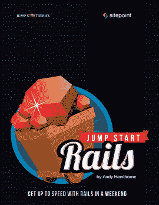

# 使用 JumpStart Rails 在周末学习 Rails

> 原文：<https://www.sitepoint.com/learn-rails-in-a-weekend-with-jumpstart-rails/>

快速启动导轨

我是 SitePoint 最新出版的名为 [Jump Start Rails](https://learnable.com/books/jsrails1) 的书籍的作者。还有一本名为《构建你的第一个 Rails 应用》的书的[配套课程](https://learnable.com/courses/build-your-first-rails-app-2784)。在这里，我将描述这本书(和课程)要达到的目标。

这本书是为那些已经有一些 web 开发经验的开发人员准备的，也许是用另一种技术，比如 PHP。

已经有很多很棒的 Rails 书籍了，那么这本书填补了什么空白呢？

本书的目的是向您展示如何在一个周末内构建和部署您的第一个 Rails 应用程序。当您对 Rails 完全陌生时，它确实有一个相当陡峭的学习曲线，并且尝试让一些有价值的东西开始运行可能会有点令人沮丧。这本书为你提供了构建和部署一个(简单的)应用程序所需的一切，在你坐下来看这本书的同一个周末的周日晚上。

它首先带您了解使用 Ruby on Rails 进行开发的准备过程。这包括所有流行的操作系统。接下来，您将直接进入并构建一个“培训”应用程序，以便您可以尝试组装 Rails 应用程序的基础。您还将熟悉 Rails 应用程序的内部情况。

下一步，您将开始构建一个真正的应用程序，也就是说，一个您可以实际部署的应用程序。在这个过程中，您将了解到许多 Rails 惯例，以便在构建 web 应用程序时完成工作。也有很多关于使用广泛的 Ruby gems 生态系统的报道，以增强你的应用程序所能做的。

本书和课程都涵盖了 [Rails 4.0](http://edgeguides.rubyonrails.org/4_0_release_notes.html) 和 [Ruby 2.0.0](http://www.ruby-lang.org/en/) 。如果你是 Rails 新手，这可能没什么意义。你只需要知道 Rails 4.0 是这个框架的最新版本。它将在 6 月 25 日成为一个稳定的版本，从现在到那时，任何重大的错误报告都将被搁置。Ruby 2 . 0 . 0 版是 Ruby 编程语言的最新版本。因此，这意味着您将构建一个最新的应用程序。

同样值得注意的是，用于部署 Rails 应用的流行平台即服务现在默认支持 Ruby 2.0.0。在本书的最后一章，你将学习如何将你的应用程序部署到 Heroku。课程中也会涉及到。

如果你一直在考虑尝试 Rails，现在是时候了。有本书的免费[样本可供您使用。](https://learnable.com/books/jsrails1/online)

## 分享这篇文章