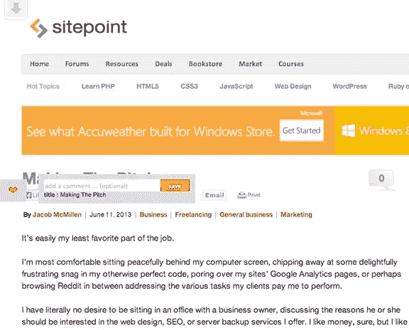

# Chrome 扩展:弥合层与层之间的差距

> 原文：<https://www.sitepoint.com/chrome-extensions-bridging-the-gap-between-layers/>

构建一个 Chrome 扩展应该是容易的，从很多方面来说都是如此。文档写得非常好，有很多例子。此外，很容易检查你已经安装的任何一个，看看后面的神奇之处。另一个很大的好处是，它都是 Javascript、CSS 和 HTML，加上 Chrome API 的额外好处，带来了额外的魔力。

最近，我不得不为我的公司开发一个工具栏，它必须读取当前查看的页面，显示一些 SEO 信息，执行一些 AJAX 调用等等。不是很难，但是我确实遇到了一个没有很好记录的问题(如果有的话)。

在继续之前，如果你不完全熟悉 Chrome 扩展开发，我建议你去读一下[这篇概述](http://developer.chrome.com/extensions/overview.html)。您将更多地了解体系结构的多层之间的复杂性。

## 问题是

我决定通过在每个网页中注入的 iframes 来加载我的扩展的 UI 元素(比如工具栏和各种弹出窗口)。考虑到这一点，多个*iframe*、当前 DOM、Chrome 后台 Javascript 文件和 Chrome 提供的其他层之间的通信并不是一件容易的事情。

事实上，问题在于使用了*iframe*。我必须通过 *JSON* 对象将大量数据从背景层发送到任何一个*iframe*，反之亦然。由于**跨域**的限制，从页面中注入的内容脚本中操作 *iframe* 是不可能的。

例如，当前查看的页面 URL 是

*http://www.example.com*

注入的 iframe URLs 是

*chrome-extensions://uniqueidmadeoutoflotsandlotsofletters*

两者之间的通信是不可能的，因为跨域通信是一个大禁忌。

## 那么，为什么使用 iframes 呢？

嗯，*iframe*是(目前)隔离大量 Javascript、CSS 和 HTML 而不受当前网页风格和行为影响的唯一方法。

此外，我固执地认为可能有一种方法可以在所有层之间以一种优雅的方式进行交流。尽管我在谷歌或 StackOverflow 上找不到答案。

## 有什么解决办法？

当使用 Chrome API 方法 *chrome.tabs.sendMessage* 从后台层发送消息时，消息被发送到**所有**帧，而不仅仅是注入了 ContentScript 的帧。

我不知道为什么我没有首先想到那个！

因为是 ContentScript 注入了*iframe*，所以它们**也**可以访问 Chrome API。

因此，*iframe*可以用默认的 DOM 方法*window . parent . postmessage*与它们的父 ContentScript 对话，用*chrome . extension . send request*与背景层对话，它们还可以用*chrome . extension . on message . add listener*方法**监听背景层消息。**

## 如何让它发生？

想法很简单:我创建了一组**接收者**，他们将处理从一层到另一层的所有消息传输。

目前，我是这样设置每一层的角色的:

### 背景(见 background.js)

可以从 ContentScript 接收消息，并将它们重定向到适当的 *iframe* 或处理消息。

可以向所有框架发送消息(ContentScript 和 *iframes* )。

### 内容脚本(参见 inject.js)

可以从背景层和*iframe*接收消息。

当来自一个 *iframe* (通过默认的 *window.postMessage* 方法)时，它会将消息重定向到后台(如果指定的话)。如果未指定，它将处理消息。

只能向后台发送消息。

### Iframe(请参见 iframe.js)

可以只从背景层接收消息，然后检查它是否是给他的，然后处理该消息。

可以用*window . parent . postmessage*向 ContentScript 发送消息。

换句话说:

–后台与 ContentScript 和 *iframes* 对话，但只监听 ContentScript。

–content script 监听后台和*iframe*，但只与后台对话。

–*Iframes*与 ContentScript 对话并监听背景。

旁注:我知道后台也可以监听 *iframe* 消息，但是在我的例子中，我跳过了这个概念，因为它不是必需的。

### 区分 iframes

每个 *iframe* 都有一个唯一的 ID(在我后面的例子中称为*视图*，所以很容易将消息重定向到一个特定的 *iframe* 。一个简单的方法是在加载 *iframe* 时在 URL 中添加一个属性，如下所示:

```
chrome.extension.getURL('html/iframe/comment.html?view=comment’);
```

**消息设置**

传递的消息是包含两个属性的简单对象:

–消息

–数据

每一层(背景、ContentScript 和 IFrame)都有一个 **tell** 方法来发送包含这两个属性的消息。

```
tell(‘tell-something’, {attribute1:’a’, attribute2:’b’});
```

当一个 *iframe* 发送消息时，当前的 *iframe* **视图 ID** 也作为*数据*中的*源*属性发送。

```
tell(‘tell-parent-something’, {source:’comment’});
```

当一个消息需要发送到一个特定的 *iframe* 时，在*数据*中添加一个带有右**视图 ID** 的*视图*属性。

```
tell(‘tell-to-an-iframe’, {

    view:’comment’,

    title:’hello world!’

});
```

如果一条消息需要发送给所有的*iframe*，我使用了“*”通配符。

```
tell(‘tell-to-all-iframes’, {view:’*’, title:’foo bar’});
```

如果没有指定视图，则应该由 ContentScript/Background 来处理消息。

## 现在，例子(终于)！

我为喜欢的页面创建了一个简单的扩展，我称之为 **iHeart** (你可以在我的 [github](https://github.com/ffto/iHeart-Chrome-Extension) 上找到源代码)。



这是一个简单的按钮，在屏幕的左边有一颗心。点击后，用户可以添加评论并保存。保存的页面将在扩展弹出按钮中列出:


## 棘手的细节

每一层都有自己的*讲述*和*倾听*方法:

### 背景

**告知**

```
_this.tell = function (message, data){

    var data = data || {};

    chrome.tabs.getSelected(null, function (tab){

        if (!tab) return;

        chrome.tabs.sendMessage(tab.id, {

            message   : message,

            data : data

        });

    });

};
```

**倾听**

```
function onPostMessage (request, sender, sendResponse){

    if (!request.message) return;

    if (request.data.view){

        _this.tell(request.message, request.data);

        return;

    }

    processMessage(request);

};
```

### 内容脚本

**告知**

```
function tell (message, data){

    var data = data || {};

    // send a message to "background.js"

    chrome.extension.sendRequest({

        message : message,

        data : data

    });

};
```

**倾听**

```
// messages coming from iframes and the current webpage

function dom_onMessage (event){

    if (!event.data.message) return;

    // tell another iframe a message
    if (event.data.view){
        tell(event.data);

    }else{

        processMessage(event.data);

    }

};

// messages coming from "background.js"

function background_onMessage (request, sender, sendResponse){

    if (request.data.view) return;

    processMessage(request);

};
```

### 内联框架

**告知**

```
_this.tell = function (message, data){

var data = data || {};

data.source = _view;

window.parent.postMessage({

        message   : message,

        data : data

    }, '*');

};
```

**倾听**

```
function background_onMessage (request, sender, sendResponse){

    // make sure the message was for this view (you can use the "*" wildcard to target all views)

    if (

        !request.message ||

        !request.data.view ||

        (request.data.view != _view && request.data.view != '*')

    ) return;

    // call the listener callback

    if (_listener) _listener(request);

};
```

沟通过程相当简单。当你访问一个网页并喜欢你所看到的(它可以是任何东西，这是你喜欢的，我不会评判)，你就点击 **iHeart** 按钮。然后，按钮告诉打开评论 *iframe。*

### js/iframe/heart.js

```
function heart_onClick (event){

    $('.heart').addClass('active');

    _iframe.tell('heart-clicked');

};
```

然后，它处理 ContentScript 中的消息并打开注释弹出窗口。

### 检查

```
function processMessage (request){

if (!request.message) return;

    switch (request.message){

        case 'iframe-loaded':

            message_onIframeLoaded(request.data);

            break;

        case 'heart-clicked':

            message_onHeartClicked(request.data);

            break;

        case 'save-iheart':

            message_onSaved(request.data);

            break;

    }

};

...

function message_onHeartClicked (data){

    var comment = getView('comment');

    comment.iframe.show();

    tell('open-comment', {

        view:'comment',

        url:window.location.href,

        title:document.title

    });

};
```

注释弹出窗口出现，并在注释框下方显示当前网页标题。

**js/iframe/comment.js**

```
function onMessage (request){

    switch (request.message){

        case 'open-comment':

            message_onOpenComment(request.data);

            break;

        case 'website-is-hearted':

            message_onIsHearted(request.data);

            break;

    }

};

...

function message_onOpenComment (data){

    $('.page-title').html(data.title);

};
```

当按下 save 按钮时，comment *iframe* 将信息发送回 ContentScript。

**js/iframe/comment.js**

```
function save_onClick (event){

    var comment = $('#comment').val() || '';

    _iframe.tell('save-iheart', {

         comment   : comment

    });

};
```

ContentScript 隐藏注释 *iframe* 并告诉后台保存整个内容。

**js/inject.js**

```
function message_onSaved (data){

    var comment = getView('comment');

    comment.iframe.hide();

    tell('save-iheart', {

        url:window.location.href,

        title:document.title,

        comment:data.comment

    });

};
```

最后，后台通过将网站保存在一个数组中来最终确定所有的细节。

**js/background.js**

```
function onPostMessage (request, sender, sendResponse){

    if (!request.message) return;

    if (request.data.view){

        _this.tell(request.message, request.data);

        return;

    }

    switch (request.message){

        case 'save-iheart':

        message_onSaved(request.data);

        break;

    case 'all-iframes-loaded':

        message_allIframesLoaded(request.data);

        break;

    }

};

…

function message_onSaved (data){

    _websites.push({

        url           : data.url,

        title         : data.title,

        comment       : data.comment

    });

};
```

## 而且…接待员做了他们的工作

差不多就是这样。这是我对多种类型的层之间的通信问题的解决方案，并不太难…

现在，如果我能同样容易地解决我个人关系中的沟通问题，那就太好了，谢谢

这个例子可以通过处理数据验证、将喜欢的网页保存在数据库中、动态地调整 iframes 内容的大小、给扩展添加一些动画以使其使用起来更有趣。所有这些都很棒，而且已经可以做到，但是超出了本文的范围。

## 分享这篇文章