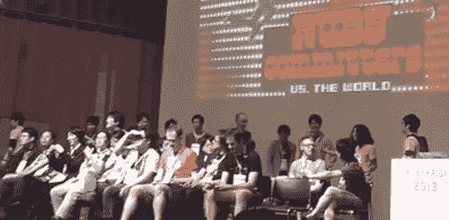
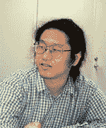
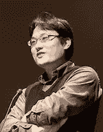

# 会见 15 位 Ruby 核心提交者

> 原文：<https://www.sitepoint.com/meet-fifteen-ruby-core-committers/>

我们都知道松本幸弘发明了 Ruby，但你能说出 Ruby 背后的其他人有多少？从这张几周前在 RubyKaigi 2013 上拍摄的照片来看，Ruby 2.0 的发布是一个真正的团队努力，来自东京舞台上的人们和世界各地数百名其他开源开发者的承诺。

然而，Ruby 2.0 版本背后的许多最活跃的开发人员都是日本人，由于语言障碍，他们在很大程度上不为日本以外的 Ruby 世界所知。最近，我请 Ruby 2.0 发布经理 Yusuke Endoh 向位于日本的 Ruby 2.0 委员会成员发送几个问题。我很好奇他们是谁，他们每个人都在做什么，他们是什么样的人。其他 14 个开发者回复了他的调查；请继续阅读，看看语言障碍背后的故事，并认识今年 Ruby 2.0 发布背后的日本人。

**更新:**我们刚刚收到了另一位 Ruby 提交者的回答。现在有十六个了:)

|  | 

## Yosuke
Introspection

 |

问:你能告诉我们一些关于你自己的事情，以及你是如何与 Ruby 结缘的吗？

我是 Yusuke Endoh，Ruby 的成员之一。在 Ruby 2.0.0 发布期间，我是一名发布经理。此外，我还是 Ruby 1.9.2 的助理发布经理。我曾经帮助提交者测试和调试 Ruby，只是为了好玩。然后，一些提交者推荐我做提交。但我并没有马上成为一名委员。但是在 1.9.1 发布之后，我看到了混乱:bug 一个接一个地被报告，直到发布日，提交者竞相修复它们。看起来他们喜欢混乱。为了避免下一个版本的混乱，我成为了提交者。但遗憾的是，1.9.2 和 2.0.0 的发布没有 1.9.1 那么混乱。

问:自我介绍和开始与 Ruby 打交道的契机是什么？

是 Ruby 的提交者之一。 在 Ruby 2.0.0 的时候做发行管理器。 在 Ruby 1.9.2 的时候做发行经理助理。 原本只是作为游戏，帮 Ruby 出错误和调试。 于是，几个提交人建议我拥有提交权。 但是因为不知道好处，所以没有马上成为提交者。 在这期间，在 1.9.1 的发行版中看到了混沌。 到当天为止，错误一个接一个地被报告，很多提交者竞相修正错误。 他们看起来很享受那个混沌。 为了加入下一个混沌，我变成了提交者。 但是很遗憾，1.9.2 和 2.0.0 的发行版没有 1.9.1 那么混乱。

问:你能告诉我们在 Ruby 2.0 发布期间谁是 Ruby 核心提交者吗？我想日本以外的大部分人大概都不熟悉除了松本幸弘之外的任何一个团队成员。

没有好的方法来定义团队的“核心提交者”或“核心团队”我猜这是因为 Matz 非常讨厌官僚主义。

我在 ruby-dev(一个日本 ruby 开发者邮件列表)上寻找那些自称为“非常核心的提交者”的人，并从他们那里收集答案。虽然这个列表远非详尽无遗，但我认为他们都是伟大的黑客和核心提交者。

问:能告诉我 Q: Ruby 2.0 时的 Ruby 核心提交是谁吗？ 我想除了日本人以外，很多人恐怕都不太了解松本和雪弘以外的团队成员。

如上所述，没有规定“core committers”或“core team”这样的集团。 matz 讨厌官僚主义，所以我认为今后也不会明确定义这样的团队。 从某种意义上说，只有 matz 可以说是核心公司。

因此，这次我们在 Ruby-dev (日语的 ruby 开发者邮件列表上)上，向认为“我才是核心提交者”的人呼吁，收集了回答。 虽然这个列表离包罗万象还很远，但至少我认为他们都是很棒的黑客，是“核心提交”。

问:你在 Ruby 2.0 项目中扮演了什么角色？

在 2.0.0 期间，我是一名发布经理。我做了一些促进发布的杂七杂八的工作:计划、进度和问题管理、离线/在线会议、公告、打包和发布，以及事后评估。

你可以在我写在 Rubyist 杂志上的一篇英文文章中读到这个版本。

问:你在 Q: Ruby 项目中的作用是什么？

2.0.0 的时候是发行经理。 为了促进发行，杂务包括计划制定、进度和错误管理、离线在线会议、广播、软件包和发行，以及反省会。

关于发行的经过请参照[Rubyist Magazine 的报道](http://jp.rubyist.net/magazine/?0041-200Special-release)。

*A portrait of me that my wife painted.
私の妻が書いてくれた似顔絵。*

问:除了 Ruby 或编程，你还喜欢做什么？

我的编程爱好是写一个查询，并享受深奥的编程。最近，我很高兴在 IOCCC 2012 上赢得了两个奖项。

我的爱好是散步；我和我的妻子走过日本关东地区几乎所有的铁路(总共大约 4200 多公里)。

问:除了 Q: Ruby 以外，您对什么感兴趣？ (无论是编程整体，还是与编程无关的爱好)

编程的相关爱好是写 Quine，享受费解的编程。 我有点高兴最近在 IOCCC 2012 上获得了两部作品。

编程以外的爱好是步行。 我和妻子一起沿着日本关东地区的铁路线沿线(共计约 4，200 公里以上)走了一圈。

|  | 

## NobunagaNakata

 |

问:你能告诉我们一些关于你自己的事情吗，以及你是如何与 Ruby 结缘的？

我是一名程序员，也是一名家庭主妇。我和妻子及三个女儿住在一起。

像其他老前辈一样，Perl 5 让我感觉不太对劲，然后我在 Ruby 中发现了几个 bug。

问:自我介绍和开始与 Ruby 打交道的契机是什么？

兼主夫程序员，妻子和女儿三人。

和其他古脸一样，在 Perl 5 上感到遗憾的时候，发现了 Ruby 的 bug。

问:你在 Ruby 2.0 项目中扮演了什么角色？

修复 bug，实现新特性和新 bug。

问:你在 Q: Ruby 项目中的作用是什么？

修复 bug，添加新功能和新 bug 等。

问:除了 Ruby 或编程，你还喜欢做什么？

热空气膨胀。

问:除了 Q: Ruby 以外，您对什么感兴趣？ (无论是编程整体，还是与编程无关的爱好)

hot-air balloon

|  | 

## Tanaka Akira

 |

问:你能告诉我们一些关于你自己的事情吗，以及你是如何与 Ruby 结缘的？

当我的程序需要多线程和数据结构时，我第一次使用 Ruby。在那之前我用的是 Perl 4，但是不适合这些问题。

问:自我介绍和开始与 Ruby 打交道的契机是什么？

在需要线程和数据结构时，从 Perl4 迁移到了 Ruby。

问:你在 Ruby 2.0 项目中扮演了什么角色？

我开发或维护了几个库，如 pathname，resolv，open-uri，pp，securerandom，tsort，time，socket，io，process，encoding，transcode 等。

问:你在 Q: Ruby 项目中的作用是什么？

做了各种各样的事情。

问:除了 Ruby 或编程，你还喜欢做什么？

我喜欢从事 API 设计和各种操作系统之间的可移植性。

问:除了 Q: Ruby 以外，您对什么感兴趣？ (无论是编程整体，还是与编程无关的爱好)

API 设计啦，便携性啦。

## 尤里·纳鲁斯

问:你能告诉我们一些关于你自己的事情吗，以及你是如何与 Ruby 结缘的？

我是即将发布的 Ruby 2.1.0 版本的发布经理。我用 CGI/Perl 编写了一个聊天/bbs 系统，但后来我想要一种编程语言，可以用来更清晰地编写程序。在尝试了不同的语言之后，我选择了 Ruby，但是它没有像字符编码转换这样的功能。因此我决定参与 Ruby 的开发。

问:自我介绍和开始与 Ruby 打交道的契机是什么？

我是成为 Ruby 2.1.0 发行经理的成濑。 本来是用 CGI/Perl 聊天、写字板的，因为 OOP-Perl 的传世感很强，虽然换成了最好的 Ruby，但是字符编码转换功能不够(从 SJIS/EUC 到 UTF-8 的 mfp )

问:你在 Ruby 2.0 项目中扮演了什么角色？

我第一次加入 Ruby 项目是作为 ext/nkf 的维护者，它转换文本编码。在 Ruby 1.9 中，我围绕 M17N(多语言化)工作。现在我在各个领域工作，主要是 CRuby 的平台相关问题。

问:你在 Q: Ruby 项目中的作用是什么？

首先，它成为了 ext/nkf 的维护者，在 Ruby 1.9 中以 M17N 周围为中心涉及到了 CRuby。 现在正在修改 CRuby 的各个部分，特别是环境相关的部分。

问:除了 Ruby 或编程，你还喜欢做什么？

普通日本文科:世界史，MMORPG，动漫，英雄。

问:除了 Q: Ruby 以外，您对什么感兴趣？ (无论是编程整体，还是与编程无关的爱好)

在日本享受着一般的文化教育——世界史、网络游戏、动画、色情。

|  | 

## Yu Nakamura Jiu

 |

问:你能告诉我们一些关于你自己的事情吗，以及你是如何与 Ruby 结缘的？

我是 Ruby Windows 版本的维护者；我把 Ruby 移植到了 mswin64 而我也是 Ruby 1.9.3 的分支维护者。在办公室，我是一个贫穷的商人，想成为一名程序员，但却被迫成为一名经理。

我在上个世纪末发现了 Ruby。有一天，我想重写一个爱好 Perl 脚本，因为它已经成为意大利面条代码。我认为这个脚本是面向对象的，但是我不喜欢 Perl 5 实现 OOP 的方式。于是，我寻找另一种编程语言，找到了 Ruby。当我开始在 Windows 上使用 Ruby 时，它经常崩溃。所以我给 ruby-dev 邮件列表发了一些补丁。后来 Matz 找我帮忙维护 Windows 上的 Ruby，我很自然的志愿了。

问:自我介绍和开始与 Ruby 打交道的契机是什么？

Windows 版 Ruby 维护者(主要负责 mswin )、mswin64 移植者、1.9.3 分支维护者。 在职场上，我是一个想做开发者，但被强迫做经理性工作的不幸的上班族。

20 世纪末开始和 Ruby 扯上关系。 因为用 Perl 写的兴趣脚本被粘在一起了，所以想重写，虽然觉得面向对象设计比较好，但是因为不想使用 Perl5 的面向对象功能，所以找了替代的语言，找到了 Ruby。 在 Windows 上准备使用的时候，突然崩溃了，所以发送了补丁，之后不知什么时候 matz 招募了 Windows 版的维护者，所以举手就变成了这样。

问:你在 Ruby 2.0 项目中扮演了什么角色？

我在 Windows 平台上修复了很多 bug(也写了新的 bug……)。我还将 Ruby 移植到了 64 位版本的 Windows 上。我还维护 Ruby 1.9.3 分支。

问:你在 Q: Ruby 项目中的作用是什么？

不断修复 Windows 版 Ruby 的 bug (并加入 bug )，在 64bit Windows 上移植 Ruby，作为业务进行 1.9.3 分支的维护，

问:除了 Ruby 或编程，你还喜欢做什么？

可能不像 Matz，我喜欢学习各种编程语言。除了 Ruby，我最喜欢的语言是 C 和 C#。编程之外，我喜欢看 shogi 游戏。我认为日本象棋比国际象棋更有趣！

问:除了 Q: Ruby 以外，您对什么感兴趣？ (无论是编程整体，还是与编程无关的爱好)

虽然不如 matz，但我喜欢摆弄各种编程语言。 除了 Ruby 以外，我最喜欢的语言是 c、C#。 除了编程以外，我喜欢看象棋。 比国际象棋更有趣哦！

## 渡部博文

问:你能告诉我们一些关于你自己的事情吗，以及你是如何与 Ruby 结缘的？

我的账号是 eban。我主要起到管理开发环境的后台作用:自动更新 version.h，管理邮件列表，svn 钩子(比如 commit mail)等。

在涉足 Ruby 之前，我把 Perl 移植到了 DJGPP (MS-DOS)。我对 Ruby 做了同样的工作，并给邮件列表发了一个补丁。我想做的只是移植；一开始我对 Ruby 不感兴趣。但是 p 方法的存在激励我继续 Ruby。在某种意义上，我并不关心 Ruby 的面向对象方面。

问:自我介绍和开始与 Ruby 打交道的契机是什么？

账号名称为 eban，version.h 的自动更新，ML 的管理，svn 的 hook 周围( commit mail 等)，主要是幕后黑手。

契机是想着把 Perl 对应 DJGPP(MS-DOS )顺便在 Ruby 上试试，突然向 ML 扔了补丁。 我只是想移植，对 Ruby 本身当初不感兴趣。 但是我想继续知道 p 方法的存在。 面向对象在某种意义上是无关紧要的。

问:你在 Ruby 2.0 项目中扮演了什么角色？

我把 Ruby 移植到 DJGPP，Cygwin，MinGW，BOW(Windows 上的 BSD)，支持交叉编译。从某种意义上说，一旦 make 通过，我的工作就差不多完成了。我创建了 ftools.rb，jcode.rb，Win32API，un.rb，pack/unpack 的“m”，instruby.rb，虽然前三个已经不用了。我还创建了 version.h 的自动更新机制。

问:你在 Q: Ruby 项目中的作用是什么？

支持移植到 DJGPP、Cygwin、MinGW、BOW(BSD On Windows )、交叉编译。 总的来说，这是一个在 make 完成时工作几乎就结束的区域。 创建 ftools.rb、jcode.rb、Win32API、un.rb、pack/unpack 的“m”和 instruby.rb。 前三个已经用过了。 制定了 version.h 的自动更新机制。

问:除了 Ruby 或编程，你还喜欢做什么？

awk、sed、perl、shell 脚本、code golf 等。

问:除了 Q: Ruby 以外，您对什么感兴趣？ (无论是编程整体，还是与编程无关的爱好)

awk、sed、perl、shell script、code golf 等。

|  | 

## Koike

## Sada

 |

问:你能告诉我们一些关于你自己的事情吗，以及你是如何与 Ruby 结缘的？

我是 Koichi Sasada，自 2012 年以来一直在 Heroku 的 Matz 团队工作。在加入 Heroku 之前，我是东京大学的教员。我的第一个 Ruby 应用是 Rava，一个用 Ruby(笑话软件)实现的 Java 虚拟机。Minero Aoki 的 Ruby Hacking Guide 是我的 hacking Ruby 实现的指南。

问:自我介绍和开始与 Ruby 打交道的契机是什么？

我叫笹田耕一。 从 2012 年开始在 Heroku，Inc .的 Matz team 工作。 加入 Heroku 之前，我在大学教书。 我的第一个 ruby APP 应用程序是使用 Rava 实现 Java 虚拟机(这是一个笑话软件)。 通过青木峰郎的“Ruby 源代码完全解说”(俗称 RHG )，我对 Ruby 本身的安装产生了兴趣。

问:你在 Ruby 2.0 项目中扮演了什么角色？

我开发了 YARV:又一个 RubyVM。当我 2004 年开始在 YARV 上工作时，有几个其他的 ruby 虚拟机打算取代 CRuby。这就是为什么我把它命名为“又一个”后来，从 Ruby 1.9.0 开始，YARV 被并入 CRuby。我正在致力于 Ruby 核心的改进，比如 VM 调优、引入新的 GC 算法 RGegGC 等等。

问:你在 Q: Ruby 项目中的作用是什么？

从 2004 年开始制作 YARV: Yet Another RubyVM (开发开始时，因为还有其他几个 VM，所以设为 Yet Another )，在 Ruby 1.9.0 中被纳入。 现在正在进行核心部分的改善。 例如，调整虚拟机和改进 GC 算法(最近正在讨论 RGenGC )。

问:除了 Ruby 或编程，你还喜欢做什么？

创造一个良好的环境，包括计算机环境和真实的房子环境。(最近刚搬进新房子！)

问:除了 Q: Ruby 以外，您对什么感兴趣？ (无论是编程整体，还是与编程无关的爱好)

我对改善环境感兴趣。 计算机环境自不必说，我也对摆弄实际的居住环境感兴趣(因为最近搬家了)。

|  | 

## Mingde
Musha

 |

问:你能告诉我们一些关于你自己的事情吗，以及你是如何与 Ruby 结缘的？

我想我最好被描述为一名 web 开发人员，使用 Rails 和 Padrino 以及一些 Perl 来维护工作中的遗留应用程序。我是 nokogiri 和 mechanize 的维护者，也是 webrobots、domain_name 和 http-cookie 等宝石的作者。在 GitHub 上关注我，跟踪我的活动。

我从九岁开始就有了编程爱好，那时我还在玩他爸爸的小口袋电脑。在 90 年代中期，当我还是一名学生的时候，我用 Perl4 编写了一个基于 web 的聊天系统来与我的朋友进行在线交流，作为一项服务和产品，它都相当成功。然而，我在用 Perl5 重写它时经历了一次艰难的经历，那时 perl 5 才刚刚推出。面向对象的特性很笨拙，解释器的性能很慢，而且在我遇到的每一种情况下都不稳定。虽然我喜欢脚本语言与面向对象相结合的想法，但那时的 Perl5 还不成熟。这就是我如何开始梦想一个体面的面向对象脚本语言，从头开始设计。

我第一次听说 Ruby 的名字是在一个日本 Java 社区，在那里它开始在 OO 的铁杆粉丝和研究人员中变得炙手可热。Matz 经常通过邮件列表来宣传他的新语言，我后来也加入了。

在我的使用案例中，与 C、Java 甚至 Perl 相比，Ruby 当时非常慢，但是我非常喜欢它的语法和混合了 Unix 理念的特性集。这似乎是一个熟悉而又崭新的世界，在这里我可以同时找到传统和未来，没过多久，我就开始在这里动手，加入这个社区，成为未来的一部分。

问:自我介绍和开始与 Ruby 打交道的契机是什么？

如果用一句话来表达的话，我想是 Web 开发者。 使用 Rails 和 Padrino，在工作中使用 Perl 进行遗留 APP 的维护。 做 nokogiri 和 mechanize 的维护者，是 webrobots、domain_name、http-cookie 等 gem 的作者。 想看平时活动的情况的话请在 GitHub 上关注。

从小学初中年左右开始因为兴趣写程序。 以父亲的口袋妖怪为契机。 ’90 年代，学生的时候想和朋友在网上聊天，所以用 perl4 写了网络聊天系统。 这无论是作为服务还是作品，在某种程度上都进行得很好，但是如果想用当时刚出版的 Perl5 重新写的话，会吃了苦头。 面向对象的功能很笨拙，不能发挥性能，如果想要活用稍微讲究的功能的话，行为就会变得可疑，我喜欢在脚本语言中引入面向对象的想法，但是当时的 Perl5 还是制作过程中不成熟的东西。 从这次经历中，我开始想要一种从头开始好好设计的面向对象的脚本语言。

第一次看到 Ruby 这个名字是在日本的 Java 社区。 在那里，喜欢面向对象的粉丝和研究者开始关注 Ruby，Matz 也经常出现在邮件列表上，宣传自己的语言，不久我也迷上了 Ruby。

那个时候的 Ruby 非常慢，即使是一点点的用途，c 和 Java 当然在速度方面也比不上 Perl，但是它的语法和功能，它们与 Unix 哲学的良好融合，让我印象深刻。 传统和未来同居了，虽然看惯了，但是看起来像是一个新世界。 不久就开始摆弄 Ruby，自己也为了成为未来的一部分，加入了社区。

问:你在 Ruby 2.0 项目中扮演了什么角色？

我从 2000 年底开始成为一名 Ruby 提交者，当时我提供自己作为一名存储库管理员来加速 Ruby 的开发。作为一名 FreeBSD 提交者，我在这方面有些经验，所以我想我应该站出来。Matz 接受了我的提议，我的任务是构建一个安全的、功能性的开发基础设施，这样我们就可以邀请已建立的第三方库的开发者来完成 Ruby 的开箱即用功能。创建 ruby-cvs 邮件列表以部署提交邮件，为每个提交者提供一个@ruby-lang.org 邮件地址，引入基于目录/模块的访问控制，以及构建一个存储库镜像(CVSup)服务器都是这种角色的一部分。

问:你在 Q: Ruby 项目中的作用是什么？

我成为 Ruby 的提交人是在 2000 年结束时，为了加速 Ruby 的开发，以存储库管理员的身份开始的。 我作为 FreeBSD 的提交人积累了这方面的经验，所以我想做。 得到 Matz 的欣然同意，着手建设安全且功能齐全的开发基础设施。 其目的是将引人注目的第三方库开发者吸引到 Ruby 的开发中，以便只用 Ruby 的发行版就能完成大多数事情。 用于创建 ruby-cvs 邮件列表并发送提交邮件，为每个提交者提供@ruby-lang-org 电子邮件地址，按目录/模块控制提交权限，以及镜像存储库

问:除了 Ruby 或编程，你还喜欢做什么？

我喜欢玩和看日本的传统象棋“松木”，听进步音乐和看美剧系列。周末，我大部分时间和我三岁的儿子和妻子一起玩乐高，购物，去附近的公园玩。

问:除了 Q: Ruby 以外，您对什么感兴趣？ (无论是编程整体，还是与编程无关的爱好)

下象棋和看比赛是我的兴趣。 还有，听渐进式音乐，喜欢看美国电视剧系列。 周末主要和三岁的儿子和妻子一起度过。 玩乐高，去买东西，去附近的公园。

|  | 

## Ozaki Yuanhong

 |

问:你能告诉我们一些关于你自己的事情吗，以及你是如何与 Ruby 结缘的？

嗨，我的名字是元弘 Kosaki。我是一名内存管理方面的 Linux 内核开发人员。大约三年前我加入了 Ruby 社区，现在我是五大活跃的提交者之一。顺便说一句，svn 真的是一个伟大的承诺。我无法想象靠提交率打败他。；)

问:自我介绍和开始与 Ruby 打交道的契机是什么？

我叫小崎资广。 我主要是 Linux kernel 内存管理领域的开发者，大约三年前我 join 了 Ruby。 刚才和近 3 年的承诺率进行比较，现在好像在第 5 位左右。 闲话不多说，svn 先生的承诺率太高了，不能打倒。 那家伙不是人

问:你在 Ruby 2.0 项目中扮演了什么角色？

我是 Ruby 1.9.3 的发布经理之一，在 Ruby 1.9.3 重写了 GVL。我还修复了许多线程错误和种族问题。我也是一名 Linux 平台维护者，我已经为 Ruby 修复了几个内核问题。

问:你在 Q: Ruby 项目中的作用是什么？

其实完全没有这里可以记载的很厉害的作用，最多在 1.9.3 的时候把事实上的发行管理器的事情搪塞过去，把 GVL 全部改写，线程和定时线程的比赛，纠正依赖环境操作系统的错误(已经什么都没有了) 作为平台的维护者，偶尔会因为处理平台固有的问题而让内核或者 glibc 因为“对 Ruby 不方便”而更改规格，等等？ 以后再也想不起来了。

问:除了 Ruby 或编程，你还喜欢做什么？

我花了很多时间改进 Linux 内核。顺便说一句，许多人认为 Linux 平台维护人员的工作很容易，因为 Linux 比其他平台有更多的测试人员，但这并不完全正确。出于多种原因，我们经常需要修复内核而不是 Ruby，这确实是一项艰巨的工作。如果你在 Linux 上使用 Ruby，你们会从我们的内核贡献中受益。:)

问:除了 Q: Ruby 以外，您对什么感兴趣？ (无论是编程整体，还是与编程无关的爱好)

大体上，本职是 Linux 店，所以弄 Linux 的时间很长。 大家好像都觉得 Linux 平台维护人员有很多测试员很轻松，但是没想到很辛苦。 不得不直接修改内核方面，嘛，因为我不方便，所以要改变内核规格，这样的提案一般都会觉得很麻烦。 因此，能够在不遇到 bug 的情况下使用 Ruby 的诸卿应该更加感谢各平台的维护者。

## 前田修吾

问:你能告诉我们一些关于你自己的事情吗，以及你是如何与 Ruby 结缘的？

我为 NaCl 工作，Matz 是其中的一员，也为 Ruby 协会工作，这是一个致力于 Ruby 推广和开发的组织。当我还是一名大学生时，我已经实现了一个 Java 正则表达式库，并在一个面向 Java 开发人员的邮件列表中发布了一封关于它的邮件。在邮件列表中，有人告诉我我的正则表达式库不是面向对象的，我应该看看 Ruby 的正则表达式库。于是我学了 Ruby，把 Java 扔了，投入到 Ruby 的开发中。

问:自我介绍和开始与 Ruby 打交道的契机是什么？

我所属的公司是一家叫 NaCl 的公司，和为了 Ruby 的普及和发展的组织——ruby 联盟。 大学的时候写了 Java 的正则表达式库，发布到了面向 Java 开发者的 ML 上，在那个 ML 上，有人指出我的库不是面向对象的，所以可以看看 Ruby 的正则表达式库。 所以我决定记住 Ruby，放弃 Java 参与 Ruby 的开发。

问:你在 Ruby 2.0 项目中扮演了什么角色？

我在 Ruby 中引入了一些疯狂的特性，比如 callcc。我做过 Ruby 开发的服务器维护，但是我不那么喜欢服务器维护，所以我很高兴柴田三从现在开始可以代替我做了。我还致力于 Ruby 的标准化。有趣的是，Ruby 现在是国际标准 ISO/IEC 30170，但我相信 Matz 不会介意打破标准，如果这是创新所必需的。

问:你在 Q: Ruby 项目中的作用是什么？

我把 callcc 等几个有点奇怪的功能引入了 Ruby。 虽然也为 Ruby 开发进行了服务器的维护，但是我不是很喜欢服务器的维护，所以我很高兴今后柴田先生会做。 此外，我们还为 Ruby 的标准化做了工作。 虽然 Ruby 现在已经成为国际标准( ISO/IEC 30170 )感觉很奇怪，但是如果为了创新而有必要的话，松本先生相信也会毫不吝惜做出与标准相反的变更。

问:除了 Ruby 或编程，你还喜欢做什么？

我对函数式编程感兴趣。除了编程，我还喜欢摩托车、钓鱼和露营。

问:除了 Q: Ruby 以外，您对什么感兴趣？ (无论是编程整体，还是与编程无关的爱好)

我对函数编程感兴趣。 除了编程以外，我喜欢摩托车、钓鱼和露营。

## 西山一弘

问:你能告诉我们一些关于你自己的事情吗，以及你是如何与 Ruby 结缘的？

我住在大阪。我的工作是管理我公司的服务器，并使用 Rails 为内部服务开发一些小型 webapps。我是从 NIFTY-Serve 上知道 Ruby 的，NIFTY-Serve 是一个古老的日本计算机通信网络。我曾经使用 JPerl 创建 CGI，用于文本处理等。但是我迁移到了 Ruby，因为它易于处理日语文本。这让我和 Ruby 扯上了关系。

问:自我介绍和开始与 Ruby 打交道的契机是什么？

住在大阪，在公司管理公司内部服务器，用 Rails 制作面向公司内部的小规模的 web APP。 Ruby 本身是电脑通信的 NIFTY-Serve 的论坛，知道它的存在本身，制作 CGI 和文本处理时使用了 JPerl，从日语的容易处理性出发，转移到了 Ruby 是一个契机。

问:你在 Ruby 2.0 项目中扮演了什么角色？

起初，我的主要贡献是改进日语文档。我认为我的第一个相对较大的贡献是从 1.4 到 1.6 的迁移笔记。还有，我在 RWiki 帮忙写了一本参考手册。这是因为我现在参与了 [Rubyist 杂志](http://jp.rubyist.net/magazine/)和 Ruby 参考手册项目。对于 Ruby 核心，我的贡献主要是小的修复。最近检查了一个 commit，修复了错别字等明显错误。

问:你在 Q: Ruby 项目中的作用是什么？

最初以日语文件系统的贡献为主。 大概从 1.4 到 1.6 的变更点的总结是相当大的一部分，但是在文件系统中，会在 RWiki 上帮助参考手册，和对现在的隼鸟的关系相关联。

我想从以前开始，对 Ruby 主体也有很多细微的修改等贡献。 最近看了提交后，经常修正 typo 等明显的错误。

问:除了 Ruby 或编程，你还喜欢做什么？

我使用 Debian 和 Ubuntu 作为服务器已经很长时间了。我将在 http://gum.debian.or.jp/2013/做一个报告。

Q: Ruby 以外に興味のあることを教えてください。(プログラミング全般でも、プログラミング関係ない趣味でも)

主要是在服务器上一直使用 Debian 和 Ubuntu，打算在今年的 http://gum.debian.or.jp/2013/上进行讨论。

|  | 

## 口黑
缝合

 |

问:你能告诉我们一些关于你自己的事情吗，以及你是如何与 Ruby 结缘的？

我是苏托康平。我的帐号是寇。我是 lib/rss 的作者。当 lib/rss 在[ruby-dev:22720]、[ruby-dev:22726]和[ruby-dev:22732]与 Ruby 包捆绑在一起时，我成为了提交者。我的第一个提交是 2004-01-29 00:19:56 +0900 的 r5572。(改版是因为我们当时用的是 CVS。)上大学的时候，一个学长跟我说了 Ruby 的事情，导致我跟 Ruby 扯上了关系。

Q: 自己紹介と、Ruby と関わるようになったきっかけを教えてください。

我是须藤功平( Kouhei Sutou )。 帐户名是 kou。 是 lib/rss/的作者。 在[ruby-dev:22720]、[ruby-dev:22726]和[ruby-dev:22732]中，lib/rss/已成为标准附件，因此提交成功。 2004-01-29 00:19:56 +0900 的 r5572 (因为当时是 CVS，所以修订版不同)是第一次提交。 开始和 Ruby 打交道的契机是因为大学的前辈告诉我有 Ruby 这个东西。

问:你在 Ruby 2.0 项目中扮演了什么角色？

我是 lib/rss/和 lib/rexml/的维护者。两者现在都处于维护模式；我只是在报告错误时才扮演这个角色。在 Ruby 2.0.0 发布之前，我实现了一些支持默认 gem 的 RubyGems 特性。关于这项工作，我在 2.0.0 中加入了一些 bug。(抱歉！)我做这个工作只是因为 drbrain 在札幌 RubyKaigi 2012 的聚会上顺带坐在了我的对面。

Q: Ruby プロジェクトにおけるあなたの役割はなんですか？

是 lib/rss/和 lib/rexml/的维护者。 因为现在都是维护模式，所以只有应对有错误报告。

在 Ruby 2.0.0 发行版之前，在 RubyGems 中实现了与 default gem 相关的功能。 此外，我在 Ruby 2.0.0 中放入了一些与 default gem 相关的错误。 (对不起。 )之所以想做 default gem，是因为在札幌 Ruby 会议 2012 的恳谈会上，drbrain 恰巧坐在了面前。

*The appearance of my bonsai
as of May 4th 2013.*

问:除了 Ruby 或编程，你还喜欢做什么？

用适度的热情种植一个不起眼的盆景(日本黑松),不要让它枯萎。

Q: Ruby 以外に興味のあることを教えてください。(プログラミング全般でも、プログラミング関係ない趣味でも)

用黑松不会枯萎的热情培育不好看的盆栽(黑松)。

## 近长友之

问:你能告诉我们一些关于你自己的事情吗，以及你是如何与 Ruby 结缘的？

当我还是一名大学生时，我的导师向我介绍了 Ruby。我用 Ruby 编写了神经网络软件的原型，觉得这是一种易于使用且功能强大的语言。我已经写了一篇博客“ruby-trunk-changes ”,简要解释了三年来对 CRuby trunk repository 的每一次提交。我发了一些小补丁。有一天 Kosaki-san 告诉我“嘿，我厌倦了处理你的补丁。自己犯！”。从那时起，我有一个承诺位。

问:自我介绍和开始与 Ruby 打交道的契机是什么？

最初接触 Ruby 是在学生时代指导过我的前辈的指导下，为了使用神经网络的软件样机而尝试使用的。 因为很容易写，功能也很丰富，所以马上就喜欢了。 大约从 3 年前开始就开始写 ruby-trunk-chages 这个 CRuby 的 trunk 的提交的简短解说的博客，在扔着在那里注意到的一点点修改的补丁的时候，对小崎说:“因为一一提交很麻烦，所以自己提交

问:你在 Ruby 2.0 项目中扮演了什么角色？

我是一个非官方的承诺审查。我阅读了 trunk 中的所有提交，有时会指出一些问题。作为 2.0.0 分支的维护者，我决定哪些提交回移植到 ruby20_0 分支。

问:你在 Q: Ruby 项目中的作用是什么？

作为提交的(非正式)审阅者，我继续阅读 trunk 的提交。 我偶尔会指出错误。 此外，作为 2.0.0 的分支维护者，还负责选定从 trunk 回退到 ruby20_0 分支的变更等。

问:除了 Ruby 或编程，你还喜欢做什么？

声音编程，机器学习等…

问:除了 Q: Ruby 以外，您对什么感兴趣？ (无论是编程整体，还是与编程无关的爱好)

请告诉我 Ruby 以外的你感兴趣的事情。 我喜欢音响系统的编程和机器学习等(但是最近完全没做好)。

| 
<small>*角谷先生*T5 拍摄的照片</small> | 

## 剑田
村田

 |

问:你能告诉我们一些关于你自己的事情吗，以及你是如何与 Ruby 结缘的？

我在 COOKPAD 公司工作，是一名开发基础设施工程师。我住在东京，但是我最初的家乡是北海道的苫小牧。因为我的妻子住在札幌，我几乎每个月都频繁地回到北海道。

大约十年前，我是 Kondara 项目的成员，该项目开发了日本著名的 Linux 发行版之一，Kondara MNU/Linux。这个项目主要使用 Ruby 来开发一些系统工具和几乎所有的发行版开发工具。我开始使用 Ruby 来加入这些 Kondara 专用工具的开发。

问:自我介绍和开始与 Ruby 打交道的契机是什么？

我在库克帕德股份有限公司担任开发基础工程师。 我现在住在东京，原本是北海道苫小牧市人。 现在因为妻子住在札幌，所以每个月都回北海道。

大约 10 年前，我是开发名为 Kondara MNU/Linux 的日本知名 Linux 分发软件的 Kondara Project 的成员。 Kondara Project 曾在 Ruby 上开发各种工具。 我开始使用 Ruby 参与那些工具的开发。

问:你在 Ruby 2.0 项目中扮演了什么角色？

我已经做了并继续做这些事情，但我认为我应该抽出更多的时间来贡献更多…
—bigdecimal 的维护者
—OS X 平台维护者
—OS X rubyci 的提供者
—数学部分的贡献者之一
—OS X 的 bug 修复(偶尔)

问:你在 Q: Ruby 项目中的作用是什么？

我做的事情如下。 我想增加更多能为 Ruby 做贡献的时间。
–bigdecimal 维护与开发
–操作系统 x 平台维护
–提供- rubyci 的操作系统 x 版
–数学贡献
–操作系统 x 相关错误修复(少见)

问:除了 Ruby 或编程，你还喜欢做什么？

我的主要爱好是研究数学和理论物理。我喜欢它们，因为它们很有趣。

加入 COOKPAD 后，烹饪是我的另一个爱好。我有时候在办公室做饭，因为厨房很宽，食材种类也足够多；COOKPAD 为其员工在办公时间烹饪提供了许多食材。

问:除了 Q: Ruby 以外，您对什么感兴趣？ (无论是编程整体，还是与编程无关的爱好)

主要兴趣是学习数学和理论物理学。

加入库克帕德后，做饭也变得很开心。 公司有宽敞的厨房和各种各样的材料，所以公司里有时做饭。 为了让员工能在工作时间做饭，库克饼备齐了很多材料。

## 樽井正也

问:你能告诉我们一些关于你自己的事情吗，以及你是如何与 Ruby 结缘的？

我叫 Masaya Tarui。我喜欢研究各种算法。大约在 2000 年，我从 Perl4 迁移到 Ruby，作为算法的原型工具。

问:自我介绍和开始与 Ruby 打交道的契机是什么？

叫樽家昌也( @taru )。 我因为兴趣学习了各种各样的算法。 作为原型算法的工具，我在 perl4 的时候搬到了 ruby。 (时期约 2000 年)

问:你在 Ruby 2.0 项目中扮演了什么角色？

目前我没有特别的责任。我修复或修改任何困扰我和/或让我感兴趣的东西。2.0.0 发布后，我有点不活跃了。1.9.2 发布的时候我更加努力的让 Windows 端口稳定。但是许多用户看起来对 1.9 的性能改进更满意。

问:你在 Q: Ruby 项目中的作用是什么？

并不是特别对某个地方负责的状态，而是采取了修正或变更自己有困难的地方、感兴趣的地方的立场。 2.0.0 发布后处于开店停业状态。 作为成果，1.9.2 发布时的 windows 环境的稳定化是最努力的地方，但社会上似乎对加快 1.9 的 require 感到高兴。

问:除了 Ruby 或编程，你还喜欢做什么？

我喜欢慵懒地生活:-)最近，我对如何高效安全地处理海量分布式数据(即放入大量设备和 web 平台)很感兴趣。

问:除了 Q: Ruby 以外，您对什么感兴趣？ (无论是编程整体，还是与编程无关的爱好)

如何懒散地生活:-)最近，越来越多的设备和网络平台分散拥有大量的数据，模糊地思考着如何在确保安全的同时高效处理。

|  | 

## Shibata Hiroshi

 |

问:你能告诉我们一些关于你自己的事情吗，以及你是如何与 Ruby 结缘的？

我是柴田浩史。我的 github 和 twitter 的账号句柄是@hsbt。我在网络服务公司 Paperboy & Co .做工程师。我在学生时代的一门数学课上遇到了 Ruby。

问:自我介绍和开始与 Ruby 打交道的契机是什么？

SHIBATA Hiroshi、github 和 twitter 帐户为@hsbt。 我在一家名为 paperboy&co .的网络服务公司做工程师。 关于 Ruby 的契机是在学生时代的数学课上被介绍的时候。

问:你在 Ruby 2.0 项目中扮演了什么角色？

在 2.0 版本管理中，我是一名 QA(质量保证)测试人员，在 trunk 上运行一些实际的应用程序，检查它们是否正常工作。对于 2.1 版本，我将扮演三个角色:QA，维护 ruby-lang.org 的网站，以及支持和改善 Ruby 提交者的开发环境。

问:你在 Q: Ruby 项目中的作用是什么？

在 2.0 的版本中，他负责 QA，检查在 trunk 中实际使用的 APP 应用程序是否能正常工作。 对于 2.1 的发行版，负责* QA * Ruby-lang.org 中存在的网站的维护* ruby 提交的开发、环境支援这三项工作。

问:除了 Ruby 或编程，你还喜欢做什么？

我的爱好是在国际会议上做演讲，并利用这个机会和妻子一起旅行。六月，我将参加新加坡的 RedDotRubyConf。

问:除了 Q: Ruby 以外，您对什么感兴趣？ (无论是编程整体，还是与编程无关的爱好)

兴趣是在海外会议上发表的时候顺便和妻子旅行。 6 月去新加坡的 RedDotRubyConf。

## 分享这篇文章