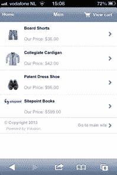
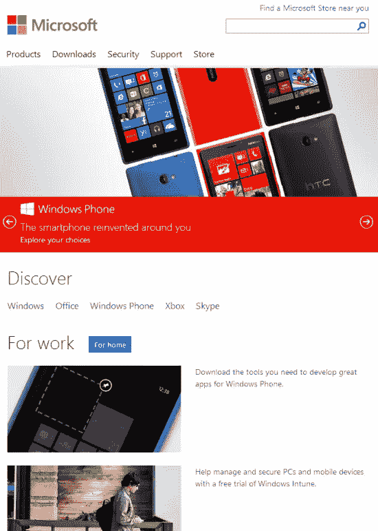
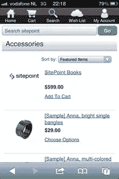
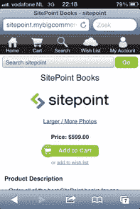
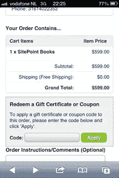
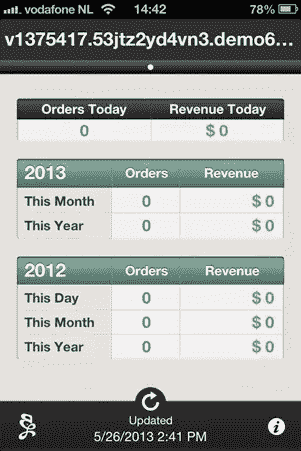
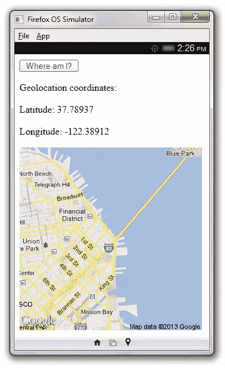

# 火狐操作系统入门:托管和打包应用

> 原文：<https://www.sitepoint.com/getting-started-with-firefox-os-hosted-and-packaged-apps/>

Mozilla 的 Firefox OS 运行的是网络应用，而不是原生应用。在我的两部分移动操作系统入门系列的第 1 部分中，我介绍了 Firefox OS，并讨论了如何设置开发 Web 应用程序的环境。

本文将向您介绍托管应用和打包应用，这是 Firefox OS 支持的两种 Web 应用。我将向你展示如何创建每一种应用，以及如何通过 [Firefox OS Marketplace](https://marketplace.firefox.com/) 发布应用。

## 发现托管应用

火狐操作系统支持*托管应用*，即网站转化为网络应用——网站就是应用。数以百万计的网站已经存在，可以很容易地转化为托管应用程序，这给了 Firefox OS 一个特殊的竞争优势。

### 创建托管应用程序

创建托管应用程序很容易。在仪表板上，输入一个网站的网址，然后点击*添加网址*按钮。例如，我输入我的 TutorTutor 网站的`http://tutortutor.ca` URL，如图 1 所示。



**图一:**输入网址，点击*添加网址*。

作为对点击 *Add URL* 的响应，模拟器开始运行并显示我的网站主页的一部分——参见图 2。


**图 2:** 在模拟器屏幕上拖动鼠标，查看该网页的更多内容。

仪表板用默认值创建一个清单文件(稍后讨论),然后[验证](https://developer.mozilla.org/en-US/docs/Tools/Firefox_OS_Simulator#Manifest-validation)。根据图 2，验证产生了一条警告消息:

```
app submission to the Marketplace needs at least an 128 icon
```

错误消息指出我没有为此应用程序指定图标。Firefox OS Marketplace 要求提交的应用程序至少有一个尺寸至少为 128 x 128 像素的图标。

如果没有图标，仪表板会为主屏幕创建一个默认应用程序图标。当创建如图 2 所示的应用程序时，仪表板从我的网站的`favicon.ico`文件中获得这个图标，并放大它，如图 3 所示。



**图 3:** 为 tutortutor.ca 生成了一个基于`favicon.ico`的应用图标

每个托管和打包的应用都需要一个*清单*，一个名为`manifest.webapp`的 JSON 文件。清单提供了关于应用程序的信息，如版本、名称、描述、图标位置和区域设置字符串。如果没有指定，仪表板会创建一个清单。

例如，清单 1 显示了一个简单的`manifest.webapp`文件，它将我的网站的[水族馆](http://tutortutor.ca/cgi-bin/makepage.cgi?/software/Aquarium)页面描述为一个托管应用程序。

```
{
  "name": "Aquarium",
  "description": "Observe several swimming fish.",
  "launch_path": "/cgi-bin/makepage.cgi?/software/Aquarium"
}
```

**清单 1:**`name`和`description`字段对于托管和打包的应用程序是必需的。

`name`字段识别显示在模拟器上的应用程序名称。`description`字段描述应用程序，最大长度为 1024 个字符。`launch_path`字段标识了要加载的 Web 资源的位置。

| 注 |
| 要了解更多关于应用清单的信息，请查看 Mozilla 的[应用清单](https://developer.mozilla.org/en-US/docs/Web/Apps/Manifest)和关于应用清单文档的[常见问题。](https://developer.mozilla.org/en-US/docs/Web/Apps/FAQs/About_app_manifests) |

我把这个`manifest.webapp`文件上传到了我网站的根目录。然而，在我可以使用仪表板添加这个应用程序之前，我必须将以下 MIME 类型添加到我的 Web 服务器，并将其与文件扩展名`.webapp`相关联:

```
application/x-web-app-manifest+json
```

应用程序清单必须提供一个标题为`application/x-web-app-manifest+json`的`Content-Type`。虽然目前不是由 Firefox 强制执行，但它是由 Firefox OS Marketplace 强制执行。

完成这个任务后，我将`http://tutortutor.ca/manifest.webapp`输入到仪表板中——参见图 4。



**图 4:** 输入清单网址，点击*添加清单*。

作为对点击*添加清单*的响应，模拟器开始运行并显示我的网站的水族馆页面的一部分——参见图 5。



**图 5:** 在模拟器屏幕上拖动鼠标，查看水族馆的更多内容。

仪表板验证清单，导致一个“`Missing 'icons' in Manifest.`”警告消息，因为我没有在清单中指定一个`icons`字段。结果，仪表板选择了一个默认图标(启动路径中没有`favicon.ico`文件)——参见图 6。


**图 6:** 为水族馆生成一个默认的应用程序图标。

这个应用程序应该有自己的图标。根据 [Firefox OS 应用程序图标](http://www.mozilla.org/en-US/styleguide/products/firefoxos/icons/)页面，应用程序图标是一个 60 乘 60 像素的图像，以 24 位 PNG 格式提供。

这个页面提供了创建图标的注意事项、例子和模板。我选择了一个蓝色的圆形模板和一个基于 PNG 的覆盖图，创建了一个水族馆的小矩形缩略图，并通过一个在线工具组合这些图像。

接下来，我将这个文件命名为`60.png`，在我的 Web 服务器上创建一个`/icons`目录，并将这个文件上传到那个目录。然后，我修改了`manifest.webapp`文件，如下所示，并上传到我的 Web 服务器的根目录:

```
{
  "name": "Aquarium",
  "description": "Observe several swimming fish.",
  "launch_path": "/cgi-bin/makepage.cgi?/software/Aquarium",
  "icons": 
  { 
    "60":  "/icons/60.png"
  }
}
```

我启动模拟器，观察主屏幕上的新图标，如图 7 所示。


**图 7:** 我的应用程序图标由一个圆形背景上的矩形水族馆图像组成。

### 分发托管应用程序

创建一个托管应用程序后，你会想要分发它，很可能是通过 Firefox OS Marketplace。在本节中，我将向您介绍这一过程，从完成应用程序的步骤开始。

Firefox OS Marketplace 要求您的应用程序至少有一个图标，其尺寸至少为 128 x 128 像素。因此，您应该创建这个图标，并将其存储在 Web 服务器上的适当位置(并适当地更新`manifest.webapp`)。

您可能希望在清单中指定一些其他字段。例如，您可能想要指定`developer`和`version`字段。清单 2 展示了我的水族馆应用程序的最终清单文件。

```
{
  "name": "Aquarium",
  "description": "Observe several swimming fish.",
  "version": "1.0",
  "launch_path": "/cgi-bin/makepage.cgi?/software/Aquarium",
  "developer": 
  { 
    "name": "Jeff Friesen", 
    "url": "http://tutortutor.ca" 
  }, 
  "icons": 
  { 
    "128": "/icons/128.png",
    "60":  "/icons/60.png"
  }
}
```

**清单 2:** 我已经将开发者和版本信息添加到这个清单中。

我的最终清单引用了两个图标。在展示应用程序时，`128.png`中的 128 x 128 像素图标由 Firefox OS Marketplace 使用，而`60.png`中的 60 x 60 像素图标作为应用程序图标出现在模拟器主屏幕上。

另一个需要考虑的问题是，当用户点击水族馆图标时，最初会看到什么。图 8 向您展示了图 5 所示的水族馆并不是用户最初看到的样子。



**图 8:** 用户最初看不到有鱼在游泳的水族馆。必须拖动页面，直到水族馆出现。

我在智能手机和平板电脑普及之前创建了我的网站，还没有重新设计这个网站，使其对移动设备友好。我可以使用[媒体查询](http://en.wikipedia.org/wiki/Media_queries)和[响应设计](http://responsivedesign.ca/)来完成这项任务。

| 注 |
| Mozilla 提供了大量关于响应设计的文档。 |

完成应用程序后，您可以将其提交到 Firefox OS Marketplace。首先将您的浏览器指向[提交页面](https://marketplace.firefox.com/developers/submit/)，然后使用您的免费角色帐户登录。



**图 9:** 您需要通过您的免费角色帐户登录。

登录后，选择一个设备类型，可能是 Firefox OS，并输入应用程序清单 URL——参见图 10。


**图 10:** 选择 Firefox OS 设备类型，并输入应用程序的清单 URL。

市场尝试验证应用程序。当它报告验证成功时，单击*继续*按钮来填写应用程序详细信息——参见图 11。


**图 11:** 屏幕显示我的 128×128 像素图标。描述取自清单的`description`字段。

我不打算继续下去，因为我觉得水族馆还没有准备好发布——我应该采用响应式设计，以便在用户进入页面时提供更好的浏览体验。

## 发现打包的应用

Firefox OS 还支持*打包的应用*，它们是包含所有应用资产的 Zip 文件:HTML、CSS、JavaScript、图像、清单等等。与托管应用不同，它们是下载到设备上的。

打包的应用程序可以访问敏感的 API，并且必须经过分发它们的商店的验证。商店审查应用程序，如果可以接受，就用应用程序的私钥签署 Zip 文件，向应用程序的用户保证应用程序已经过安全和其他问题的审查。

有三种打包的应用程序:

*   *特许的:*一个特许的应用程序通过一个特殊的过程被 Firefox OS Marketplace 批准。当一个应用程序想要访问设备上的某些敏感 API 时，它为用户提供了更多的安全性，相当于 iOS 或 Android 等平台上的原生应用程序。

*   *经认证:*经认证的应用旨在用于关键系统功能(例如，智能手机的默认拨号器或系统设置应用)。它用于 Firefox OS 手机上的关键功能，而不是用于第三方应用程序——大多数应用程序开发者可以忽略认证的应用程序。

*   *素包:*素包 app 就是常规的打包 app。它不能使用某些敏感的 Web APIs。Firefox OS Marketplace 对其进行签名，但不执行用于特权或认证应用程序的特殊认证过程。

关于打包应用的更多信息(尤其是它们与托管应用的区别)，请查看 Mozilla 的[打包应用](https://marketplace.firefox.com/developers/docs/packaged)文档。

### 创建打包应用程序

创建打包的应用程序也很容易。首先，您应该建立一个简单的文件和目录结构。例如，我为获得并显示当前地理位置的打包应用程序创建了以下文件和目录结构:

```
icons
   60.png
   128.png
js
   app.js
   jquery-1.10.1.min.js
index.html
manifest.webapp
```

清单 3 展示了`index.html`的内容。

```
<!DOCTYPE html>
  <html>
    <head>
      <title>Where am I?</title>
      <script src="js/jquery-1.10.1.min.js"></script> 
      <script src="js/app.js"></script>
      <style>
      @media (orientation: landscape)
      {
         #map { float: right }
         #left { float: left }
      }
      </style>
    </head> 

    <body>
      <div id="left">
      <button id="whereami">
        Where am I?
      </button>

      <p>
      Geolocation coordinates:

      <p>
      <span id="latitude"></span>

      <p>
      <span id="longitude"></span>
      </div>

      <p>
      <div id="map">
      </div>
    </body> 
  </html>
```

**清单 3:**`index.html`文件是应用程序的起点。

清单 3 描述了驱动应用程序的 HTML。这个头文件包括一个标题(Firefox OS 设备可能使用也可能不使用)，一个导入 jQuery 的`script`标签，一个导入应用程序 JavaScript 逻辑的`script`标签，以及一个`style`标签(稍后讨论)。

该应用程序显示一个按钮，后面是一个`Geolocation coordinates:`标签，后面是几个显示纬度和经度的范围，后面是一个显示当前位置地图图像的 div。这些用户界面元素在纵向模式下看起来不错。

在横向模式下，地图的大部分被切掉，右边有过多的空白。为了改进用户界面，我添加了一个`style`标签，当设备处于横向模式时，它的媒体查询将元素悬浮在屏幕上。

清单 4 展示了`app.js`的内容。

```
$(function() 
{
   if (!("geolocation" in navigator))
   {
      $("#latitude").text("geolocation not available");
      return;
   }

   function getGeoData()
   {
      function success(position)
      {
         var latitude = position.coords.latitude;
         var longitude = position.coords.longitude;
         $("#latitude").text("Latitude: "+latitude);
         $("#longitude").text("Longitude: "+longitude);
         var img = new Image();
         img.src = "http://maps.googleapis.com/maps/api/staticmap?center="+
                   latitude+","+longitude+"&zoom=13&size=300x300&sensor=false";
         var node = document.getElementById("map");
         node.removeChild(node.firstChild);
         node.appendChild(img);
      }

      function error(err) 
      {
         $("#latitude").text("unavailable");
      }

      navigator.geolocation.getCurrentPosition(success, error);
   }

   $("#whereami").click(getGeoData);
});
```

**清单 4:**`app.js`文件定义了应用程序的逻辑。

清单 4 检查`navigator.geolocation`属性是否存在，当该属性不存在时输出一条`geolocation not available`消息。此外，它向`whereami`按钮注册了一个点击处理程序，以便在按钮被点击时调用`getGeoData()`。

`getGeoData()`函数首先定义了`success()`和`error()`函数，在可以获取或者不可以获取位置时(可能是用户没有给出权限)调用。然后执行`navigator.geolocation.getCurrentPosition(success, error);`。

要求用户授予/拒绝权限。当被授予并且没有出错时，用一个`position`参数调用`success()`,提取并显示其纬度和经度。此外，获得并显示该位置的基于 Google 的地图。

清单 5 展示了`manifest.webapp`的内容。

```
{ 
  "name": "Where am I?", 
  "description": "This app tells you where you're located.",
  "version": "1.0",
  "launch_path": "/index.html", 
  "developer": 
  { 
    "name": "Jeff Friesen", 
    "url": "http://tutortutor.ca" 
  }, 
  "icons": 
  { 
    "128": "/icons/128.png",
    "60":  "/icons/60.png"
  }, 
  "permissions": 
  {
    "geolocation": 
    {
      "description": "Needed to tell the user where they are"
    }
  }
}
```

**清单 5:** 访问地理定位 API 需要许可。

应用程序需要权限才能访问地理定位 API。这个权限的名称是`geolocation`，它必须作为一个`permissions`字段的子字段出现。

| 注 |
| Mozilla 的[应用权限](https://developer.mozilla.org/en-US/docs/Web/Apps/App_permissions?redirectlocale=en-US&redirectslug=Apps%2FApp_permissions)文档描述了`geolocation`，也提供了完整的权限列表。 |

图 12 显示了在纵向模式下运行的应用程序。



**图 12:** “我在哪里？”纵向模式下的应用程序。

图 13 显示了在横向模式下运行的应用程序。


**图 13:** “我在哪里？”横向模式下的应用程序。

### 分发打包的应用程序

在分发打包的应用程序之前，您需要将其文件和目录结构压缩到 zip 存档中。例如，我存档了“我在哪里？”■文件和目录结构(下面重复)成`whereami.zip`:

```
icons
   60.png
   128.png
js
   app.js
   jquery-1.10.1.min.js
index.html
manifest.webapp
```

您现在可以将这个打包的应用程序提交到 Firefox OS Marketplace。提交托管应用程序时，将浏览器指向[提交页面](https://marketplace.firefox.com/developers/submit/)，使用您的免费角色帐户登录。

登录后，选择一种设备类型，这将是火狐操作系统。然后点击*打包的*标签，点击后续的*选择文件……*按钮，选择打包应用的 Zip 文件——见图 14。


**图 14:**Zip 文件被自动验证。

点击*继续*按钮，在出现的页面上填写应用详情。填写完这些详细信息后，再次点击*继续*按钮查看应用程序。

## 结论

我介绍了托管和打包的应用程序，并向您展示了如何创建和分发各种类型的 Web 应用程序。要了解更多关于 Firefox 操作系统和应用程序开发的信息，请查看 Mozilla 在以下站点提供的大量文档:

*   [Firefox Marketplace 开发者中心](https://marketplace.firefox.com/developers/)
*   [Mozilla 开发者网络](https://developer.mozilla.org/en-US/)

Firefox OS 专注于网络应用，这使得它成为 Android、iOS 和其他面向原生应用的移动操作系统的有趣替代品。随着 Firefox OS 开始获得动力，现在是开始为这个平台编写(并最终实现盈利)Web 应用程序的大好时机。

## 分享这篇文章