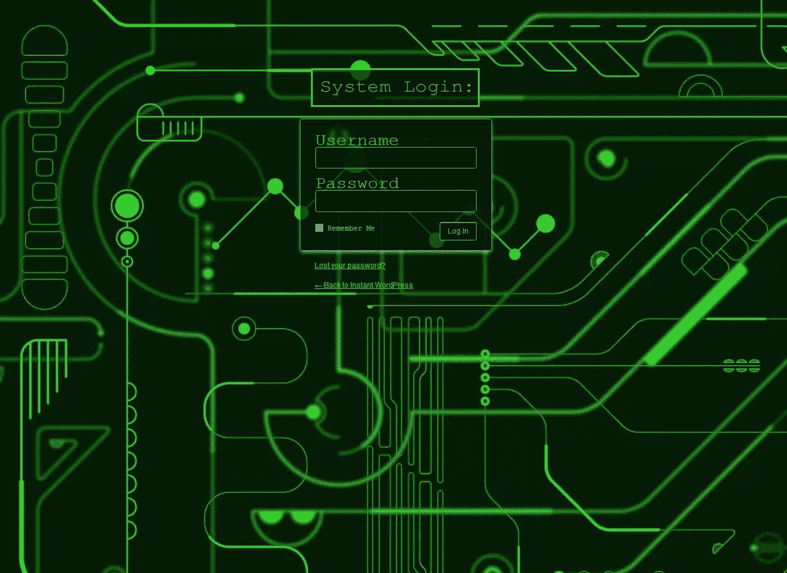
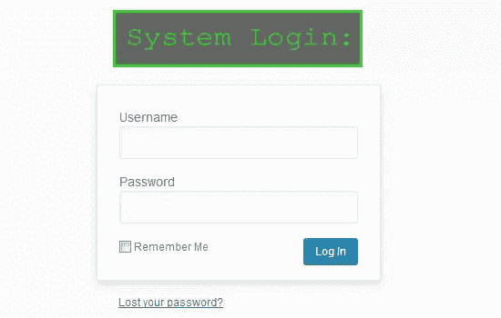
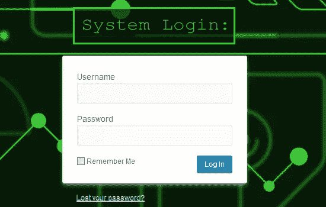
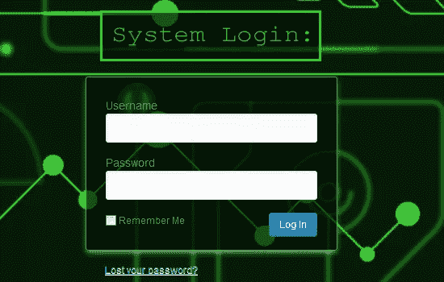
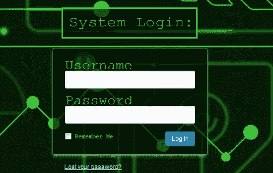
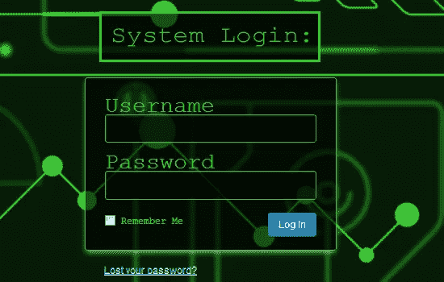
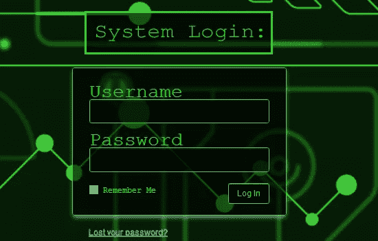
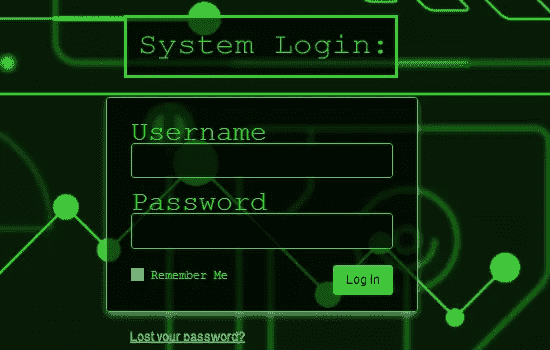
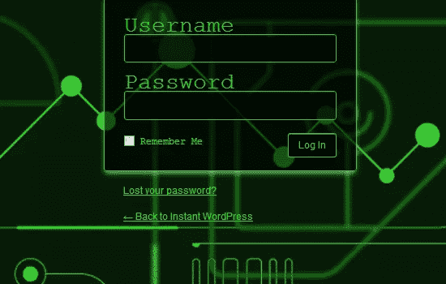

# 设计一个风格化的自定义 WordPress 登录界面

> 原文：<https://www.sitepoint.com/design-a-stylized-custom-wordpress-login-screen/>

WordPress 登录界面是 WordPress 网站中最普通的、我们都见过的相同事物之一。奇怪的是，这也是最难修改的事情之一。没有用于添加您的徽标或更改整体外观和感觉的内置功能。

在本文中，我将通过几个简短的步骤向您展示如何开始修改登录屏幕，以便用户体验定制的、品牌化的外观和感觉。我把这个设计放在最上面，只是为了展示使用一个简单的 functions.php 文件和一些 CSS 就可以使登录表单风格化。

我的成品看起来是这样的:

*(点击查看完整版)*

如果你碰巧想要我在本教程中使用的背景图片，你可以在这里下载:

我把它分成几个部分，所以你可以只修改你想要的部分。你可能只想改变几个项目，改变一些字体，调整一些背景，并称之为好。对于那些想要彻底整容的人来说，你可以做一个非常戏剧性的改变，就像你从我的例子中看到的那样。所以，等一下，很快你就会有一个高度风格化的 WordPress 登录表单。

### 修改 Functions.php

更改登录屏幕最令人沮丧的地方之一是，你需要在你的 functions.php 文件中添加几行代码，告诉 WordPress 你想要一个不同的样式表用于登录屏幕。不幸的是，登录在 WordPress 中是一个独特的页面，但是出于安全和其他原因，它就是这样。

因此，在您的 functions.php 文件中，粘贴以下内容:

[sourcecode language="php"]

函数风格化 _login() {

回声'<link rel="stylesheet" type="text/css" href="’ . get_bloginfo(‘stylesheet_directory’) . ‘/stylized-login.css">'；

}

add_action('login_head '，' styled _ log in ')；

[/sourcecode]

我们在这里所做的是“挂钩”到 login_head，并告诉 WordPress 使用我们将要构建的风格化的 login.css 文档。

您需要函数和 add_action，所以两者都不要跳过。

### 添加您的 CSS 文档

现在，您需要将风格化的 login.css 文档添加到主题的文件夹中。这应该是文件夹中的 style.css。如果您想将自定义登录文件放在一个单独的文件夹中，请确保在步骤 1 中相应地更新该文件夹。

从普通用户的角度来看，在这一点上您还没有做任何改变，但是您现在已经万事俱备了。

### 更改徽标

我们都习惯了登录表单上面的 WordPress 标志，所以让我们先把它改一下。在风格化的 login.css 中，添加以下内容:

[sourcecode language="css"]

。登录 h1 a {
背景-图片:URL(' logo . png ')；
}

[/sourcecode]

我把我的图像命名为 logo.png。如果你想让它完全合身，它应该是 247 x 63。

### 更改页面的背景图像

背景图片是让你的登录页面焕然一新的最简单的方法之一:

[sourcecode language="css"]

body.login {
背景-图片:URL(' BG . png ')；
}

[/sourcecode]

你不必把背景做成图像。你可以只设置背景色，称之为好。

### 更改表单背景和边框

白色背景的表单本身是另一张“普通 WordPress”的名片，所以让我们改变一下:

[sourcecode language="css"]

。登录表单{
后台:rgba(0，0，0，.. 6)；
}

# loginform {
border-color:# 33d 42a；
}

[/sourcecode]

请注意，我使用了 RGBA，它允许一个阿尔法(透明度)，所以如果你想使形式或多或少的透明，这是你会改变它。我添加了透明度，你可以在下图中看到。

### 更改用户名和密码字体

我坚持使用一些常见的系统字体，但您可以随时导入您选择的字体，以获得进一步的风格化效果:

[sourcecode language="css"]

。登录标签{
font-family:“快递新”，快递，等宽；
字体大小:28px
颜色:# 33d42a
}

[/sourcecode]

### 更改输入框背景和边框

在这个例子中，我甚至不想让我的输入使用标准的白色背景，所以这里有一个快速的方法来给这些输入一个全新的外观:

[sourcecode language="css"]

。登录输入[type = " text "]{
font-family:" Courier New "，Courier，等宽；
font-size:24px；
背景色:rgba(0，0，0，.. 6)；
border-color:# 33d 42a；
}

。登录输入[type = " password "]{
background-color:rgba(0，0，0，.. 6)；
border-color:# 33d 42a；
}

[/sourcecode]

我再一次使用 RGBA 来获得这些输入框的透明效果。

### 更改登录按钮

现在我们*让*把那个蓝色的登录按钮拿出来。它毁了一切！

[sourcecode language="css"]

。wp-core-ui。按钮-原色{
背景色:# 000；
背景-图像:无；
border-color:# 33d 42a；
border-bottom-color:# 13f 278；
颜色:# 33d42a
}

。wp-core-ui。button-primary:hover {
背景色:# 33d42a
背景-图像:无；
border-color:# 33d 42a；
颜色:# 000；
}

[/sourcecode]

这也照顾到我们的悬停状态。当鼠标悬停时，按钮变成亮绿色。为了清楚起见，请看下面。

### 更改丢失的密码和“回到…”链接

快好了！底部的那些小链接现在是我们完全风格化的表单的全部。

[sourcecode language="css"]

。登录#导航 a，。登录#backtoblog a {
color: #33d42a！重要；
文字-阴影:无；
}

。登录#nav a:悬停，。登录# backto blog a:hover {
color:# 33d 42a！重要；
text-shadow:0 1px 0 # 33d 42a；
}

[/sourcecode]

### 更改徽标链接按钮

最后，但并非最不重要的，我不能离开不够好，不得不改变图标链接到我自己的网站——对不起，WordPress.org，我不想要那个链接了。

要进行此更改，您必须返回到您的 functions.php 文件，并添加以下内容:

[sourcecode language="php"]

函数 login_link( $url ) {

返回 get _ bloginfo(' URL ')；

}

add_filter( 'login_headerurl '，' log in _ link ')；

[/sourcecode]

### 最终 CSS

这是一个大块的 CSS，带有供你复制和粘贴的注释:

[sourcecode language="css"]

/*登录表单上方的徽标*/
。登录 h1 a {
背景-图片:URL(' logo . png ')；
}

/*背景图片*/
body . log in {
Background-image:URL(' BG . png ')；
}

/*表格背景*/
。登录表单{
后台:rgba(0，0，0，.. 6)；
}

/*表单的边框*/
# loginform {
Border-color:# 33d 42a；
}

/*表单的标签*/
。登录标签{
font-family:“快递新”，快递，等宽；
font-size:28px；
颜色:# 33d42a
}

/*用户名文本框*/
。登录输入[type = " text "]{
font-family:" Courier New "，Courier，等宽；
font-size:24px；
背景色:rgba(0，0，0，.. 6)；
border-color:# 33d 42a；
}

/*密码文本框*/
。登录输入[type = " password "]{
background-color:rgba(0，0，0，.. 6)；
border-color:# 33d 42a；
}

/*登录按钮*/
。wp-core-ui。按钮-原色{
背景色:# 000；
背景-图像:无；
border-color:# 33d 42a；
border-bottom-color:# 13f 278；
颜色:# 33d42a
}

/*登录按钮悬停*/
。wp-core-ui。button-primary:hover {
背景色:# 33d42a
背景-图像:无；
border-color:# 33d 42a；
颜色:# 000；
}

/*丢失密码和“返回”链接*/
。登录#导航 a，。登录#backtoblog a {
color: #33d42a！重要；
文-影:无；
}

/*丢失密码和“返回”悬停链接*/
。登录#nav a:悬停，。登录# backto blog a:hover {
color:# 33d 42a！重要；
text-shadow:0 1px 0 # 33d 42a；
}

[/sourcecode]

仅此而已。享受定制 WordPress 来满足你(客户)的需求！

## 分享这篇文章