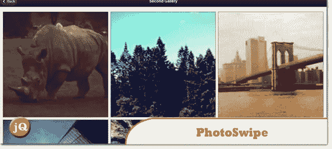
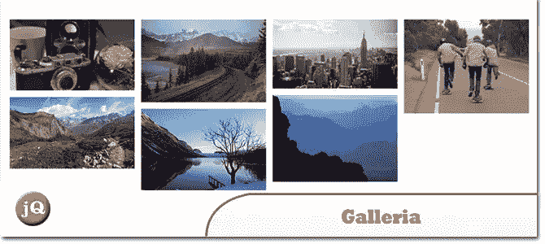
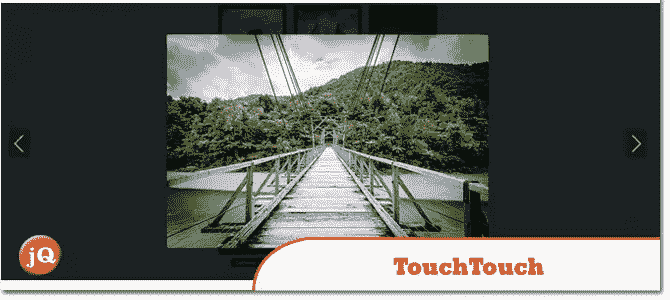
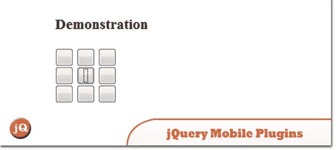

# 5 个 jQuery 移动图库插件

> 原文：<https://www.sitepoint.com/5-jquery-mobile-gallery-plugins-2/>

在本帖中，我们分享了几个好的 jQuery 手机图库插件,来展示你手机上的可爱图片！它们简单且轻量级，仅适用于 JQuery Mobile。玩得开心！:)

**相关帖子:**

*   [**jQuery Touch Swipe 图库插件**](http://www.jquery4u.com/mobile-devices/5-jquery-touch-swipe-image-gallery-plugins/)
*   [**12 jQuery 移动布局及实例**](http://www.jquery4u.com/page-layout/12-jquery-mobile-layout-plugins-examples/)

## 1.图像翻转

简单的 JQuery 移动图片库插件

 
[来源](http://cflove.org/2012/09/imageflip-jquery-mobile-image-gallery-plugin.cfm) [演示](http://cflove.org/examples/imageFlip/)

## 2.照片擦除

用于移动和触摸设备的图片库

 
[来源](http://www.photoswipe.com/) [演示](http://www.photoswipe.com/latest/examples/04-jquery-mobile.html)

## 3.一群小商店

这是一个 JavaScript 图库框架，简化了为 web 和移动设备创建漂亮图库的过程。

 
[来源](http://galleria.io/) [演示](http://galleria.io/themes/folio/)

## 4.触摸触摸

一个触摸优化的图库插件

 
[来源](http://tutorialzine.com/2012/04/mobile-touch-gallery/) [演示](http://demo.tutorialzine.com/2012/04/mobile-touch-gallery/)

## 5.jQuery 移动插件

jQuery Mobile 1.20 的插件

 
[来源](https://github.com/sgissinger/jquery-mobile-plugins#readme)

## 分享这篇文章