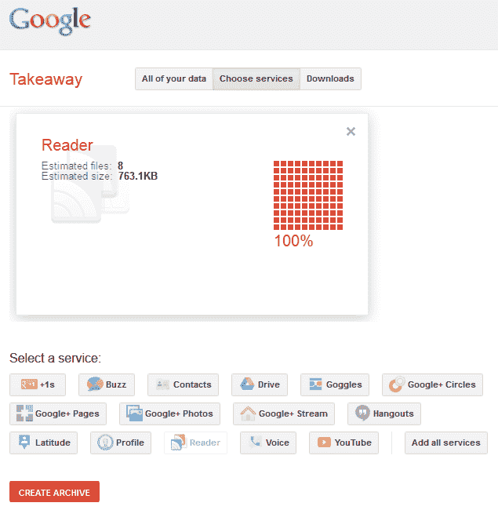

# 谷歌阅读器:是时候计划你的退出策略了

> 原文：<https://www.sitepoint.com/google-reader-data-export/>

离谷歌阅读器永远关闭还有不到一个月的时间。尽管有请求和抗议，谷歌不太可能改变主意。世界上最常用和最成功的 RSS 阅读器将于 2013 年 7 月 1 日停止使用。

虽然有其他选择，如 [Feedly](http://www.feedly.com/) ，但许多人依赖谷歌阅读器来管理订阅源。没有无痛迁移的保证。无论你在考虑什么选择，备份你在过去八年中收集的订阅源网址和标有星号的条目是非常重要的。你在 Reader 本身找不到太多帮助，但这个过程并不难…

## 1.登录谷歌外卖

前往[google.com/takeout](https://www.google.com/takeout/)，用你用于阅读器的谷歌账户 ID 和密码登录。

## 2.选择谷歌阅读器

你可能不需要或不想下载你所有的数据(除非你完全放弃谷歌)，所以点击**选择服务**标签，然后点击**阅读器**图标:

外卖将计算您的档案的大致大小。

## 3.下载您的数据

点击**创建档案**按钮。这个过程应该不会超过几秒钟，但是如果你有大量的数据，你可以要求在完成后收到电子邮件。

创建完成后，点击蓝色的**下载**按钮，获取一个名为*<your-email>*-take out . zip 的文件

如果您希望再次下载，可以随时返回到**下载**选项卡。

## 文件

归档包含一个包含八个文件的 Reader 文件夹:

*   **subscriptions.xml** —您的 OPML(轮廓处理器标记语言)格式的订阅。这通常可以导入到大多数好的 RSS 阅读器中
*   **starred.json** —带有 json 格式描述的带星号的 URL
*   **liked.json** —你喜欢的物品
*   **notes.json** —你关于物品的笔记
*   **following.json** —您关注的用户
*   **followers.json** —关注你的用户
*   **shared.json** —您共享的项目
*   关注者共享的项目

## 接下来去哪里？

最大的问题是:*前谷歌读者有哪些选择？*

谷歌阅读器的消亡在网络上留下了一个 RSS 形状的大洞。谷歌杀死了许多竞争对手，很少有替代者能够提供由可靠的网络基础设施支持的出色的网络和移动体验。

就我个人而言，我会继续使用谷歌阅读器，直到彻底结束，希望他们会暂缓这项服务。然而，我正在研究一些选项——敬请关注 SitePoint 上即将推出的 12 款免费谷歌阅读器。

## 分享这篇文章