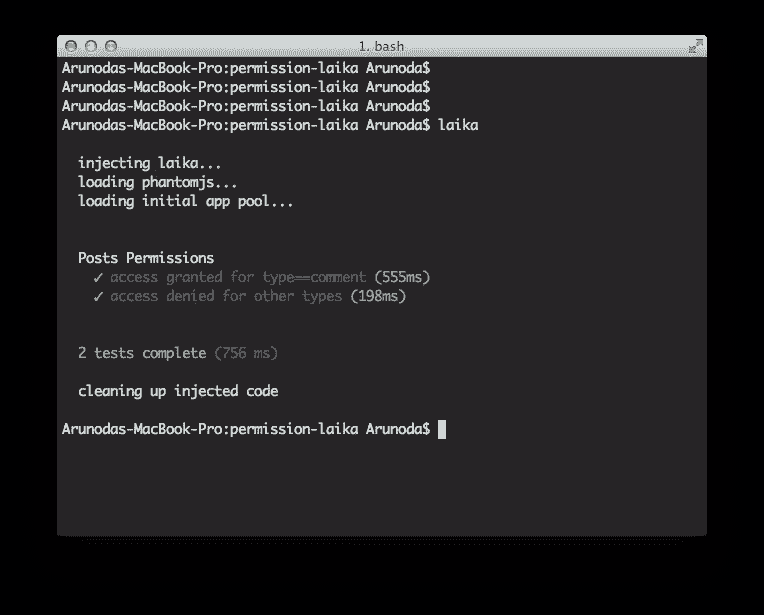
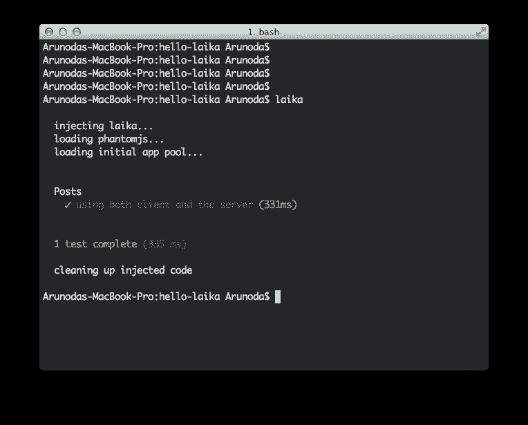

# Firefox 操作系统入门

> 原文：<https://www.sitepoint.com/getting-started-with-firefox-os/>

移动应用程序如今风靡一时。*本地应用*运行在移动设备的操作系统上，必须适应不同的设备，而*网络应用*运行在浏览器环境中，所有支持网络的移动设备都可以访问。

原生应用目前主导着移动应用的格局，谷歌 Android 和苹果 iOS 平台的成功证明了这一事实。也许 Mozilla 刚刚起步的运行网络应用的 Firefox OS 移动操作系统会侵蚀部分市场份额。

本文是向您展示如何开始使用 Firefox OS 的两部分系列的开始。我首先向您介绍这个移动操作系统，然后向您展示如何建立一个基于 Firefox OS 模拟器的开发环境。

## 火狐操作系统简介

Firefox OS 是 Mozilla 为智能手机和平板电脑开发的开源移动操作系统。它基于 Linux 内核，启动一个基于 Gecko 的运行时引擎，让用户运行用 HTML、JavaScript 和其他开放的 Web 应用程序 API 编写的应用程序。

Firefox OS 是作为一个开放的 Web 技术栈实现的，它由三个主要层组成:

*   一个 Linux 内核和用户空间硬件抽象层(HAL)。Linux、libusb 和 BlueZ 等常见的开源项目用于内核和各种用户空间库。HAL 的某些部分(如摄像头和 GPS)与 Android 共享。
*   *Gecko:* 位于 Gonk 之上的应用程序运行时。它实现了 HTML、CSS 和 JavaScript 的开放标准。此外，Gecko 还包括网络堆栈、图形堆栈、布局引擎、虚拟机(针对 JavaScript)等等。
*   *盖亚:*用户界面，控制屏幕上绘制的一切。它是用 HTML、CSS 和 JavaScript 编写的；并通过开放的 Web APIs(由 Gecko 实现)与操作系统进行交互。盖亚包括一个锁屏，一个主屏幕，等等。

2011 年 7 月 25 日，Mozilla 公司的研究主管 Andreas Gal 博士宣布了 Boot to Gecko (B2G)项目——Firefox OS 最初被称为 Boot to Gecko。这个项目的目标是:为开放网络构建一个完整的独立操作系统。

为什么要创建另一个基于网络的移动操作系统呢？Mozilla 出于以下原因创建了 B2G/火狐操作系统:

*   证明基于标准的开放 Web 有潜力成为主流移动操作系统提供的现有单一供应商应用程序开发堆栈的竞争替代方案。原生应用是一种倒退，因为它们将用户绑定到特定的操作系统和支持该系统的设备上。相比之下，网络已经发展到让用户在任何类型的设备上以几乎相同的方式体验内容。
*   填补移动市场的巨大空白。智能手机往往非常昂贵，不是每个人都买得起(尤其是在发展中市场，如哥伦比亚和波兰)。一种不用花很多钱就能获得智能手机体验的方法是购买便宜的安卓设备。然而，由于代码开销、较慢的处理器和其他因素，应用程序往往运行不佳。Firefox OS 提供了更高性能的体验，因为 Gecko 和硬件之间的开销更少——它能够在廉价和低端硬件上提供智能手机体验，这与在更昂贵的硬件上提供 Android 体验相当。Firefox OS 不与高端设备竞争。相反，它以功能手机的价格提供入门级到中级智能手机。

要使 Firefox OS 成为一个完整的操作系统，它必须允许 Web 应用程序访问本机应用程序可以访问的所有重要设备功能。Firefox OS 寻找那些阻止 Web 应用与本机应用平等的差距，并提供所需的 API。

Firefox OS 的成果包括新的[Web API](https://wiki.mozilla.org/WebAPI#APIs)来展示设备功能(例如电话和摄像头)，一个安全地将这些功能展示给网页的特权模型，证明这些功能的应用程序，等等。

Firefox OS 可以在许多 Android 设备上运行，包括三星的设备。它甚至在树莓派上得到了证明。另外， [Geeksphone](http://www.geeksphone.com/) 正在为这款操作系统提供第一批开发者预览设备——见图 1。

**图 1:**Keon(左边)采用 3.5 英寸 HVGA 多点触摸屏，而 Peak(右边)
采用 4.3 英寸 qHD IPS 多点触摸屏。

今年 2 月，Mozilla 宣布计划在全球廉价移动设备上推出 Firefox OS。它与 LG 电子和其他公司合作生产运行该操作系统的设备，并与西班牙电信和德国电信等移动网络提供商合作。

| 火狐操作系统和平板电脑 |
| 富士康最近发布了一款运行 Firefox OS 的[平板设备。](http://www.idownloadblog.com/2013/05/28/foxconn-firefox-tablet/) |

首批 Firefox OS 设备将在巴西、哥伦比亚、匈牙利、墨西哥、黑山、波兰、塞尔维亚、西班牙和委内瑞拉上市。火狐操作系统设备可能要到 2014 年才会在智能手机饱和的美国市场上市。

## 设置开发环境

如果你熟悉 HTML、CSS、JavaScript 和其他开放网络技术，你已经在为 Firefox OS 开发应用程序方面有了一个良好的开端。但是，您首先需要设置一个开发环境。最简单的解决方案是使用 Firefox OS 模拟器。

*火狐 OS 模拟器*是火狐 OS 的测试环境。这个环境由一个仪表板、一个控制台和 Firefox OS 模拟器设备(模拟器)组成，用于安装和运行 Web 应用程序。

将你的浏览器指向 Mozilla 的 [Firefox OS Simulator](https://addons.mozilla.org/en-US/firefox/addon/firefox-os-simulator/) 页面，以获取这个适用于最新版本 Firefox 浏览器的附加组件。3.0.1 版是撰写本文时的最新版本。

点击*添加到 Firefox* 按钮下载 Firefox OS 模拟器。在弹出的*软件安装*对话框中，点击*立即安装*按钮。过了一会儿，Firefox OS Simulator 安装完毕，一个新条目被添加到附加组件屏幕。

选择*工具* | *附加组件*显示附加组件屏幕。因为 Firefox OS Simulator 最初是禁用的，所以您必须通过单击该插件的*启用*按钮来启用它。

开启 Firefox OS 模拟器后，选择*工具* | *网页开发者* | *Firefox OS 模拟器*。模拟器加载很快，您将被带到如图 2 所示的仪表板。

**图 2:** 仪表板允许您启动和停止，以及向模拟器添加应用程序或从中删除应用程序。

您可以启动和停止模拟器，选择是否显示查看消息的控制台，以及在模拟器中添加/移除应用程序。每个添加的应用程序也会出现在仪表板上。

点击*停止/运行*开关启动模拟器。(当您想要停止模拟器时，再次单击此开关。)如果不希望出现错误控制台，取消勾选*控制台*复选框。图 3 显示了模拟器和错误控制台。

**图 3:** 模拟器运行时，仪表盘上出现一个*连接*按钮，用于连接远程设备，以供调试之用。

模拟器提供了一个主屏幕，顶部有一个状态区域，下面有一个查看应用程序图标的区域(向左/向右拖动鼠标以查看它们)，下面有一个常用图标工具栏(如电话)，底部有一个工具栏，带有以下图标按钮:

*   *主页:*该按钮导航至主屏幕。

*   *旋转模拟:*该按钮在纵向和横向之间切换模拟器。

*   *地理位置模拟:*该按钮触发一个对话框，要求您分享您的地理位置，可以是您当前的坐标，也可以是提供的自定义坐标。

查看 Mozilla 的 [Firefox OS Simulator](https://marketplace.firefox.com/developers/docs/firefox_os_simulator) 文档，了解更多关于 Firefox OS Simulator 和使用仪表板的信息。您还将了解模拟器的局限性。

## 结论

我介绍了 Firefox OS，并向您展示了如何基于 Firefox OS 模拟器建立一个简单的开发环境。在本系列的第二部分，我将向您介绍托管应用和打包应用，并向您展示如何创建它们。

## 分享这篇文章