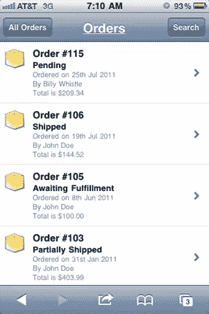
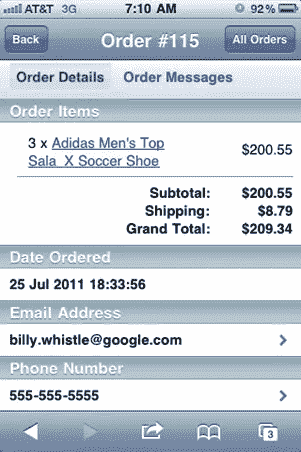
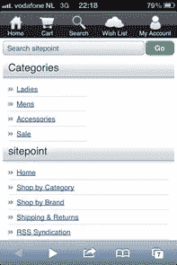
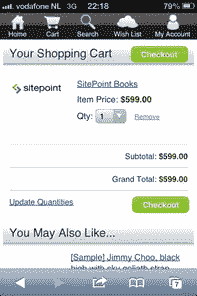
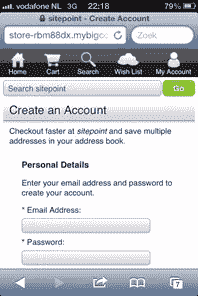
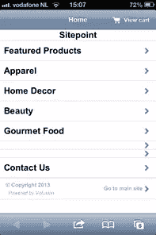
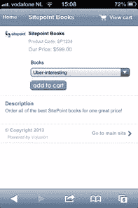
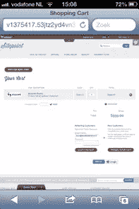
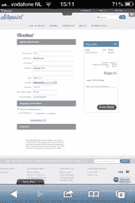

# 大商业和革命:比较设置和移动

> 原文：<https://www.sitepoint.com/bigcommerce-and-volusion-comparing-set-up-and-mobile/>

在这个系列的第一篇的[中，我比较了](https://www.sitepoint.com/more-hosted-shopping-carts-bigcommerce-and-volusion/) [BigCommerce](http://www.bigcommerce.com/) 和 [Volusion](http://www.volusion.com.au/) ，两者都托管购物车，在功能和价格方面。在这一部分中，我将了解它们的设置有多简单，以及它们是如何处理移动商务的。最后，我将看看他们的合作伙伴计划，看看作为一名开发人员，他们对您有多感兴趣。

## 建立大商业

我将从 BigCommerce 开始，还有什么比在 Prezi 演示中向您展示这些步骤更好的方式呢:

[https://prezi.com/embed/xzhgwnmn6hgd/?bgcolor=ffffff&lock_to_path=0&autoplay=0&autohide_ctrls=0&features=undefined&disabled_features=undefined](https://prezi.com/embed/xzhgwnmn6hgd/?bgcolor=ffffff&lock_to_path=0&autoplay=0&autohide_ctrls=0&features=undefined&disabled_features=undefined)

如你所见，BigCommerce 非常容易建立。快速启动向导名副其实，但是完成所有步骤并不意味着您就大功告成了。这是因为在您执行其中一个指定步骤后，某个阶段会被标记为“完成”。但是大多数情况下你需要配置更多的选项或者产品。例如，您可能想要添加多个产品，并且您可能想要有多个运输选项。

然而，向导是向您展示在哪里配置每个步骤的好方法，这可能是它的预期目的。完成向导后，您可能会再花 30-60 分钟来配置您的商店，这并不算长。这一切都非常直观，几乎你需要填写的每个字段都有一个小指针告诉你该做什么。

## 设置音量

现在让我们看看 Volusion 是如何做到的，当然他们也有自己的 Prezi:

[https://prezi.com/embed/uqh38c89qcvb/?bgcolor=ffffff&lock_to_path=0&autoplay=0&autohide_ctrls=0&features=undefined&disabled_features=undefined](https://prezi.com/embed/uqh38c89qcvb/?bgcolor=ffffff&lock_to_path=0&autoplay=0&autohide_ctrls=0&features=undefined&disabled_features=undefined)

你可以马上注意到 Volusion 不像 BigCommerce 那样有一个方便的快速启动向导。这意味着你没有真正的动机去开店，因为你知道你已经配置了所有需要的东西。然而，我制作的 Prezi 具有与 BigCommerce 相同的步骤，因此它可以作为您自己的快速启动向导。有一个快速启动，但它是在前端，非常有限。

谈到可配置性，Volusion 给我留下了深刻的印象。您可以根据自己的需要进行设置，我只介绍了基本的设置。这里的设置比我展示的多得多，也比 BigCommerce 多得多。它只是按照你期望的方式工作，你真的不需要一本手册(除了税收设置)。但是看到它如此简单，我对你打开手机的方式有点失望。

应该有一个大的“打开手机”按钮什么的，或者至少你应该在主题设置里找到。但是它在通用设置中，你真的需要去寻找它。而且你也不能排除一个 iPad，它往往不需要移动版，但是你也不知道它*是否包含*(没有进一步的设置)。但是在下一个关于移动商务的章节中会有更多的介绍。

Volusion 的一大优势是你可以把它翻译成任何语言。例如，结合使用任何货币(和字符编码方法)的选项，您甚至可以在荷兰(我居住的地方)使用 Volusion。请记住，他们使用 Akamai 作为他们的 CDN，它具有出色的全球覆盖，因此您的客户不会看到任何速度限制。BigCommerce 没有这个功能，这就限制了它的市场。你可以雇人编写代码(或者自己动手)，但是整个过程可能会在升级中丢失，所以不推荐这样做。

与 BigCommerce 一样，设置您的商店将花费您大约 1 或 2 个小时，这还不包括添加产品的时间。

## 移动商务

正如我在[我的](https://www.sitepoint.com/testing-3-hosted-shopping-carts/) [以前的](https://www.sitepoint.com/testing-3-hosted-shopping-carts-operations/) [文章](https://www.sitepoint.com/self-hosted-shopping-carts-magento-and-woocommerce-compared/)中提到的，移动商务变得越来越重要。让我们来比较一下这两种解决方案。

### 移动大商务

#### *仪表板*

|  |  |
| *订单概述，由 BigCommerce 提供* | *订单详情，由 BigCommerce 提供* |

在本系列的第一部分中，我确定 BigCommerce 没有移动应用程序，但他们确实提供了常规仪表板的修改后的移动版本。这允许您查看您的订单信息，如等待付款/发货、预购等。它是只读的，但对于那些想在旅途中保持跟踪的人来说，这可能会派上用场。要进行完整的处理，你需要切换到桌面版本(顺便说一下，iPhone 不能这样做，因为你不能切换)。

#### *前端*

默认情况下，优化移动前端是启用的，但在 Prezi“设置 BigCommerce”中，我向您展示了如何自己启用/禁用它。你也可以选择为你的 iPad 访客提供移动主题(默认情况下是禁用的)，但我不推荐这样做。移动主题在 iPad 上看起来总是有点傻，屏幕对于桌面版来说足够大了。

游客可以享受从浏览到结账的完整移动体验(而且，大多数时候，支付提供商都有移动版本)。

|  |  |  |
| *手机主页* | *类别概述* | *产品详情* |
|  |  |  |
| *购物车* | *创建账户(或登录)* | *结账* |

它看起来很棒，但它有一个主要缺点:这是你唯一的移动主题(尽管提供了 100 多个桌面主题)。所以，所有支持移动的大型商务网站看起来都一样。它没有响应能力，所以它不是基于屏幕大小，而是基于浏览器代理。有一种方法可以定制你的手机主题，但是这是一种变通方法，并不完美。

你可以为你的商店开发一个内置响应功能的定制主题，让别人为你做这件事。这将需要一些工作(尽管 big commerce 提供了一些帮助),所以预计会很昂贵。但本质上你应该能够从许多移动主题中选择，而不是一个，我认为 BigCommerce 应该提供这种选择。就目前而言，情况并非如此。

### Volusion mobile

#### *仪表板*

|  |  |
| *收入概况* | *仪表板* |

Volusion 提供了一个应用程序，让你可以在旅途中查看你的销售数据。尽管有一个快速的方法来检查你的销售总是好的，但它不会让你在旅途中更有效率。没有移动优化的管理，所以你只能使用桌面版本。这是可行的，但是需要大量的放大来确保你选择了你想要的。

#### *前端*

Volusion 也有一个移动主题，你必须自己打开它(这在 Prezi 的“设置 Volusion”中有解释)。没有任何可能的配置，它只是开或关，不检测使用哪个浏览器代理。而且，就像 BigCommerce 一样，移动主题没有响应。

这还不是 Volusion 手机主题最糟糕的方面。事实上，购物车和结账过程不包括在内。因此，有人可以访问您的移动网站，浏览和把产品放在他们的购物车。但是当他们真正想付费时，他们看到的是你网站的桌面版本。

当他们使用平板电脑时，这并不坏，但在手机上，这远不方便。这真的会影响你的销售，更不用说这看起来很不专业。虽然这些问题是最明显的，但也有一整套有限的功能([阅读他们的 FAQ](http://support.volusion.com/article/volusion-mcommerce-faq) )。

所以他们基本上做的是优化前端，让它看起来是移动优化的，然后就这样了。尽管他们承认移动商务的重要性，但他们没有给你合适的工具。希望这是他们很快会改进的地方。

|  |  |  |
| *手机主页* | *类别概述* | *产品详情* |
|  |  |  |
| *购物车(未优化)* | *结帐/创建账户* *(未优化)* |  |

和 BigCommerce 一样，Volusion 只提供一个移动主题。但是，至少你可以花钱买一个更好的主题，尽管这些主题标价 995 美元(你买了一个新的桌面主题，并收到一个匹配的移动主题)。

或者你可以自己编辑手机主题代码，但是编辑 Volusion 模板是有限的，并且需要很大的[耐心](http://tech-hive.com/reviews/shopping-carts/volusion-every-themers-nightmare-20100615/)。因此，就像 BigCommerce 一样，(雇人)定制你的主题会相当昂贵。

## 合作伙伴选项

最后，我将快速浏览一下他们的合作伙伴计划，看看作为开发人员的您能从中受益。

### *开发商/解决方案合作伙伴计划*

两家提供商都给你机会为他们的平台开发应用程序。有了 BigCommerce，你将成为他们合作伙伴项目的[开发者](http://www.bigcommerce.com/partners/developers)，产品销售将成为你的收入来源。他们假设你已经有了一个可用的应用程序/网站，但是你总是可以为一个新的应用程序提出你的想法。

这同样适用于 Volusion，因为您成为了[解决方案合作伙伴](http://www.volusion.com/become-partner/solution/)。在这两种情况下，你都将受益于被列入他们的市场，给你一些体面的推广。请注意，你肯定不是唯一的一个，你应该考虑是否值得投入时间。

### *专家程序*

BigCommerce 和 Volusion 都为他们的客户提供各种各样的“专家”，这些公司专门在设计和营销等特定领域提供帮助。

BigCommerce 提供设计、营销、开发和整合方面的专家。没有办法自己报名成为专家。所以目前对你来说没有商机。

Volusion 正在[接受新的专家](http://experts.volusion.com/more-info)并拥有相同的专业领域，只是他们使用“业务”一词来称呼他们的集成[专家](http://experts.volusion.com/)。

作为一名专家，你可以列出你的专长，描述你做什么，并指出你的费用是多少。被列入他们的专家目录将花费你一个月的费用，但它提供了新业务的绝佳机会。你不会在一个特定的专业领域与数十家公司竞争，所以你被选中的机会肯定是值得努力的。

## 结论

很难选择一个供应商而不是另一个。尽管他们提供相同的产品，BigCommerce 和 Volusion 使用不同的方法，这给了他们各自的好处。

让我们列出利弊

### 大商业

**+** 集成 CMS

**+** 对设置的巨大帮助(成功小队，快速启动向导)

**+** 每个计划中包含的所有功能

**+** 体面的移动主题

**–**没有有用的移动仪表盘

**–**没有多语言功能

**–**没有有趣的合作伙伴计划

### 解决办法

**+** 许多功能(每日交易、投资回报跟踪等。)

**+** 较低的价格(但在较低价格的计划中功能有限)

**+** 多语言能力

**+** 有趣的合作伙伴计划

**–**没有有用的移动仪表盘

**–**限量手机主题

从客户的角度来看，两者都不会错。这取决于你的要求和预算，但如果你想自己动手，电子商务确实比志愿服务更受欢迎。

作为开发者，你会发现 Volusion 更适合。他们有一个体面的合作伙伴计划，他们的大量功能为您提供了咨询工作的绝佳机会。你可以在世界任何一个地方开一家 Volusion 商店，这将打开很多市场。

## 演示商店

我建立的两个演示商店都有扩展的演示许可证(谢谢 BigCommerce 和 Volusion！)

BigCommerce 演示店:[http://sitepoint.mybigcommerce.com/](http://sitepoint.mybigcommerce.com/)(截止 6 月 14 日)

Volusion 试玩店:[http://v1375417.53jtz2yd4vn3.demo6.volusion.com/](http://v1375417.53jtz2yd4vn3.demo6.volusion.com/)(截止 6 月 30 日)

## 分享这篇文章