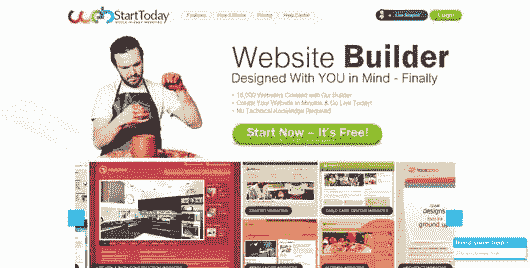
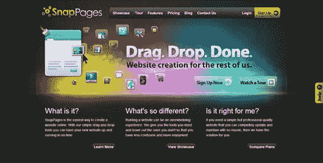
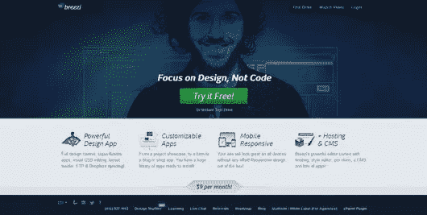
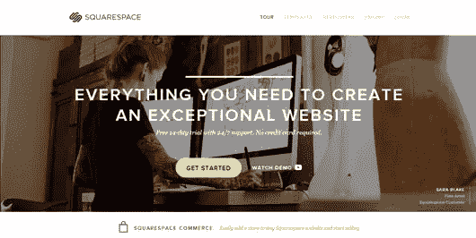

# 设计师，了解你的竞争对手:5 个自己动手的网站建设者

> 原文：<https://www.sitepoint.com/know-your-enemy-top-5-site-builders-for-building-professional-websites/>

如果你认为你只是和你的同事竞争与网页相关的设计工作，请再想一想。相当多的自己动手的网站建设者已经变得流行，并在生产基本的网站惊人地有效。当然，在很多情况下，企业应该聘请专业的网站开发人员/设计师来创建他们的网站。然而，有时客户需要的是一个快速而专业的网站，他们可以自己建立。

一些客户可能只是想在花大价钱聘请专业开发人员之前，看看你的初创公司进展如何。或者，也许他们正在建立一个俱乐部，只需要一个简单、信息丰富的网站。或者，也许他们是一个小企业主，只需要一个专业的联系点或一个简单的电子商务网站。对于这些和类似的情况，正确的网站建设者可以满足要求，并为任何寻求竞标相同工作的设计师创造激烈的竞争。

事实上，一些最好的网站建设者允许任何人——从初学者到有经验的设计师——在几分钟内创建一个完整的网站。大部分时间将花在寻找合适的网站建设者为您的需求。为了帮助设计者理解他们的低成本竞争，我在网上收集了 5 个具有最好功能和极好评论的网站。其中一些有免费试用，但都需要每月付费，但如果你想击败它们的质量和价值，它们是值得研究的。

### [WebStartToday](http://www.webstarttoday.com/)

作为一款免费的 web builder 工具，WebStartToday 是其中的佼佼者。事实上，你可以用这个简单的工具在不到一个小时的时间内建立一个网站。它非常简单，即使是没有网页设计经验的企业主也可以用它来建立自己的网站。WebStartToday 在其网页设计中包含了为您所在行业定制的 SEO，以及 Google Analytics 支持。最强大的功能之一包括颜色主题，这使得定制任何设计来匹配您的品牌变得非常容易。图像编辑工具也令人印象深刻；它足够强大，我不需要离开网站就可以在另一个软件程序中微调我的照片。其他功能包括:

*   数千种设计可供选择
*   72 个垂直行业的行业特定内容
*   域名托管
*   交互式设计选项
*   无限存储
*   易于管理的 CMS
*   全天候支持

即使有了免费版本，你也可以马上建立一个网站并运行以供审查，而无需支付域名托管费。与大多数免费版本不同，它的有效期为一整年。如果你想要一个独特的域名，而不是免费版的 BusinessName.webstarttoday.com，并且你的网站上没有广告，那么你可以升级到付费订阅(9.99 美元/月)。或 99 美元/年)。WebStartToday 有这么多有用的功能和最简单的 web builder 工具，对于小企业主或自由职业者来说是一个值得选择的工具，即使他们没有任何技术知识。

### [快照页面](http://www.snappages.com)

这个网站建设者有三种不同的定价选择。个人版是免费的，配有 1GB 存储空间，5 个页面，功能有限。专业版和开发版(14 天免费试用分别为 8 美元/月和 30 美元/月)都有 10GB 的存储空间、无限的页面和不同程度的功能。例如，开发者版本可以管理多个账户、[完全 CSS 控制](https://www.sitepoint.com/5-extremely-useful-but-rarely-used-css3-properties/)、发票创建器等等。大多数客户共有的一些主要功能包括:

*   可定制的主题
*   拖放内容
*   博客功能
*   日历功能
*   朋友访问-密码保护你的网站的某些部分

专业版和开发版包括搜索引擎优化和谷歌分析，嵌入第三方部件或自定义代码，以及自定义域名。免费版的功能不多，但付费版的功能惊人地强大。

### [玩家](http://www.edicy.com/)

不说英语的人可以从 Edicy 令人印象深刻的语言列表中选择。如果客户有一个全球品牌，他们可以为几种不同的语言创建一个网站。而且，这个工具有一个开发者版本，需要一些 HTML、CSS、JavaScript 的知识，你需要学习一点他们的模板语言。面向开发人员和非开发人员的其他功能包括:

*   移动优化
*   可定制的主题
*   拖放功能
*   数据分析工具
*   谷歌分析和网站管理员集成
*   第三方开放格式数据集成

免费版本非常有限，只有 5 页，2 种语言，有限的功能，和一个 YourBusiness.edicy.co 域名。标准版(11 美元/月或 96 美元/年)和升级版(18 美元/月或 156 美元/年)都有免费试用。标准版本只有 2GB 的存储空间，3 个用户，30 个页面和 3 种语言，只有一个密码保护的页面。Plus 版本在这些功能上是无限制的，而年度订阅版本则附带一个免费域名。

### [Breezi.com](http://breezi.com/)

这个 web builder 工具相当新，只有一年左右的历史，但它提供了许多强大的功能。它没有免费的版本，但是你可以用 9 美元/月的价格获得所有的功能和域名托管。虽然用这个工具创建一个网站需要一点时间，但 Breezi 提供了你需要的几乎所有东西，从字体到背景到样式，这意味着定制非常容易。更多功能包括:

*   响应性/适应性设计
*   无限的存储和带宽
*   可以轻松更换的“皮肤”
*   可定制的应用
*   无限页数
*   形式

你不需要知道任何代码来设计一个专业的，定制的网站，CMS 将使客户很容易管理他们自己的内容。它没有其他已经有网页的网站建立者那么快，但是对于那些既有非常挑剔的偏好又有非常紧张的预算的客户来说，这可能是一个诱人的选择。

### [平方空间](http://www.squarespace.com/)

这个网站建设者拥有 24/7 的支持和 14 天的免费试用。此外，您可以从普通的博客、页面或画廊网站中进行选择，也可以为您的客户创建一个完整的在线商店。Squarespace 有一个名为 LayoutEngine 的工具，可以让排列项目变得容易。更多功能包括:

*   处理和库存的商店管理
*   图像编辑
*   轻松导入
*   社交网络自动发布
*   预先设计的模板
*   自定义模板生成器
*   移动网站
*   搜索引擎优化和分析

标准(8 美元/月)计划具有有限的功能，20 页，500 GB 带宽，2 GB 存储，只有 2 个贡献者。无限计划(16 美元/月)和商业计划(24 美元/月)都有不同程度的功能和无限的页面、带宽、存储和贡献者。客户可以选择免费定制域名的任何计划按年计费。

所以，现在你知道了——任何人，甚至那些没有你丰富的网页设计技能的人，都很有可能在不到一天的时间里建立一个网站。这类网站会对许多网页设计者构成威胁，但是没有什么可以代替专家为你服务。另外，设计师天生就很有创造力，他们不可避免地会想出办法来击败这些竞争对手。

你如何与建筑商竞争？它在客户讨论中出现过吗？

## 分享这篇文章