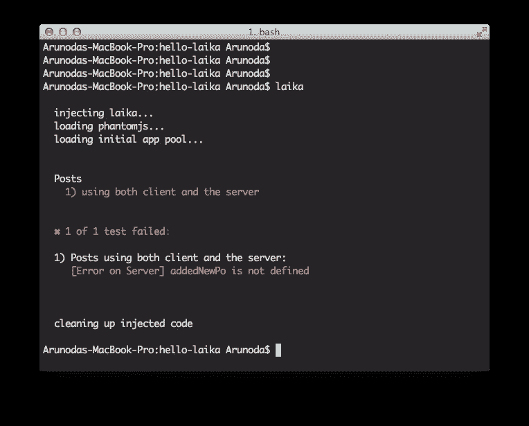
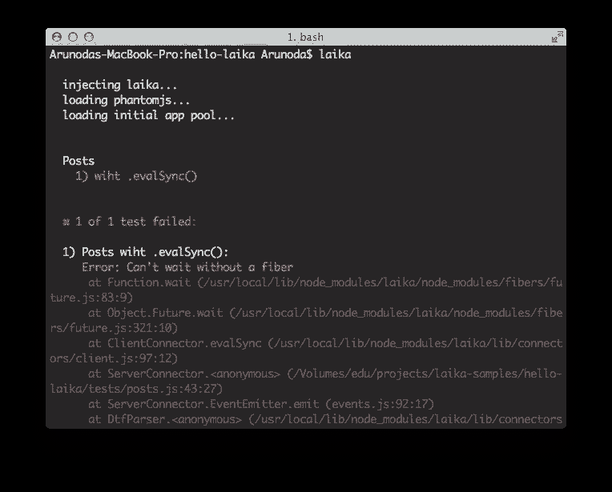

# 使用 Meteor 的测试驱动开发

> 原文：<https://www.sitepoint.com/test-driven-development-with-meteor/>

如果你最近关注过科技领域，那么 [Meteor](http://meteor.com) 对你来说并不陌生。我们每周都听到许多关于流星的好消息。

如果你以前没有听说过它，Meteor 是一个革命性的 JavaScript 框架，它允许你非常快速地创建实时的单页 web 应用程序。这是一个[开源项目](https://github.com/meteor/meteor)，但与其他项目不同，它有[大笔资金](http://venturebeat.com/2012/07/25/meteor-funding/)来保持快速发展。

## 流星不再是玩具了

虽然 Meteor 还很年轻，但许多人都热衷于用它来构建高容量的生产应用程序。这是因为它解决了一个真正的问题，并允许开发人员专注于应用程序逻辑，而不是担心如何管理服务器和客户端之间的通信。

在这里，我们谈论的是生产质量的应用程序，而不再是原型。所以在我们发布一行代码之前，我们需要测试它。不幸的是，Meteor 还没有一个官方的测试框架。但是他们有一个叫做 [tinytest](http://goo.gl/W203h) 的测试框架，用来测试 Meteor 包——但不是整个应用。

## 流星测试框架应该是什么样的？

当您开发一个 Meteor 应用程序时，您将服务器和客户端代码编写在一起，并且它们是紧密相连的。因此，我们应该能够编写涉及客户端和服务器端的测试用例。

Meteor 是关于实时的，以及我们如何在客户端(浏览器)之间共享数据。所以一个测试框架应该能够编写涉及多个客户端的测试用例。

最重要的是，它应该是有趣的。

## 介绍 Laika——meteor 的测试框架

Laika 是一个功能丰富的针对 meteor 的[测试框架，可以满足上述所有需求。Laika 不是第一个，也不是唯一的测试框架，但是它*是*最容易使用并且有据可查的。](http://arunoda.github.io/laika/)

网址:[http://arunoda.github.io/laika/](http://arunoda.github.io/laika/)

使用 Laika，您可以编写针对服务器和客户机的测试。它可以与多个客户端一起工作。Laika 针对您的实际应用程序运行测试，而不是一些模拟或存根，因此它使您的测试更加准确。


## 设置系统

莱卡在幕后为你表演一些魔术。所以它需要一些第三方工具在你的系统上可用。

*   安装`[nodejs](http://nodejs.org)`–Laika 运行在 nodejs 之上
*   安装`[phantomjs](http://phantomjs.org/download.html)`–Laika 使用 phantomjs 创建客户端
*   安装`[mongodb](http://docs.mongodb.org/manual/installation/)`–Laika 每次测试都需要一个外部 mongodb 数据库

此外，

*   在运行测试时，您需要运行 mongodb
*   使用这个命令启动 mongodb，并对 Laika 进行一些优化

`mongod --smallfiles --noprealloc --nojournal`

最后用`sudo npm install -g laika`安装莱卡。

## 入门指南

我们将在两种情况下测试一个陨石收藏。

1.  从客户端插入文档，并从服务器观察它
2.  从一个客户端插入一个文档，以测试另一个客户端是否正确获取

### 让我们创建我们的流星应用程序

我们需要一个流星应用程序来测试。让我们创造它。

*   用`meteor create hello-laika`创建流星 app
*   cd 进入`hello-laika`

然后创建一个名为`collections.js`的文件，内容如下:

`Posts = new Meteor.Collection('posts');`

github 上有这个应用[。](https://github.com/arunoda/hello-laika)

### `tests`文件夹

所有的 Laika 测试文件都应该在你的 Meteor 应用程序的`tests`文件夹下。`tests`是一个特殊的文件夹，其中的文件不会包含在客户端或服务器中。这是流星本身的一个规律。

### 让我们编写第一个测试

在我们的`tests`文件夹下创建一个名为`posts.js`的文件，内容如下:(文件名没有限制，你可以随意命名(`.js`)

```
var assert = require('assert');

    suite('Posts', function() {
      ltest('using both client and the server', function(done, server, client) {
        server.eval(function() {
          Posts.find().observe({
            added: addedNewPost
          });

          function addedNewPost(post) {
            emit('post', post);
          }
        })

        server.once('post', function(post) {
          assert.equal(post.title, 'hello title');
          done();
        });

        client.eval(function() {
          Posts.insert({title: 'hello title'});
        });
      });
    })
```

这是用`nodejs`写的，所有内置节点模块都可以在测试中使用。如果你熟悉用`[mocha](http://visionmedia.github.io/mocha/)`编写测试，这些应该都很熟悉。

这里，我们观察服务器中新文档的`Post`集合。我们使用客户端插入一个文档，这触发了我们的观察。

让我们回顾一下代码。

*   第一行我们加载 nodejs 断言模块来做断言
*   然后我们创建一个名为“Posts”的测试套件
*   在我们的套件中，我们可以用名称和回调来创建我们的测试(使用`ltest`方法)
*   在回调中，我们接受服务器和客户端被用来评估服务器和客户端内部的代码
*   `server.eval()`方法允许我们评估服务器内部的代码
*   你可以用`emit()`发送一些结果回来测试，然后用`server.once`或`server.on`捕捉它
*   `client.eval()`以同样的方式运行，但是评估客户端内部的代码
*   代码的其余部分不言自明

### 运行测试

创建测试后，

*   转到项目文件夹
*   润莱卡

您将看到如下所示的内容。如果你得到一个错误，仔细检查你的测试代码。


### 创建我们的第二个测试

在您的测试套件`Posts`中创建以下测试。

```
ltest('using two client', function(done, server, c1, c2) {
      c1.eval(function() {
        Posts.find().observe({
          added: addedNewPost
        });

        function addedNewPost(post) {
          emit('post', post);
        }
        emit('done');
      })

      c1.once('post', function(post) {
        assert.equal(post.title, 'from c2');
        done();
      })

      c1.once('done', function() {
        c2.eval(insertPost);
      });

      function insertPost() {
        Posts.insert({title: 'from c2'});
      }
    });
```

这里，我们观察一个客户机中的集合，另一个客户机插入一个文档。我们来复习一下。

*   现在我们有两个客户端(c1 和 c2 ),而不是之前测试中的一个
*   如上所述，您可以指定任意数量的客户端，`laika`可以为您创建客户端
*   你看第一个`c1.eval()`，有两个`emit()`调用。
*   我们可以随时从服务器/客户端进行测试
*   它们可以通过`.on()`或`.once()`被捕获

## 真实生活用例

现在你已经看到如何使用莱卡。但是莱卡可以做得更多。它可以非常快速地测试流星特有的功能。其中一些是:

*   流星方法
*   出版物/订阅
*   许可
*   证明
*   批准

这里可以找到一些例子——[http://arunoda.github.io/laika/examples.html](http://arunoda.github.io/laika/examples.html)

## 莱卡的内部运作方式

作为开发人员，我们总是好奇内部是如何工作的。因此，在本节中，您将看到 Laika 的内部工作方式。

### 莱卡做独立测试

Laika 为您编写的每个测试运行一个单独的应用程序，带有一个干净的数据库。每个测试都是相互隔离的，所以你不需要担心清理你的应用程序和数据库的状态。

由于这个原因，你的测试会运行得慢一些。

### 服务器和测试通过 TCP 通信

在您的测试用例中，您可以简单地在服务器内部评估 Meteor 代码，但是在内部 Laika 可以为您做一些艰苦的工作。当你开始测试的时候，Laika 会在你的 Meteor 应用中注入一些服务器端代码。然后它启动一个 TCP 服务器，Laika 连接到它。

一旦调用`.eval()`方法，Laika 会通过 TCP 连接发送给服务器。如果有任何可用的结果(调用服务器中的`.emit()`),它也会通过相同的连接发送回服务器。

最后，Laika 会清除应用程序中注入的代码。

### 客户端和服务器通过幻象进行通信

就像服务器一样，莱卡在引擎盖下为您施展一些魔法。对于您请求的每个客户端，Laika 使用 [PhantomJS](http://phantomjs.org) 创建一个客户端，并在其上评估代码。PhantomJS 是没有 UI 的 webkit 浏览器，所以我们在这里做真实的客户端测试。

### 莱卡用摩卡

Laika 的主要目标是成为针对其独特需求的 meteor 测试框架，而不是创建另一个 JavaScript 测试框架。`[mocha](http://visionmedia.github.io/mocha/)`是一个非常好的广泛使用的 JavaScript/NodeJS 测试框架，我们在内部使用它。所以摩卡的大部分选择在莱卡也有。

[参见 laika 命令行选项](http://arunoda.github.io/laika/options.html)

## 错误处理

错误是人类的通病，所以写一些有错误的测试是很自然的。它可以是测试本身，也可以是在服务器或客户端上评估的代码。Laika 会处理这些错误并向您报告，因此您可以立即修复它。



不幸的是，Laika 不能向您显示哪个行号导致了错误，但是它会向您显示在哪个测试中发生了错误以及错误的上下文。

## 语法糖

您已经看到 Laika 使用 [EventEmitter](https://www.sitepoint.com/nodejs-events-and-eventemitter/) 模式(或类似的东西)在被评估的代码和测试之间进行通信。如果您想从评估的代码中触发多个结果，这真的很有用。

但是如果您想发送一个结果并根据该结果进行测试，EventEmitter 风格可能会令人头疼。有时，你也会在[回调地狱](http://callbackhell.com/)中结束。

Laika 知道这种痛苦，它有允许你写同步代码的`.evalSync()`方法。`.evalSync()`在服务器和客户端都可用。这是可能的，因为每个测试都是在一个[光纤](https://github.com/laverdet/node-fibers)中进行的。

让我们看看它的实际效果

### 使用 EventEmitter 样式

```
ltest('with eventEmitter style', function(done, server, client) {
      server.eval(function() {
        //assumes we do some real async work
        setTimeout(function() {
          emit('some-data', {data: 'data'});
        }, 100);
      });

      server.on('some-data', function(data) {
        client.eval(function(data) {
          //do something with the data
          emit('result', true);
        }, data);
      });

      client.on('result', function(result) {
        assert.ok(result);
        done();
      });
    });

### With .evalSync() synchronously

    ltest('wiht .evalSync()', function(done, server, client) {
      var data = server.evalSync(function() {
        setTimeout(function() {
          emit('return', {data: 'data'});
        }, 100);
      });

      var result = client.evalSync(function(data) {
        //do something with the data
        emit('return', true);
      }, data);

      assert.ok(result);
      done();
    })
```

你可以看到不同之处。您必须使用特殊的`emit('return', {some: 'data'})`将执行发送回测试。也可以使用其他`emit()`事件，但它们必须发生在`emit('return')`之后。

### 但是`.evalSync()`只对主测试回调有效

没错，`evalSync()`只在主测试回调内部起作用。如果您试图从嵌套回调中调用它，它会失败。看下面的例子，它失败了。

```
ltest('failing .evalSync()', function(done, server, client) {
      server.eval(function() {
        emit('some-event');
      });

      server.on('some-event', function() {
        var result = client.evalSync(function() {
          emit('return', true);
        });
        assert.ok(result, true);
        done();
      });
    })
```



## 莱卡——项目

Laika 是在开源 MIT 许可下发布的，你可以将它用于任何目的。如果你能在博客或推文中提到 Laika，我将非常感激。

该项目托管在 github 上-[Laika Meteor](https://github.com/arunoda/laika)测试框架。

Laika 是一个新框架，于 2013 年 5 月中旬发布。它经过了很好的测试，但可能会有一些边缘情况。如果你和莱卡相处不愉快，或者有什么要说的，可以使用我们在 github 上的[问题跟踪器](https://github.com/arunoda/laika/issues?state=open)或者通过[@阿鲁诺达](https://twitter.com/arunoda)联系我。

所以。你还在等什么？用莱卡测试你的流星项目，今天就发货。

## 分享这篇文章