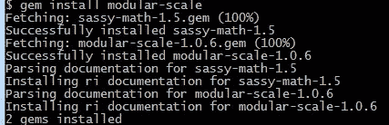
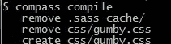
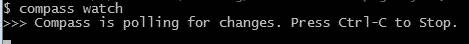
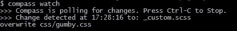
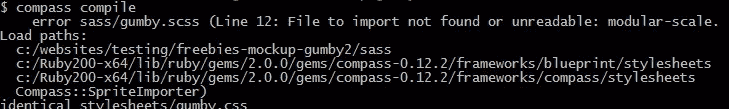
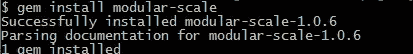

# 编译和监控 Gumby2 中的 SASS

> 原文：<https://www.sitepoint.com/compile-monitor-sass-gumby2/>

这是一篇展示如何使用 Gumby2 打包的 COMPASS 监控和编译 web 应用 CSS 文件的快速文章。当你改变任何一个 SASS 样式表时，自动更新你的主 css 文件。好看。

> Gumby 2 基于 Sass 构建，非常依赖 Compass 的功能… Gumby 附带一个编译好的 gumby.css 文件，您可以包含该文件，然后继续以常规方式编写 css，但是在您可以使用 Sass 和 Compass 并释放 Gumby 2 的真正功能之前，您需要安装一些依赖项。

[下载 Gumby2](http://gumbyframework.com/)

### 1.设置 Gumby2

从 localhost:8080 或此类服务器运行–更新 CSS/gum by . CSS @ import for Google font–添加 http://而不是//(如果您进行部署，请改回来，以便它适合 https://等)。如果你从 file:// raw html 运行，chrome 会阻止任何 XHR 请求

### 2.安装 SASS 和指南针

参见 [Gumby2 SASS 安装指南](http://gumbyframework.com/docs/sass/#!/installation)。

### 3.安装模块化秤

[模块比例](http://thesassway.com/projects/modular-scale)是一个 Gumby2 依赖项——用于排版。

```
git bash install modular-scale
```



### 4.编译和监控

您可以通过键入以下命令来手动构建 css 文件:

```
$ compass compile
```



如果您希望 compass 在您进行更改时自动构建您的 css 文件，请键入以下内容:

```
$ compass watch
```



对自定义样式进行了更改…瞧！

就像我们通常做的那样，它会立即动态编译新的 CSS 文件。

注意:你不需要每次都输入 compile，你可以直接启动 watch，它会自动获取自上次保存以来的任何更改。



**搞定！:)**

## 安装过程中遇到一些错误？

出现错误！_gumby2 模块化刻度误差)

再次运行安装…



又出错了…哎呀，我找不到 config.rb 了！https://raw . github . com/gum by framework/gum by/master/config . Rb



成功！:)

## 分享这篇文章