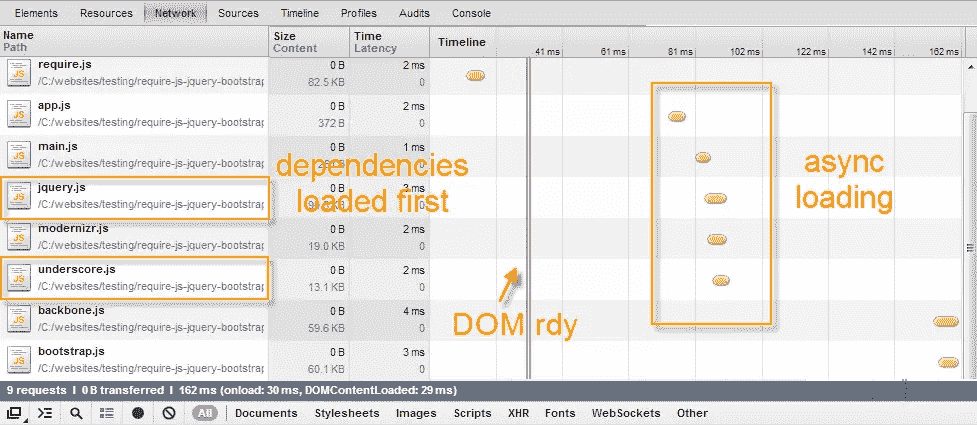

# Require.js 示例–设置时间 2 分钟

> 原文：<https://www.sitepoint.com/require-js-setup-time-2-minutes/>

设置 Require.js 仅需 2 分钟。或者下载下面的代码，让它开始工作。

I’ve added some better screenshots below of require.js in action.

[在 GitHub 上查看项目](https://github.com/sdeering/require-js-jquery-bootstrap)

## Require.js 是什么？

**[RequireJS](http://requirejs.org/) 是一个 JavaScript 文件和模块加载器。**它针对浏览器内使用进行了优化，但也可以用于其他 JavaScript 环境，如 Rhino 和 Node。使用像 RequireJS 这样的模块化脚本加载器将会提高代码的速度和质量。

*   **速度**–异步 JavaScript 加载。
*   **管理 JavaScript 依赖关系**比如 jQuery 插件。
*   **文件结构**你的 web app 文件。

*   当你做得好的时候，你可以编写模块来做特定的 web 应用程序。
*   不需要在 HTML 中包含 100 个脚本标签。
*   可以很容易地与构建脚本集成。

## 有用吗？

是的。下面的截图取自我的开发工具，chrome 开发工具处于打开状态(禁用缓存),因此速度自然很快，但令人惊讶的是，即使在这里，你也可以看到性能的提高。




## web 应用程序结构

这是一个可以用于 web 应用程序的非常基本的结构。

*   根/
    *   index.html
    *   射流研究…
        *   小贩
            *   [外部 JavaScript 文件和 jQuery 插件]
        *   应用
            *   主页. js
            *   [您的模块和 web 应用程序 JavaScript 文件]
        *   app.js
    *   钢性铸铁
    *   img

## 之前的 HTML:

加载脚本的正常方式是… modernizr 放在头部，其余的放在正文中。

```
< !DOCTYPE html>
<head>
    <title>My Web App</title>
    <link rel="stylesheet" href="app/css/main.css"/>
    <script src="app/js/vendor/modernizr-2.6.2-respond-1.1.0.min.js"></script>
</head>
<body>

    <div id="main" class="container"></div>

    <script src="app/js/vendor/jquery-1.9.1.min.js"></script>
    <script src="app/js/vendor/underscore.min.js"></script>
    <script src="app/js/vendor/backbone.min.js"></script>
    <script src="app/js/vendor/bootstrap.min.js"></script>
    <script src="app/js/main.js"></script>
</body>
```

## HTML 在:

Require.js 放在头里。漂亮整洁。

```
< !DOCTYPE html>
<head>
    <title>My Web App</title>
    <link rel="stylesheet" href="app/css/main.css"/>
    <script data-main="js/app" src="js/vendor/require.js"></script>
</head>
<body>

    <div id="main" class="container"></div>

</body>
```

## app.js

这个文件包含 require.js 的配置。如果您更改目录结构，这需要匹配。我向您展示的是 shim 版本，您也可以从 CDN 加载 [jQuery。](http://requirejs.org/docs/jquery.html)

```
// Place third party dependencies in the lib folder
//
// Configure loading modules from the lib directory,
requirejs.config({
    "baseUrl": "js/vendor",
    "paths": {
      "app": "../app"
    },
    "shim": {
        "backbone": ["jquery", "underscore"],
        "bootstrap": ["jquery"]
    }
});

// Load the main app module to start the app
requirejs(["app/main"]);
```

## 主页. js

这个文件包含了 web 应用程序的依赖项，一旦加载，你就可以使用任何你喜欢的框架来启动你的应用程序，比如 Backbone 或者 Angular。

```
//Load Web App JavaScript Dependencies/Plugins
define([
    "jquery",
    "modernizr",
    "underscore",
    "backbone",
    "bootstrap"
], function($)
{
    $(function()
    {

        //do stuff
        console.log('required plugins loaded...');

    });
});
```

## 还是不能让它工作吗？

[下载代码](https://github.com/sdeering/require-js-jquery-bootstrap)

## 分享这篇文章