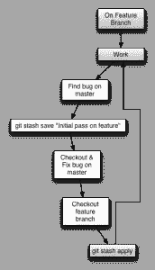
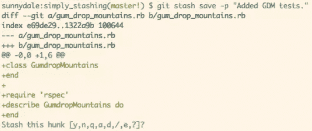

# Git:简单的存储

> 原文：<https://www.sitepoint.com/git-simply-stashing/>

大多数 ruby 爱好者发现他们每天都在使用 Git。我们用它来组织我们的项目，保护我们自己免于错误，并且在确信我们的代码是安全的情况下进行更改。它简单的命令行界面掩盖了它的灵活性和深度。因为这种力量，它绝对值得深入研究和实践。

今天，我想讨论一些我用来简化分支交换的技巧，特别是`git-stash`命令。

是在脏的工作目录中临时隐藏更改的好方法。这允许我们在一个特性分支上工作，并且快速地切换到其他分支，而不需要首先准备/提交我们的变更。


<small>【典型藏匿工作流程】</small>

如果您像大多数开发人员一样，那么您对`git-stash`的体验不会超过以下两个命令:

```
git stash
```

和

```
git stash pop
```

通常，这已经足够满足我们的需求了，但是`git-stash`还能提供更多。让我们来探索它无数的能力。

## 带描述保存

最简单的隐藏方法是`git stash`并且(大部分)类似于`git stash save`。后者需要几个参数，其中最重要的是描述。如果你将 stash 作为你正常工作流程的一部分，你**必须**使用这些描述来更好地控制每个 stash。让我们看看它是如何工作的:

```
touch gum_drop_mountains.rb   # New feature
git add .                     # git-stash only works on tracked files
                              # unless you pass the --include-untracked flag
                              # to stash save

git stash save "Initial pass on Gum Drop Mountains."
git stash list
stash@{0}: On master: Initial pass on Gum Drop Mountains.
```

现在，当我们查看当前存储列表时，我们会看到有意义的消息，而不是默认描述`WIP on <branch> <last commit message>`。

## 藏在补丁里

有时你想要隐藏一个特定的变更子集，为此我们可以使用`--patch` ( `-p`)标志。这允许我们交互地指定哪些变更将包含在这个存储中。

```
# edit gum_drop_mountain.rb
git stash save -p "Added GDM tests"
```

这将使您进入如下提示:



一旦你开始了交互过程，你可以按下`?`来查看可用命令的列表。完成后，你就可以用`git stash list`看到你的新收藏了。未提交的更改仍然会在您的当前目录中。

## 列出库存

查看您当前隐藏的更改的最常见方式是键入`git stash list`,就像我们前面提到的那样。这将打印:

```
# Unless you are cool and passed a description

stash@{0}: WIP on submit: 6ebd0e2... Initial Commit.
stash@{1}: On master: 9cc0589... Add git-stash
```

这里，存储被指定为`stash@{<revision>}`。许多`git-stash`命令允许显式设置这个 stash 标识符，使它成为一条重要的信息。`git stash list`接受`git log`可访问的任何选项，这允许一些定制。

```
git stash list --pretty=format:'%Cblue%h %Cred* %C(yellow)%s'
```

它将输出如下内容:


可以用上面的格式给`git-log`起别名，这很常见。使用 git 存储列表这样做是这种优化风格的主要候选，因为能够快速破译这些描述可以节省您的时间。

#### 显示个人仓库

使用`git stash show`命令可以显示库存。它接受 stash 标识符的参数，默认为`stash@{0}`(最近的)。默认情况下，它将显示 diffstat。

## 应用存储

让我们假设我们已经工作了几个小时。在这段时间里，我们已经几次被抽调去处理项目中的其他分支。当我们离开的时候，我们已经把脏的工作目录藏了起来，并给了它们所有好的消息，这样我们以后就可以把它们拼凑起来。既然 bug 已经修复，我们可以回到我们的特性了。我们的藏匿清单看起来像这样:

```
git stash list
stash@{0}: On gum_drop_mountain: Touching up gum drop mountain peaks.
stash@{1}: On candy_cane_lane: Adding some tinsel to candy cane lane
stash@{2}: On master: First pass on gum drop mountains.
```

我们想回到`candy_cane_lane`特性分支，并在那里应用我们隐藏的更改。为此，我们将使用`git stash apply`命令。

```
git checkout candy_cane_lane
git stash apply stash@{1}    # Specified stash or most recent (stash@{0})
```

一旦我们完成了这些，我们的变更就回到了它们正确的位置，我们就可以继续工作了。

Git 在这里很聪明，因为您可以将这些更改应用到除了它们被隐藏的分支之外的分支。此外，您应用更改的分支不必是一个干净的目录！如果 stash 不再适用[1]，Git 将抛出一个需要手动解决的合并冲突。

## 移除藏物

只是为了好玩，让我们在继续之前检查一下藏毒清单。

```
git stash list
stash@{0}: On gum_drop_mountain: Touching up gum drop mountain peaks.
stash@{1}: On candy_cane_lane: Adding some tinsel to candy cane lane
stash@{2}: On master: First pass on gum drop mountains.
```

什么？即使在应用之后，我们的存储仍然存在于我们的列表中。这是因为`apply`不会自动清理自己，我们必须使用下面的命令来删除隐藏

```
git stash drop stash@{1}
```

它会把我们用过的毒品扔掉。如果我们没有给它一个隐藏标识符，它会认为我们打算放弃`stash@{0}`(最近的)。如果我们想摆脱所有隐藏的变更，我们可以运行`git stash clear`。**小心**清除贮藏物(不管是掉落还是清除)，因为它们**不可能**恢复。

## 哦，太方便了

在对一个分支应用了一些变更之后，从列表中移除这些变更通常是一个好主意(如上)。幸运的是，Git 为我们提供了一个方便的方法来包装这个工作流。假设我们想要应用`stash@{1}`并将其从存储列表中移除。我们可以运行以下命令:

```
git stash pop stash@{1}
```

如果我们不提供 stash 标识符，它将假设是最近的(像大多数`git-stash`命令一样)。`git-stash` [手册页](https://www.kernel.org/pub/software/scm/git/docs/git-stash.html)提供了思考这个命令的好方法。这与`git stash save`正好相反。

## 分藏

有时，您会发现自己在错误的分支(例如主目录)上开始了更改，并希望将当前的脏目录放入它自己的分支。你很幸运！通常你必须做这样的事情:

```
git stash
git checkout -b new_feature
git stash pop
```

但是`git-stash`有一个方便的方法可以做到这一点。简单来说:

```
git stash
git stash branch new_feature
```

这将创建并检出一个新的分支`new_feature`，并对其应用`stash@{0}`。

## 藏还是不藏

决定什么时候该藏起来，什么时候该承诺，什么时候该放弃，这是个人喜好的问题。只要你写下关于隐藏的描述性信息，并确保保持你的隐藏列表干净，那么隐藏是一个快速找到一个干净目录的好方法。另一方面，如果你不小心，你会发现自己痛苦地浪费时间去分辨哪个是哪个。

除了警告之外，stashing 是 Git 提供的一项强大功能，稍加练习，它可以帮助您更快、更安全地浏览代码。黑客快乐！

#### 资源

1.  [Pro Git (stashing)](http://git-scm.com/book/en/Git-Tools-Stashing)
2.  [去准备](http://gitready.com/)
3.  [git-stash man page](https://www.kernel.org/pub/software/scm/git/docs/git-stash.html)

## 分享这篇文章