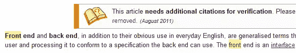
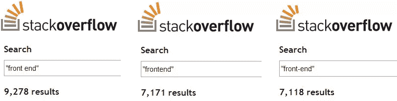
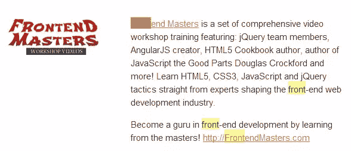
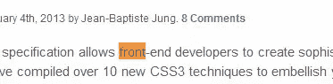

# 是前端，前端，还是前端？

> 原文：<https://www.sitepoint.com/spelling-frontend-front-end-front-etc/>

前端、前端和前端。

你可能在过去见过或用过以上所有的，但是哪个是正确的呢？

## 让我们来看看！

## [维基百科. org](http://en.wikipedia.org/wiki/Front_and_back_ends)

## [paulirish.com](http://paulirish.com)

站点:http://paulirish.com“前端”约 154 个结果(0.33 秒)
站点:http://paulirish.com“前端”约 41 个结果(0.29 秒)

## [stackoverflow.com](http://stackoverflow.com)

## [frontendmasters.com](http://frontendmasters.com)

## [linkedin](http://www.linkedin.com/skills/skill/Frontend)

站点:http://linkedin.com“前端”约 701 万条结果(0.32 秒)
站点:http://linkedin.com“前端”约 24.2 万条结果(0.29 秒)

## [css-tricks.com](http://css-tricks.com)

## [加的斯人. com](http://addyosmani.com/)

## [catswhocode.com](http://catswhocode.com)

站点:catswhocode.com“前端”约 115 个结果(0.30 秒)
站点:catswhocode.com“前端”8 个结果(0.31 秒)

## 英语正字法

[是“前端”、“前端”，还是“前端”？](http://english.stackexchange.com/questions/34447/is-it-front-end-frontend-or-front-end)表示“前端”是正确的方式。

## 谷歌全球搜索结果

我猜谷歌搜索不太关心大小写，连字符被算作空格……
“前端”大约 22，600，000 个结果(0.34 秒)
“前端”大约 44，900，000 个结果(0.36 秒)
“前端”大约 44，900，000 个结果(0.30 秒)

## 结论

我最喜欢的拼写是 Frontend，但我猜 Frontend 在网上是最流行的。这真的重要吗？你用哪一个？**发表评论。**

## 分享这篇文章