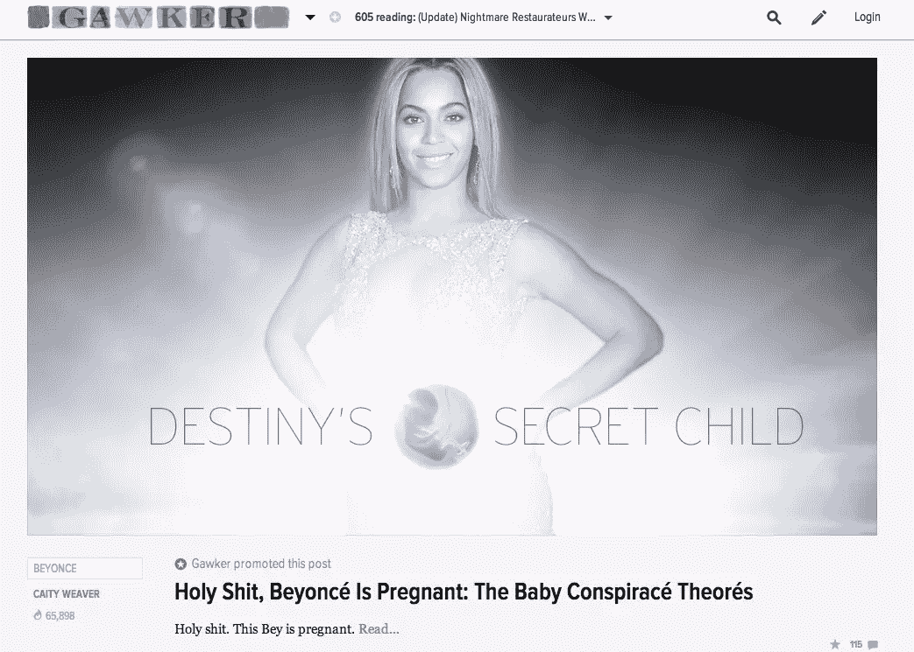

# 语法还重要吗？

> 原文：<https://www.sitepoint.com/does-grammar-even-matter-any-more/>

简短的回答是:我可以黑兹伯格。

最长的答案是:是的，比以往任何时候都多。我们来看看为什么。

## 旧学校规则

许多反对网络对语法的古怪态度的人在学校通过传统方式学习语言，并且在这方面表现出色。

他们理解规则，并且喜欢应用它们。他们认为得体的英语反映了说英语的人的形象，并对听或读英语的人表示尊重。通常，但不总是，他们特别迷恋印刷媒体。

这些作家认为，你不能用“和”或“但是”来开始一个句子；连续逗号要么是圣杯，要么是魔鬼的作品；缩写是用于面对面的交谈，而不是商务写作。

他们是对的吗？

## 新媒体限制

他们当然是对的——这些是英语用法的(一些)规则。

然而，新媒体对语言提出了新的限制——这种限制需要一定的灵活性。

像 [icanhazcheezburger](http://icanhas.cheezburger.com/) 这样的网站的成功表明，灵活性可以在用户参与度和受众增长方面带来回报。

### 约束#1:技术

阅读和理解数字文本比印刷文本更难。好了，我说了。

这是我认为语言在网上变得不那么正式的一个关键原因。由于在这种媒介中交流更加困难，内容创建者试图使交流尽可能简单。

### 限制#2:进入门槛低

网络的准入门槛比传统媒体低得多。

对于我们这些有东西要卖的人来说，这是一个很大的优势，但这也是为什么网络没有传统媒体那么正式的另一个原因。

### 约束#3:用户交互

网络是互动的，它给了我们比传统媒体更多的信息，让我们知道我们的交流有多有效。

举例来说，我们都知道网络用户会浏览，如果我们为他们创建内容，我们需要考虑这一点。

但是网络也比传统媒体带来了更广泛的交流。

这些因素影响着一切，从我们是否使用销售视频，到我们是否在邀请人们观看的文本中使用分号。

## 达成妥协

你只需要看几个 lolcats 就能意识到，就语言而言，网络是一个几乎无所不在的地方。

这是否意味着“正统”英语已经死亡？

这取决于一件事:你的品牌。你的品牌是有价值的——希望有些价值与其目标受众相关。它有相应的语调，而这种语调是通过你使用语言来传达的。

如果你选择遵守最严格的语法规则，你肯定会疏远一些用户。如果你选择用 lolcats 语言构建你的网站，你可以期待同样的结果(当然，除非你的企业*是*一个 lolcats 网站)。

正确的妥协在于你的品牌和顾客之间的领域。用他们语言中与你的品牌和价值观相一致的方面来和你的观众交流。

我们每个人都会改变我们的谈话方式，这取决于我们在和谁说话——这是，而不是媒介，应该决定你有多严格地遵守英语用法规则，以及在你的网页副本和内容中你坚持哪些规则。

在这种情况下，知道语法、标点符号和拼写规则的人——因此知道何时以及如何打破这些规则——能够将他们的在线信息发挥到最大效果。

但是坚持住。你不是语法学家:你是开发人员、首席执行官或创始人。这给你留下了什么？

我们将在下周回答这个问题，我们将关注用户对你的拷贝的测试，看它是否达到目标。

## 分享这篇文章