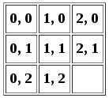
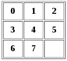
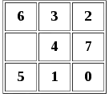
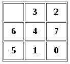
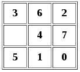
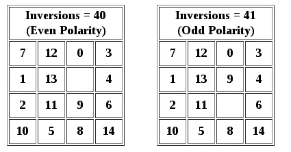

# 随机化滑动拼图

> 原文：<https://www.sitepoint.com/randomizing-sliding-puzzle-tiles/>

在之前的教程中，我演示了如何用 HTML5 canvas 创建一个滑动拼图游戏。

为了节省时间，我对起始图块位置进行了硬编码。如果方块是随机的，游戏会玩得更好，但这样做会导致复杂性，需要一个单独的教程来解释。

这就是那个教程。

有许多方法可以随机化瓷砖。我将查看几个选项，并讨论它们的优点和缺点，以及出现的问题和如何克服它们。

一个简单的方法是将拼图初始化为已解决的状态，然后重复调用一个函数，将任意一块拼图滑入空白区域。

```
function initTiles() {
    var slideLoc = new Object;
    var direction = 0;
    for (var i = 0; i < 30; ++i) {
      direction = Math.floor(Math.random()*4);
      slideLoc.x = emptyLoc.x;
      slideLoc.y = emptyLoc.y;
      if (direction == 0 && slideLoc.x > 0) {
        slideLoc.x = slideLoc.x - 1;
      } else if (direction == 1 && slideLoc.y > 0) {
        slideLoc.y = slideLoc.y - 1;
      } else if (direction == 2 && slideLoc.x < (tileCount - 1)) {
        slideLoc.x = slideLoc.x + 1;
      } else if (direction == 3 && slideLoc.y < (tileCount - 1)) {
        slideLoc.y = slideLoc.y + 1;
      }
      slideTile(emptyLoc, slideLoc);
    }
  }
```

在这种情况下，我们滑动了 30 块瓷砖，是 4×4 拼图中瓷砖总数的两倍，但大多数瓷砖仍保留在原来的位置。为了得到类似随机性的东西，我们需要更多的迭代。

这不是随机拼图的有效方法。理想情况下，我们希望每个棋子只移动一次。我们可以将拼图初始化为一个已解决的状态，然后遍历拼图，用随机选择的一个拼图交换每个拼图。

```
function initTiles() {
    for (var i = 0; i < tileCount; ++i) {
      for (var j = 0; j < tileCount; ++j) {
        var k = Math.floor(Math.random() * tileCount);
        var l = Math.floor(Math.random() * tileCount);
        swapTiles(i, j, k, l);
      }
    }
  }

  function swapTiles(i, j, k, l) {
    var temp = new Object();
    temp = boardParts[i][j];
    boardParts[i][j] = boardParts[k][l];
    boardParts[k][l] = temp;
  }
```

这种方法不仅给了我们一个看起来更随机的配置，而且用了更少的代码行。然而，这种算法有两个严重的缺陷。第一个问题很微妙。尽管用随机位置交换每一个小块比简单地将小块滑入空槽要有效得多，但这仍然不是真正的随机算法。有些起始位置会比其他位置出现得更频繁。

在一个 2×2 的谜题中，一些起始配置出现的频率比其他的高 87%。添加第三行，一些配置出现的频率是其他配置的五倍，并且随着添加更多的瓦片，情况会继续恶化。幸运的是，有一种方法可以在不增加额外复杂性的情况下实现真正的随机性。这就是著名的费希尔-耶茨算法。

```
function initTiles() {
    var i = tileCount * tileCount - 1;
    while (i > 0) {
      var j = Math.floor(Math.random() * i);
      var xi = i % tileCount;
      var yi = Math.floor(i / tileCount);
      var xj = j % tileCount;
      var yj = Math.floor(j / tileCount);
      swapTiles(xi, yi, xj, yj);
      --i;
    }
  }
```

Fisher-Yates 的数学超出了本教程的范围，但它确实给了每个方块出现的平等机会。使用这种算法，谜题就像`Math.random()`函数所能得到的一样随机。

但是随机交换瓷砖——使用 Fisher-Yates 算法或任何其他算法——会导致另一个问题。所有可能的瓦片配置中有一半给了我们一个永远无法解决的难题。为了防止将一个无法解决的谜题释放给无辜的用户，我们还需要另一种算法。

在介绍这个算法之前，我需要定义两个术语:反转和极性。倒置是指一对瓷砖的顺序与它们应该在的位置相反。一个难题的极性是所有瓷砖中反转的总数是偶数还是奇数。一个有 10 个反转的谜题，极性是偶数；一个有 7 个反转的谜题有奇数极性。

根据定义，解决的难题具有零反转(甚至极性)。如果我们从一个已解决的拼图中交换两个相邻的瓷砖，我们将有一个反转。

在这个游戏中，棋盘被配置成一个二维数组，每个棋子用其 x/y 坐标表示。



但是为了处理反转和极性，我们可以把它看作一个一维数组。我们可以用公式 n = y * w + x 将每个瓷砖的坐标转换成一个数字 n，其中 w 是宽度。作为一个一维数组，瓷砖编号如下。



现在让我们考虑一个随机难题。它可能看起来像这样。



有 19 个倒置。瓦片 6 被反转，所有六个瓦片编号为 0 到 5；3 与 0、1、2 反相；2 用 0 和 1 反相；4 用 0 和 1 反相；7 与 0、1、5 反相；5 用 0 和 1 反相；1 与 0 相反。

为了得到这个总数，我们需要一个函数来计算每个瓷砖的反演。

```
function countInversions(i, j) {
    var inversions = 0;
    var tileNum = j * tileCount + i;
    var lastTile = tileCount * tileCount;
    var tileValue = boardParts[i][j].y * tileCount + boardParts[i][j].x;
    for (var q = tileNum + 1; q < lastTile; ++q) {
      var k = q % tileCount;
      var l = Math.floor(q / tileCount);

      var compValue = boardParts[k][l].y * tileCount + boardParts[k][l].x;
      if (tileValue > compValue && tileValue != (lastTile - 1)) {
        ++inversions;
      }
    }
    return inversions;
  }
```

现在我们可以迭代瓷砖，并保持反演的运行总和。

```
function sumInversions() {
    var inversions = 0;
    for (var j = 0; j < tileCount; ++j) {
      for (var i = 0; i < tileCount; ++i) {
        inversions += countInversions(i, j);
      }
    }
    return inversions;
  }
```

向侧面滑动瓷砖不会改变倒置的数量；空的方块没有数字，所以把它和相邻的方块交换，总会得到相同数量的反转。然而，我们可能会在上下滑动瓷砖时改变反转的数量。例如，如果我们将 6 平铺向下滑动，我们将反转的数量从 19 减少到 17。



规则是向上或向下滑动瓷砖将改变其与 w–1 瓷砖的关系，其中 w 是拼图的宽度。因此，对于 3×3 的拼图，我们要改变该拼图与另外两块拼图的关系。这可能导致两个倒位的减少，两个倒位的增加，或者没有变化。例如，在上面的谜题中，向上滑动瓷砖 5 会给我们留下 19 个反转，因为它会得到 4 个反转，而失去 7 个反转。

一个以偶数个反转开始的谜题，总会有偶数个反转；一个有奇数个反演的谜题，总会有奇数个反演。这不仅适用于 3×3 的拼图，也适用于任何宽度为奇数的拼图。如果我们想要达到零反转，我们必须从偶数开始。

因为我们已经计算了反演的次数，一个简单的函数将告诉我们这个难题是否可解。

```
function isSolvable() {
    return (sumInversions() % 2 == 0)
  }
```

上面的例子是不可解的，因为 19 不是偶数。但是假设前两块瓷砖反过来呢？



现在我们从 18 个倒置开始。3 和 6 不再颠倒，但其他一切保持不变。我们有一个可解的谜题。

这给了我们一个优雅的解决方案，它保留了谜题的真正随机性——每个不可解的谜题都与一个唯一可解的谜题配对，唯一不同的是前两个拼图。

```
if (!isSolvable()) {
    swapTiles(0, 0, 1, 0);
    initEmpty();
  }
```

不幸的是，如果交换的方块中有一个是空方块，这就行不通了。我们需要特殊的代码来处理这种情况。

```
if (!isSolvable()) {
    if (emptyLoc.y == 0 && emptyLoc.x <= 1) {
      swapTiles(tileCount - 2, tileCount - 1, tileCount - 1, tileCount - 1);
    } else {
      swapTiles(0, 0, 1, 0);
    }
    initEmpty();
  }
```

如果空方块在前两个位置中的一个，我们就交换最后两个方块。这稍微扭曲了随机性，但我们仍然比其他算法更接近了。

只剩下一个问题了。如果拼图的宽度是一个偶数，上下滑动一个小方块就会反转极性。正如我们在上面看到的，这是因为瓷砖改变了它与 w–1 瓷砖的关系。



为了使谜题可解，当空方块在底行时，它必须具有偶数极性(假设当谜题解出来时，空方块在底行)。当空方块在下一行时，如果极性是奇数，这个谜题是可解的。因此，对于一个偶数宽度的难题，我们必须对反演加上空行和底行之间的距离求和。

```
function isSolvable(width, height, emptyRow) {
    if (width % 2 == 1) {
      return (sumInversions() % 2 == 0)
    } else {
      return ((sumInversions() + height - emptyRow) % 2 == 0)
    }
  }
```

现在我们必须编辑调用这个函数的代码行。

```
if (!isSolvable(tileCount, tileCount, emptyLoc.y + 1))
```

这里有几件事需要注意。

首先，因为`emptyLoc`数组是从零开始的，所以我们需要在和高度比较之前加一。

第二，对于正方形拼图，我们在技术上不需要高度和宽度两个参数；它们是相同的值，我们将变量`tileCount`传递给两者。但是在函数中将它们分开可以澄清每个方程中使用的维度。如果我们要做一个长方形的拼图，我们就知道哪里要用宽度，哪里要用高度。

随机化一个滑动谜题比一开始就创建谜题更费功夫，但为了它提供的更好的游戏体验，这种努力是值得的。你可以在这里看到一个随机难题[的例子。](http://html5.brucealderman.info/sliderandom.html)

## 分享这篇文章