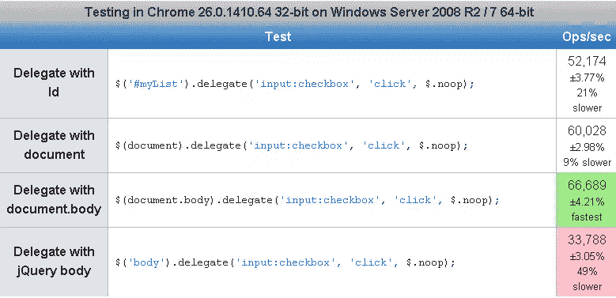
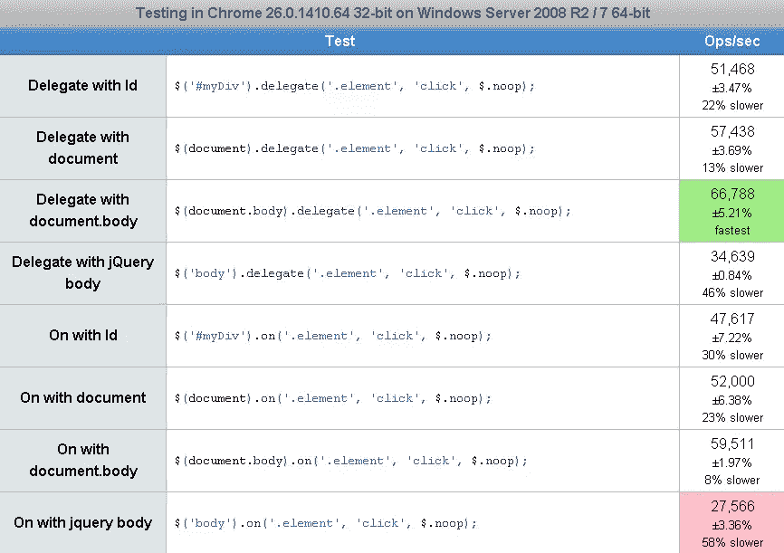

# jQuery $('body ')。on() vs $('document ')。在()

> 原文：<https://www.sitepoint.com/jquery-body-on-document-on/>

使用新的 jQuery 函数。on()替换。live()我见过几种不同的使用方法。在这里，我看一下在事件委托中使用 body 或 document 作为绑定元素的主要区别。如果是新的事件委托，它提供了将事件附加到尚未创建的元素的方法，并且在将事件附加到同一类型的多个元素时具有较低的开销。更多信息，如果你想知道为什么。live()已被弃用，请看一下 [jQuery。直播()对上()回顾](http://www.jquery4u.com/jquery-functions/on-vs-live-review/)。

> 大多数浏览器事件从文档中最深、最里面的元素(事件目标)开始冒泡或传播，一直到主体和文档元素。在 Internet Explorer 8 和更低版本中，一些事件(如 change 和 submit)本身并不冒泡，但 jQuery 对这些事件进行了修补，以冒泡并创建一致的跨浏览器行为。

来源:http://api.jquery.com/on/

## 使用主体作为委托

为了获得最佳性能，请在尽可能靠近目标元素的文档位置附加委托事件。避免对大型文档的委托事件过度使用文档或文档正文。

HTML 处理拖放事件:

```
$('body').on('dragover', filesDragged).on('drop', filesDropped);
```

## 使用文档作为委托

在加载任何其他 HTML 之前，document 元素在文档的头部是可用的，因此不用等待文档准备就绪就可以在那里附加事件是安全的。
默认情况下，大多数事件从原始事件目标上升到文档元素。

## 都是速度的问题！？

[](http://jsperf.com/jquery-body-delegate-vs-document-delegate)

从这个 jsperf 可以看出，使用 document 比使用 body 作为事件委托要快。

[](http://jsperf.com/jquery-delegate-on-body-or-document/3)

同样，文档的性能更好，但差别不大。在()和上。delegate()–后者调用前者。

jQuery 源代码。

```
delegate: function( selector, types, data, fn ) {
                return this.on( types, selector, data, fn );
        },
```

### 结论

去问保罗·爱尔兰人。但是我想这没有太大的区别，我倾向于使用 body，因为这是官方 jQuery API 文档中的内容。

正确用法:

例如，代替:

```
$("body").on("click", "#commentForm .addNew", addComment)
```

使用:

```
$("#commentForm").on("click", ".addNew", addComment).
```

### 什么时候应该使用事件委托？

1.当您为需要相同功能的更多元素绑定一个公共处理程序时。(例如:表格行悬停)

*在示例中，如果您必须使用直接绑定来绑定所有行，您将最终为该表中的 n 行创建 n 个处理程序。通过使用委托方法，您最终可以在一个简单的处理程序中处理所有这些。

2.当您在 DOM 中更频繁地添加动态内容时(例如:在表中添加/删除行)

为什么不应该使用事件委托？

1.与将事件直接绑定到元素相比，事件委托要慢一些。

*它会比较它碰到的每个气泡上的目标选择器，这种比较既复杂又昂贵。

2.对事件冒泡没有控制，直到它碰到它所绑定到的元素。

PS:即使对于动态内容，如果在内容插入 DOM 后绑定处理程序，也不必使用事件委托方法。(如果添加的动态内容不经常被删除/重新添加)

## 延伸阅读:

事件委托是一种在元素实际存在于 DOM 之前编写处理程序的技术。这种方法有它自己的缺点，只有当你有这样的需求时才应该使用。

来源:[http://stack overflow . com/questions/12824549/should-all-jquery-events-be-bound-to-document](http://stackoverflow.com/questions/12824549/should-all-jquery-events-be-bound-to-document)

## 分享这篇文章