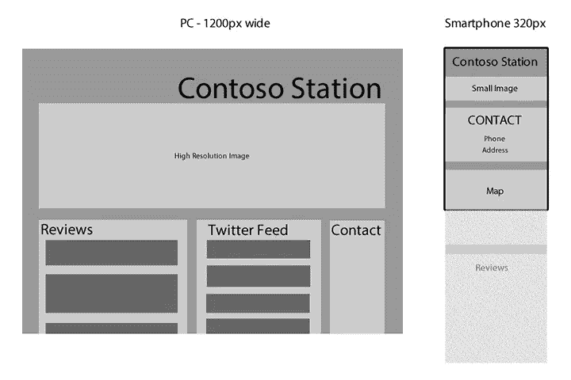
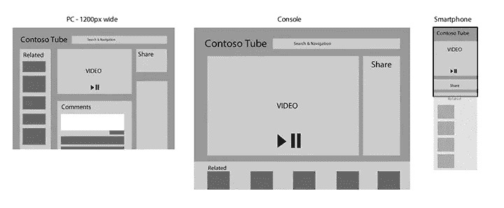
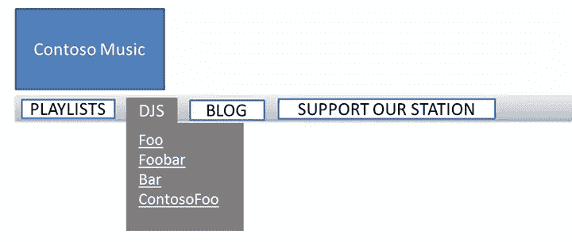
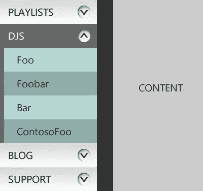
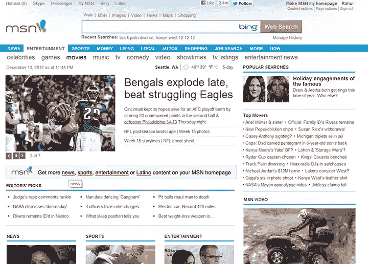
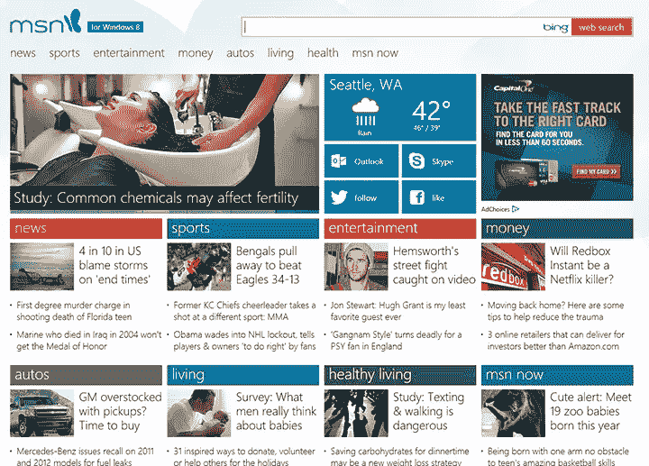

# 响应式网站的设计体验

> 原文：<https://www.sitepoint.com/designing-experiences-for-responsive-web-sites/>

## 在开始之前

响应式网站设计旨在确保网站的布局和内容能够流畅地适应可用的屏幕空间。这是一个很好的方法，可以让您将投资集中在改进网站内容和用户功能上，同时确保用户无论使用什么设备和屏幕大小访问您的网站都有良好的体验。如果你没有阅读本系列的第一篇文章“为什么 Web 已经为响应式 Web 设计做好了准备”，请务必先阅读它。

然而，值得退一步来思考你网站的体验，了解用户访问你网站的设备*是否改变了用户对网站功能* *的期望。*当用户在旅途中时，她会用手机查看你的网站的快速更新吗？他是坐在离大屏幕电视 10 英尺远的地方，希望沉浸在相对被动的丰富内容、视频和游戏的消费体验中吗？其他用户是否坐在他们的电脑前，希望从你的网站内容中获得最大收益？最重要的是，这些期望如何影响你在相应屏幕尺寸下提供的网站布局和功能？

## 这是什么样的网站？

为你的站点规划跨不同外形的内容层次无疑是拥有一个响应良好的站点体验的第一步。考虑下面的例子，这些例子评估和比较了当客户在步行或乘坐公共交通工具时，当他们坐在电脑桌前时，当他们躺在客厅的沙发上时，当他们通过 4 英寸的手机访问您的网站时，他们希望获得的最佳体验。

### 新闻网站(内容消费)

人们去 ContosoNews.com 主要是为了做一件事——了解当天的时事。当你在电脑屏幕上看到这个网站时，你会发现它的布局就像报纸一样。更重要的是，单一主页有望吸引和留住对时事、商业、体育、娱乐和其他话题感兴趣的不同类型的读者，并向他们展示 ContosoNews 有他们感兴趣的内容。主页有丰富的布局，有幻灯片、推荐文章的循环、如果你向下滚动，在文件夹下有各种类别的新闻、推荐的社论甚至天气。**图 1** 显示了不同分辨率下的现场示意图。

**图一。比较 ContosoNews.com 的布局**

如果您在手机浏览器上访问该网站，您会看到内容的一个子集，以及指向其余内容的菜单和链接导航。PC 上可用的内容已被优先排序，顶部标题已被置于文件夹上方。推荐文章的幻灯片被一系列带有链接的简介所取代。“其他类别”部分的热门文章不见了，取而代之的是一个离开主页的类别选择器。

通过这种方式，通过手机访问网站的用户可以粗略地浏览一下，了解可供消费的内容，并在方便的时候进行更深入的挖掘。

### 本地景点(超本地网站)

Contoso Station 是西雅图一家时髦的新餐馆。当人们在电脑或电视屏幕上访问该餐厅的网站时，餐厅会自豪地展示其最新的 Yelp 评论、新闻文章和来自添加标签#i&lt3contoso 的用户的推文。

然而，当你在智能手机上访问该网站时，该公司会做出合理的假设，认为你在移动中访问该网站，希望找到它的位置、运营时间和电话号码。这款手机甚至会询问你的位置，并向你显示一张地图，上面有去餐馆的最快路线。一些剩余的内容可以以更少的细节呈现——例如，Yelp 评论被浓缩为一行片段——而其余的内容(例如，Twitter feed)可以对通过手机访问该网站的用户完全隐藏。**图 2** 显示了这个场景的一个例子。

**图二。对比 Contoso 站的布局**

如图 2**所示，**本地企业应该优先考虑并向手机用户展示完全不同的内容，让他们的移动体验对位置更加敏感。

### 媒体网站(丰富的视听内容)

ContosoTube 是一种流行的互联网服务，人们可以在这里分享各种视频。用户可以看到最新的最高收视率和最常观看的内容。当他们登录并浏览网站时，他们可以创建和编辑视频播放列表，获得个性化推荐，订阅其他用户的播放列表，甚至互相发送消息。

ContosoTube 在手机上的体验是为了显示用户从其他应用程序(即时消息、电子邮件、Twitter 等)打开的视频，搜索以观看视频，并让登录的用户访问他们现有的订阅和播放列表。他们在内容监管方面的经验非常有限。

关于 ContosoTube 有趣的是，从用户功能的角度来看，Xbox 站点体验类似于手机体验，尽管 Xbox 站点的布局基于屏幕空间而有所不同，因为即使 ContosoTube 用户在他们的大屏幕上访问该站点，他们也可能是从他们的客厅访问该站点，并且使用不如鼠标精确的控件进行访问。虽然电视的屏幕尺寸可能会吸引开发人员在可用功能方面提供更像 PC 的体验，但很有可能用户在电视上访问 ContosoTube 时会主要关注观看内容，而不是创建内容、管理内容和与他人交流。**图 3** 比较了 ContosoTube 的现场布局。

**图三。PC、电视和智能手机上的 ContosoTube。**

### HTML5 游戏

在探索在浏览器上创建沉浸式游戏体验的 HTML 技术的网站 [Build New Games](http://buildnewgames.com/a-study-in-adaptive-game-design/) 上，Jack Lawson 提供了一个关于响应性设计网站的游戏体验的精彩讨论。

游戏是网站设计的一个很好的例子，用户根据他们访问网站的环境期望完全不同的体验。例如，如果用户从个人电脑上访问 WorldOfContosoCraft.com 网站，他可能希望获得完整的游戏体验——他可以自己玩游戏，通过游戏中的聊天功能与其他玩家进行互动和交流，对自己的头像进行定制和设置，甚至参与游戏中的市场，购买升级产品、盔甲和其他好东西。

在控制台上，该用户可能期望类似的功能丰富的体验，但是他也期望能够使用他的控制器而不是鼠标和键盘来驱动体验。(目前有 Chrome 和 Firefox 的库——尽管跨浏览器支持有限，正如 Nikhil Suresh 在他关于 JavaScript 库中[控制器支持的讨论中指出的。)](http://buildnewgames.com/console-experience-on-the-web/)

在手机本身上，用户可能希望执行更简单的操作，例如检查他的库存和玩家统计数据，对化身执行一些定制，可能从游戏内市场购买一些插件。游戏开发者可以为用手机访问网站几分钟的用户提供这种上下文相关的体验，即使他们不能玩游戏，也可以让他们的用户参与到整体体验中。

## 用户界面设计的考虑因素(又名胖手指)

除了信息设计，你还需要考虑用户输入的模式。今天，首先也是最重要的，这意味着你的网站用户界面应该是触摸友好的。访问者不仅仅在手机和平板电脑上使用网站触摸功能；他们也使用基于触摸屏的个人电脑。此外，当你想到 Xbox 上的用户时，他们通过使用操纵杆与你的网页的 UI 元素进行交互，这不如鼠标精确。

理想情况下，你不希望你的用户界面元素(按钮、链接、表单控件等等)的设计和编码与传统的鼠标键盘元素不同。事实上，Windows 8 使这种区别变得不存在，用户可以用 USB 鼠标运行微软 Surface，也可以用触摸屏运行台式机。展望未来，有理由认为更多的传统电脑将配备触摸屏功能。

这就是为什么最好的方法是为用户输入设计一个通用的界面，让触摸用户能够舒适地访问。鼠标和键盘用户仍然可以很好地与这些页面进行交互。

为了突出这种方法中的一些范式转变，让我们以我最喜欢的本地广播电台 Contoso Music 上最常见的导航形式之一的下拉菜单为例。(参见**图 4。**)这只是触控链接和导航菜单解决方案的一个例子，但它说明了我们需要考虑的最重要的因素。

**图 4。Contoso Music 的下拉导航菜单**

这个导航菜单有几个问题超出了响应式布局，但它们仍然是构建跨多种设备扩展的统一站点体验不可或缺的一部分。

1.  首先，许多网站使用导航菜单，当用户将鼠标放在菜单标题上时，链接就会显示出来。这是绝对不可接受的，因为鼠标悬停不能很好地转化为触摸浏览器。事实上，除了触摸输入，你根本不应该依靠鼠标悬停来显示任何有用的信息，因为它不是键盘可访问的，并且违反了 W3C 可访问性指南。
2.  其次，看看链接播放列表和 DJ 的相对大小。这两条信息应该在层次结构中处于同一级别。但是，链接的大小由文本的大小决定。这使得 DJs 链接不那么突出，也更难在触摸屏上精确点击。DJs 链接可能小到 20 像素乘 40 像素，这是不可访问的。
3.  另一个微妙的问题是，只有文本项本身是超链接，通过浏览菜单列表项就可以发现这个问题。同样，如果链接 Foo 的目标是弹出菜单的整个宽度，而不仅仅是文本宽度，那么触摸用户会得到更好的服务。

此外，一体化设备上的用户可能会在不同的设备配置中使用同一台机器，在这种情况下，他们可能会在某个时候使用鼠标访问您的网站，然后通过触摸重新访问它。为用户提供触摸友好、间距合理的超链接和导航是有益的。

图 5 显示了一个触摸屏导航的常见例子，很多网站都将其用于菜单，尤其是在移动应用程序或平板电脑的侧边栏中。

**图 5。Contoso 音乐导航菜单的人性化重新设计**

导航菜单利用触摸、鼠标或键盘来展开和折叠手风琴样式的子菜单。所有链接的宽度相同(甚至是子菜单项)，对于每个链接，整个矩形都是可点击的，而不仅仅是文本。

MSN.com 就是一个很好的例子。旧 MSN.com(如图 6 所示)的内容密度要高得多，有许多紧密排列的文本链接(可点击的区域更小)(在使用触摸和游戏操纵杆时为错误创造了空间)，还有一个鼠标悬停可以显示新闻的子类别(见娱乐下的菜单)。

**图 6。老 MSN.com**

**图 7** 展示了新的触摸友好版 MSN.com。虽然目前只在 Windows 8 上提供，但在测试后，这种触摸友好的用户界面将在所有浏览器上全面推出。请注意更宽敞的布局和更大的打击目标。

**图 7。MSN.com 的新面貌**

## 一个*站点*适合所有

响应式 Web 设计不应该仅仅是根据用户屏幕大小来优雅地调整相同内容的大小。为了更好地跨多个屏幕与用户联系，你的网站不仅要知道设备的物理特征(比如屏幕大小)，还要推断用户的物理环境、输入模式和她正在寻找的信息类型。

在本系列的下一篇文章中，我将介绍响应式设计的一些实现技术。

本文是来自 Internet Explorer 团队的 HTML5 技术系列的一部分。通过三个月的免费 BrowserStack 跨浏览器测试@ [尝试本文中的概念。即](http://modern.ie)。

## 分享这篇文章