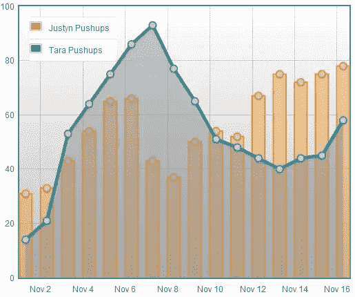

# WordPress 中的响应性实时图表:收尾工作

> 原文：<https://www.sitepoint.com/responsive-real-time-graphs-in-wordpress-finishing-touches/>

在这个关于 WordPress 中实时图表系列的最后一部分，我将深入探讨设计 Flot 图表的本质。我不能忍受把一个丑陋的婴儿交给你！我只是没有这种能力。

因此，我们将看看如何最大限度地利用 Flot 工具，并深入了解如何让您的 Flot 图表品牌化，看起来完全像你想要的那样。

免责声明:与我的相比，你的 WordPress 网站有很多不同之处。您可能希望在测试服务器上测试 Flot 图表的外观，因为只需要一个被遗忘的分号，图表就会消失。所以，一旦你的系统工作了，就从备份开始——做一些改变——再次备份，等等。

有了这个简单明了的忠告，让我们开始有趣的事情吧！

### Flot 图书馆

Flot 工具相当健壮。你可以改变图表中的每一个元素。所以，如果你有一个定义明确的品牌，有一套特定的颜色和形状，你就能让你的图表看起来坚如磐石。

Flot 将每个数据系列分开，因此每个系列都可以根据颜色和形状进行单独控制。您可以更改背景颜色、使用渐变以及控制图例显示的位置(如果有的话)。甚至网格线本身也可以定制。因此，让我们深入了解其中一些功能的细节，这样您就可以亲自看到了。

### 数据系列

让我们先看看如何控制我们的俯卧撑数据系列，我们将在此基础上建立。以下是控制数据系列外观的一种方法:

*   标签:字符串。将数据系列的标签用引号括起来
*   线:这些有几个属性。以一个开括号开始，以一个闭括号结束，比如 CSS。
    *   show:boolean(true/false)–如果您希望线条显示在点之间，请将此项设置为 true，如果您希望隐藏线条，请设置为 false
    *   线宽:数字。例如，数字“5”等于 5px。没有报价。
    *   fill: boolean(真/假)
    *   fillColor:字符串。可以是十六进制或 RGB，甚至 RGBA。使用引号:" #f000 "
*   点:有几个属性
    *   半径:数字。例如，数字“5”等于 5px。没有报价。
    *   fill: boolean(真/假)
    *   fillColor:字符串。可以是十六进制或 RGB，甚至 RGBA。使用引号:" #f000 "
*   条形:有几个属性
    *   barWidth:数字。换算成时间或像素。没有报价
        *   例 1:数据是按天的，所以条形宽度:60*60*24*1000。这是因为日期在 Unix 时间戳中。
        *   示例 2:不是日期/时间格式的数据需要是一个以像素为单位的数字= barWidth: 5，等于 5px
    *   对齐:“左”、“右”或“中间”。相对于 X 轴
    *   水平:布尔值(真/假)，默认值为假
    *   fill: boolean(真/假)
    *   fillColor:字符串。可以是十六进制或 RGB，甚至 RGBA。使用引号:" #f000 "

### 系列和标签的颜色

起初这似乎有悖直觉，但我其实很喜欢 Flot 给一个系列分配颜色的方式。不是在线条或条形数据中定义颜色，而是将其作为应用于整个图形的选项参数的一部分进行分配。当您定义一个系列的颜色时，所有连接的元素都将获得相同的颜色。换句话说，当你给一条线一个标签时，标签框也会自动获得相同的颜色。

如果您有三个数据系列，您应该这样分配它们:

```
colors: ["#f7941e","#2935A","#15AF5C"]
```

当你尝试使用 RGBA 时，颜色会有问题，所以坚持使用十六进制数字。

### 网格颜色

网格是高度可定制的。有将近 24 个属性，但这里是大多数人想要的。文档列出了所有这些:

*   显示:布尔值(真/假)
*   颜色:彩色。网格线。坚持十六进制，因为 RGB 和 RGBA 得到错误
*   backgroundColor:颜色/渐变。渐变由多种颜色定义:
    *   [颜色 1，颜色 2]
    *   您也可以用单独的组列出不透明度(alpha)

### 图例格式

我使用 CSS 文档来定义我的 Flot 图表中的几个元素，图例是这样做绝对必要的。在您的 CSS 文档(我的资源中的 layout.css)中，确保包含以下内容

```
.legend table {width: auto;}
```

这将确保您的所有其他格式工作。这是 Flot 中的一个错误，这是一个简单的修复方法。

您可以使用图例调整大约 20 个选项，但是这里最重要的是图例的格式是不同的。只有左括号和右括号，但每个属性只用逗号分隔:

*   显示:布尔值(真/假)
*   labelBoxBorderColor:颜色。坚持十六进制颜色。
*   位置:“东北”或“西北”或“东南”或“西南”。确保包括引号。
*   边距:像素数
*   backgroundColor: null 或 Color。Null 表示它会自动检测。
*   backgroundOpacity:介于 0 和 1 之间的数字。默认值为 0.85。

样本应该是这样的:

[source code language = " JavaScript "]

图例:
{

show: true，
位置:' nw '，
边距:15，

}

如果使用 PHP 进行硬编码，那么在使用 position 属性时，需要对单引号进行转义:

[sourcecode language= " php "

“echo”图例:{position: 'nw '，} '；

[/sourcecode]

弗洛特的传说是错误的。如果您发现您的代码没有影响，您可以直接进入 jquery.flot.js 文件，对“legend”执行 CTRL+F。你会在这里看到所有的默认值。这完全是个骗局，但它完成了任务。

### 样本完成图表

下面是我的代码最少的情况:



下面是您可以用于测试目的的 JavaScript:

[source code language = " JavaScript "]
jQuery(文档)。ready(function($){
var D1 =[
，[1351753200000，31]，[1351839600000，33]，[1351926000000，43]，[1352012400000，54]，
，[1352098800000，65]，[13521852000
var d2 = [
，[1351753200000，14]，[1351839600000，21]，[1351926000000，53]，[1352012400000，64]，
，[1352098800000，75]，[1352185200000，800
var placeholder = $(&quot；#占位符&quot；);
var plot = $。绘图(占位符，
[
{
数据:d1，
标签:&quot；贾斯丁俯卧撑&quot；，
条:{
条宽:60*60*24*600，
显示:真，
对齐:&quot；居中&quot；、
}、
分:{
显示:真、
填充:真、
填充颜色:&quot；# CCC&quot；，
半径:5，
}，

}，
{
数据:d2，
标签:&quot；塔拉俯卧撑&quot；，
线条:{
显示:真，
填充:真，
填充颜色:&quot；rgba(141，141，141，.. 5)&quot；、
线宽:5、
}、
点数:{
显示:真、
填充:真、
填充颜色:&quot；# CCC&quot；，
半径:5，
}，
}
，
{
xaxis:
{ mode:&quot；时间&quot；}，
颜色:
[&quot；# f 7941 e&quot；，&quot；# 1 db 5 CB&quot；]，
网格:
{
背景颜色:{颜色:[&quot；# ffffff&quot；，&quot；# c0c0c 0&quot；]}，
颜色:[&quot；# 666&quot；]，
}，
图例:
{
显示:真，
位置:' nw '，
边距:15，
}，
}

);

}
)；

[/sourcecode]

如果在 PHP 中使用，就像这样包装上面的代码:

[sourcecode language="php"]

回声

//以上所有代码都在这里

；

[/sourcecode]

### 关键提示:

我建议对布局和格式做很小的改动。整个图表会因为一个错误的陈述而消失。而且，由于每个属性通常都有自己的语法，所以很容易破坏图表。

### 其他要点

有许多不同种类的图形和图表可供使用:折线图、饼图和条形图。饼状图需要自己的教程，因为有很多方法可以使用它们。文档中包含的示例文件非常适合展示如何格式化饼图。

真正深入学习的最好方法是查看文档中包含的大量示例文件。他们几乎什么都有，但是没有这本书很难理解。

炫耀你的作品！我真的很想看到很多又大又可爱的图表！我们有如此多的数据要处理，在过去很难显示出来。我希望看到这个系统成为一个标准，这样我们就可以在它的基础上创建一个围绕 Flot 的社区。

## 分享这篇文章