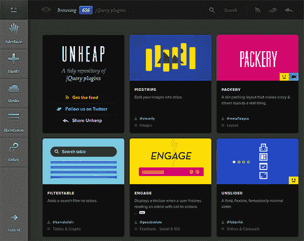

# Unheap.com:更好的 jQuery 插件库？

> 原文：<https://www.sitepoint.com/unheap-jquery-plugin-repository/>

我从未对[官方 jQuery 插件注册表](http://plugins.jquery.com/)特别称赞过。团队正在研究它，但也许最善意的观察是，它是*【字典】*——去除了所有“乐趣”的功能。该系统缺乏一个简单的界面，良好的搜索设施，在线演示，开发商评级和评论。

作为替代，为什么不试试[**unheap.com**](http://www.unheap.com/)——一个新的独立 jQuery 插件库…

**的好处在你使用它的那一刻就显现出来了:**

 ***   该网站有一个华丽的动态响应界面——使用起来很愉快
*   插件被分为界面、输入、媒体、导航和杂项代码等部分和子部分。
*   搜索工具运行良好。
*   插件列表有到演示页面和视频的直接链接。
*   列出了相关插件。
*   用户的意见，投票和错误报告被记录。
*   提供了社交媒体共享设施。
*   你可以在 [~~谷歌阅读器~~](https://www.sitepoint.com/goodbye-google-reader/) ，呃，一个兼容的 RSS 阅读器中查看新的和更新的插件的 RSS 源。
*   [插件提交过程](http://www.unheap.com/submit)简单直接。
*   在撰写本文时，几乎有 700 个插件可用。

我印象深刻。除非 jQuery 团队能够开发出一个像 unheap.com 一样好的系统，否则也许他们现在应该放弃，把它作为“官方”存储库？

除非你找到了更好的？…** 

## **分享这篇文章**