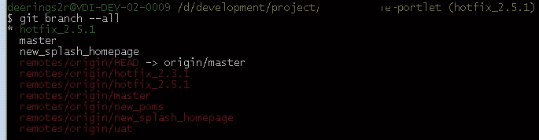
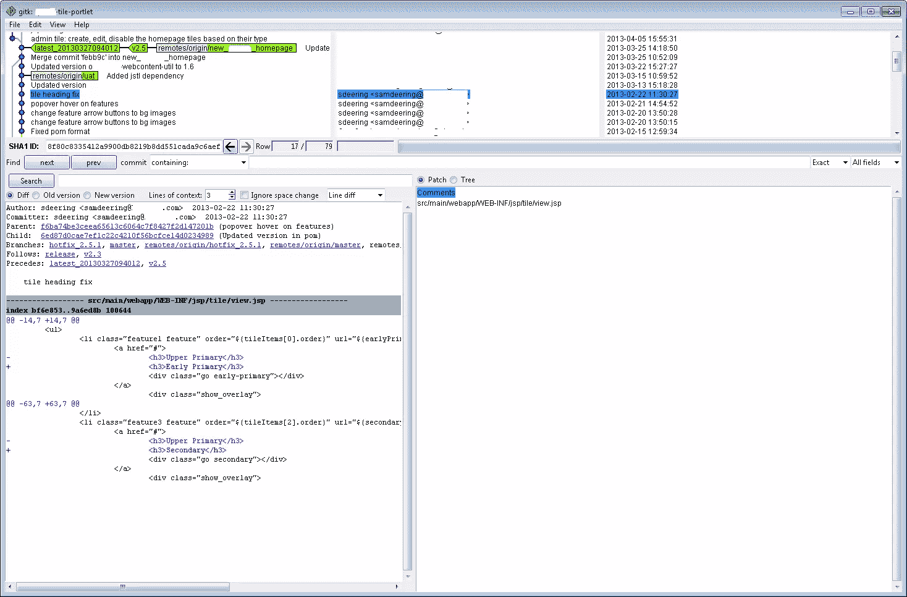
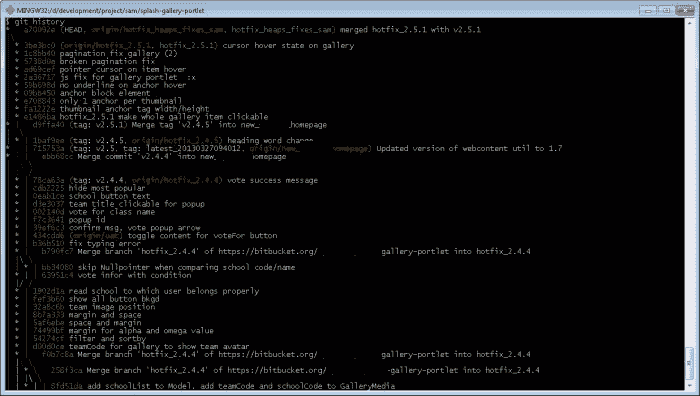

# 有用的 GIT 命令和别名

> 原文：<https://www.sitepoint.com/commands/>

这里是一些有用的 GIT 命令的参考列表，包括 GIT 别名命令。如果你知道或使用任何不在这里的，请发表评论，这样我就可以添加它们来帮助别人！:)

### 去吧，巴什

GIT Bash for Windows(原名 GitWin)是面向 Windows 用户的 shell 命令行工具。它本质上是 GNU bash“极简 GNU for Windows”的一个 Windows 端口(详见 [msysgit 项目网站](http://msysgit.github.io/))。
[下载 GIT 痛击](http://git-scm.com/downloads)

## 有用的 GIT 命令

显示所有分支。

```
$ git branch --all
```



Load [GITK](http://gitk.sourceforge.net/)

```
$ gitk
```



添加(如果适用)并通过消息提交更改。

```
git commit -a -m "msg"
```

搜索特定短语和文件类型的树内容。ie 在所有内容中找到“CSS”这个词。js 文件。

```
git grep "css" -- *.js
```

创建当前分支的压缩备份。

```
$ git archive --format=zip master^>backup-10-04-2013.zip
```

查看本地 GIT 配置。

```
$ cat .git/config
```

## 有用的 GIT 别名命令

GIT Alias 命令可以节省您在 GIT CMD 中输入冗长命令的大量时间。它们基本上将一个长命令映射成你想要的任何简写版本。他们也可以配置美化/美化你的结果。[git 别名命令上的官方帖子](http://git-scm.com/book/en/Git-Basics-Tips-and-Tricks#Git-Aliases)。参见:[必须有 Git 别名:高级例子。](http://durdn.com/blog/2012/11/22/must-have-git-aliases-advanced-examples/)

展示一个漂亮的 git 日志历史。

```
$ git config --global alias.history "log --abbrev-commit --pretty=oneline --graph --decorate"
usage: $ git history
```



显示最后一次提交。

```
$ git config --global alias.last 'log -1 HEAD'usage: $ git last
usage: $ git last
```

重置为上次提交的状态。

```
$ git config --global alias.resetlast 'reset --hard HEAD'
usage: git resetlast
```

## 分享这篇文章