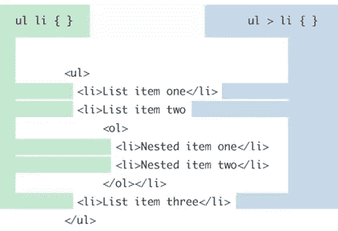
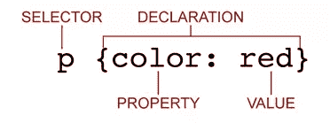

# CSS 架构:重构你的 CSS

> 原文：<https://www.sitepoint.com/css-architectures-refactor-your-css/>

我在 CSS 架构系列的上一篇文章中提到的顶级可伸缩和模块化方法都有一些亮点，可以帮助你改变思考和构建 CSS 的方式。它们在许多方面也是重叠的，这表明在改进你的 CSS 的过程中哪些方面是真正关键的。虽然你可以遵循任何单一的方法来构建一个新的网站，并取得巨大的成功，但事实是，我们大多数人所做的是试图让现有的 CSS 变得有意义。

因此，虽然我描述的方法本身很棒，但我们真正需要的是一种结合所有超能力来打击疯狂代码邪恶的方法——一种可扩展和模块化技术的"[正义](http://www.youtube.com/watch?v=ANCjrzSJOsU) [联盟](http://www.youtube.com/watch?v=FLOwCWDlVTg)。此外，就像罗马不是一天建成的一样，试图一下子纠正数千行缺乏韵律或理性的代码是徒劳的。因此，通过分阶段的方法集中传递代码是一个好主意。

## 给 CSS 重构起个好名字

去年，我为一个客户做了一个项目，我受雇去做这个项目。在研究了 DRY CSS、OOCSS、SMACSS 和 CSSG 之后，我试图将它们提炼为基本的实践。在一瞬间的洞察力，我意识到所有这些方法归结为著名的格言“衡量两次，削减一次。”当然啦！它们都鼓励查看模式，创建可移植的样式和模块，这些样式和模块可以重用，并且不添加多余的和多余的选择器或样式。

此外，我的客户有很多代码，并希望在对 CSS 进行更改的数量方面具有灵活性。因此，我开发了一个内聚的、分阶段的攻击计划来减少我的客户的 CSS 中的行数。最后，所有四个可伸缩 CSS 框架的所有实践和技术都被合并，我开发的过程在减少 CSS 的行数方面非常有效。

一旦我创建了流程，我就必须想出给它起什么名字。以“测量两次，切割一次”为基础，我添加了 CSS，这就是我得到的结果:

测两次，切一次 CSS→mtco CSS→meta coa CSS→meta coax！

因此，在本文中，我将与您分享我的 MetaCoax CSS [重构](http://aka.ms/CodeRefactoring)过程，旨在“消除”数千行冗余 CSS——提高 CSS 的可读性、简单性和可扩展性，同时保持网站的可见设计和功能不变。([看看我最近关于 CSS 去膨胀的演讲中的幻灯片](http://www.slideshare.net/denisejacobs/scalable-and-modular-css-ftw)。)

为了做好重构 CSS 的准备，这里有一些建议。首先，熟悉特殊性和级联——这将产生巨大的差异。我希望在本系列的前两篇文章([第一部分](http://msdn.microsoft.com/en-us/magazine/jj983725.aspx)、[第二部分](http://msdn.microsoft.com/en-us/magazine/dn194516.aspx))中，我已经阐明了让选择器和规则过于具体会限制它们的可重用性。尤其是在使用后代选择器时，特异性很容易迅速失控，这正是我们努力避免的。第二，记住继承规则:某些属性由子元素继承；因此，应该始终记住这些属性是如何在 DOM 中级联的。

## MetaCoax 过程

MetaCoax 流程分为四个阶段。每个阶段都建立在前一个阶段的基础上，它们都包含了减少代码量、增加可伸缩性和可维护性的实践，并且作为额外的奖励，为未来友好的站点奠定了基础。我们将查看每个阶段的详细分解以及每个阶段包含的实践和技术。在本文中，我将介绍阶段 1 和阶段 2。关于阶段 3 和阶段 4 的详细信息将出现在本系列的最后一篇文章中。

**注意:**在你进行 MetaCoax 重构的过程中，一个很好的工具是妮可·沙利文的 [CSS Lint](http://csslint.net/) ，它指出了 CSS 中需要清理的地方，并给出了如何清理的建议。

### 阶段 1:缩短选择器，利用和分层规则集

第一阶段集中在改进网站 CSS 的最小工作量上。这些变化包括修改 CSS，但不涉及网站页面的当前 HTML。目标是让样式表变得更轻量级，并且更容易维护和更新，只需要少量的时间和精力。该方法包括优化选择器，同时通过更智能地重用规则集来减少冗余。即使您只将这个阶段的实践应用到您的 CSS 中，您也会看到可维护性的提高。

这是我们要做的:

*   缩短选择器链条
    *   取消限定符
    *   删除后代
    *   使选择器链为三个或更少
*   杠杆和层声明
    *   依靠继承来利用级联
    *   复习，修改，减少！重要属性
    *   干燥(“不要重复”)你的规则集

### 缩短选档杆链条

为了最佳地优化选择器，目标是使用浅的而不是深的选择器链，使链尽可能短。这种做法使得代码更容易使用，并且样式变得更加可移植。其他优势是减少选择器损坏的机会，减少位置依赖性，减少特异性，并通过防止过度使用来避免特异性战争！重要声明。

您有几种方法可以缩短选择器链，结合我概述的所有可伸缩架构的实践，并进一步应用“减少、重用、再循环”的精神。所有的实践都保证了 CSS 代码更加宽容。这不正是更新样式表的基本目标吗？

#### 删除后代选择器

派生选择器(a b)是用来定位元素的最“昂贵”的组合选择器之一。其他昂贵的 CSS 选择器包括通用选择器(*)和子选择器(a > b)。是什么让它们变得昂贵？它们非常通用，因此迫使浏览器查看更多的页面元素来进行匹配。选择器链越长，所需的检查越多，浏览器在屏幕上呈现样式的时间就越长。匹配派生选择器时，浏览器必须找到页面上键选择器(最右边的那个)的每个实例，然后沿着祖先树向上进行匹配。

虽然对于几百行的样式表来说这可能不是问题，但是当文档的大小接近 10，000 行或更多时，这就成了一个大问题。更重要的是，在采用未来友好和[移动优先](http://aka.ms/MobileFirst)的方法时，长的选择器链会造成一种情况，即小的、能力较弱的设备被迫加载和处理不必要的大 CSS 文档。

对后代选择器的过度依赖是 Internet Explorer 6 编码时代的遗迹，因为 Internet Explorer 6 根本没有呈现其他 CSS 2.1 组合器选择器。因为现在在美国和其他主要市场几乎不存在 Internet Explorer 6 的使用，所以开始使用与 Internet Explorer 7 和 Internet Explorer 8 兼容的选择器并彻底放弃大量使用派生选择器是完全安全的。**表 1** 显示了您可以在 Internet Explorer 7 中使用的选择器。从那时起，所有版本的 Internet Explorer 都支持这里显示的所有选择器。

| **选择器** | **网络浏览器 7** |
| 通用* | y |
| 孩子:e > f | y |
| 属性:e[属性] | y |
| :第一个孩子 | y |
| :悬停 | y |
| :活动 | y |
| 兄弟/相邻:e + f | n |
| :之前 | n |
| :之后 | n |

**表 1。CSS 2.1 选择器对 Internet Explorer 7 安全**。

**注:**在 http://caniuse.com/和 http://www.findmebyip.com/litmus/[查看图表，确定其他 CSS 选择器的浏览器支持。](http://www.findmebyip.com/litmus/)

使用子选择器，而不是后代选择器。子元素选择器选择的元素是父元素的直接后代，即第一代的直接子元素，而不是后代选择器所包括的孙元素或曾孙元素。**图 1** 说明了这一选择过程。



**图一。** **后代选择器与子选择器**

虽然子选择器仍然是一个“昂贵”的选择器，但它更加具体。这意味着浏览器不会沿着继承链向下搜索来匹配键选择器。因此，这样的选择器可以更好地瞄准您需要的元素。

如果你必须使用一个下行选择器，去掉所有多余的元素。例如:

`.widget li a`

会变成

`.widget a`

无论 li 是否存在，都将应用该样式。

#### 杀死合格的选择器

限定# IDs 和。包含元素的类会导致浏览器不必要地减慢搜索页面上的附加元素以与选择器匹配的速度。没有必要限定 ID。ID 在 CSS 中具有最高的特异性权重，因为它对于它所在的任何页面都是唯一的，并且它自己总是有一个直接匹配。合格的选择器还会导致选择器的特定性高得离谱，这就需要使用更特定的选择器以及使用！重要的是战胜这些超级具体的规则集。

选择器，如

`div#widget-nav div#widget-nav-slider`

可以简化为

`#widget-nav #widget-nav-slider`

并进一步削减到

`#widget-nav-slider`

每一种都提供相同的结果。

在选择器中删除一个元素类限定符会降低选择器的特异性，这使您能够在必要时正确地使用级联来覆盖样式。举个例子，

`li.chapter`

理想情况下会变成

`.chapter`

更好的是，因为它更具体地针对

*   ，您可以考虑在您的*   tag, and scoping the CSS to

    `.li-chapter`或`.list-chapter`

    #### 三个或更少

    在优化选择器时，制定一个“三个或更少”的规则:组合选择器到达键选择器的步骤应该不超过三步。举个例子，看看这个神奇的选择器:

    `div#blog-footer div#col2.column div.bestright p.besttitle {margin-bottom: 4px;}`

    要使用三步或更少的步骤来访问键选择器，请进行如下更改:

    `#col2.column .besttitle {border: 1px solid #eee;}`

    ### 杠杆和层声明

    下一步是关注样式声明本身。当将臃肿的 CSS 重构为更易于管理的东西时，很容易将注意力主要集中在选择器上，并相信样式会自行解决。然而，注意你正在创建的样式声明(见**图 2** )以及它们的去向，在向圆滑的 CSS 发展的过程中也会有所不同。

    

    **图二。** **剖析一个 CSS 规则集**

    #### 利用继承

    通常，我们认为我们非常了解一些事情，而实际上我们并不了解，CSS 中的继承可能就是其中之一。您可能记得[继承是 CSS](https://www.w3.org/wiki/Inheritance_and_cascade) 的一个基本概念，但是您可能不记得哪些属性是自然继承的，哪些不是。**表 2** 显示了被后代元素继承的最常用的属性，除非后代元素的样式不同。([还有其他一些更不为人知的遗传特性](https://www.w3.org/TR/CSS21/propidx.html)。)

    | `color``font-family``font-family` `font-size` `font-style``font-variant` `font-weight` `font``letter-spacing``line-height` | `list-style-image` `list-style-position` `list-style-type` `list-style``text-align``text-indent` `text-transform``visibility``white-space``word-spacing` |

    **表 2。由后代元素继承的公共元素**

    当您寻找要合并或消除的冗余样式时，记住这些属性很重要。当您更新样式表时，可以继承的属性应该放在 CSS 中，以便它们得到最好的利用，而不是重复。通过适当地放置这些属性，可以完全消除后来多余的样式声明。

    #### 复习，修改，减少！重要属性

    如果你的 CSS 拥有惊人的数量！重要宣言，那就该减了。你真的应该用！仅在特定情况下的重要声明。CSS Tricks 的 Chris Coyier 推荐在[实用程序类中或者在用户样式表](http://css-tricks.com/when-using-important-is-the-right-choice/)中使用它们。如果你以其他方式使用它们，你可能最终会被贴上自私和懒惰的标签[，谁希望这样呢？！](https://twitter.com/stefsull/status/70631020352913408)

    如何减少！重要吗？首先，按照我前面提出的建议，保持选择器的特异性较低。第二，记住，理想情况下，新的样式不应该撤销以前的规则集，而应该增加它们。

    我的意思是:如果你发现自己正在编写新的样式来撤销以前的样式(然后使用！重要的是在特异性战争的情况下试图击败风格)，那么你需要重新思考旧的风格，将其提取到它的必要性，然后创建新的风格来增强原始风格，而不是努力撤销已经存在的风格。这就是我认为的“分层”风格的规则集。这也可以被称为“扩展”(或“子类化”)一个样式，这是阶段 2 中创建模块的一部分。

    如果你有大量的！相同样式的重要属性，我敢打赌，这些属性可以转变成可移植的样式，应用于多个元素，我在描述阶段 2 时也会谈到这一点。

    #### 擦干你的规则集

    为了减少 CSS 中大量重复的样式，少量的干编码会有所帮助。虽然采用完全干燥的 CSS 方法可能有点苛刻，但知道何时重复相同的规则集，然后让您的小组上[是一个很好的实践](http://msdn.microsoft.com/en-us/magazine/dn194516.aspx)。

    ### 阶段 2:重组、调整和模块化

    第二阶段的技术集中在做中高水平的工作来提高网站的 CSS。这些变化包括更改页面的 CSS 和 HTML，HTML 的更改很可能涉及重命名或重新分配类名。目标是通过按类别而不是按页面对样式进行分组，删除过时的 HTML，清除选择器中多余的内容，并创建模块来提高代码效率，从而为样式表提供结构和组织。

    这个阶段将进一步消除冗余，通过提高选择器的准确性和效率使样式表更加轻量级，同时也有助于维护。这种程度的改进比第一阶段花费更多的时间和精力，但是它包括了使你的 CSS 变得更好所需的大量工作，并且估计会显著地减少 CSS 代码的行数。

    我们要做的是:

    *   重构以重构
        *   在样式表中对 CSS 规则进行分类
        *   重构依赖于 DOM 中的限定符的样式
        *   使用类名作为键选择器
    *   开始建立模块
        *   用双连字符(–)扩展模块子样式
    *   创建便携助手样式
        *   外科布局助手
        *   印刷样式
    *   调整 HTML
        *   消除内嵌样式
        *   减少使用以获得更好的语义

    ### 重构以重构

    我们不要忘记，重构 CSS 是我们的主要目标。这些实践启动了一个过程，从思考和创建基于和特定于页面组件和页面层次结构的样式，转向以可移植、可重用和模块化的方式思考样式。

    #### 样式表中的 css 规则分类

    在本系列的第一篇文章中，我建议创建一个目录，以便更容易找到 CSS 中的样式部分。在 CSS 重构的这个阶段，我建议按照 [SMACSS 类别](http://msdn.microsoft.com/en-us/magazine/dn194516.aspx)，通过将这些部分转换成它们所描述的样式类型来加快这个过程。这些类别是:

    *   默认样式，通常是单个元素选择器，它们将层叠整个文档。
    *   **布局**页面各部分的样式。
    *   站点各种模块的可重用样式:标注、侧边栏、产品、媒体、幻灯片、列表等等。
    *   **State** 描述模块或布局在特定状态下外观的样式。
    *   描述模块或布局外观的风格。

    现在，您的目录和文档部分将如下所示:

    ```
    /* Table of Contents

    - Base
    - Layout
    - Module
    - State
    - Theme

    */
    …

    (later in the document…)

    /* =Layout */ (etc.)
    ```

    样式表的这种重组有助于为第 2 阶段的其余实践奠定基础，也是第 3 阶段的一部分。

    #### 重构依赖于 DOM 中的限定符的样式

    这条建议是整篇文章中最重要的一条:完全消除特定于页面的样式——也就是说，基于向 body 元素添加一个类来表示不同页面的样式。像这样的样式迫使浏览器沿着 DOM 链一直检查到

    tag.   Here’s an example:

    ```
    body.donations.events div#footer-columns div#col1 div.staff span.slug {
    display: block;
    margin: 3px 0 0 0;
    }
    ```

    这种做法是选择器链长，选择器的超高特异性和使用需求的根源！重要的是要覆盖级联中较高的样式，如下例所示:

    ```
    body.video div#lowercontent div.children.videoitem.hover a.title { background: #bc5b29; 
    color: #fff !important;
    text-decoration: none; 
    }
    ```

    换句话说，很糟糕。 [Mmkaay](http://www.youtube.com/watch?v=E4_tOiLB_Ko) ？

    要解决这个问题，您需要遵循前面的所有建议，比如三个或更少，取消限定符并减少特异性。你最终可能会得到这样的结果:

    ```
    .donations-slug {
    display: block;
    margin: 3px 0 0 0;
    }
    ```

    #### 使用类名作为键选择器

    因为 id 是高度特定的，您应该尽可能避免使用它们，因为它们不能像类那样被重用。然而，在创建类时，您希望保持类名的语义性和可移植性。目标是使选择器尽可能直接。通过这样做，您可以避免特殊性问题，甚至可以像前面建议的那样组合样式来对它们进行分层。

    从 SMACSS 中，您应该逐渐养成这样的习惯:当您创建选择器时，键选择器应该是一个. class，而不是一个标记名或#id。永远记住，最右边的按键选择器是最重要的。如果一个选择器能够尽可能地针对所讨论的元素，那么您就中了大奖。这样，因为浏览器只匹配精确的元素，所以样式的针对性更强。

    检查所有使用子选择器的地方，并尽可能用特定的类替换它们。这也避免了将子组合子中的键选择器作为一个元素，这也是不鼓励的。

    例如，不这样做:

    `#toc > LI > A`

    最好创建一个类，如下所示，然后将其添加到适当的元素中。

    `.toc-anchor`

    ### 开始建立模块

    在可伸缩的 CSS 方法和模块中，没有什么可以概括“测量两次，切割一次”的格言，而它们是所有方法的核心和灵魂。模块是可以从设计模式中抽象出来的代码组件——例如，经常出现的带有图像的项目列表，这些图像浮动在左侧、右侧或下方；这些可以抽象到一个模块中，每个模块都可以共享一组基本样式。然后，可以通过更改文本、背景、字体颜色、边框、浮动等来扩展(或换肤)该模块，但结构保持不变。

    模块最好的一点是它们是可移植的，这意味着它们不依赖于位置。将一个设计模式抽象成一个代码模块意味着你可以把它放在任何页面的任何地方，它会以同样的方式显示出来，而不需要你重新发明样式。现在*这就是*CSS 的用途，对吗？！除了我之前的建议，模块化你的 CSS 是显著减少代码量的最好方法之一。

    OOCSS 提供了一个很好的方式来思考如何构建模块和[皮肤](http://aka.ms/ModulesBlockStructures)，以及[什么可以做成模块](https://github.com/stubbornella/oocss/wiki/_pages)。SMACSS 为如何命名模块和扩展模块提供了清晰的指导方针。

    #### 用以下内容扩展子样式—

    尽管 SMACSS 为考虑扩展模块提供了很好的指导，但我更喜欢成年人用 CSS 扩展子样式的技术。这对我来说很有意义，因为这是一个视觉指示，表明新的风格是基于以前的风格，但又更进一步。

    这里有一个例子:

    ```
    #go, #pmgo{
        width: 29px;
        height: 29px;
        margin: 4px 0 0 4px;
        padding: 0;
        border: 0;
        font-size: 0;
        display: block;
        line-height: 0;
        text-indent: -9999px !important;
        background: transparent urlimg/go.jpg") 0 0 no-repeat;
        cursor: pointer; /* hand-shaped cursor */
        x-cursor: hand; /* for IE 5.x */
    }

    #pmgo{
        margin: 2px 0 0 3px;
        background: transparent urlimg/go.jpg") no-repeat center top;
    }
    ```

    这段代码可以修改成类似这样的内容:

    ```
    .button-search{
        width: 29px;
        height: 29px;
        margin: 4px 0 0 4px;
        padding: 0;
        border: 0;
        font-size: 0;
        display: block;
        line-height: 0;
        text-indent: -9999px !important;
        background: transparent urlimg/go.jpg") 0 0 no-repeat;
        cursor: pointer; /* hand-shaped cursor */
        x-cursor: hand; /* for IE 5.x */
    }

    .button-search--pm{
    margin: 2px 0 0 3px;
    background: transparent urlimg/go.jpg") no-repeat center top;
    }
    ```

    ### 创建便携助手样式

    随着模块化的进程，可移植样式是你的武器库中的另一个方便的工具。这里有一些成人 CSS 的例子。

    #### 外科布局助手

    按照成年人的 CSS 标准，有一点额外的布局帮助并不可耻。虽然网格解决了很多问题，但这些样式可能会在需要时稍微推动元素(特别是在垂直间距方面)，同时消除代码行。

    ```
    .margin-top {margin-top: 5px;}
    .margin-bottom {margin-bottom: .5em;}
    ```

    虽然在大多数情况下，我们在创建类时努力保持名称的语义，但在这种情况下，描述性名称是好的。

    #### 印刷样式

    如果你发现你的 CSS 大部分都是用于改变字体、大小和/或行高，那么排版风格是完美的。面向成年人的 OOCSS 和 CSS 都建议不依赖于元素的专用印刷样式，如下所示:

    ```
    .h-slug {font-size: .8em;}

    .h-title {font-size: 1.5em;}

    .h-author {font-size: 1em;}
    ```

    一个很好的练习是搜索属性 font、font-size、font-face 以及 h1 到 h6，并惊叹于这些属性实例的巨大数量。一旦你开怀大笑，弄清楚哪些样式适用于什么，哪些大小是重要的，然后开始制作一些可移植的印刷样式。

    ### 调整 HTML

    虽然我们到目前为止所讨论的第 1 和第 2 阶段的实践在 CSS 清理方面创造了奇迹，但是我们不能忘记页面标记。最有可能的是，正如 Andy Hume 在《成年人的 CSS》中所建议的，除了添加新的类名之外，您还需要对 HTML 进行修改。

    #### 减少使用以获得更好的语义

    你是否滥用了标签，而一个更具语义的标签会更合适？请记住，正如 W3C(【https://www.w3.org/TR/html401/struct/global.html#h-7.5.4】)所声明的那样，标签实际上是用于行内元素，而不是块级元素，所以将用于标题和其他块级元素在技术上是不正确的。

    例如，在这里，范围应该是段落或标题标签，指示内容在文档层次结构中的位置。这些元素中的任何一个都可以为类挂钩提供一个基础。

    ```
    <li>

    <a href="/learning/hillman" title="">

    

    </a>

    <span>Brenda Hillman Essays</span>

    <span><a href="/learning/hillman" title="Air in the Epic" class="title">Air in the Epic</a></span>

    <span>Brenda Hillman</span>

    </li>
    ```

    从语义的角度来看，下面的代码版本是一个改进:

    ```
    <li>

    <a href="/learning/hillman" title="">

    
    </a>

    <p>Brenda Hillman Essays </p>

    <h3><a href="/learning/hillman" title="Air in the Epic" class="title">Air in the Epic</a></h3>

    <p>Brenda Hillman</p>

    </li>
    ```

    #### 消除内嵌样式

    最后，您需要摆脱内联样式。在这个时代，内联样式应该很少使用。它们与 HTML 的联系过于紧密，类似于<font>标签横行</font> 的往昔。如果您使用内联样式来覆盖特异性，那么按照本文中的建议进行修改应该已经帮助您避免了特异性战争，有效地消除了对内联样式的需求。

    例如，这种内嵌样式:

    ```
    <span class="text-indent: 1em">Skittles are tasty</span>
    ```

    可以很容易地转换成它自己的类，应用于整个文档，就像这样:

    ```
    .indent {text-indent: 1em:}
    ```

    你的任务，[如果你选择接受它](http://www.hark.com/clips/ytqshsltzw-your-mission-jim-should-you-choose-to-accept-it)，就是找到内联样式的所有实例，看看在哪里可以让这些样式成为可移植的助手。您正在使用的属性可以很容易地变成可移植的样式，可以在其他文本实例中重用。

    ## 试试吧，对你有好处！

    在瑞典马尔默举行的[redev](http://oredev.org/)网络开发大会上，我有幸看到才华横溢的 [Katrina Owen](http://kytrinyx.com/) 呈现“[治疗重构](https://vimeo.com/53154356)她建议，当面临最后期限时，她会转向重构可怕的代码，以帮助她获得对世界的控制感和正义感。

    你可以用同样的方法更好地重组你的 CSS。通过修复困扰你的 CSS 的问题，你可以获得一种平静和力量的感觉，同时开始使你的站点的样式表世界变得更好，一次一行代码。

    不过，请跟着我，因为我们还没有完全完成。在 MetaCoax 过程中，我们还有两个阶段要介绍，这将彻底地从您的 CSS 中驱逐邪恶，并且还将使您能够为所有跟随您的前端开发人员留下美好的遗产。

    *This article is part of the HTML5 tech series from the Internet Explorer team. [Try-out](http://www.microsoft.com/click/services/Redirect2.ashx?CR_CC=200210648) the concepts in this article with three months of free BrowserStack cross-browser testing @[http://modern.IE](http://modern.ie/)*

    ## 进一步阅读的链接

    *   [CSS Lint 页面](https://github.com/stubbornella/csslint/wiki/_pages)
    *   [打破好习惯](https://vimeo.com/44773888)——哈里·罗伯茨在 2012 前沿趋势会议上的讲话
    *   [大 CSS](https://speakerdeck.com/csswizardry/big-css-1)——又一个伟大的哈里·罗伯茨演讲

    **—**

## 分享这篇文章