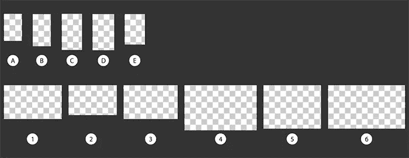

# 为什么网络已经为响应式网页设计做好了准备

> 原文：<https://www.sitepoint.com/why-the-web-is-ready-for-responsive-web-design/>

## 移动游戏领域

如今，除了传统的个人电脑之外，很大一部分网站流量来自移动设备，即智能手机和平板电脑。在全球范围内，移动设备现在占互联网流量的 12 %,并且这一比例比桌面互联网流量增长得更快。在智能手机普及率高的国家，移动网络流量的比例足够高(例如，[20%的美国网络流量](http://www.phonearena.com/news/Mobile-Browsing-accounts-for-20-of-North-American-web-traffic-according-to-new-report_id30602)是通过移动浏览的)。此外，随着智能手机在硬件和软件方面的发展和成熟，以及在南美、亚洲和非洲的采用，这一数字预计将在未来 10 年内显著增长。

在过去的几年里，网站所有者已经开始利用这一趋势，并主要依赖本地移动应用程序为顶级网站提供服务，如脸书、T2、Hulu 和 T4。此外，像 *Pulse、* *Flipboard 和其他*这样的新兴网络服务甚至采取了移动优先的方式，在建立网站体验之前，先为 iOS 和其他生态系统开发应用。原生应用允许开发人员创建独特的手机优先、触摸优化的体验，供用户与他们的内容进行交互，以利用相机集成、地理位置和离线数据存储等功能。

将目标锁定在移动用户上很有意义，尤其是在美国，超过 50%的移动用户拥有智能手机。虽然移动应用程序为网站所有者提供了一种以新的形式与用户联系的方式，提供了跨平台赚钱的新方式和以移动场景为中心的新体验，以增强和取悦用户，但与网络的普遍性和影响力相比，它们为开发者提供了一个不完整的机会。有几个问题会影响本地纯移动方法。

## 问题 1:支持多个平台的成本

在多个平台上创建相似的内容和体验成本很高，需要网站所有者选择要优化的平台。此外，对于从其他平台寻找您的内容的用户来说，这意味着网站体验有限，尤其是当您需要优先考虑您的开发投资时。

采用*响应性设计的网站*可以帮助解决投资成本问题，并确保所有最新移动操作系统的用户都享受到一致的有用体验。

Scott Scazafavo，Allrecipes.com 公司前产品管理副总裁，他的职责包括移动产品开发，是这样说的:

> *“要想开发出一款能够与由实时数据或内容驱动的“同类最佳”产品竞争的原生移动应用程序(就像我们在 MSN 和我的前雇主 Allrecipes.com 所做的那样)，通常需要大约 25 万美元的初始投资来定义、设计和设计该原生应用程序，然后每个平台每年为该原生应用程序投入 7.5 万至 10 万美元的维护投资，以保持其不断发展，保持消费者的兴趣和健康的采用人数。这超出了设计或工程所需的任何内部工作，以创建和维护支持这些产品的服务(API)。*
> 
> *除了移动浏览器之外，我们在 MSN 上为我们的 TMX 产品(目前在 IE10 上可用的 MSN.com 的新触摸优先版本)采取的方法，以及帮助将该产品交付到应用程序市场的薄壳应用程序，只需要我们用内部资源创建该应用程序产品的少量增量初始投资。[这个数字]每个平台每个应用程序的初始投资可能是 2.5 万到 5 万美元，此后维护这些应用程序的维护成本可以忽略不计。"*

同样，通过使用响应式网页设计技术，[Clipboard.com](http://clipboard.com/)能够瞄准许多移动、小型设备浏览器，如 Windows 8 上的 Internet Explorer 10 和 iPhone/iPad 上的 Safari，而*的开发成本只有项目开始时的一半。*

## 问题 2:支离破碎的生态系统

即使在一个给定的平台中，也存在大量的设备几何形状和尺寸，以及支持的平台版本。这要求网站所有者不仅要为近乎相似的显示器尺寸和分辨率进行设计，还要提交给多个应用商店(Kindle store、Google Play 和 Nook store，都在 Android 平台上)。在同一平台内管理多项资产增加了支持矩阵的复杂性。修复 Nexus 7 原生应用中的一个布局错误，你可能需要为 Kindle Fire 应用再次修复它。这意味着你的所有用户都不在同一个应用版本上，没有相同的功能集和相同的错误修复。

类似地(即使在 iOS 应用生态系统中)，像 ESPN、Spotify、愤怒的小鸟空间和应用商店本身[这样的顶级应用在 iPhone 5 发布时也没有正确地占据全屏](http://www.maclife.com/article/gallery/7_big_apps_still_need_iphone_5_optimization#slide-3)，而是在应用的顶部和底部向用户显示一个黑条。iPhone 5 的加入要求开发者发布应用程序更新来解决这个简单的布局错误。

我们还处于供应商们正在试验新的外形规格的阶段，比如大屏幕。例如，超过 2500 万 Xbox Live 用户现在可以在客厅的电视屏幕上访问 Internet Explorer 10，并且不仅通过指针，还通过 Kinect 和 Xbox SmartGlass 等更以人为中心的机制与它进行交互。今天的技术决策者正面临着一个支离破碎且非常不稳定的设备环境，他们的用户已经将这些设备融入了他们的日常生活。

## 统一的方法:响应式网页设计

响应式网页设计旨在为市场上现有的各种设备提供最佳的浏览/消费体验——*轻松阅读和导航，最大限度地减少尺寸调整、平移和滚动*——*以及为未来的用户提供经得起未来考验的网站*。已经有不同的网络教程介绍帮助网站变得更有响应性的个别技术。这个系列的目的不仅仅是提供一个统一的响应性 Web 设计方法，它的目的是让决策者和开发人员深刻认识到采用响应性作为他们 reach 策略的一部分的迫切需要。根据 [modern 对 5000 个顶级网站的抓取。也就是说，只有大约 14%的网站有某种形式的响应式设计。不难看出为什么开发人员认为这是一项令人望而生畏的任务。](http://modern.ie/)

看一看**图 1。**你可以在流行的智能手机和平板电脑上看到网络浏览器的相对屏幕分辨率(这些设备在**表 1** 中进行了标识)。设备分辨率，以及 CSS 像素与硬件像素的比率(这个概念我们将在第 3 部分解释)，都来自[维基百科](http://en.wikipedia.org/wiki/List_of_displays_by_pixel_density)。(每个方块对应 100 x 100 像素的网页内容，以 1 倍光学变焦布局。)

**图一。几种当前设备的分辨率采样**

**表 1。图 1 的关键点**

| A | iPhone 4 |
| B | iPhone 5 |
| C | 三星银河 S3 |
| D | 诺基亚雪 920 |
| E | HTC 8X |
| one | Kindle Fire，Nook 颜色 |
| Two | Kindle Fire 高清 |
| three | LG Nexus 7 |
| four | Kindle Fire HD 8.9 |
| five | iPad 和 iPad Mini(硬件分辨率不同，但 CSS 像素数量相同，第 2 部分将详细介绍) |
| six | 微软 Surface |

那么跨浏览器、跨设备代码是解决方案吗？

传统上，特定于操作系统的应用程序能够提供更复杂的用户参与，因为它们可以访问有价值的用户信息，如地理位置、离线存储，甚至是定制界面的定制字体支持。

然而，现代浏览器如 Internet Explorer 10、Google Chrome(第 22 版)、Safari 6 和 Firefox(第 17 版)现在提供了这些体验的最大份额，作为其对 HTML5 和 CSS3 支持的一部分。HTML5 不是你爷爷的 HTML，它最初是被设计来让人们通过互联网编码和传递文本信息的。HTML5 旨在让开发者为 21 世纪编写丰富的基于网络的应用程序。在 HTML5 和 CSS3 之间，您可以访问曾经的原生功能，如[媒体查询](http://mediaqueri.es/)、[地理位置](http://html5demos.com/geo)、[自定义字体支持](http://ie.microsoft.com/testdrive/Graphics/OpenType/)、[离线存储](http://ietestdrive2.com/OfflineSocialAlbums/Default.html)，甚至[触摸事件](http://www.html5rocks.com/en/mobile/touch/)！这样，您的站点可以在不同尺寸的硬件上有不同的外观和布局，为用户提供位置感知服务，甚至在用户断开互联网连接时提供有价值的体验。

## HTML5 神话

有一些常见的 HTML5 神话。其中包括:

我无法将 HTML5 货币化。

HTML5 网站可以说比它们的应用程序有更多的赚钱机会。今天的应用货币化包括应用购买(尽管 iOS 应用商店中的大多数应用都在免费到 0.99 美元的范围内)。这可能是 HTML5 网站体验无法直接货币化的唯一方式。否则，开发者对广告和应用内或站内购买有很大的控制权。更重要的是，许多应用程序倾向于限制用户可以做的导航量。例如，大多数阅读器和报纸/杂志应用程序提供文本内容，而不提供网络的“链接性”，这种链接性允许用户在浏览当前网页时导航到相关内容。

当响应性地实现时，网站体验保留了 Web 的“链接”性质，并且可以导致更高数量的用户印象。

**HTML5 不能离线。**

HTML5 有几个不同的解决方案来确保用户拥有良好的离线体验。首先也是最重要的，网页可以指定当它们断开连接时，它们的哪些资产应该对用户可用(使用 [App Cache](http://www.html5rocks.com/en/tutorials/appcache/beginner/) )。这样，用户即使在脱机状态下也可以与页面进行交互。此外，HTML5 可以使用本地存储和 IndexedDB 在本地存储用户信息和输入。即使用户关闭浏览器，这些数据仍然存在，并且可以在稍后用户重新启动网页时同步回服务器。

查看这个[离线计算器](http://ie.microsoft.com/testdrive/html5/OfflineCalculator/)的演示。用户只需要在第一次访问 Web 时连接到 Web。随后，他可以脱机访问它。此外，用户的计算和结果通过本地存储器存储，因此他可以在以后回来继续计算。

Mozilla hacks 博客是打破一些关于 HTML5 的常见神话的良好开端。这里需要注意的是，原生应用使用针对特定设备性能进行了优化的 API。然而，HTML5 和 CSS3 为开发人员提供了跨各种外形构建引人入胜的体验的工具，并确保您不会错过从其他平台访问的用户。

[CanIUse.com](http://caniuse.com/)是了解特定 HTML5 和 CSS 特性的可用浏览器支持的重要资源。

## 媒体询问和响应设计

CSS3 中有一个新的工具可以帮助响应性网页设计，叫做*媒体查询*。媒体查询允许您为用户提供相同的 HTML 内容，但允许浏览器检测设备的大小限制(以像素为单位),并以不同的相关方式布局相同的内容。您可以增加或缩小文本和图像内容的宽度，增加或减少报纸风格布局中的列数，甚至完全隐藏信息，这取决于您认为用户在给定设备上的正确消费体验。

通过媒体查询的组合来指定内容的布局，以及浏览器检测来识别用户体验的其他限制(例如，如果用户通过 Xbox 360 在大电视屏幕上与网站进行交互)，您可以识别用户的需求，并针对用户访问内容的当前环境提供正确的体验—无论是在桌面上丰富地使用内容， 通过在写字板上触摸或在手机上快速浏览来与它互动——用网络技术优雅地做到这一点。

最棒的是，大多数现代移动设备都支持 HTML5 和 CSS3！这样，您就可以直接在浏览器中创建接近原生的体验。缺少 DRM 支持或对特定设备专用硬件的访问，你可以通过 HTML5、CSS3 和 JavaScript 提供的体验是无限的。看看复古的 Atari 视频游戏吧，了解一下你可以纯粹用符合标准的网络技术创造的酷体验。

应该注意的是，单独使用媒体查询为您的网站构建三种不同的固定宽度布局肯定可以帮助您锁定当今常见的屏幕尺寸(例如，桌面、平板电脑和手机)。然而，*这并不是真正的响应式网页设计*。它不能为使用中等宽度设备访问您网站的用户提供最佳体验，也不能让您为下一波具有新几何形状和尺寸的“It”设备做好准备。

## 建一次！部署一次！

如果你选择投资于你的网站体验，你可以设计一个单一的 HTML5、CSS3 和 JavaScript 体验，它可以跨越各种形式，从小型智能手机触摸屏到大型影院显示器或电视机。我们将在本系列的后面讨论实现细节，但是这里需要注意的是，您永远不必选择您希望哪个用户喜欢这个很酷的新特性，或者用这个高安全性的补丁来保护。

除了简化您的代码库和支持矩阵之外，它还有以下优点。

### 好处 1:不会留下任何用户

押注于一两个顶级移动平台的强大原生应用程序可能意味着，如果竞争对手在所有平台上提供有用的网络体验，覆盖范围更广，你的一些用户就会转向竞争对手。

### 好处 2:统一的广告故事

通常，当网站依靠广告获得收入时，他们会与业务合作伙伴接洽，并根据用户体验的是全面的网络版本还是有限的应用版本，向他们出售零碎的广告。此外，移动设备上的广告点击率低于桌面电脑上的广告点击率，在这种情况下，与合作伙伴互动、为原生应用创建广告资产和销售特定应用的广告资产的额外成本与额外收益不相称。例如，MSN.com(它现在已经开始在其国际市场推出一个统一的、基于媒体查询的 HTML5 网站)现在可以在所有类型的设备上统一其广告合作关系。

借助可根据不同外形尺寸灵活扩展的单一 HTML5 体验，您可以在客厅、办公桌和移动设备上为单一广告客户提供相同的广告资产组合。

### 好处 3:将你的网站体验直接升级为你的应用体验

有时，您可能仍然会遇到障碍，您希望向用户提供利用其独特硬件的出色移动体验，例如，您希望用户通过摇动手机从您的网站获取新内容。在这种情况下，您需要访问设备加速度计。

好消息是，你可以通过在你的网站内容周围应用一个包装器来创建一个本地应用，并且只编写必要的本地应用代码来与手机上的附加硬件进行交互。例如，您可以在 iPhone 上的 WebViewController 中托管站点内容(相应地缩小视图),并在 objective-C 本机代码中监听加速度计事件。

这意味着，对于您在 Web 层中构建的任何修复/功能，您都不需要麻烦地运送应用程序升级！

## “那么，我该如何开始呢？”

在这一点上，我们还没有谈论响应式网页设计的“如何做”。我将在本系列的下一部分中讨论这个问题，但是我希望您已经有机会考虑一个向用户交付内容的解决方案的长期好处，该解决方案由一个单一的代码库组成，使用熟悉的 Web 技术编写，具有对开放 JavaScript 库的不断增长的支持、丰富的 HTML5 设备集成以及高质量的 CSS3 布局和图形支持。如果没有，您可以随时回头查看**图 1** 中快速增加的设备列表。

## 分享这篇文章