# 自主购物车:Magento 和 WooCommerce

> 原文：<https://www.sitepoint.com/self-hosted-shopping-carts-magento-and-woocommerce-compared/>

在我之前的两篇文章中，我写了托管购物车、它们的特性和一些操作。但是如果你想托管自己的购物车呢？

在这篇文章中，我将比较 WooCommerce(一个高级 WordPress 扩展)和 Magento(社区版)。Magento Go 是 Magento 的托管版本，包含在托管购物车文章中。我现在将向您展示您自己托管 Magento 需要什么，并提供对其特性的更深入的研究。但是，正如我在上一篇文章中提到的，Magento 可能非常强大。所以我决定将它与 WooCommerce 进行比较，woo commerce 是一个流行的 WordPress 购物车扩展，在功能方面可以与之前文章中的 Shopify 相提并论。

在每种情况下，我会比较主机的要求，设置和功能。两个购物车都可以免费使用。

## 主办；主持

### Magento

总有人在争论 [Magento](http://www.magentocommerce.com/) 托管，是否需要 Magento 优化托管。事实上，一个成功的 Magento 网络商店需要大量的服务器资源。一个简单的 Magento 安装可以运行在任何类型的主机或服务器上，只要你有 256 MB 的最低内存分配，并满足[的要求](http://www.magentocommerce.com/system-requirements)。

### 伍尔科贸易公司

由于 [WooCommerce](http://www.woothemes.com/woocommerce/) 在 WordPress 上运行，托管需求更加友好。[系统需求](http://docs.woothemes.com/document/woocommerce/)非常标准，没有特定的服务器需求。这并不意味着你不应该关注它，你需要为成功做好准备。

尤其是当 Magento 是一家拥有数万件商品的大型商店时，它会变得非常凶猛。您的数据库将增长到几十千兆字节的大小，其庞大的文件结构将给您的服务器带来严重的负载。最初，您可以通过简单地添加更多内存和增加 CPU 能力来加快存储速度。但是一旦这还不够，你就需要把前端和后端分开。我可以写一篇关于优化 Magento 的全新文章。这也适用于 WooCommerce，但程度不同。基本上，WooCommerce 变得越大，它就会变得越慢，你需要采取更多的措施来保持它的速度。这就是专业托管的用武之地，你可以将这些担忧外包出去，专注于为你自己或你的客户建设和配置商店。

## 安装

设置两个购物车非常简单。WooCommerce 是一个 WordPress 插件，所以你当然需要安装 WordPress。

几乎所有的托管公司都提供 WordPress 的简易安装，大多数也提供 Magento 安装。或者你可以从 [Magento](http://www.magentocommerce.com/download) 或者 [WordPress](http://wordpress.org/download/) 下载安装文件自己安装。

为此，我将使用我自己的域 [aboutblankenspoor.nl](http://www.aboutblankenspoor.nl) 。它运行在 2GB 内存的 VPS 上，两个 CPU 内核总共 4.6GHz。它非常适合这项工作，它有 Installatron 来安装 Magento 和 WordPress。

让我们从 Magento 开始。

### Magento

[Magento 演示商店](http://www.aboutblankenspoor.nl/magento/)

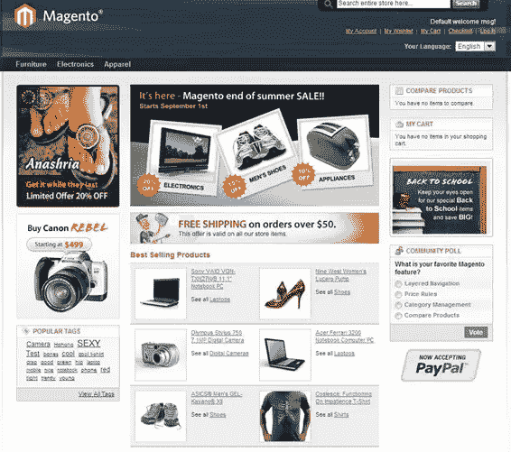

在安装过程中，您可以选择插入示例数据。默认模板没有 Magento Go 默认模板现代，这个看起来有点过时。此外，您在首次登录时不会看到方便的设置向导。

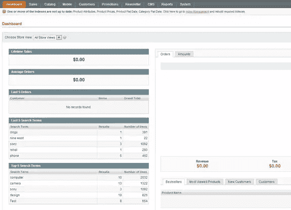

你所看到的是一个方便的仪表板，上面有你最新的销售数据、搜索词、畅销书等。当订单开始滚滚而来时，这会非常有激励作用。

Magento 允许你改变你看到的任何东西，这给了你很大的灵活性来定制你的商店。因此，添加您的第一个产品可能是一个相当大的挑战。

您首先要建立一个类别结构。

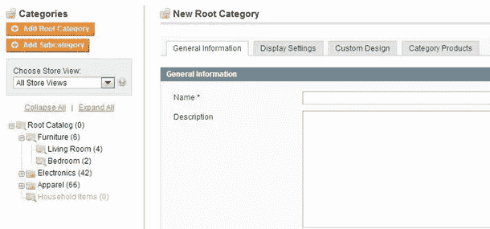

您可以嵌套无限的子类别，每个(子)类别为您提供了大量的配置选项。您可以为每个类别选择特定的设计和布局，例如，如果您想要制作特定于产品的登录页面，这很方便。大多数设置可以从站点设置继承，以节省您的时间。

在你弄清楚你的类别结构后，你开始添加产品。这是 Magento 真正开始发光的地方:你可以制作产品属性模板，你可以在这个模板上建立你的列表。例如，电脑(硬盘、内存)有一套与 t 恤不同的产品属性(尺寸、颜色)。你可以制作一件简单的产品(只有一件商品)、组合产品(出售一间卧室，带床、床单、枕头)或可配置产品(比如不同尺寸和颜色的 t 恤，顾客可以选择一种组合)。

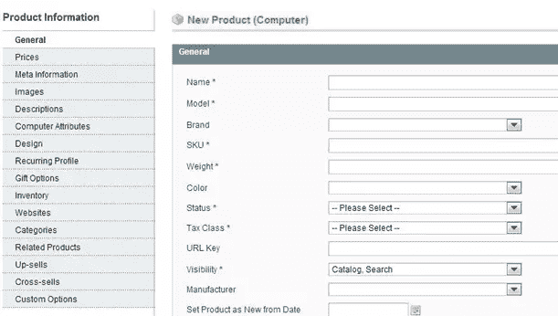

如果你选择一个简单的产品，你可以配置你的列表的每个细节。同样，这些设置中许多可以在站点范围内指定，但这是一个强大的选项。所有这些功能的缺点是，你每添加一个产品，很容易就要花费 10-15 分钟。幸运的是，通过根据这些值将 CSV 文件导入您的产品，您可以节省大量时间。

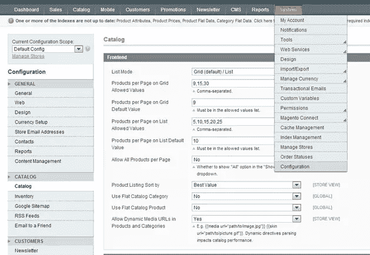

设置屏幕和 Magento 的任何部分一样大，有数百种设置可供选择。

由于 Magento 的复杂性，建立您的商店可能需要几天的时间来建立一个基于默认主题的简单商店，或者当您添加数千种产品并使用自定义设计时需要几个月的时间。

但是，你不会很快发现两家店是一样的…

### 伍尔科贸易公司

[WooCommerce 演示店](http://www.aboutblankenspoor.nl/woocommerce/%20)

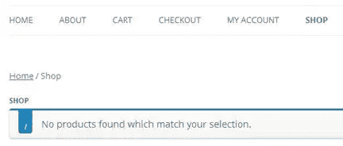

设置 WooCommerce 从安装 WordPress 开始，然后添加 WooCommerce 插件。你的 WordPress 站点增加了一些 WooCommerce 功能(购物车、结账、我的账户和商店)。样本数据必须手动加载，但不像 Magento 那样简单([参见说明](http://wcdocs.woothemes.com/tutorials/importing-woocommerce-dummy-data/))。

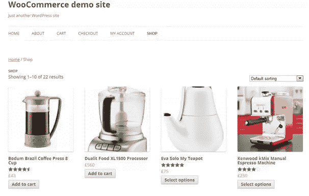

然而，在执行了这些步骤之后，你的 WooCommerce 商店立刻看起来好多了。

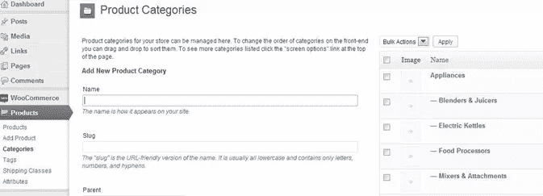

WooCommerce 在 WordPress 管理导航中增加了两个按钮，分别叫做 WooCommerce 和 Products。在后者中，您可以设置您的类别和产品。对于熟悉 WordPress 的人来说，这应该看起来很熟悉。您的选择非常有限:您可以指定一个类别视图是否应该显示里面的产品、子类别或者两者都显示。

添加产品为您提供了更多的定制选项。与 Magento 一样，您可以添加简单产品、分组产品和可配置产品(称为可变产品)。还有一个选项是添加外部供应商的附属产品(稍后将详细介绍)。

此外，您可以指定产品应该是虚拟的(如服务合同)或可下载的。Magento 也是这样做的，但是有了 WooCommerce 就更容易了。

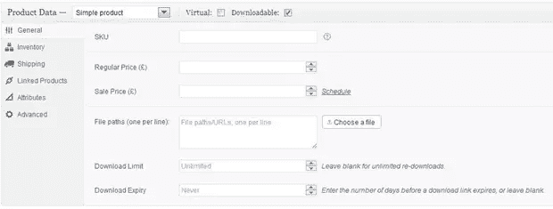

由于没有 Magento 那么多选项，在 WooCommerce 中添加产品的速度要快得多。有比你在这个截图中看到的更多的选项，因为添加一个产品基本上就是添加一个有很多变量的 WordPress 帖子。因此，您可以添加图像，指定一个或多个类别，并添加产品信息。但是 WooCommerce 的强大之处在于这些产品设置。

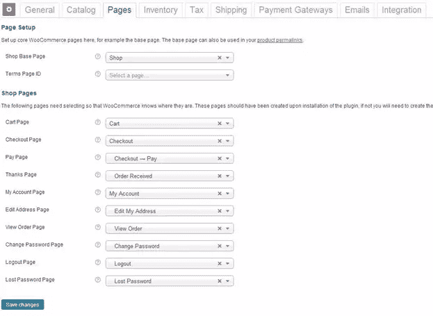

WooCommerce 提供给你的设置界面相对简单，因为大多数设置都可以保持不变。但这也让你可以在几天内开好商店，在那里你将花大部分时间添加产品，而不是微调你的设置。如果你以前使用过 WordPress，你肯定会在时间上受益。

## 特征

通过向您展示这两个程序的一些后端，您现在可能已经有了一个关于您可以期待什么的想法。但为了帮助你做出选择，我列出了一些与众不同的特征:

### Magento

*   **轻松翻译:**您可以在浏览您的商店时翻译您的整个前端，无需编辑 CSV 文件(尽管这仍然是可能的)。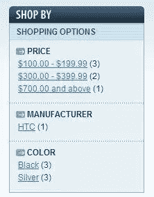
*   **不同的商店视图:**这可用于从同一后端操作不同的商店。例如，我为我的一个客户使用了这种方法，他在他们的主域上有一个“所有产品”商店，在目标域上有一个利基商店(有他们产品的选择)。利基产品也出售的主要领域。你也可以用它来定位你的商店。
*   **销售工具:**你可以添加追加销售、交叉销售、产品/类别/购物车折扣和产品比较等。
*   **分层导航:**这允许您让客户根据您指定的标准过滤产品列表，如价格范围、颜色、品牌等。
*   附加组件和主题:有数以千计的免费和付费主题，让网站看起来像你喜欢的样子。如果您想扩展或改进集成的功能，您可以使用附加组件。这些通常都很好，而且大多免费或便宜。

### 伍尔科贸易公司

*   **简单设置:**这可能是它的主要特点，因为这可以让你为自己或你的客户建立一个专业商店，并先试水。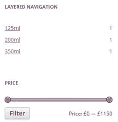
*   **代销商产品:**如果你想销售代销商产品，这是一个极好的功能。这可以增加你的代销商收入，因为你可以列出产品，就像是你自己的一样。
*   **商品评分:** WooCommerce 有内置的评分系统，你甚至可以给那些给你留下评价的人提供折扣。
*   **分层导航:**是的，WooCommerce 也有这个，虽然没有你想象的那么普遍。但是 Magento 版本效果更好，因为你只能用 WooCommerce 选择一个属性。
*   **Widgets:** 您可以非常简单地为您的畅销商品、特色商品、特价商品等添加 Widgets。
*   虽然没有 Magento 那么多，但 WooCommerce 有自己的一套主题和插件来扩展或改进功能。你也可以使用 WordPress 插件来补充你的商店。

## 结论

当你看到 Magento 和 WooCommerce 之间的所有差异时，你可能会认为我在拿苹果和橙子做比较。但这里的情况并非如此，因为我主要是想向您展示 Magento 和 WooCommerce 的可能性。我认为在某种程度上它们是互补的，WooCommerce 是你电子商务冒险的开始，Magento 是最终的解决方案。这并不意味着 WooCommerce 不会给你一个专业的网店，但最终你可能会想要 Magento 给你的额外功能。

它们都有缺点:WooCommerce 缺乏某些必要的功能，或者没有很好地发挥这些功能。另一方面，Magento 拥有你需要的所有特性，但是有一个陡峭的学习曲线。

最棒的是你可以两个都试试，它们都是开源的，可以免费获得。让我知道你的想法。

## 分享这篇文章