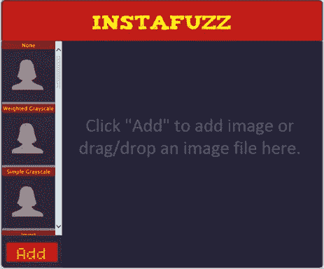
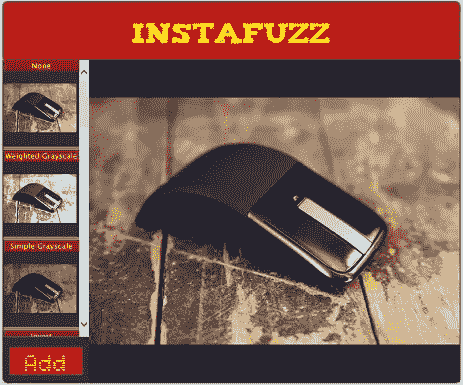
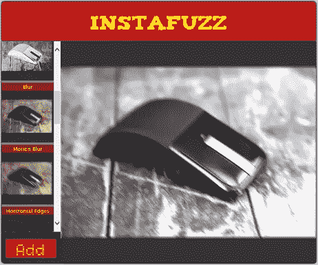

# 如何用 HTML5 搭建一个类似 Instagram 的照片分享 App

> 原文：<https://www.sitepoint.com/how-to-build-an-instagram-like-photo-sharing-app-with-html5/>

当我开始开发这个应用程序时，我只是真的很感兴趣，想看看网络平台是否真的已经发展到了这样一个地步，即像非常受欢迎的 Instagram 应用程序这样的应用程序可以只使用 HTML、JavaScript 和 CSS 来构建。

事实证明我们确实可以做到。本文将带您了解使这一切成为可能的技术，并展示构建可互操作的 web 应用程序是如何完全可行的，无论用户运行的是什么品牌的浏览器，这些应用程序都能提供出色的用户体验。

如果你碰巧是两个没有听说过 Instagram 的人之一，那么你可能会很高兴听到这是一个非常受欢迎的照片分享和社交网络服务，允许你拍照，对照片应用有趣的数字滤镜，并与世界分享。这项服务变得如此受欢迎，以至于在 2012 年 4 月,[被脸书](http://finance.fortune.cnn.com/2012/04/09/breaking-facebook-buying-instagram-for-1-billion/)以一袋现金和股票的价格收购。

InstaFuzz 是我开发的应用程序的名字，虽然我不希望被脸书或其他任何人以 10 亿绿色收购，但它确实证明了这样一个应用程序可以只使用符合标准的 web 技术来构建，如 Canvas、File API、Drag/Drop、Web Workers、ES5 和 CSS3，并且仍然可以在现代浏览器如 [Internet Explorer 10](http://www.microsoft.com/click/services/Redirect2.ashx?CR_CC=200210648) 、Google Chrome 和 Firefox 上运行良好。你也可以很容易地使用代码[构建一个 Windows 应用商店应用](http://www.microsoft.com/click/services/Redirect2.ashx?CR_CC=200185226)。

## 关于应用程序

如果你想看看这个应用程序，这里是它的托管地:

[http://blogorama.nerdworks.in/arbit/InstaFuzz/](http://aka.ms/InstaFuzz)

一旦你加载它，你会看到一个类似这样的屏幕:



这个想法是，你可以通过点击左下角的大红色“添加”按钮，或者将图像文件拖放到右边的黑/蓝色区域，将照片加载到应用程序中。一旦你这样做了，你会得到这样的东西:



你会注意到，屏幕左侧列出的数字滤镜列表显示了应用该滤镜后图像的预览。应用过滤器是一个简单的事情，点击左边的过滤器预览之一。这是在应用了“加权灰度”滤镜和“运动模糊”之后的效果。正如你所知，滤镜是*相加的*–当你不断点击滤镜时，它们会被应用到之前应用的滤镜之上:



接下来让我们看看 UI 布局是如何组合在一起的。

## 用户界面布局

HTML 标记如此之少，以至于我可以在这里完整地复制 BODY 标记的内容(不包括脚本包含的内容):

```
<header>

    <div id="title">InstaFuzz</div>

</header>

<section id="container">

    <canvas id="picture" width="650" height="565"></canvas>

    <div id="controls">

        <div id="filters-list"></div>

        <button id="loadImage">Add</button>

        <input type="file" id="fileUpload"

           style="display: none;"

           accept="image/gif, image/jpeg, image/png" />

    </div>

</section>
&nbsp;
<!-- Handlebar template for a filter UI button -->
&nbsp;
<script id="filter-template" type="text/x-handlebars-template">

    <div data-filter-id="{{filterId}}">

        <div>{{filterName}}</div>

        <canvas width="128" height="128"></canvas>

    </div>

</script>
```

这里没什么事情。几乎所有的东西都应该是标准的。不过，我要提醒大家注意，我在这里使用了[手柄](http://handlebarsjs.com/) JavaScript 模板系统来呈现屏幕左侧过滤器列表的标记。模板标记在 HTML 文件(上面代码片段中的脚本标记)中声明，然后在 JavaScript 中使用。然后，模板标记被绑定到一个 JavaScript 对象，该对象为把手表达式提供值，例如 *{{filterId}}* 和 *{{filterName}}。*这里是来自应用程序的相关 JS 片段，以及来自 [jQuery](http://jquery.com/) 的 DOM 操作帮助:

```
var templHtml = $("#filter-template").html(),

    template = Handlebars.compile(templHtml),

    filtersList = $("#filters-list");
&nbsp;
var context = {

    filterName: filter.name,

    filterId: index

};
&nbsp;
filtersList.append(template(context));
```

从 HTML 标记中可以看出，所有的过滤器预览框都有一个 CANVAS 标记，右边的大框也是如此，最终输出呈现在那里。我们将在文章的后面更详细地讨论如何使用 canvas 技术来实现这些效果。

该应用程序还使用 [CSS3 @font-face](http://aka.ms/fontface) 字体来呈现标题和“添加”按钮中的文本。字体取自优秀的[字体松鼠](http://aka.ms/FontSquirrel)网站，下面是声明的样子:

```
@font-face {

    font-family: 'TizaRegular';

    src: url('fonts/tiza/tiza-webfont.eot');

    src: url('fonts/tiza/tiza-webfont.eot?#iefix')

           format('embedded-opentype'),

         url('fonts/tiza/tiza-webfont.woff') format('woff'),

         url('fonts/tiza/tiza-webfont.ttf') format('truetype'),

         url('fonts/tiza/tiza-webfont.svg#TizaRegular') format('svg');

    font-weight: normal;

    font-style: normal;

}
```

该指令使用户代理将字体嵌入页面，并使其在分配给*字体系列*规则的名称下可用，在本例中为“TizaRegular”。在这之后，我们可以像平常一样将这个字体分配给任何 CSS *字体家族*规则。在 *InstaFuzz* 中，我使用下面的规则给 header 元素分配字体:

```
font-family: TizaRegular, Cambria, Cochin, Georgia, Times,

    "Times New Roman", serif;
```

您可能还注意到容器元素在页面上投下了一个微妙的阴影。

这是通过使用 [CSS3 盒子阴影](http://aka.ms/boxshadowproperty)规则实现的，下面是它在 *InstaFuzz* 中的使用方法。

```
-moz-box-shadow: 1px 0px 4px #000000, -1px -1px 4px #000000;

-webkit-box-shadow: 1px 0px 4px #000000, -1px -1px 4px #000000;

box-shadow: 1px 0px 4px #000000, -1px -1px 4px #000000;
```

这将导致浏览器在相关元素周围呈现阴影。值中的每个逗号分隔部分指定阴影的以下属性:

1.  水平偏移
2.  垂直偏移
3.  扩散距离–正值具有柔化阴影的效果
4.  阴影颜色

可以指定多个阴影值，用逗号分隔，事实上上面已经做过了。注意，我还使用供应商前缀语法为 Firefox 和 Chrome/Safari 指定了影子，使用了 *moz* 和 *webkit* 前缀。这导致影子继续在那些浏览器版本中工作，在这些浏览器版本中，使用该规则的供应商前缀版本来提供对此功能的支持。注意，W3C 版本的规则——*阴影框*——是最后指定的。这样做是为了确保在浏览器同时支持这两种形式的情况下，只有 W3C 行为会真正应用到页面上。

人们经常会发现，web 开发人员要么没有为所有支持该规则的浏览器包含给定 CSS3 规则的供应商前缀版本，要么也没有包含 W3C 版本。通常开发者只是把规则的 *webkit* 版本忽略其他浏览器和 W3C 标准版本。这导致了两个问题——[ 1]使用非 webkit 浏览器的用户体验不佳,[2]最终导致 webkit 成为事实上的 web 标准。理想情况下，我们希望 W3C 驱动网络的未来，而不是一个特定的浏览器实现。因此，在使用 CSS 特性的实验性实现时，需要记住以下几点:

1.  尽一切可能使用带有供应商前缀的 CSS 规则版本，但记住要为所有受支持的浏览器指定规则，而不仅仅是您测试页面的浏览器(如果您正在使用 [Visual Studio](http://www.microsoft.com/click/services/Redirect2.ashx?CR_CC=200117040) 编辑您的 CSS，那么您可能会对 Visual Studio 极其出色的扩展 [*Web Essentials*](http://aka.ms/WebEssentials) 感兴趣，它使管理供应商前缀的工作尽可能简单)。
2.  记住还要指定该规则的 W3C 版本。
3.  记住对规则的出现进行排序，以便 W3C 版本最后出现。这是为了允许支持供应商前缀版本和 W3C 版本的客户端使用 W3C 指定的规则语义。

目前就这些。在本系列的下一篇也是最后一篇文章中，我们将了解该应用程序如何支持文件的拖放、文件 API 的使用、过滤器本身如何工作，以及我们如何通过将核心数字处理工作委托给 web workers 来防止 UI 线程冻结。

## 分享这篇文章