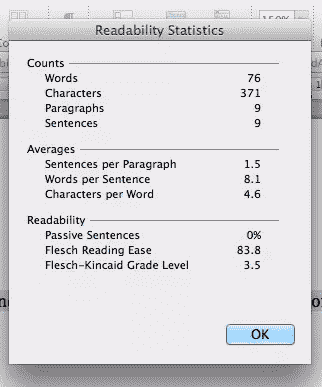
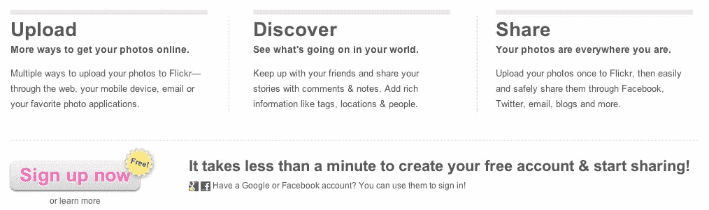

# 只需简单的一步就能让你的主页更加易读

> 原文：<https://www.sitepoint.com/make-your-homepage-copy-more-readable-in-1-easy-step/>

当我们最近谈论 Instagram 时，我们看到了他们在主页上的电梯宣传。 [Mailchimp](http://mailchimp.com/) 的服务解释也同样简洁明了。更进一步，[优步出租车](https://www.uber.com/)的主页用三个简单的步骤来解释它的服务。

然而，当你试图在你的主页上用漂亮的句子描述你的服务时，你得到的却是冗长的段落。

怎么回事？你需要成为超级明星作家才能写出好的文案吗？嗯，不疼。但是如果你不是一个超级明星作家，你也雇不起，那怎么办？

今天，我想向你展示一个快速简单的工具。在接下来的一两分钟里，我将向您展示它是如何做到的:

*   简化你使用的语言
*   谈论你的产品的特点和好处
*   用用户自己的语言与他们交流。

我们会得到额外的奖金。

## 该工具

真的吗？一个能做所有这些的工具？这是什么？当我们谈到 [SEO 如何帮助你沟通](https://www.sitepoint.com/seo-can-help-you-communicate/)时，我提到了这个工具。

是[可读性分数](http://en.wikipedia.org/wiki/Flesch%E2%80%93Kincaid_Readability_Test)。

如果您有 MS Word，您可以在进行拼写检查时获得可读性分数。首先，你需要打开它:进入 Word >首选项>拼写和语法>显示可读性统计。然后，对一些文本进行拼写检查。一旦完成，它会出现一个可读性统计对话框。

没有消息吗？搜索一下在线可读性计算器，你会找到一系列选项，比如这个，它可以让你直接输入文本，立即计算出许多不同的可读性分数。

我主要关注的是 Flesch 可读性分数(表明有多少人能够理解这篇文章)和 Flesch-Kincaid 等级分数，后者反映了读者理解这篇文章需要达到的典型的学校等级。

## 更容易阅读=更多意义

让我们来看看这些易用性工具的运行情况。例如，我们将从 [Flickr 主页](http://www.flickr.com/)上查看服务信息。

如果你是作家，你会发现这些句子中有一句不合语法。如果你有敏锐的眼光，你可能会对&符号和单词“and”的混乱感到疑惑。(为什么不选这个或者那个？我猜是布局。)但是让我们把重点放在这篇课文的可理解性上。

当我将这些内容复制到 Word 中并检查其得分时，我们看到可读性得分为 71.8，评分为 6.0。

那还不错。但是我们能改进它吗？让我们看看。这是那篇课文的修订版。

**上传**
*让您的照片快速上网。*
上传照片到 Flickr 又快又简单。使用网络、手机、电子邮件或你最喜欢的照片应用程序。

**发现**
*看看你的世界里发生了什么。*
为照片添加标签、地点和人物。使用评论和笔记来分享您的故事，并与朋友保持联系。

**分享**
*随身带着你的照片。*
通过脸书、推特、电子邮件、博客等分享您的照片。有了 Flickr，分享变得简单又安全。

你怎么想呢?

这篇文章的可读性分数是 83.8，等级只有 3.5。这意味着对于更多的人来说，它比现在 Flickr 主页上的拷贝更有意义。

### 语法时间

可读性工具鼓励我们使用更好的语法。如果你讨厌语法，不要担心:可以用来提高你所写的服务的可读性的技术是非常基本的。

1.  **拆句:**句子越短越好读。在这里，我把文中的每一点都变成了自己的句子——但是请注意，这可能会改变你的信息的形式。例如，最后一句话比原版更强调分享的方便性和安全性。
2.  使用更短、更常见的词:原文并不完全包含古怪的语言，但我确实删除了一些较长的词:多个、应用程序、信息、无处不在、上传。
3.  避免被动语态:如果你在用“ing”这个词，你可能是在用被动语态说话。这篇文章没有这个问题，但是把被动句(像这样的)变成主动句是另一个提高可读性的简单方法。做*那*的一个简单方法就是把一个人(你的客户或者用户！)进入句子:如果你把被动句变成主动句，你会提高可读性。

这并不是你可以用来提高可读性的全部技术，但是它们是任何人——企业家、开发人员变成下午作家——提高文字可读性的简单方法。

### 品牌信息

提高文笔是一回事。但你不想在这个过程中淡化品牌信息，对吗？这肯定是您想要考虑的事情，所以让我们看看它在 Flickr 示例中是如何进行的。

看了原文，我觉得好像有段时间没更新了。例如，即使是最不了解网络的人——我妈妈——如今也无一例外地称应用程序为“应用程序”。她可能没有手机，或者经常讨论应用程序，但当她有手机时，她就是这么称呼它们的。

社交媒体网站让标签、位置和人的概念变得非常普遍。现在谁管这叫“信息丰富”？我不认识任何人。我们大多数人认为它——能够从任何地方上传东西到我们的账户——是基本的产品功能，而不是关键的卖点。

所以我的重写稍微改变了这篇文章中的信息。我提出的第一点是关于努力，而不是选择的多样性，因为我不知道选择的多样性对大多数人来说是一个卖点。

第二点包含与第一点相同的信息，但在结束温暖人心的好处之前，将基本功能放在第一位。Awww。

第三点再次复制了原始版本中的消息传递，但将功能(共享技术)和好处(简单、安全)分开，以使它们更加清晰。

在这一点上，我确实改变了副标题，我可以看到我的新副标题可能会得到营销回扣(“我们不想暗示他们正在其他地方发展，但是他们已经在 T2 到处发展了。这听起来太终极了”)。但我认为，在这种情况下，暗示人们花时间在 Flickr 以外的网站上是公平的，文本具有逻辑和概念意义，巧妙地完成了信息传递。

### 特点和优势

当谈到他们的产品时，许多企业家很难区分特点和好处。我们将在下周更详细地讨论这个问题，但现在，我想指出的是，除了更容易阅读和理解之外，修订后的文本使功能和优点比原来的更清楚。

在新的文本中，三点中的每一点都包含一个关于功能的句子和一个关于好处的句子。第一点把利益放在第一位；第二个和第三个把特性放在第一位。在每种情况下，文本都非常清楚地说明了你得到了什么，以及它为你做了什么。

## 可读性能为你做什么

恭喜你。我们刚刚使用可读性工具来:

*   简化我们使用的语言
*   提高我们的语法
*   更清晰地定义产品特性和优势
*   更新我们的文本，以反映我们提供此服务的竞争环境
*   用用户自己的方式与他们交谈。

它们是简单的工具和简单的技术。但是它们可以极大地改变你与目标用户的交流方式——在网站上，在你的界面中，在系统邮件和自动回复邮件中，你能想到的。

你用过可读性工具吗？你认为你可以试一试吗？

## 分享这篇文章