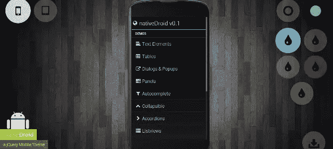
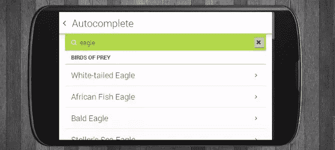
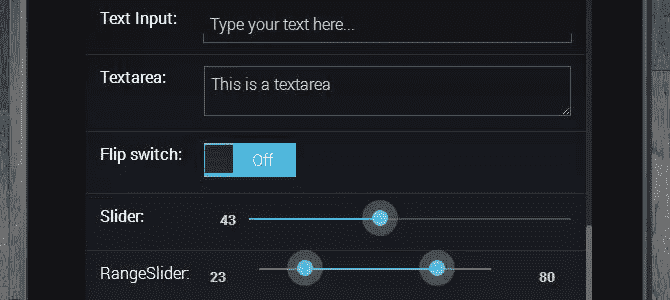
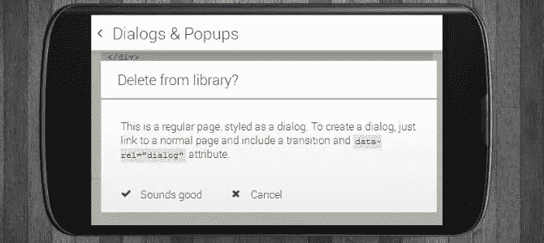
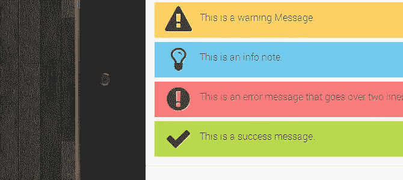
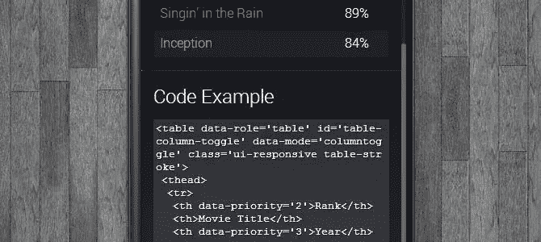

# native roid——jQuery Mobile 1.3 的免费主题

> 原文：<https://www.sitepoint.com/nativedroid-free-theme-jquery-mobile-1-3/>

## 介绍

我想为 jQuery Mobile 1.3 呈现一个新的&干净的主题，调用 [nativeDroid](http://nativedroid.godesign.ch/) 。你可以在 [nativedroid.godesign.ch](http://nativedroid.godesign.ch/) 上找到 nativeDroid (v0.1)的第一个版本。它是免费提供的，可以用于任何私人和商业项目。你只是被鼓励在你的学分中设置一个反向链接。

## nativeDroid 的特征

*   GUI 看起来很接近 Android HOLO
*   纯 CSS3/HTML5 无图像设计(包括图标字体)
*   有 5 种不同的颜色(蓝色/绿色/紫色/红色/黄色)可供选择，可与浅色和深色主题搭配使用。
*   适合作为任何移动项目的开始框架
*   不需要额外的 JavaScript 代码
*   所有 jQuery Mobile 1.3 项目的示例
*   所有的字体图标都可以使用 jQM 数据-图标-属性来添加

## 很好，但是有一些调整…

[native roid](http://nativedroid.godesign.ch/)基本上只是 [jQuery Mobile](http://www.jquerymobile.com/) 的一个主题，所以你可以使用 jQM 提供的任何功能，但是为了更好的外观设计，有一些调整需要考虑:

*   所有样式都应用于数据-theme='b '
*   只使用不带主题的结构样式表(css/jquerymobile.css)。
*   jQuery Mobile 的 Themeroller 的样式表将打破这种设计。
*   data-inset='true|false '参数在 nativeDroid 中不起作用。请使用包装标签。
*   仅将 data-role='header '与 data-position='fixed '和 data-tap-toggle='false '结合使用，并特别将 data-theme='b '应用于标题内的链接元素。
*   data-role='footer '尚未设计。有理由地使用它们。

作为最佳实践，我们建议您从复制演示中的一个 HTML 文档开始。

## 颜色和样式

**基础 CSS**

*   css/font-awesome.min.css 包含 nativeDroid 中使用的字体和图标。
*   css/jquerymobile.css 包含 jquerymobile 的原始结构，没有任何主题(缩小)。
*   CSS/jquery mobile . nativedroid . CSS 包含 native droid 所需的结构调整。

**主题**

*   CSS/jquery mobile . native droid . light . CSS 包含了灯光主题。
*   CSS/jquery mobile . native droid . dark . CSS 包含黑暗主题。

**颜色**

*   CSS/jquery mobile . native droid . color . blue . CSS 蓝色样式。
*   CSS/jquery mobile . native droid . color . green . CSS 绿色样式。
*   CSS/jquery mobile . native droid . color . purple . CSS 紫色样式。
*   CSS/jquery mobile . native droid . color . red . CSS 紫色样式。
*   CSS/jquery mobile . native droid . color . yellow . CSS 黄色样式。

要创建自己的颜色样式，只需复制一个基本的 color.css 文件，然后根据自己的喜好调整一些颜色代码。

## 这是最终版本吗？

不，绝对不是。nativeDroid 将在空闲时间每周开发，所以你可以肯定，将会有一些很酷的新功能和错误将被修复。

## 更多截图

## 分享这篇文章