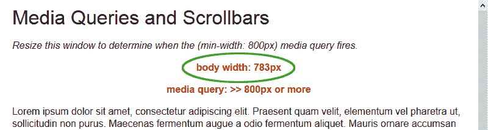

# 你的响应式网页设计太脆弱了吗？

> 原文：<https://www.sitepoint.com/responsive-web-design-too-fragile/>

看看 Chrome 中的这个 [**媒体查询演示页面**](https://blogs.sitepointstatic.com/examples/tech/mqscrollbars/index.html) 。现在调整你的浏览器宽度，把机身缩小到 800px 以下。一旦达到 799 像素，背景颜色和*媒体查询*检测文本就会改变。

现在在 Firefox、Opera 或 Internet Explorer 10 中加载[同一个页面](https://blogs.sitepointstatic.com/examples/tech/mqscrollbars/index.html)，再次调整浏览器大小。这将取决于您的操作系统和配置，但您会发现您必须进一步减少大约 20 像素的大小，以激发相同的媒体查询事件。在我的电脑上，它的反应速度是 782 像素:

为什么？让我们看看宽度为的 [W3C 媒体查询规范:](https://www.w3.org/TR/css3-mediaqueries/#width)

> “宽度”媒体功能描述了输出设备的目标显示区域的宽度。对于连续媒体，这是视口的宽度(如 CSS2 第 9.1.1 节[CSS21]所述)，包括呈现的滚动条(如果有)的大小。

这再清楚不过了:Chrome，或者更具体地说，Webkit 渲染引擎([即将闪现](/blink-rendering-engine-google-chrome/))错误地忽略了滚动条，反应过早。这似乎是明智的，因为滚动条宽度因系统而异，但它违背了 W3C 标准*(也许是拒绝 WebKit 单一文化的另一个[原因？)](https://www.sitepoint.com/5-reasons-to-reject-webkit-monoculture/)*

这个问题有技术上的解决办法。例如， [mqGenie](https://github.com/stowball/mqGenie) 检测非 Webkit 浏览器并计算滚动条宽度，这样您就可以从浏览器报告的视窗尺寸中减去它。但是你不应该用它…

> 如果你的响应式设计如此脆弱，以至于 20 个像素会导致布局问题，那你就做得不对！

响应式网页设计允许**流体布局**被断点穿插。这些断点可能很简单(比如修改字体大小)，也可能实现更复杂的更改，重新排列列和网格。

不幸的是，在过去的十年里，流畅的布局设计技巧已经成为一门失传的艺术。正如我在 2009 年所评论的那样，固定宽度已经成为常态。流畅的布局可能是这种媒体最大的优势之一，但是设计师们经常在这个概念上挣扎。

RWD 解决了流体设计的许多批评，但增加了进一步的复杂性。因此，使用媒体查询来实现一系列固定宽度的布局是很有诱惑力的——这就是滚动条假设等浏览器问题的症结所在。

以下是我的三个黄金响应网页设计建议:

1.  在尝试 RWD 之前，研究和试验流体设计技术。
2.  当创建一个响应式模板时，从最简单的移动优先布局开始，向更复杂的桌面设计努力(参见[如何使用响应式网页设计来支持旧浏览器](https://www.sitepoint.com/support-old-browsers-responsive-web-design/))。
3.  忘记像素——字体和元素尺寸使用比例单位，如%、em 和 rem。即使您的最终设计必须有固定的尺寸，创建一个流体布局，并相应地设置外部元素的宽度。

这是一种不同的思考方式，但是要坚持。对网页设计施加类似纸张的限制减少了可能性，并使响应性网页设计变得更加困难。

## 分享这篇文章