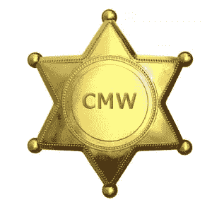

# 采访流氓:查尔斯麦斯武德，第一部分

> 原文：<https://www.sitepoint.com/interviewing-rogues-charles-max-wood/>

## 领头的流氓

每周都有一群 Ruby 爱好者聚集在一个虚拟的圆桌会议上，探索/讨论/争论 Ruby 语言或 Ruby 社区的某些方面。他们允许我们其他人通过 [Ruby Rogues 播客](https://itunes.apple.com/us/podcast/ruby-rogues/id436260381?mt=2&uo=4 "Ruby Rogues on iTunes")收听他们的讨论。该播客可以在 [iTunes](https://itunes.apple.com/us/podcast/ruby-rogues/id436260381?mt=2&uo=4) 或[网站](http://www.rubyrogues.com)上访问，并提供了一大群精通技术的人分享他们的想法和意见的“墙上苍蝇”视图。

在这一系列文章中，我将分享我对这一特殊群体成员的采访结果。

我们从“流氓”的领导者和创始人查尔斯·麦斯武德开始。他通过 [TeachMeToCode](http://www.teachmetocode.com) 描述了一些关于他自己、他的背景和导致 Ruby Rogues 的不太可能的灵感。

### “介绍一下你自己吧，查克”

Thom: 你是非常受欢迎的播客 [Ruby Rogues](http://www.rubyrogues.com) 的负责人。
现在，假装这是一个播客，你是一个客人。"*那么 Chuck，给我们简单介绍一下你自己吧*"。

查尔斯:好吧，我出生并成长在犹他州。我在犹他州的几家公司工作过。我实际上是从做技术支持开始的，然后就进入了 Ruby 编程领域。我在[杨百翰大学](http://home.byu.edu/home/)获得了计算机工程学位，这个学位更多的是面向硬件而不是软件。

我从小就断断续续地编程。我在 TI 计算器上编程，现在我已经用 Ruby 编程大约七年半了。

**Thom:** 那么你是什么时候，怎么发现 Ruby 的呢？我敢打赌这是每个人都在讲述的故事: *Rails 把你带到了 Ruby。*

查尔斯:是也不是。我不得不说，大部分是。我为一家名为 [Mozy](http://www.mozy.com) 的公司提供技术支持。他们做在线备份。在我上学的四五年里，我一直在杨百翰大学从事技术支持工作。所以我得到了这份技术支持的工作，这是一个非常容易的转变，因为我对 Windows 和 Linux 等都非常熟悉。

我在回复客户关于如何使用 [Mozy](http://www.mozy.com) 的电子邮件(当时 [Mozy](http://www.mozy.com) 仅适用于 Windows)，但我完成了过渡，在我在那里呆了大约四个月后，该产品在[华尔街日报](http://www.wsj.com)、[沃尔特·莫斯伯格](http://en.wikipedia.org/wiki/Walter_Mossberg)实际上评论了 [Mozy](http://www.mozy.com) 。因此，突然之间，我们的支持量大幅上升，因为我们有一大群新人注册了这项服务，以备份他们的计算机。

只有我们两个人回复这些邮件，我们完全被搞懵了。我们面临着跟上进度的压力，沃尔特·莫斯伯格对一些技术支持请求花费的时间比他希望的长感到有点不高兴，所以我们决定编写一个程序，基本上可以对我们的电子邮件进行排队，这样我们只需回答一封邮件，它就会立即调出另一封邮件。

当时，该公司正在用 Ruby on Rails 构建其 web 资源，所以我们最终用 Ruby on Rails 构建了它，我们必须构建的任何实用程序都只需编写服务器端的 Ruby 脚本。所以，两者都有一点。

汤姆:那真的很酷。

查尔斯:因为我上过编程课，并且有相关领域的学位，所以编程对我来说并不是什么大事。所以事情就这么解决了。

所以我们开始建立一个系统来排列所有的电子邮件，它从那里发展成为一个全面的技术支持系统。

作为您的第一个 Ruby 项目，您构建了一个成熟的技术支持票务管理系统！

查尔斯:对。我们雇佣了更多的技术支持人员，而当时我们还没有一个 QA 部门，所以我做的一部分事情就是编写自动化测试，在我能做到的地方，测试产品，这样它就会出现更少的错误，从而减轻我们的技术支持负担。

当我真正抬起头来，意识到事情的发展时，在技术支持方面比我级别高的人已经转到销售部门，帮助他们满足技术需求，而我在这家初创公司管理着一个 30 人的部门，当时我才 25 岁。

汤姆:这是一个伟大的成功故事。

查尔斯:这太疯狂了，很多成功都是因为我愿意拿起键盘写一些代码。

嗯，[该公司被](http://mozy.com/about) [EMC 公司](http://http://www.emc.com/)收购了，还有一些其他的政治事务在进行，我决定我真的不想管理所有这些人，我只想写代码——这对我来说是一个彻底的打击，因为在我的计算机科学课上，我想，“好吧，这些人写这些玩具程序是有报酬的，但对我来说没有成就感，所以我真的不想成为一名程序员。”

当我在 Mozy 完成的时候，我想，“我想成为一名程序员。这是我想去的地方。”

所以我转到了 QA，我做了六个月的 QA，然后在这六个月里，和我一起工作的那个人，他看着我说，“你的价值比这高，去得到一个报价，把它带回来，他们可能会匹配并留下你。”所以我出去了，我得到了一份工作，他们不匹配，我去了，并接受了我的第一份编程工作！

我在一家咨询公司工作，之后，我在一家领先的公司工作，我讨厌那些家伙，所以我离开了，去了一家公司工作，我不知道他们是否还在，[CrimeReports.com](https://www.crimereports.com/)，我在那里工作了大约六个月。他们是一家伟大的公司，他们雇佣了错误的营销经理，事情开始变得糟糕，以至于他们无力支付现有员工的数量，所以我被解雇了，决定做自由职业者，我已经做了大约两年半的自由网络开发员。

### 为什么开始播客？

Thom: 这个播客的想法是怎么来的？

查尔斯:所以我大概介绍了一下背景。当我在 [Mozy](http://www.mozy.com) 做 QA 的时候，我和另一个人一起工作，他叫 Don，他买了一个全新的 iPods。我觉得 iPods 真的非常非常酷。所以我检查了一下**我真的想要一个**！

他说，“是的，嗯，iPod 最大的好处就是你可以听这些播客。”“嗯，我听说过播客，但我没有 iPod，”我说。
“是的，但你现在用的那台 Mac 上有 iTunes。”，他说。
所以我开始听播客，我意识到能够听人们谈论我关心的事情真的是一件很酷的事情。

所以我在听 Greg Pollack 和 Jason Seifer 的 Rails Envy，我也在听其他一些崭露头角的播客谈论编程和我当时感兴趣的其他东西。这真的很有趣，因为我当时想，“嗯，开一个播客会很酷。”这是在 2008 年。

与此同时，我的一个朋友，Eric Berry，建立了一个名为 TeachMeToCode.com 的网站，他在做一些与 Ruby 和 Rails 相关的视频教程。其中一些实际上就像是，“这就是你如何用 Rails 构建一个 Twitter 克隆体。”诸如此类的东西。所以他招募了一群当地的家伙为他做视频。所以我做的第一件事实际上是，“[这是 Rails 路由的工作方式](https://itunes.apple.com/us/podcast/basic-ruby-on-rails-routing/id346337520?i=85369387&mt=2)，”一个 TeachMeToCode 的视频，这是在 2008 年 8 月。

然后我在想，“这有点意思！”我参与其中，一家公司实际上给了我一个免费的麦克风，它就像一个 200 美元的麦克风，并给了我录制更多屏幕广播所需的所有软件。与此同时，我在想，“嗯，我有这个麦克风，所以我用麦克风听起来还不错。所以也许我应该开一个播客，开一个我谈论 Ruby 的播客会很有趣。”

所以我给格雷格·波拉克发了一封电子邮件，心想，“哎呀，他是个大忙人，可能不关心犹他州的一些编程新手。”我基本上是说，“嗨，Greg，我叫 Chuck，我喜欢你的节目，我是一名 Rails 开发人员，我正在考虑开始一个播客。”第二天我收到了一封电子邮件，“天哪，太棒了！你完全应该开一个播客！”我说，“嗯，我不想做你正在做的事情，”他建议说，“嗯，你不必做。你为什么不做这些事情中的一件呢？”他推荐的一件事是我采访其他程序员。

葛雷格是个超级好人。你可以把我从那以后所做的一切都归咎于格雷格。

我下次见到他时会的。或者，也许，他会读到这个！

查尔斯:后来我在一次会议上遇到了他，他是我的第一位客人。

**Thom:** 优秀。

查尔斯:所以我在 2008 年 10 月采访了他。我开始采访其他人，或者只是继续谈论 Rails，因为我觉得它很酷；如果我找不到人说话。信不信由你，人们开始听我放在那里的东西，我完全震惊了。
我想，“好吧，我就把它放在那里，少数人会听它。”不，这真的很成功。人们关心。

然后，运行 [TeachMeToCode](http://www.teachmetocode.com) 的 Eric 开始在 Grails 上做更多的 [Groovy 工作。
他决定将](http://grails.org/) [TeachMeToCode](http://www.teachmetocode.com) 交给仍在做 Ruby 的人，因为大部分视频都与 Ruby 相关，他完全沉迷于 [Grails](http://grails.org/) 中，他并不真的想将网站从观众身边转移开。

所以，因为我在做播客，而且我在那里取得了成功，他决定让我来做这件事。他把它交给我，我为 [TeachMeToCode](http://www.teachmetocode.com) 制作视频，大概一年，两年，或者更长，我不记得了。我已经很久没有上传视频了。我做了一段时间，人们开始知道我是谁，与此同时，我采访了所有这些了不起的 ruby 爱好者。

所以在这几年里，我开始做的是 [Rails 蔻驰播客](http://railscoach.com)，后来我把名字改成了 [TeachMeToCode](http://www.teachmetocode.com) 播客。我采访了像詹姆斯·爱德华·格雷、迪夫·托马斯这样的人。我读了某人的书，然后邀请他们上节目，这太棒了。我遇到了所有这些不可思议的人，我和 Corey Haines 谈过，所以我在 Ruby 社区中有所有这些联系人，我在这两三年中采访过他们。

明天回来看看对恰克的采访的结论！

## 分享这篇文章